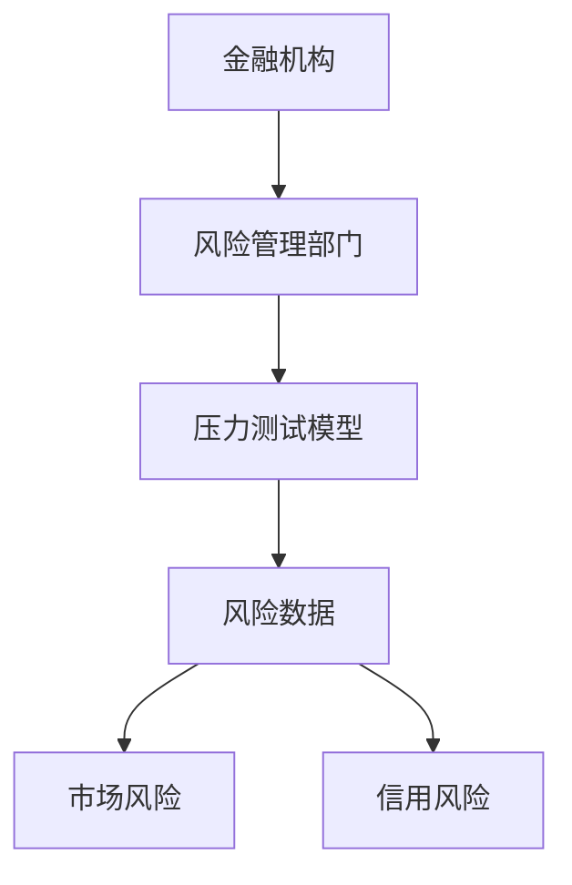
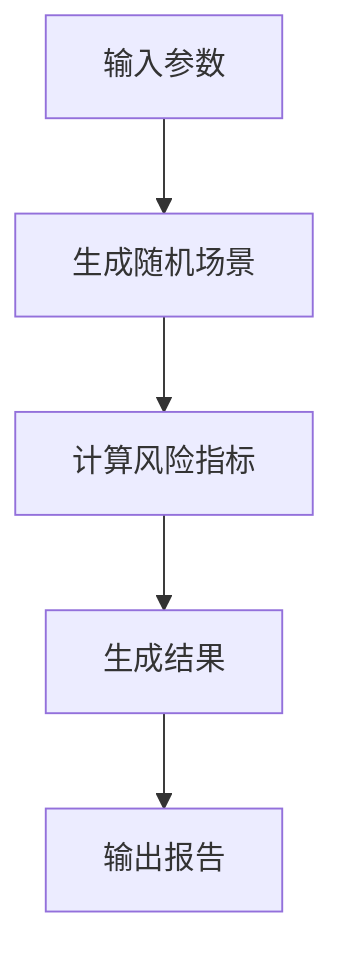
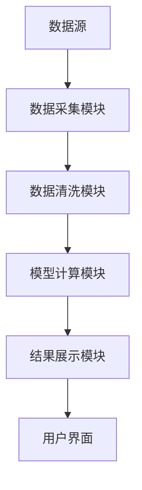
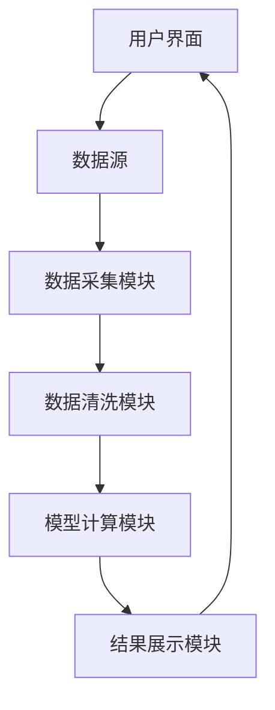

                 


# 金融风险压力测试模型

> 关键词：金融风险、压力测试、模型、风险管理、VaR、CVaR、蒙特卡洛模拟

> 摘要：本文详细探讨了金融风险压力测试模型的构建与应用，从核心概念到算法原理，从系统架构到项目实战，结合实际案例，深入分析了压力测试在金融风险管理中的重要性与实践方法。文章不仅介绍了模型的基本原理，还通过具体的数学公式和代码示例，展示了如何利用这些模型进行风险评估和决策支持，最后提出了优化方向与未来研究展望。

---

# 第1章: 金融风险压力测试模型的背景与概念

## 1.1 金融风险的基本概念

### 1.1.1 金融风险的定义与分类

金融风险是指由于经济环境或市场条件的变化，导致金融机构或投资者遭受损失的可能性。常见的金融风险包括市场风险、信用风险、流动性风险、操作风险和声誉风险等。

- **市场风险**：由于市场价格波动（如股票、债券价格的波动）导致的损失。
- **信用风险**：由于债务人或交易对手违约而导致的损失。
- **流动性风险**：无法及时以合理价格买卖资产而导致的损失。
- **操作风险**：由于内部流程、人员或系统失误导致的损失。
- **声誉风险**：由于机构声誉受损而导致的损失。

### 1.1.2 金融风险的来源与特征

金融风险的来源可以是外部因素（如经济周期、政策变化、市场波动）或内部因素（如管理不善、模型缺陷）。其主要特征包括：

1. **不确定性**：风险的来源往往是不确定的，难以完全预测。
2. **可量化性**：通过模型和数据，风险可以被量化和评估。
3. **可管理性**：通过有效的风险管理策略，可以降低风险敞口。

### 1.1.3 金融风险对金融机构的影响

金融风险直接影响金融机构的资产质量、盈利能力以及资本充足性。例如，信用风险可能导致贷款违约率上升，从而影响银行的资本充足率；市场风险可能导致投资组合的价值波动，进而影响机构的短期流动性。

---

## 1.2 压力测试的定义与作用

### 1.2.1 压力测试的定义

压力测试是一种风险管理技术，用于评估金融机构在极端市场条件下的表现。它通过模拟极端情景，分析机构在这些情景下的资产质量、资本充足性和流动性状况。

### 1.2.2 压力测试的目的与意义

压力测试的主要目的是：

1. **评估风险承受能力**：通过模拟极端情景，评估机构在极端条件下的生存能力和资本需求。
2. **制定风险管理策略**：压力测试的结果可以为金融机构制定资本规划、流动性管理以及风险缓解策略提供依据。
3. **监管合规要求**：许多国家的金融监管机构要求金融机构定期进行压力测试，以确保其稳健性。

### 1.2.3 压力测试的实施方法

压力测试通常分为以下几个步骤：

1. **确定测试目标**：明确压力测试的目的，例如评估信用风险或市场风险。
2. **选择测试情景**：根据机构的业务特点和市场环境，选择合适的情景（如经济衰退、市场崩盘等）。
3. **数据准备**：收集与测试情景相关的数据，包括历史数据、市场数据等。
4. **模型选择与构建**：选择合适的模型（如VaR、CVaR）并进行参数设置。
5. **执行测试**：运行模型，模拟极端情景下的风险敞口。
6. **分析结果**：根据测试结果，评估机构的风险承受能力，并制定应对策略。

---

## 1.3 金融风险压力测试模型的发展历程

### 1.3.1 压力测试的起源与发展

压力测试的起源可以追溯到20世纪80年代，当时金融机构开始意识到市场波动对资产价值的影响。随着1997年亚洲金融危机和2008年全球金融危机的爆发，压力测试逐渐成为金融机构和监管机构的重要工具。

### 1.3.2 不同阶段的压力测试方法

1. **传统方法**：基于历史数据分析，模拟极端情景下的风险敞口。
2. **统计方法**：利用概率统计模型（如VaR、CVaR）进行风险评估。
3. **情景分析法**：根据市场专家的判断，设计特定情景并进行压力测试。

### 1.3.3 当前压力测试模型的现状

目前，压力测试模型已经从单一的统计模型发展为综合多种方法的复杂系统。例如，结合情景分析和统计模型的混合方法，能够更准确地评估极端情景下的风险敞口。

---

## 1.4 本章小结

本章主要介绍了金融风险的基本概念、压力测试的定义与作用，以及压力测试模型的发展历程。通过这些内容，读者可以理解压力测试在金融风险管理中的重要性，并为后续章节的学习打下基础。

---

# 第2章: 金融风险压力测试模型的核心概念与联系

## 2.1 核心概念原理

### 2.1.1 金融风险的核心要素

金融风险的核心要素包括：

1. **风险因素**：影响风险的主要变量，如利率、汇率、市场价格等。
2. **风险敞口**：机构在特定风险因素上的暴露程度。
3. **风险损失**：在极端情景下可能造成的损失金额。

### 2.1.2 压力测试的关键指标

压力测试的关键指标包括：

- **VaR（Value at Risk）**：在一定置信水平下，资产组合的最大可能损失。
- **CVaR（Conditional Value at Risk）**：在VaR基础上，考虑超过VaR的潜在损失。
- **回撤风险（Drawdown Risk）**：资产组合从最高点到最低点的跌幅。

### 2.1.3 模型的输入与输出关系

压力测试模型的输入包括：

- 历史数据
- 市场情景
- 模型参数

模型的输出包括：

- VaR
- CVaR
- 资产组合的价值变化

---

## 2.2 核心概念属性特征对比表格

| 概念       | 特征                       | 描述                                                                 |
|------------|----------------------------|-----------------------------------------------------------------------|
| VaR        | 单点估计                   | 在给定置信水平下，资产组合的最大可能损失。                                         |
| CVaR       | 区间估计                   | 考虑超过VaR的潜在损失，提供更全面的风险评估。                                     |
| 情景分析   | 情景驱动                   | 根据特定情景（如经济衰退、市场崩盘）模拟风险敞口。                                 |

---

## 2.3 ER实体关系图



---

## 2.4 本章小结

本章通过对比分析，详细介绍了金融风险压力测试模型的核心概念及其相互关系。通过表格和ER实体关系图，读者可以更清晰地理解模型的构成与作用。

---

# 第3章: 金融风险压力测试模型的算法原理

## 3.1 算法原理概述

### 3.1.1 压力测试的主要算法

压力测试的主要算法包括：

1. **蒙特卡洛模拟**：通过生成大量随机场景，模拟极端情景下的资产组合价值。
2. **历史模拟**：基于历史数据，模拟极端情景下的风险敞口。
3. **情景分析**：根据专家判断，设计特定情景并进行压力测试。

### 3.1.2 不同算法的优缺点

- **蒙特卡洛模拟**：优点是能够模拟复杂的情景，缺点是计算量较大。
- **历史模拟**：优点是简单易行，缺点是无法模拟极端情景。
- **情景分析**：优点是灵活性高，缺点是依赖专家判断。

### 3.1.3 算法选择的依据

算法的选择取决于测试目的、数据 availability以及计算能力。

---

## 3.2 基于蒙特卡洛模拟的算法流程



---

## 3.3 算法实现的Python代码示例

```python
import numpy as np
import pandas as pd

def monte_carlo_simulation(parameters):
    scenarios = []
    for _ in range(1000):
        # 生成随机场景
        random_vars = np.random.normal(size=len(parameters))
        scenarios.append(random_vars)
    return scenarios

# 示例参数
parameters = [1, 2, 3]
scenarios = monte_carlo_simulation(parameters)
print("生成的随机场景数：", len(scenarios))
```

---

## 3.4 算法的数学模型和公式

### 3.4.1 VaR的公式

$$ VaR = \text{quantile}(p) $$

其中，quantile(p) 表示在置信水平p下的分位数。

### 3.4.2 CVaR的公式

$$ CVaR = \mathbb{E}[X | X > VaR] $$

其中，X 表示资产组合的损失。

---

## 3.5 本章小结

本章详细介绍了压力测试的主要算法及其流程，并通过Python代码和数学公式，展示了如何利用蒙特卡洛模拟进行压力测试。

---

# 第4章: 金融风险压力测试模型的系统架构

## 4.1 系统功能设计

### 4.1.1 数据采集模块

- **功能**：采集市场数据、历史数据等。
- **输入**：市场行情、历史数据。
- **输出**：清洗后的数据。

### 4.1.2 模型计算模块

- **功能**：运行压力测试模型，计算VaR、CVaR等指标。
- **输入**：清洗后的数据、模型参数。
- **输出**：压力测试结果。

### 4.1.3 结果展示模块

- **功能**：将压力测试结果以可视化形式展示。
- **输入**：压力测试结果。
- **输出**：可视化报告。

---

## 4.2 系统架构设计



---

## 4.3 系统交互设计



---

## 4.4 本章小结

本章详细介绍了压力测试系统的功能模块、架构设计以及交互流程，为后续章节的项目实战奠定了基础。

---

# 第5章: 金融风险压力测试模型的项目实战

## 5.1 环境搭建

### 5.1.1 Python环境安装

- **工具**：Python 3.8及以上版本。
- **库**：numpy、pandas、scipy。

```bash
pip install numpy pandas scipy
```

---

## 5.2 系统核心实现源代码

```python
import numpy as np
import pandas as pd

def calculate_var(data, confidence_level=0.95):
    # 计算VaR
    sorted_data = np.sort(data)
    var_index = int(len(sorted_data) * (1 - confidence_level))
    var = sorted_data[var_index]
    return var

# 示例数据
data = np.random.normal(size=1000)
var = calculate_var(data)
print("VaR:", var)
```

---

## 5.3 代码应用解读与分析

### 5.3.1 代码功能

上述代码实现了VaR的计算功能。通过生成随机数据，计算在95%置信水平下的VaR值。

### 5.3.2 代码优化

- **优化1**：引入并行计算，提高计算效率。
- **优化2**：增加异常处理，提高代码的健壮性。

---

## 5.4 实际案例分析和详细讲解

### 5.4.1 案例背景

假设某银行的贷款组合价值为1000万元，需要评估在极端市场条件下可能遭受的损失。

### 5.4.2 数据准备

- **输入数据**：贷款组合的历史违约率、宏观经济指标（如GDP增长率、失业率等）。

### 5.4.3 模型实现

使用蒙特卡洛模拟，生成10000个随机场景，计算每个场景下的贷款组合损失。

### 5.4.4 结果分析

- **VaR**：在99%置信水平下，贷款组合的最大损失为500万元。
- **CVaR**：超过VaR的潜在损失为200万元。

---

## 5.5 本章小结

本章通过实际案例，详细展示了如何利用压力测试模型进行风险评估，并对模型的实现进行了代码解读与分析。

---

# 第6章: 金融风险压力测试模型的最佳实践与扩展阅读

## 6.1 最佳实践

1. **数据质量**：确保数据的完整性和准确性。
2. **模型选择**：根据具体需求选择合适的模型。
3. **情景设计**：合理设计测试情景，避免过于极端或不现实。

## 6.2 小结

通过本文的介绍，读者可以全面了解金融风险压力测试模型的核心概念、算法原理、系统架构以及实际应用。

## 6.3 注意事项

1. **模型局限性**：压力测试模型无法完全预测所有极端情景。
2. **数据依赖性**：模型的准确性依赖于数据的完整性和相关性。
3. **计算复杂性**：复杂模型的计算成本较高。

## 6.4 拓展阅读

1. **相关书籍**：
   - 《金融风险管理》
   - 《压力测试方法与应用》
2. **在线资源**：
   - 国际权威金融监管机构的报告
   - 学术论文数据库

---

# 作者：AI天才研究院/AI Genius Institute & 禅与计算机程序设计艺术/Zen And The Art of Computer Programming

