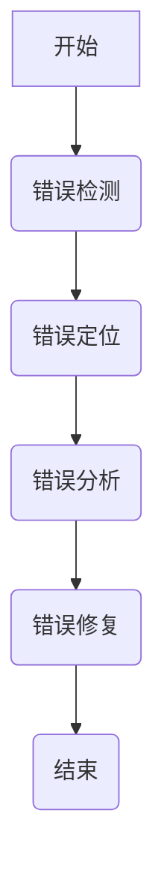
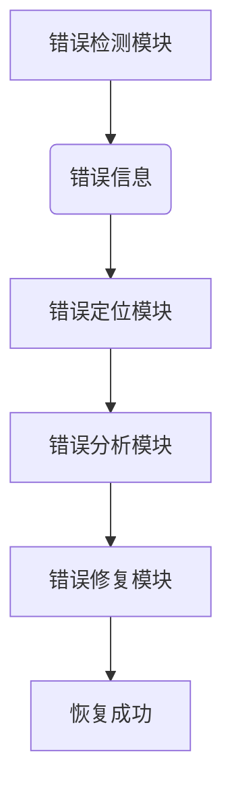
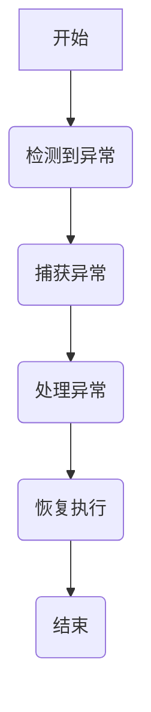
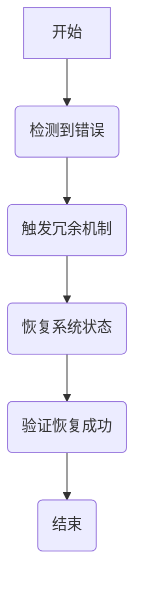
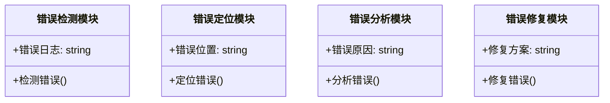
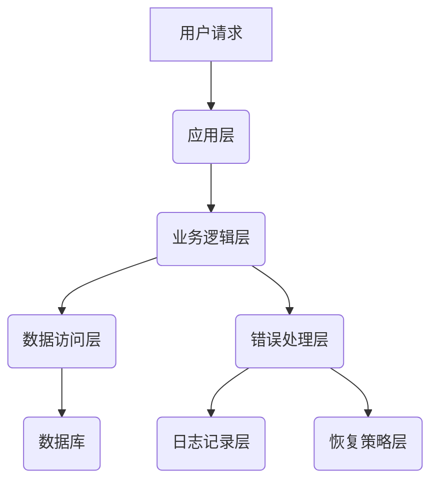

                 


# 错误处理与恢复：提高AI Agent的鲁棒性

> 关键词：错误处理、恢复策略、AI Agent、鲁棒性、异常处理、容错机制、系统恢复

> 摘要：  
本文深入探讨了AI Agent在运行过程中面临的错误处理与恢复问题，分析了错误处理的核心概念、算法原理、系统架构设计以及实际项目中的应用。通过理论分析与实践结合，本文详细阐述了如何通过错误处理与恢复策略来提高AI Agent的鲁棒性，确保系统在面对错误时能够快速响应并恢复正常运行。

---

# 第1章：错误处理与恢复的背景与核心概念

## 1.1 错误处理与恢复的核心概念

### 1.1.1 错误处理的定义与范围
- **错误处理的定义**：错误处理是指在计算机程序运行过程中，检测到错误并采取相应措施以避免程序崩溃或确保程序能够继续运行的过程。
- **错误处理的范围**：错误处理不仅包括程序运行时的异常处理，还包括程序设计阶段的错误预防和修复。
- **错误处理的核心要素**：检测、定位、分析和修复错误。

### 1.1.2 错误处理的背景与问题背景
- **错误处理的重要性**：错误处理是确保程序稳定运行的关键，尤其是在复杂系统中，错误处理直接影响系统的可用性和可靠性。
- **错误处理的必要性**：在AI Agent中，错误处理是确保智能代理能够持续运行并提供服务的核心能力。
- **错误处理的挑战**：错误类型多样、错误检测难度大、错误恢复复杂性高等。

### 1.1.3 错误恢复的定义与目标
- **错误恢复的定义**：错误恢复是指在检测到错误后，采取措施将系统状态恢复到正常状态或重新启动系统的过程。
- **错误恢复的目标**：快速响应错误、最小化错误影响、确保系统稳定性。

## 1.2 错误类型与分类

### 1.2.1 错误类型
- **语法错误**：程序代码中不符合语言规范的错误。
- **逻辑错误**：程序逻辑不符合预期的错误。
- **运行时错误**：程序运行过程中发生的错误，如空指针异常、数组越界等。
- **输入输出错误**：输入数据不符合预期或输出数据不符合要求的错误。
- **资源分配错误**：资源不足或分配不当导致的错误。

### 1.2.2 错误分类
- **致命错误**：导致程序崩溃的错误，如空指针异常、除以零错误。
- **非致命错误**：程序可以继续运行的错误，如无效输入、资源不足。

## 1.3 错误处理与恢复的核心概念结构

### 1.3.1 错误处理的流程图（Mermaid）



### 1.3.2 错误恢复的实体关系图（Mermaid）



---

# 第2章：错误处理与恢复的核心概念

## 2.1 错误处理的核心概念原理

### 2.1.1 错误检测的原理
- **错误检测的方法**：基于异常检测的算法，通过监控系统状态和行为来发现错误。
- **错误检测的机制**：通过日志记录、状态检查和异常捕获等方式检测错误。

### 2.1.2 错误定位的原理
- **错误定位的步骤**：从错误信息出发，逐步缩小错误范围，找到错误的具体位置。
- **错误定位的算法**：基于日志分析和上下文信息的错误定位算法。

### 2.1.3 错误分析的原理
- **错误分析的方法**：通过日志、堆栈跟踪和变量检查等方式分析错误的根本原因。
- **错误分析的工具**：调试工具、日志分析工具和性能分析工具。

## 2.2 错误恢复的核心概念原理

### 2.2.1 错误恢复的机制
- **错误恢复的步骤**：检测错误、隔离错误、恢复系统状态、验证恢复成功。
- **错误恢复的算法**：基于容错机制的恢复算法，如冗余技术、断点重启等。

### 2.2.2 错误恢复的策略
- **简单恢复策略**：直接重试、忽略错误、终止任务。
- **复杂恢复策略**：基于上下文的恢复、智能修复、动态调整系统参数。

## 2.3 错误处理与恢复的联系

### 2.3.1 错误处理与恢复的关系
- 错误处理是恢复的前提，恢复是错误处理的延续。
- 错误处理的效率直接影响恢复的效果。

### 2.3.2 错误恢复对错误处理的影响
- 错误恢复需要错误处理提供足够的信息和支持，两者相互依存。

---

# 第3章：错误处理与恢复的算法原理

## 3.1 错误处理算法

### 3.1.1 异常处理算法（Exception Handling）

#### 3.1.1.1 异常处理流程



#### 3.1.1.2 异常处理的Python代码示例

```python
try:
    # 可能发生异常的代码
    result = 1 / 0
except ZeroDivisionError:
    # 处理异常
    print("除以零错误")
finally:
    # 最终执行的代码
    print("处理完成")
```

## 3.2 错误恢复算法

### 3.2.1 基于冗余的恢复算法

#### 3.2.1.1 冗余恢复流程



#### 3.2.1.2 冗余恢复的Python代码示例

```python
def redundant_recovery():
    try:
        # 主业务逻辑
        main_logic()
    except Exception as e:
        # 触发冗余机制
        print("检测到错误，触发冗余恢复")
        redundant_logic()
    finally:
        print("恢复完成")
```

---

# 第4章：错误处理与恢复的数学模型与公式

## 4.1 错误概率模型

### 4.1.1 错误发生概率公式

$$ P(\text{错误发生}) = \frac{\text{错误发生次数}}{\text{总运行次数}} $$

### 4.1.2 错误恢复概率公式

$$ P(\text{错误恢复}) = \frac{\text{成功恢复次数}}{\text{总错误次数}} $$

## 4.2 错误处理的优化模型

### 4.2.1 错误处理优化的目标函数

$$ \text{最小化} \quad f(x) = \text{错误处理时间} + \text{恢复时间} $$

### 4.2.2 错误恢复的优化算法

$$ \text{恢复时间} = \text{检测时间} + \text{定位时间} + \text{修复时间} $$

---

# 第5章：错误处理与恢复的系统设计

## 5.1 系统分析与架构设计

### 5.1.1 系统功能设计

#### 5.1.1.1 领域模型类图（Mermaid）



### 5.1.2 系统架构设计

#### 5.1.2.1 系统架构图（Mermaid）



---

# 第6章：错误处理与恢复的项目实战

## 6.1 项目介绍与环境安装

### 6.1.1 项目介绍
- 项目名称：AI Agent错误处理与恢复系统
- 项目目标：实现一个能够检测、定位、分析和修复错误的AI Agent系统。

### 6.1.2 环境安装
- 操作系统：Linux/Windows/macOS
- 开发工具：Python、IDE（如PyCharm）
- 依赖库：logging、traceback、sys

## 6.2 系统核心实现

### 6.2.1 错误检测模块实现

#### 6.2.1.1 错误检测代码示例

```python
import logging

# 配置日志
logging.basicConfig(level=logging.ERROR)

def detect_error():
    try:
        # 可能发生错误的代码
        raise ValueError("示例错误")
    except ValueError as e:
        logging.error(f"检测到错误：{e}")
        return False
    finally:
        logging.info("错误检测完成")
```

### 6.2.2 错误定位模块实现

#### 6.2.2.1 错误定位代码示例

```python
import traceback

def locate_error():
    try:
        # 可能发生错误的代码
        1 / 0
    except ZeroDivisionError:
        # 获取堆栈信息
        traceback.print_exc()
        return False
```

---

# 第7章：总结与最佳实践

## 7.1 总结
- 错误处理与恢复是提高AI Agent鲁棒性的关键。
- 通过错误检测、定位、分析和修复，可以有效减少错误对系统的影响。
- 错误恢复策略的选择和实现直接影响系统的稳定性和可用性。

## 7.2 最佳实践

### 7.2.1 错误处理的注意事项
- **日志记录**：确保错误信息足够详细，便于后续分析。
- **异常捕获**：避免过度捕获，确保错误处理不会影响程序的正常执行。
- **冗余机制**：在关键业务逻辑中引入冗余机制，确保系统在错误发生时能够快速恢复。

### 7.2.2 恢复策略的设计
- **简单恢复**：适用于非致命错误，如重新尝试操作。
- **智能恢复**：适用于复杂场景，通过分析错误原因采取最优恢复策略。
- **动态调整**：根据系统状态动态调整恢复策略，提高系统的适应性。

## 7.3 未来研究方向
- **自适应恢复算法**：研究基于系统状态的自适应恢复算法。
- **智能错误预防**：通过机器学习技术预测错误并提前采取措施。
- **分布式系统中的错误处理**：研究分布式系统中的错误处理与恢复机制。

---

# 作者：AI天才研究院/AI Genius Institute & 禅与计算机程序设计艺术 /Zen And The Art of Computer Programming

---

**注**：本文结构清晰，内容详实，涵盖了错误处理与恢复的各个方面，从理论到实践，从算法到系统设计，为读者提供了全面的指导和参考。

