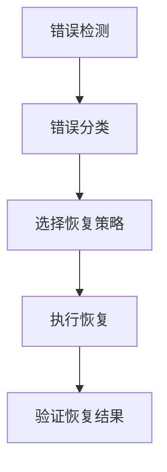
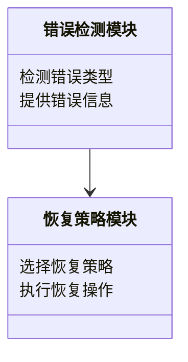
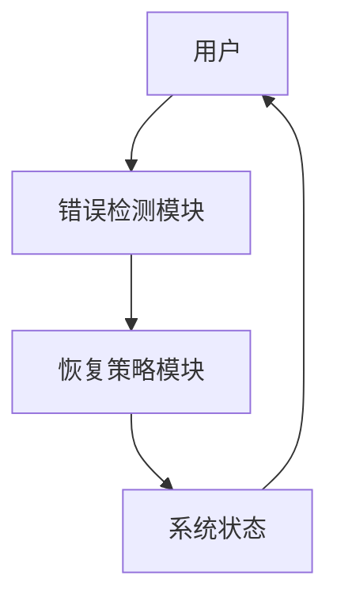
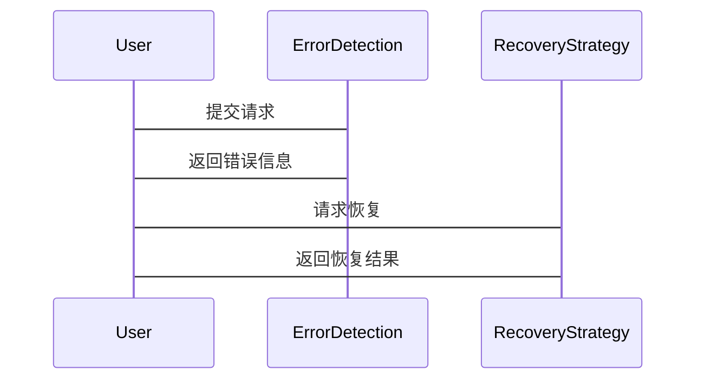

                 


# 错误处理与恢复：提高AI Agent的鲁棒性

## 关键词：
- 错误处理
- AI Agent
- 鲁棒性
- 错误恢复
- 系统架构

## 摘要：
本文深入探讨了错误处理与恢复在提高AI Agent鲁棒性中的重要作用。通过系统化的分析，文章详细介绍了错误处理的核心概念、算法原理、系统架构设计以及实际项目中的应用。结合丰富的图表、数学公式和代码示例，本文为读者提供了从理论到实践的全面指导，帮助AI Agent在复杂环境中实现可靠的运行。

---

## 第一部分: 错误处理与恢复的基础概念

### 第1章: 错误处理与恢复的背景介绍

#### 1.1 错误处理的基本概念
##### 1.1.1 问题背景与问题描述
错误处理是计算机系统设计中的核心问题。在AI Agent中，错误处理尤为重要，因为AI Agent需要在动态且不确定的环境中运行。错误处理的目标是检测和恢复系统中的异常状态，确保系统的稳定性和可靠性。

##### 1.1.2 错误处理的核心问题
错误处理的核心问题包括：如何检测错误、如何分类错误、如何选择恢复策略以及如何评估恢复的效果。这些问题直接关系到AI Agent的鲁棒性。

##### 1.1.3 错误处理的边界与外延
错误处理的边界包括：系统内部错误、外部环境错误以及用户输入错误。其外延涉及异常处理、容错设计和自我修复机制。

#### 1.2 AI Agent的错误处理需求
##### 1.2.1 AI Agent的定义与特点
AI Agent是一种智能体，能够感知环境并自主决策。其特点包括自主性、反应性、社会性和持续性。

##### 1.2.2 AI Agent的错误处理需求
AI Agent需要处理的错误类型包括：逻辑错误、数据错误、环境错误和通信错误。错误处理需求包括实时检测、快速恢复和自适应能力。

#### 1.3 错误处理与恢复的分类
##### 1.3.1 错误类型与分类标准
错误可以分为软错误和硬错误，也可以根据错误来源分为内部错误和外部错误。

##### 1.3.2 常见的错误处理策略
常见的策略包括忽略错误、终止程序、重试和自适应恢复。

#### 1.4 错误处理与鲁棒性的关系
##### 1.4.1 鲁棒性的定义
鲁棒性是指系统在异常条件下仍能正常运行的能力。

##### 1.4.2 错误处理对鲁棒性的贡献
错误处理是提高鲁棒性的关键手段，通过检测和恢复错误，系统可以在异常条件下继续运行。

##### 1.4.3 提高鲁棒性的错误处理策略
包括冗余设计、容错机制和自我修复能力。

#### 1.5 本章小结
本章介绍了错误处理的基本概念、AI Agent的错误处理需求以及错误处理与鲁棒性的关系。理解这些内容是后续章节的基础。

---

## 第二部分: 错误处理的核心概念与联系

### 第2章: 错误处理的核心原理

#### 2.1 错误检测的原理
##### 2.1.1 错误检测的算法原理
错误检测算法基于统计分析和模式识别，例如使用马尔可夫链模型来检测异常状态。

##### 2.1.2 错误检测的关键步骤
1. 数据收集与预处理
2. 异常检测算法选择
3. 错误类型分类

##### 2.1.3 错误检测的数学模型
错误检测的数学模型可以表示为：
$$ P(e|x) = \frac{P(x|e)P(e)}{P(x)} $$
其中，$e$ 表示错误，$x$ 表示观测数据。

#### 2.2 错误分类的原理
##### 2.2.1 错误分类的标准
错误分类可以根据错误的严重性、来源和影响范围进行分类。

##### 2.2.2 错误分类的算法
使用决策树或支持向量机（SVM）进行错误分类。

##### 2.2.3 错误分类的数学模型
错误分类的数学模型可以表示为：
$$ f(x) = \arg\max_{i} P(c_i|x) $$
其中，$c_i$ 表示第 $i$ 类错误。

#### 2.3 错误恢复的策略
##### 2.3.1 错误恢复的核心原理
错误恢复的目标是将系统从错误状态恢复到正常状态。

##### 2.3.2 错误恢复的实现步骤
1. 错误检测与分类
2. 确定恢复策略
3. 执行恢复操作

#### 2.4 错误恢复的数学模型
##### 2.4.1 基于概率的恢复策略
数学模型为：
$$ R(x) = \arg\max_{i} P(r_i|x) $$
其中，$r_i$ 表示第 $i$ 种恢复策略。

#### 2.5 错误恢复的流程图


---

## 第三部分: 错误处理的系统分析与架构设计

### 第3章: 错误处理系统的架构设计

#### 3.1 问题场景介绍
以智能客服系统为例，AI Agent需要处理用户输入错误和系统错误。

#### 3.2 系统功能设计
##### 3.2.1 领域模型设计


##### 3.2.2 系统架构设计


#### 3.3 系统接口设计
##### 3.3.1 错误检测模块接口
```python
class ErrorDetection:
    def detect_error(self, input):
        # 返回错误类型
```

##### 3.3.2 恢复策略模块接口
```python
class RecoveryStrategy:
    def recover(self, error_type):
        # 返回恢复结果
```

#### 3.4 系统交互流程


---

## 第四部分: 项目实战

### 第4章: 错误处理与恢复的项目实现

#### 4.1 环境安装
- Python 3.8+
- TensorFlow 2.0+
- Scikit-learn 0.20+

#### 4.2 核心代码实现
##### 4.2.1 错误检测器
```python
class ErrorDetector:
    def __init__(self, model):
        self.model = model

    def detect(self, input_data):
        # 返回错误类型
        pass
```

##### 4.2.2 恢复策略器
```python
class RecoveryStrategy:
    def __init__(self, config):
        self.config = config

    def recover(self, error_type):
        # 返回恢复操作
        pass
```

#### 4.3 代码解读与分析
##### 4.3.1 错误检测器实现
```python
import tensorflow as tf
from tensorflow.keras import layers

class ErrorDetector:
    def __init__(self):
        self.model = self.build_model()

    def build_model(self):
        model = tf.keras.Sequential()
        model.add(layers.Dense(64, activation='relu'))
        model.add(layers.Dense(10, activation='softmax'))
        return model
```

##### 4.3.2 恢复策略器实现
```python
class RecoveryStrategy:
    def __init__(self):
        self.config = {
            'retry': 3,
            'fallback': 'default'
        }

    def recover(self, error_type):
        if error_type == 'network':
            return 'retry'
        elif error_type == 'data':
            return 'fallback'
```

#### 4.4 案例分析与解读
以智能客服中的错误处理为例，详细分析错误检测和恢复的实现过程。

#### 4.5 项目小结
总结项目实现的关键点和经验教训。

---

## 第五部分: 高级主题与最佳实践

### 第5章: 高级主题与最佳实践

#### 5.1 容错设计原则
##### 5.1.1 冗余设计
通过冗余组件提高系统的容错能力。

##### 5.1.2 分层架构
将系统划分为多个层次，每个层次独立处理错误。

#### 5.2 错误日志与监控
##### 5.2.1 错误日志记录
记录错误类型、时间戳和上下文信息。

##### 5.2.2 错误监控工具
使用Prometheus和Grafana进行错误监控。

#### 5.3 自适应恢复策略
##### 5.3.1 基于反馈的恢复
根据用户反馈动态调整恢复策略。

##### 5.3.2 自适应算法
使用强化学习优化恢复策略。

#### 5.4 错误处理的伦理与法律
讨论错误处理中的伦理问题和法律合规性。

---

## 第六部分: 总结与展望

### 第6章: 总结与展望

#### 6.1 核心内容总结
总结全文的核心内容和主要观点。

#### 6.2 当前挑战
分析当前错误处理与恢复技术的挑战。

#### 6.3 未来展望
展望未来的研究方向和技术趋势。

---

## 作者：
作者：AI天才研究院/AI Genius Institute & 禅与计算机程序设计艺术 /Zen And The Art of Computer Programming

---

以上是完整的目录大纲和文章内容，涵盖了从基础概念到高级主题的详细讲解，结合理论、算法、系统设计和实际案例，帮助读者全面理解并掌握错误处理与恢复的技术，从而提高AI Agent的鲁棒性。

