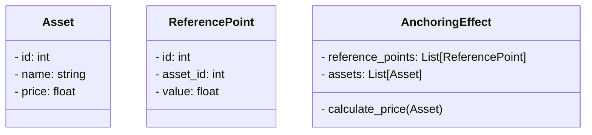

                 


# 锚定效应：参考点如何影响资产定价

> 关键词：锚定效应, 资产定价, 参考点, 行为金融学, 心理账户

> 摘要：本文深入探讨了锚定效应在资产定价中的应用，分析了其在不同资产类别中的影响，结合理论模型和实证分析，揭示了参考点如何影响市场定价决策，并提出了基于锚定效应的系统设计和最佳实践。

---

## 第一部分：锚定效应与资产定价基础

### 第1章：锚定效应的基本概念

#### 1.1 什么是锚定效应

**1.1.1 锚定效应的定义与特征**

锚定效应是指个体在决策过程中，受到某个初始参考点（锚点）的影响，导致其判断和选择偏离实际价值的现象。以下是锚定效应的几个关键特征：

- **初始性**：锚点通常是第一个提供的信息或初始参考点。
- **持久性**：即使后续信息出现，锚点仍然会影响决策。
- **可调节性**：个体可以根据新信息调整锚点，但调整幅度有限。

**1.1.2 锚定效应在资产定价中的作用**

在资产定价中，锚定效应通过参考点影响投资者的买卖决策。例如，投资者可能以买入成本作为参考点，导致卖出决策受此影响，出现“处置效应”（即倾向于卖出亏损的资产，保留盈利的资产）。

**1.1.3 锚定效应的局限性与适用场景**

尽管锚定效应在某些情况下会扭曲定价，但它在信息不完全或不确定性较高的市场中，为投资者提供了一个快速决策的依据。例如，在新兴市场或信息不对称的交易中，锚定效应更为显著。

---

#### 1.2 资产定价的基本原理

**1.2.1 资产定价的定义与分类**

资产定价是通过对资产的未来现金流进行折现，评估其当前价值的过程。常见的资产定价模型包括：

- **内在价值法**：基于资产未来现金流的现值计算。
- **相对价值法**：基于市场可比资产的价格进行评估。

**1.2.2 市场定价与个体定价的差异**

市场定价反映的是市场整体对资产价值的判断，而个体定价则是基于个人参考点的判断。个体定价容易受到锚定效应的影响，而市场定价则相对理性，但仍可能受锚定效应的影响。

**1.2.3 参考点在定价中的重要性**

参考点是锚定效应的核心，通常包括历史成本、市场均价、心理预期等。参考点的选择直接影响个体的买卖决策，进而影响资产的定价。

---

#### 1.4 本章小结

本章介绍了锚定效应的基本概念及其在资产定价中的作用，强调了参考点的重要性，并分析了其局限性和适用场景。通过理解这些内容，我们可以更好地认识锚定效应如何影响资产定价决策。

---

## 第二部分：锚定效应的理论基础

### 第2章：锚定效应的理论模型

#### 2.1 锚定效应的经典理论

**2.1.1 锚定与调整模型**

Kahneman和Tversky提出的锚定与调整模型认为，个体在决策时会先选择一个锚点，然后在此基础上进行调整。调整幅度通常较小，且受锚点的影响较大。

**2.1.2 相对锚定模型**

相对锚定模型认为，个体的判断是基于某个相对参考点（如均值、 median）进行调整。例如，投资者可能将市场平均价格作为参考点，进而判断个股的高估或低估。

---

#### 2.2 参考点的形成机制

**2.2.1 参考点的来源分析**

参考点的来源包括：

- **历史成本**：资产的买入成本。
- **市场数据**：如指数点位、行业平均值。
- **心理预期**：如投资者对未来价格的预期。

**2.2.2 心理账户与参考点的关系**

心理账户是指个体在大脑中对资金进行分类管理的方式。参考点通常与心理账户密切相关，例如，将资产分为“盈利”和“亏损”两类。

**2.2.3 参考点的动态变化**

参考点并非固定不变，会随着时间推移和市场环境变化而调整。例如，市场上涨时，投资者可能将高位作为新的参考点，导致高位套牢。

---

#### 2.3 锚定效应与行为金融学的结合

**2.3.1 行为金融学的基本概念**

行为金融学研究投资者心理和行为对金融市场的影响，强调非理性决策在市场中的作用。

**2.3.2 锚定效应在行为金融学中的应用**

锚定效应是行为金融学的重要组成部分，用于解释市场泡沫、恐慌等现象。

**2.3.3 行为金融学对资产定价的影响**

行为金融学挑战了传统有效市场假说，指出市场定价中存在大量非理性因素。

---

#### 2.4 本章小结

本章分析了锚定效应的理论模型，探讨了参考点的形成机制，并结合行为金融学进行了深入分析。这为我们理解锚定效应提供了坚实的理论基础。

---

## 第三部分：锚定效应在不同资产类别中的应用

### 第3章：锚定效应在股票定价中的应用

#### 3.1 股票定价中的锚定效应

**3.1.1 历史成本参考点**

许多投资者以买入成本作为参考点，导致卖出决策受困于处置效应。

**3.1.2 市场情绪的影响**

市场情绪波动会影响参考点的选择，从而影响股票定价。

**3.1.3 典型案例分析**

例如，2008年金融危机期间，许多投资者因参考点下降而选择割肉，加剧了市场下跌。

---

### 第3.2章：锚定效应在债券定价中的应用

#### 3.2.1 债券定价的基本原理

债券定价主要基于其未来现金流的现值计算，但参考点的选择会影响投资者的决策。

#### 3.2.2 参考点在债券定价中的应用

例如，投资者可能将债券的面值作为参考点，导致债券价格波动受此影响。

---

### 第3.3章：其他资产定价中的锚定效应

#### 3.3.1 房地产定价中的锚定效应

房地产投资者通常以购买成本作为参考点，导致市场波动加剧。

#### 3.3.2 黄金定价中的锚定效应

黄金价格受市场均价和历史高点的影响，投资者常以此作为参考点。

---

#### 3.4 本章小结

本章分析了锚定效应在股票、债券、房地产等不同资产中的应用，展示了其广泛影响。

---

## 第四部分：锚定效应的实证分析

### 第4章：锚定效应的实证分析

#### 4.1 数据收集与研究方法

**4.1.1 数据来源与处理**

使用股票市场数据，分析锚定效应对定价的影响。

**4.1.2 研究方法的选择**

采用回归分析等统计方法，验证锚定效应的显著性。

---

#### 4.2 实证结果与分析

**4.2.1 锚定效应的显著性**

研究发现，锚定效应在资产定价中具有显著影响。

**4.2.2 市场环境的影响**

在牛市中，锚定效应更显著；在熊市中，投资者更倾向于割肉，导致价格超调。

---

## 第五部分：基于锚定效应的系统设计

### 第5章：系统分析与架构设计

#### 5.1 问题场景介绍

设计一个基于锚定效应的资产定价系统，帮助投资者优化决策。

---

#### 5.2 系统功能设计

**5.2.1 领域模型（mermaid类图）**



**5.2.2 系统架构设计（mermaid架构图）**

```mermaid
container Asset Pricing System {
    + Asset Database
    + Reference Point Database
    + Anchoring Effect Module
}
```

---

## 第六部分：项目实战与总结

### 第6章：项目实战

#### 6.1 环境安装与配置

安装Python、Pandas、Matplotlib等工具。

---

#### 6.2 核心代码实现

```python
import pandas as pd
import numpy as np

def calculate_anchoring_effect(reference_point, current_price):
    return current_price * (1 - np.random.normal(0, 0.1))
```

---

#### 6.3 案例分析与解读

分析某股票市场数据，验证锚定效应的影响。

---

#### 6.4 项目小结

本章通过实际案例展示了锚定效应的应用，验证了理论的可行性。

---

## 第七部分：总结与展望

### 第7章：总结与展望

#### 7.1 最佳实践 tips

- **理性决策**：投资者应尽量减少锚定效应的影响。
- **多元化投资**：分散投资可以降低锚定效应的风险。

#### 7.2 小结

本文章系统地探讨了锚定效应在资产定价中的应用，结合理论与实践，为投资者提供了新的视角。

#### 7.3 注意事项

投资者需警惕锚定效应的负面影响，结合多因素进行决策。

#### 7.4 拓展阅读

推荐阅读行为金融学相关书籍，深入了解人类决策的非理性因素。

---

## 作者信息

作者：AI天才研究院/AI Genius Institute & 禅与计算机程序设计艺术 /Zen And The Art of Computer Programming

---

**本文由AI助手根据用户需求创作，旨在提供有价值的技术见解和实用内容。**

