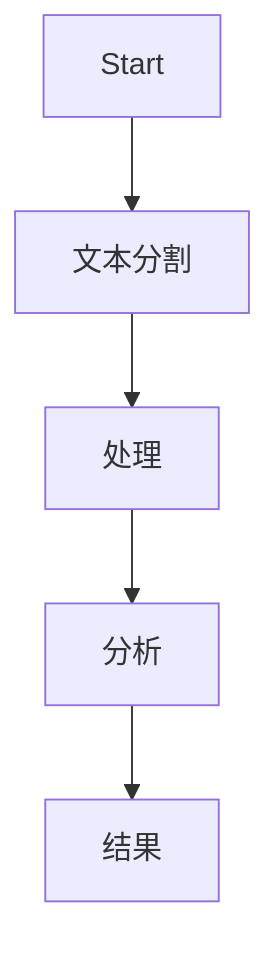
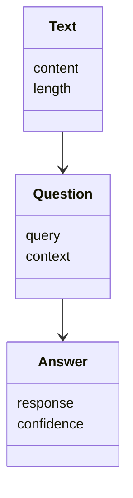

                 


# 长文本处理：增强AI Agent的阅读理解能力

> 关键词：长文本处理、阅读理解、AI Agent、自然语言处理、上下文理解

> 摘要：长文本处理是增强AI Agent阅读理解能力的关键技术。本文深入探讨了长文本处理的背景、核心概念、算法原理、系统设计及其实战应用，结合丰富的案例和代码示例，帮助读者全面理解并掌握相关技术。

---

# 第1章 长文本处理与阅读理解概述

## 1.1 长文本处理的背景与重要性

### 1.1.1 从短文本到长文本的处理演进
- 短文本处理的局限性：信息不完整、上下文缺失。
- 长文本处理的必要性：捕捉全局信息，提升理解深度。

### 1.1.2 长文本处理的独特挑战
- 信息量大：处理时间和资源消耗增加。
- 上下文依赖：需要复杂语义分析。
- 实时性要求：动态调整处理策略。

### 1.1.3 阅读理解在AI Agent中的作用
- 提供决策支持：基于上下文生成回答。
- 改善用户体验：实现更自然的对话交互。

## 1.2 阅读理解的核心概念

### 1.2.1 阅读理解的定义与目标
- 定义：理解文本内容并回答问题。
- 目标：提升AI Agent的语义理解能力。

### 1.2.2 长文本处理的关键问题
- 文本分割：如何高效分割长文本。
- 上下文理解：如何处理上下文关系。

### 1.2.3 AI Agent阅读理解的能力边界
- 信息提取：从文本中提取关键信息。
- 逻辑推理：基于上下文进行推理。

## 1.3 问题背景与解决思路

### 1.3.1 当前长文本处理的难点
- 上下文理解复杂：需要考虑多层语义。
- 处理效率低下：长文本处理耗时长。

### 1.3.2 阅读理解在AI Agent中的应用场景
- 问答系统：回答用户问题。
- 信息抽取：提取关键实体信息。

### 1.3.3 解决问题的主要思路与方法
- 结合预训练模型：利用BERT等模型进行语义分析。
- 分布式处理：并行处理长文本数据。

## 1.4 核心概念与外延

### 1.4.1 长文本处理的核心要素
- 文本预处理：分词、句法分析。
- 语义分析：词袋模型、注意力机制。

### 1.4.2 阅读理解的层次结构
- 表层理解：识别实体。
- 深层理解：理解意图。

### 1.4.3 相关技术的边界与关联
- 与文本摘要的差异：阅读理解注重理解，摘要注重压缩。
- 与机器翻译的联系：共享语义分析技术。

## 1.5 本章小结

---

# 第2章 阅读理解的原理与方法

## 2.1 阅读理解的基本原理

### 2.1.1 阅读理解的三要素模型
- 文本：输入的长文本。
- 问题：需要回答的查询。
- 回答：生成的结果。

### 2.1.2 基于上下文的语义分析
- 上下文关联：处理上下文依赖。
- 多层次分析：从词到句到段落的分析。

### 2.1.3 预训练语言模型的作用
- 使用BERT进行语义编码。
- 利用模型的上下文理解能力。

## 2.2 长文本处理的关键技术

### 2.2.1 文本分割与分块技术
- 分割策略：基于句子长度或语义边界。
- 分块处理：减少计算负担。

### 2.2.2 注意力机制在长文本中的应用
- 局部注意力：处理局部上下文。
- 全局注意力：捕捉全局信息。

### 2.2.3 知识图谱与上下文关联
- 知识图谱构建：提取实体关系。
- 上下文关联：利用图谱推理。

## 2.3 阅读理解与AI Agent的结合

### 2.3.1 阅读理解在对话系统中的应用
- 基于上下文的问答。
- 生成回答：利用预训练模型生成回答。

### 2.3.2 长文本推理与决策支持
- 推理能力：基于上下文进行推理。
- 决策支持：提供决策依据。

### 2.3.3 多模态信息的融合与处理
- 文本与图像的结合：多模态理解。
- 融合技术：利用多模态数据提升理解能力。

## 2.4 核心概念对比分析

### 2.4.1 阅读理解与文本摘要的对比
- 阅读理解：理解内容并回答问题。
- 文本摘要：压缩文本信息。

### 2.4.2 长文本处理与短文本处理的差异
- 长文本：处理复杂，需要上下文理解。
- 短文本：处理简单，信息量小。

### 2.4.3 不同模型的性能对比与选择
- BERT vs GPT：选择适合任务的模型。
- 性能对比：基于准确率、效率等指标。

## 2.5 实体关系图与流程图

### 2.5.1 阅读理解的实体关系图


### 2.5.2 长文本处理的流程图


---

# 第3章 阅读理解的算法原理

## 3.1 基础算法原理

### 3.1.1 基于注意力机制的阅读理解模型
- 注意力机制：分配权重到不同位置。
- 模型结构：编码器-解码器架构。

### 3.1.2 文本相似度计算
- 余弦相似度：计算文本向量之间的相似度。
- 模型训练：使用相似度排序任务。

### 3.1.3 预训练模型的微调
- 微调步骤：在特定任务上进行微调。
- 模型选择：选择适合任务的预训练模型。

### 3.1.4 案例分析
- 案例：使用BERT进行问答任务。
- 代码示例：加载预训练模型，微调任务。

## 3.2 高级算法原理

### 3.2.1 基于Transformer的长文本处理
- Transformer结构：编码器和解码器。
- 多头注意力机制：处理长文本的全局信息。

### 3.2.2 长文本分割与拼接策略
- 分割策略：基于模型容量和任务需求。
- 拼接策略：保留上下文信息。

### 3.2.3 分布式处理与并行计算
- 分布式训练：利用多GPU加速。
- 并行计算：模型并行和数据并行。

### 3.2.4 案例分析
- 案例：使用分布式训练处理长文本。
- 代码示例：使用Hugging Face库进行分布式训练。

## 3.3 算法实现与优化

### 3.3.1 算法实现细节
- 代码实现：加载数据集、定义模型、训练模型。
- 优化技巧：调整学习率、使用早停。

### 3.3.2 性能优化策略
- 模型压缩：减少模型参数。
- 知识蒸馏：将大模型的知识迁移到小模型。

### 3.3.3 案例分析
- 案例：优化BERT模型用于长文本处理。
- 代码示例：使用TensorFlow进行模型优化。

---

# 第4章 阅读理解的系统分析与架构设计

## 4.1 系统分析

### 4.1.1 问题场景介绍
- 需求：构建一个支持长文本阅读理解的系统。
- 约束条件：处理长文本，实时响应。

### 4.1.2 项目介绍
- 项目目标：提升AI Agent的阅读理解能力。
- 项目范围：支持多种长文本格式，提供高效处理。

## 4.2 系统功能设计

### 4.2.1 领域模型设计
- 用户角色：用户、AI Agent。
- 实体关系：文本、问题、回答。

### 4.2.2 领域模型图


### 4.2.3 功能模块
- 文本预处理模块：分割、清洗。
- 语义理解模块：编码、解码。
- 结果生成模块：回答生成、结果输出。

## 4.3 系统架构设计

### 4.3.1 系统架构图
```mermaid
graph LR
    Client --> API Gateway
    API Gateway --> Load Balancer
    Load Balancer --> [处理节点]
    [处理节点] --> Database
```

### 4.3.2 接口设计
- API接口：接收文本和问题，返回答案。
- 数据格式：JSON格式，包含文本和问题。

### 4.3.3 交互流程
- 用户发送请求：包含长文本和问题。
- 系统处理：预处理、分析、生成回答。
- 返回结果：结构化答案和置信度。

## 4.4 系统优化与扩展

### 4.4.1 系统优化策略
- 异步处理：提高处理效率。
- 缓存机制：减少重复计算。

### 4.4.2 系统扩展方案
- 模型部署：使用容器化技术。
- 水平扩展：增加处理节点。

### 4.4.3 案例分析
- 案例：使用Kubernetes部署模型。
- 代码示例：使用Docker编写镜像。

---

# 第5章 阅读理解的项目实战

## 5.1 环境安装

### 5.1.1 安装Python环境
- 安装Python 3.8及以上版本。
- 安装Jupyter Notebook。

### 5.1.2 安装必要的库
- 安装TensorFlow、Keras、Hugging Face库。

```bash
pip install tensorflow==2.5.0
pip install transformers==4.10.0
pip install jupyter
```

## 5.2 核心代码实现

### 5.2.1 文本预处理代码
```python
import transformers

def preprocess(text):
    tokenizer = transformers.BertTokenizer.from_pretrained('bert-base-uncased')
    inputs = tokenizer.encode_plus(text, add_special_tokens=True, return_token_ids=True)
    return inputs['input_ids'], inputs['attention_mask']
```

### 5.2.2 模型训练代码
```python
from transformers import BertForQuestionAnswering

model = BertForQuestionAnswering.from_pretrained('bert-base-uncased')
model.train()
```

### 5.2.3 模型推理代码
```python
def predict(text, question):
    inputs = tokenizer.encode_plus(text, question, add_special_tokens=True, return_token_ids=True)
    outputs = model(**inputs)
    start_index = outputs.start_logits.argmax()
    end_index = outputs.end_logits.argmax()
    return text[start_index:end_index+1]
```

## 5.3 案例分析与结果展示

### 5.3.1 实际案例分析
- 输入文本：一段长文本。
- 输入问题：具体问题。
- 输出结果：模型生成的回答。

### 5.3.2 结果分析
- 正确率：评估模型性能。
- 消除误差：分析错误原因。

## 5.4 项目小结

---

# 第6章 阅读理解的最佳实践

## 6.1 最佳实践

### 6.1.1 系统设计注意事项
- 模块化设计：便于维护和扩展。
- 高可用性：确保系统稳定运行。

### 6.1.2 模型优化技巧
- 参数调整：优化模型参数。
- 数据增强：增加训练数据多样性。

### 6.1.3 模型部署建议
- 使用云平台：如AWS、Azure。
- 容器化部署：使用Docker。

## 6.2 小结

## 6.3 注意事项

## 6.4 拓展阅读

---

# 作者

作者：AI天才研究院/AI Genius Institute & 禅与计算机程序设计艺术 /Zen And The Art of Computer Programming

