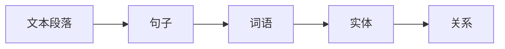
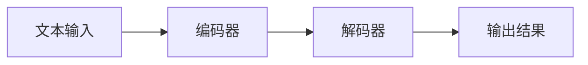
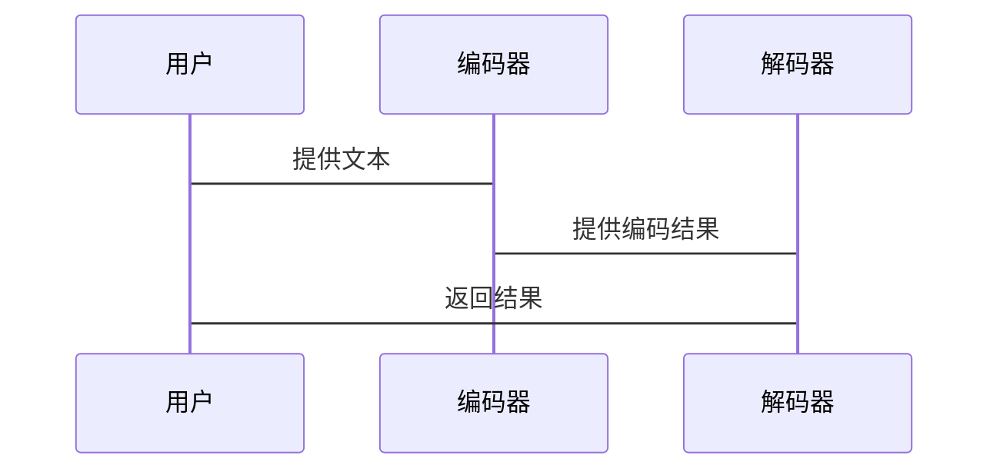

                 


# 长文本理解：增强AI Agent的阅读能力

## 关键词
长文本理解, AI Agent, 自然语言处理, Transformer, 深度学习

## 摘要
长文本理解是人工智能领域的重要研究方向，旨在提升AI Agent对复杂长文本内容的阅读和理解能力。本文系统地介绍了长文本理解的核心概念、算法原理、系统设计、项目实战及最佳实践，帮助读者全面掌握这一技术。

---

## 第一部分: 长文本理解的背景与核心概念

### 第1章: 长文本理解的定义与问题背景

#### 1.1 长文本理解的定义
长文本理解是指AI Agent能够解析、分析和理解长度较长的文本内容的能力。其核心目标是通过自然语言处理技术，提取文本中的关键信息并进行语义分析，以便为后续任务提供支持。

#### 1.2 长文本理解的问题背景
当前AI Agent的阅读能力在处理长文本时面临以下挑战：
- **信息量大**：长文本包含大量信息，需要高效的方法进行处理。
- **语义复杂**：长文本中的语义关系复杂，难以准确理解。
- **计算资源需求高**：长文本处理需要大量计算资源，对模型性能要求较高。

#### 1.3 长文本理解的重要性与应用场景
长文本理解在多个领域具有重要应用，如智能客服、医疗信息处理、法律文本分析等。

---

### 第2章: 长文本理解的核心概念与联系

#### 2.1 长文本理解的核心概念
- **文本结构化**：将文本分解为句子、词语等基本单位。
- **语义分析**：理解文本中词语之间的关系和整体含义。
- **文本摘要**：提取文本的核心信息，生成简洁的摘要。
- **文本推理**：基于文本内容进行逻辑推理。

#### 2.2 核心概念的属性特征对比
| 概念 | 输入 | 输出 | 目标 |
|------|------|------|------|
| 文本结构化 | 原始文本 | 句子、词语 | 提取文本结构 |
| 语义分析 | 句子、词语 | 语义关系 | 理解语义含义 |

#### 2.3 实体关系图（ER图）架构


---

## 第二部分: 长文本理解的算法原理

### 第3章: 基于Transformer的长文本理解算法

#### 3.1 Transformer模型原理
- **结构**：Transformer由编码器和解码器组成。
- **工作流程**：
  1. 输入文本通过编码器进行词向量编码。
  2. 编码器输出结果通过解码器生成最终的语义表示。

#### 3.2 Transformer模型的数学公式
$$\text{Transformer}(x) = \text{Dec}(f(\text{Enc}(x)))$$

#### 3.3 Transformer模型的Python实现
```python
import torch
import torch.nn as nn

class Transformer(nn.Module):
    def __init__(self, embed_dim):
        super(Transformer, self).__init__()
        self.encoder = nn.Sequential(
            nn.Embedding(embed_dim),
            nn.Linear(embed_dim, embed_dim)
        )
        self.decoder = nn.Sequential(
            nn.Linear(embed_dim, embed_dim),
            nn.Linear(embed_dim, 1)
        )
    
    def forward(self, x):
        encoded = self.encoder(x)
        decoded = self.decoder(encoded)
        return decoded
```

---

## 第三部分: 长文本理解的系统设计

### 第4章: 长文本理解系统设计

#### 4.1 系统架构设计


#### 4.2 系统交互流程


---

## 第四部分: 项目实战

### 第5章: 长文本理解的实战应用

#### 5.1 环境安装
- 安装Python和必要的库（如PyTorch、Hugging Face Transformers）。

#### 5.2 核心代码实现
```python
from transformers import BertTokenizer, BertModel

tokenizer = BertTokenizer.from_pretrained('bert-base-uncased')
model = BertModel.from_pretrained('bert-base-uncased')

text = "长文本理解是人工智能领域的重要研究方向。"
inputs = tokenizer(text, return_tensors='np')
outputs = model(**inputs)
```

#### 5.3 案例分析
分析一个法律文本，提取关键条款并生成摘要。

---

## 第五部分: 总结与展望

### 第6章: 长文本理解的总结与展望

#### 6.1 核心要点回顾
- 长文本理解的核心概念。
- Transformer模型的工作原理。
- 系统设计与实现。

#### 6.2 最佳实践Tips
- 选择合适的模型和工具。
- 合理优化计算资源。
- 定期更新模型和数据。

#### 6.3 小结
长文本理解是AI Agent能力提升的重要方向，未来将更加注重模型的高效性和准确性。

---

## 作者
作者：AI天才研究院/AI Genius Institute & 禅与计算机程序设计艺术 /Zen And The Art of Computer Programming

