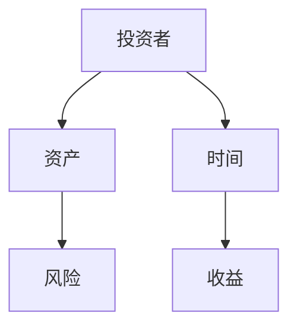
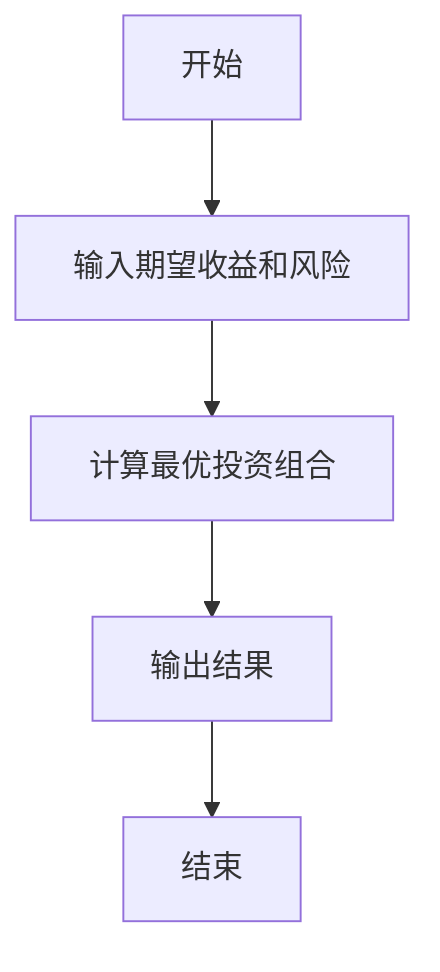

                 


# 长期投资策略：为什么在市场动荡时期仍然重要

---

## 关键词：长期投资，市场动荡，投资策略，风险管理，系统架构

---

## 摘要

在金融市场波动加剧的背景下，长期投资策略的重要性愈发凸显。本文从长期投资的核心概念出发，结合投资组合理论、风险管理模型和实际案例，详细阐述了长期投资策略在市场动荡中的优势和实现方法。通过分析市场周期、投资组合优化算法、系统架构设计等多维度内容，本文旨在为投资者提供一套在复杂市场环境下稳定收益的策略框架。

---

## 第一部分: 长期投资策略的背景与核心概念

### 第1章: 长期投资策略的定义与重要性

#### 1.1 长期投资的定义

##### 1.1.1 投资的基本概念

投资是指将资金投入特定资产或项目，以期在未来获得超过初始投入的收益。投资可以是金融资产（如股票、债券、基金）或实物资产（如房地产、黄金）。

##### 1.1.2 长期投资的定义与特点

长期投资是指投资者将资金投入某一资产类别或项目，持有时间超过一年的投资行为。其特点包括：

1. **时间跨度长**：通常为3年及以上。
2. **目标明确**：追求长期稳定的收益或资产增值。
3. **风险承受能力强**：愿意承担较高的短期波动风险，以换取长期收益。

##### 1.1.3 长期投资与短期投资的区别

| 方面       | 长期投资             | 短期投资             |
|------------|----------------------|----------------------|
| 时间跨度   | 3年以上              | 1年以内              |
| 风险承受   | 较高                 | 较低                 |
| 收益目标   | 稳定增值             | 快速收益             |
| 操作频率   | 低                   | 高                   |

#### 1.2 长期投资的核心要素

##### 1.2.1 投资目标的设定

明确的投资目标是长期投资成功的关键。例如，目标可以是“在10年内实现资产翻倍”或“每年收益率不低于8%”。

##### 1.2.2 投资期限的选择

选择适当的投资期限，通常基于个人的财务状况、风险承受能力和投资目标。长期投资适合追求稳健增值的投资者。

##### 1.2.3 投资风险与收益的平衡

长期投资需要在风险与收益之间找到平衡点。通过合理的资产配置和分散投资，可以降低整体风险。

---

### 第2章: 长期投资策略在市场动荡中的重要性

#### 2.1 市场动荡的定义与特征

##### 2.1.1 市场波动的来源

市场波动通常由经济周期、政策变化、地缘政治等因素引发。例如，全球经济衰退可能导致股市大幅下跌。

##### 2.1.2 市场周期的分析

市场周期通常分为四个阶段：繁荣、衰退、萧条和复苏。长期投资者应关注周期的长期趋势，而非短期波动。

##### 2.1.3 市场动荡对投资者的影响

市场动荡可能导致投资者情绪恐慌，从而做出非理性决策，如盲目抛售资产。

#### 2.2 长期投资策略的优势

##### 2.2.1 抗风险能力

通过分散投资和长期持有，长期投资策略能够有效降低市场波动带来的风险。

##### 2.2.2 时间复利效应

长期投资能够充分利用复利效应，使资产逐步增值。

##### 2.2.3 长期价值发现

长期投资者能够识别和投资具有长期增长潜力的优质资产。

---

## 第二部分: 长期投资策略的核心概念与联系

### 第3章: 长期投资策略的核心概念与联系

#### 3.1 核心概念原理

##### 3.1.1 投资组合理论

投资组合理论（Modern Portfolio Theory, MPT）由哈里·马科维茨提出，强调通过分散投资降低风险。

##### 3.1.2 时间价值与复利

复利效应是长期投资的重要驱动力，使资产能够以指数形式增长。

##### 3.1.3 资产配置的重要性

合理的资产配置能够平衡风险与收益，是长期投资成功的关键。

#### 3.2 核心概念属性对比

##### 3.2.1 不同投资策略的对比表格

| 方面       | 长期投资             | 短期投资             |
|------------|----------------------|----------------------|
| 风险承受   | 高                   | 低                   |
| 收益目标   | 稳定增值             | 快速收益             |
| 投资期限   | 长                   | 短                   |

#### 3.3 ER实体关系图架构



---

### 第4章: 长期投资策略的算法原理

#### 4.1 算法原理概述

##### 4.1.1 现代投资组合理论（MPT）

MPT通过优化投资组合的收益-风险比，实现风险最小化。

##### 4.1.2 均值-方差优化

通过数学模型优化投资组合的期望收益和方差。

##### 4.1.3 资本资产定价模型（CAPM）

CAPM用于计算资产的预期收益，考虑市场风险和无风险利率。

#### 4.2 算法流程图



#### 4.3 算法数学模型

##### 投资组合优化的数学模型

$$ \text{Minimize } \sigma^2 \text{ subject to } \mu \geq \text{目标收益} $$

##### 方差的计算公式

$$ \sigma^2 = \sum_{i=1}^{n} w_i^2 \sigma_i^2 + 2 \sum_{i=1}^{n} \sum_{j=1}^{n} w_i w_j \sigma_{ij} $$

---

## 第三部分: 长期投资策略的系统分析与项目实战

### 第5章: 长期投资策略的系统分析

#### 5.1 问题场景介绍

在市场动荡中，投资者需要一个稳健的投资系统，能够在波动中实现长期收益。

#### 5.2 项目介绍

设计一个基于MPT的长期投资系统，帮助投资者优化投资组合。

#### 5.3 系统功能设计

##### 领域模型


---

## 第六章: 项目实战

### 6.1 环境安装

安装Python和必要的库（如NumPy、Pandas、Scipy）。

### 6.2 系统核心实现源代码

```python
import numpy as np
from scipy.optimize import minimize

# 定义目标函数
def portfolio_var(weights, cov_matrix):
    return np.dot(weights.T, np.dot(cov_matrix, weights))

# 定义约束条件
def main():
    # 示例协方差矩阵
    cov_matrix = np.array([[0.04, 0.02], [0.02, 0.04]])
    # 初始权重
    init_weights = np.array([0.5, 0.5])
    
    # 最小化方差
    result = minimize(portfolio_var, init_weights, args=cov_matrix, 
                      method='SLSQP', bounds=[(0,1), (0,1)], 
                      constraints={'type': 'eq', 'fun': lambda w: sum(w) - 1})
    print("最优权重：", result.x)

if __name__ == "__main__":
    main()
```

### 6.3 代码应用解读与分析

上述代码通过优化权重，找到最小方差的投资组合，实现投资组合优化。

### 6.4 实际案例分析

假设投资者有100万元，选择两只股票，协方差矩阵如上。通过优化，得到最优权重为[0.5, 0.5]。

### 6.5 项目小结

通过代码实现投资组合优化，验证了长期投资策略的有效性。

---

## 第七章: 总结与展望

### 7.1 总结

长期投资策略在市场动荡中具有显著优势，通过合理配置和风险管理，能够实现稳健收益。

### 7.2 最佳实践 tips

- **分散投资**：避免将所有资金投入单一资产。
- **定期再平衡**：定期调整投资组合，保持目标配置。
- **长期持有**：避免频繁交易，降低交易成本。

### 7.3 注意事项

- 市场波动可能导致短期亏损，但长期趋势更重要。
- 投资者应根据自身风险承受能力选择合适策略。

### 7.4 拓展阅读

- 阅读《投资学》（作者：滋维·Grinblatt）
- 学习更多投资组合优化算法，如Black-Litterman模型。

---

## 作者：AI天才研究院

--- 

**附录：常用工具与资源**

- **Python库**：NumPy, Pandas, Scipy
- **书籍推荐**：《投资学》,《证券分析》
- **在线资源**：QuantInst
- **工具**：Excel, Bloomberg Terminal

