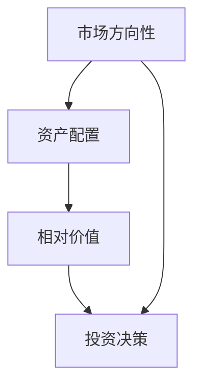
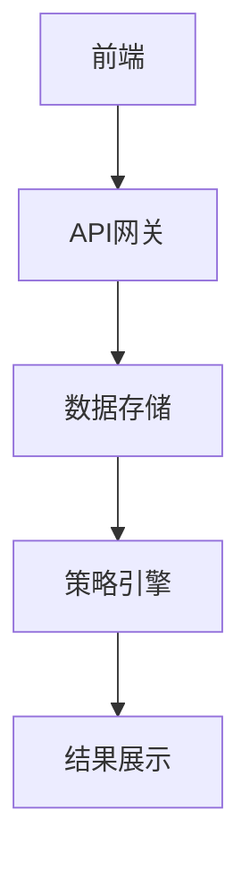

                 


# 长短期策略：平衡市场方向性与相对价值

## 关键词：长短期策略，市场方向性，相对价值，投资策略，算法原理，系统架构，项目实战

## 摘要：  
长短期策略是投资领域中的核心问题，涉及市场方向性与相对价值的平衡。本文通过分析长短期策略的核心原理、算法模型、系统架构及实际案例，探讨如何在市场波动中实现长期与短期目标的动态平衡。

---

# 第一部分: 长短期策略的背景与核心概念

## 第1章: 长短期策略概述

### 1.1 市场方向性与相对价值的定义
- **市场方向性**：指市场整体走势，包括上涨、下跌或震荡。  
- **相对价值**：指资产之间的相对定价，关注资产间的比较优势。  

### 1.2 长短期策略的核心问题
- **市场方向性对投资决策的影响**：长期策略注重趋势，短期策略关注波动。  
- **相对价值在资产配置中的作用**：通过资产间的相对估值优化配置。  

### 1.3 长短期策略的边界与外延
- **适用场景**：市场稳定或波动较大时。  
- **局限性**：市场不可预测性和策略执行成本。  

### 1.4 核心要素
- **市场趋势识别**：通过技术分析和基本面分析判断趋势。  
- **相对价值评估**：利用估值指标（PE、PB等）进行资产比较。  

---

# 第二部分: 长短期策略的核心概念与联系

## 第2章: 长短期策略的核心原理

### 2.1 长期策略的原理
- **逻辑**：追求长期稳定收益，注重资产配置和风险管理。  
- **数学模型**：时间序列分析、动态规划模型。  

### 2.2 短期策略的原理
- **逻辑**：抓住短期市场波动，利用技术指标和市场情绪进行交易。  
- **数学模型**：均值-方差模型、机器学习算法。  

### 2.3 长短期策略的平衡机制
- **动态平衡**：根据市场环境调整策略权重。  
- **协同作用**：长期策略提供方向性，短期策略捕捉机会。  

### 2.4 对比表
| 比较维度 | 长期策略 | 短期策略 |
|----------|----------|----------|
| 时间框架 | 5年以上 | 几周到几个月 |
| 风险承受 | 较高 | 较低 |
| 收益来源 | 资本增值 | 价格波动 |

### 2.5 ER实体关系图


---

# 第三部分: 长短期策略的算法原理与数学模型

## 第3章: 长短期策略的数学模型

### 3.1 长期策略的数学模型
- **时间序列分析**：使用ARIMA模型预测市场趋势。  
- **动态规划模型**：通过状态转移优化投资组合。  

### 3.2 短期策略的数学模型
- **均值-方差模型**：优化投资组合风险与收益。  
- **机器学习算法**：如LSTM用于时间序列预测。  

---

## 第4章: 算法实现与代码示例

### 4.1 长期策略算法实现
```python
import numpy as np
import pandas as pd
from sklearn.linear_model import LinearRegression

# 示例：长期趋势预测
data = pd.read_csv('market_data.csv')
X = np.array(data.index).reshape(-1, 1)
y = data['price'].values

model = LinearRegression()
model.fit(X, y)
future_periods = 5
X_future = np.array([len(data) + 1, len(data) + 2, len(data) + 3, len(data) + 4, len(data) + 5]).reshape(-1, 1)
y_future = model.predict(X_future)
```

### 4.2 短期策略算法实现
```python
import talib as ta

# 示例：短期交易信号生成
data = pd.read_csv('market_data.csv')
close_price = data['close']
signals = pd.Series(0, index=data.index, name='signal')

# 使用MACD指标生成信号
macd, signal_line, hist = ta.MACD(close_price, fastperiod=12, slowperiod=26, signalperiod=9)
signals[signal_line > macd] = 1
signals[signal_line < macd] = -1
```

---

# 第四部分: 系统分析与架构设计

## 第5章: 系统架构设计

### 5.1 项目场景介绍
- **目标**：构建长短期策略的分析系统。  
- **用户需求**：投资者需要实时市场数据和策略建议。  

### 5.2 系统功能设计
- **数据采集**：接口获取市场数据。  
- **策略分析**：计算市场方向性和相对价值。  
- **决策支持**：生成投资建议。  

### 5.3 系统架构设计


---

# 第五部分: 项目实战

## 第6章: 项目实战与案例分析

### 6.1 环境安装
```bash
pip install numpy pandas matplotlib scikit-learn
```

### 6.2 核心代码实现
```python
import matplotlib.pyplot as plt

# 示例：绘制市场趋势图
data = pd.read_csv('market_data.csv')
plt.figure(figsize=(10, 6))
plt.plot(data['date'], data['price'], label='Market Price')
plt.xlabel('Date')
plt.ylabel('Price')
plt.title('Market Trend Analysis')
plt.legend()
plt.show()
```

### 6.3 案例分析
- **案例1**：长期投资中市场趋势的识别。  
- **案例2**：短期交易中的相对价值评估。  

---

# 第六部分: 总结与展望

## 第7章: 总结与展望

### 7.1 本章小结
- 长短期策略的平衡是投资成功的关键。  
- 结合市场方向性和相对价值的分析，能够优化投资决策。  

### 7.2 最佳实践 tips
- 定期评估和调整策略。  
- 结合技术分析和基本面分析。  

### 7.3 小结
长短期策略的平衡需要深入的市场分析和灵活的策略调整。未来的研究可以进一步结合人工智能技术，提升策略的智能化水平。

---

作者：AI天才研究院/AI Genius Institute & 禅与计算机程序设计艺术 /Zen And The Art of Computer Programming

