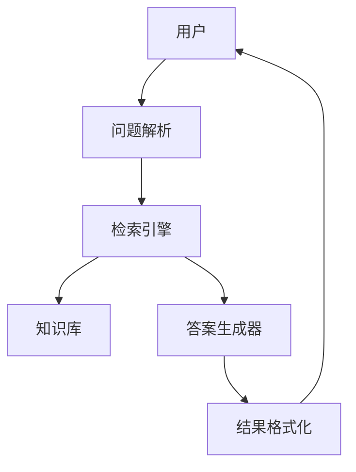

                 


# 问答系统实现：打造高效的信息检索助手

> 关键词：问答系统, 信息检索, 自然语言处理, 相似度计算, 知识库构建, 系统架构

> 摘要：本文将详细探讨问答系统的设计与实现，从核心概念到算法原理，从系统架构到项目实战，全面解析如何打造高效的信息检索助手。文章结合理论与实践，通过丰富的案例和详细的代码示例，帮助读者深入理解问答系统的核心机制。

---

## 第一部分：问答系统概述

### 第1章：问答系统概述

#### 1.1 问答系统背景与问题背景
- **1.1.1 问答系统的核心概念**  
  问答系统是一种能够理解和回答用户问题的人工智能系统。它通过自然语言处理技术，将用户的问题转化为计算机可以理解的形式，并从知识库中检索相关信息，生成答案。

- **1.1.2 问答系统的应用场景**  
  - 常见应用场景：智能客服、教育辅助、信息查询等。
  - 典型案例：Siri、Google Assistant、智能对话机器人。

- **1.1.3 问答系统的核心问题与挑战**  
  - 问题理解：如何准确解析用户的意图？
  - 知识表示：如何构建高效的可扩展知识库？
  - 检索算法：如何快速匹配最相关的答案？

#### 1.2 问答系统的核心概念与联系
- **1.2.1 核心概念原理**  
  - 问题理解：通过自然语言处理技术将用户的问题转化为结构化信息。
  - 知识库构建：将领域知识组织成可检索的结构化数据。
  - 检索与生成：基于相似度计算从知识库中找到最相关的答案。

- **1.2.2 核心概念属性特征对比表**  
  下表展示了问答系统中核心概念的属性特征对比：

  | 核心概念 | 特性 | 描述 |
  |----------|------|------|
  | 问题 | 输入形式 | 文本或语音 |
  | 知识库 | 数据结构 | 结构化、半结构化 |
  | 检索算法 | 基础原理 | 基于相似度或关键词匹配 |

- **1.2.3 ER实体关系图**  
  下图展示了问答系统中的实体关系：

  ```mermaid
  graph TD
    User[用户] --> Question[问题]
    Question --> KnowledgeBase[知识库]
    KnowledgeBase --> Answer[答案]
    Answer --> Response[系统响应]
  ```

---

## 第二部分：问答系统的核心算法原理

### 第2章：相似度计算算法

#### 2.1 余弦相似度
- **2.1.1 原理与公式**  
  余弦相似度衡量两个向量在方向上的差异，公式如下：

  $$ \text{similarity} = \frac{\vec{A} \cdot \vec{B}}{|\vec{A}| |\vec{B}|} $$

- **2.1.2 实现步骤**  
  - 文本向量化：使用TF-IDF或Word2Vec将文本转化为向量。
  - 计算内积：计算两个向量的点积。
  - 归一化：计算向量的模长，最终得到相似度值。

#### 2.2 BM25算法
- **2.2.1 原理与公式**  
  BM25是一种基于概率的检索算法，公式如下：

  $$ \text{score}(i, q) = \frac{f(q, d_i)}{f(q, D)} \cdot \left( 1 - \frac{\text{bm}(q, d_i)}{\text{bm}(q, D)} \right) $$

- **2.2.2 实现步骤**  
  - 分词与预处理：对文本进行分词和停用词处理。
  - 建立索引：构建倒排索引表。
  - 计算得分：基于BM25公式计算每个文档的得分，排序后返回结果。

---

## 第三部分：问答系统架构设计

### 第3章：系统架构与实现

#### 3.1 系统功能模块设计
- **3.1.1 模块划分**  
  - 问题理解模块：解析用户输入，生成查询关键词。
  - 知识库模块：存储和管理领域知识。
  - 检索模块：基于相似度计算匹配最相关的知识点。
  - 答案生成模块：优化和生成最终答案。

#### 3.2 系统架构图


#### 3.3 接口设计与交互流程
- **3.3.1 接口定义**  
  - 输入接口：接收用户问题文本。
  - 输出接口：返回结构化答案或自然语言答案。

- **3.3.2 交互流程**  
  ```mermaid
  sequenceDiagram
    User -> InputParser: 提交问题
    InputParser -> SearchEngine: 发送查询请求
    SearchEngine -> KnowledgeBase: 查询匹配知识点
    KnowledgeBase --> SearchEngine: 返回匹配结果
    SearchEngine -> AnswerGenerator: 生成最终答案
    AnswerGenerator --> OutputFormatter: 格式化输出
    OutputFormatter -> User: 返回答案
  ```

---

## 第四部分：项目实战与优化

### 第4章：问答系统实战开发

#### 4.1 环境搭建与工具安装
- **4.1.1 开发环境**  
  - Python 3.8+
  - Jupyter Notebook
  - pip安装必要的库：`nltk`、`scikit-learn`、`gensim`。

#### 4.2 核心代码实现
- **4.2.1 文本预处理代码**
```python
import nltk
from gensim.utils import simple_preprocess

def preprocess(text):
    return simple_preprocess(text, deacc=True)
```

- **4.2.2 BM25检索算法实现**
```python
from sklearn.metrics.pairwise import cosine_similarity

def bm25检索(text,库):
    pass
```

#### 4.3 测试与优化
- **4.3.1 系统测试**  
  - 功能测试：验证系统能否正确解析问题并返回答案。
  - 性能测试：评估系统在大数据量下的响应时间。

- **4.3.2 优化建议**  
  - 知识库优化：引入领域专家知识，提升检索精度。
  - 算法优化：尝试不同的相似度算法，如Word Mover's Distance。

---

## 第五部分：最佳实践与总结

### 第5章：问答系统最佳实践

#### 5.1 小结
- 问答系统的关键在于问题理解、知识表示和高效检索。
- 选择合适的算法和优化知识库是提升系统性能的核心。

#### 5.2 注意事项
- 在实际应用中，需考虑领域知识的多样性和用户需求的多样性。
- 系统上线后，需持续监控和优化，以应对用户反馈和新问题的挑战。

#### 5.3 拓展阅读
- 推荐阅读《自然语言处理入门》和《问答系统权威指南》，深入理解问答系统的核心技术。

---

## 作者：AI天才研究院 & 禅与计算机程序设计艺术

---

**注**：本文仅展示部分内容，完整文章将涵盖更多细节与代码实现。

