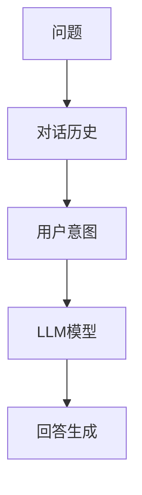
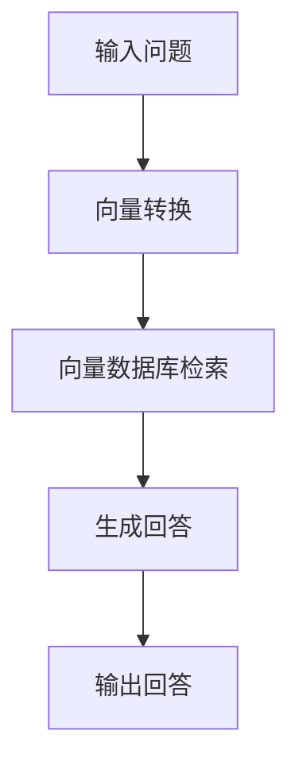
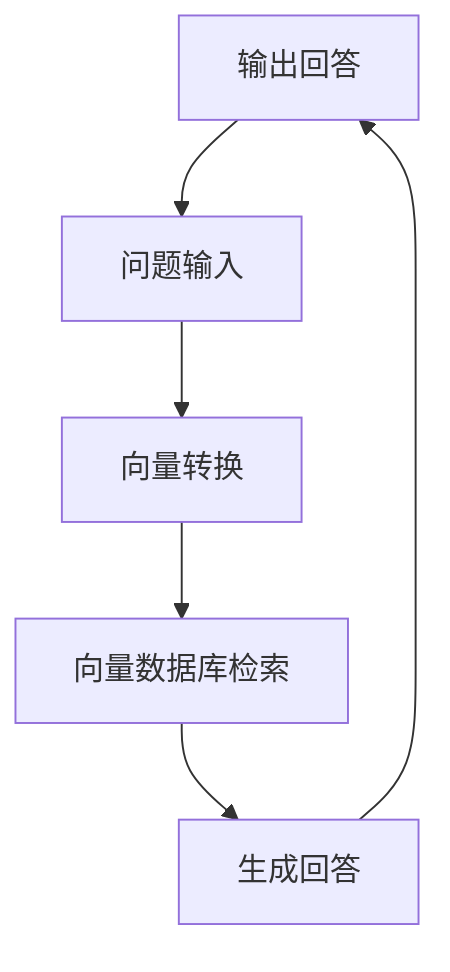

                 


# 问答系统：构建基于LLM的智能问答Agent

> 关键词：问答系统，LLM，智能问答Agent，向量数据库，检索式问答，生成式问答

> 摘要：本文详细介绍了如何构建基于大语言模型（LLM）的智能问答系统，从背景概念到核心算法，从系统架构到项目实战，全面解析智能问答Agent的构建过程。文章首先介绍了问答系统的核心概念与应用场景，然后深入探讨了基于LLM的问答系统的优势与原理，详细讲解了向量数据库、检索式问答和生成式问答的算法原理，最后通过系统设计与项目实战，展示如何构建一个高效智能的问答系统。

---

## 第1章 问答系统概述

### 1.1 问答系统的核心概念
问答系统（Question Answering System, QAS）是一种能够理解和回答用户提问的智能系统。它通过自然语言处理（NLP）技术，将用户的问题转化为计算机可以处理的形式，并结合知识库或模型生成回答。

#### 1.1.1 问题背景与问题描述
- **问题背景**：用户通过自然语言提问，系统需要准确理解问题并提供有用的回答。
- **问题描述**：问答系统的核心任务是将输入的自然语言问题映射到系统的知识库或模型中，生成准确的回答。

#### 1.1.2 问题解决的思路与方法
- **关键词提取**：从问题中提取关键信息，用于检索或生成回答。
- **上下文理解**：分析问题的上下文，确定回答的方向和范围。
- **多轮对话**：支持连续的多轮对话，理解对话的历史和上下文关系。

#### 1.1.3 问题的边界与外延
- **边界**：问答系统通常处理单个问题，不支持复杂的多步骤推理。
- **外延**：可以扩展到对话系统，支持上下文理解和多轮交互。

#### 1.1.4 核心概念结构与组成要素
- **输入**：自然语言问题。
- **输出**：生成的回答或检索的结果。
- **知识库**：用于支持回答的知识存储。
- **模型**：用于理解和生成回答的算法或模型。

### 1.2 问答系统的应用场景
问答系统广泛应用于多个领域，包括：
- **客服系统**：自动回答客户的问题。
- **教育领域**：辅助学生解答问题。
- **医疗领域**：提供医疗建议和信息查询。
- **社交媒体**：自动回答用户的常见问题。

### 1.3 基于LLM的问答系统优势
- **强大的语言理解能力**：LLM能够理解复杂的语言结构和语义。
- **自动生成回答**：无需依赖固定的规则，能够生成多样化的回答。
- **上下文理解**：支持多轮对话，能够记住对话历史。

---

## 第2章 问答系统核心概念与联系

### 2.1 核心概念原理
#### 2.1.1 问题分类与处理流程
- **问题分类**：将问题分为开放式和封闭式问题。
- **处理流程**：接收问题 -> 分析问题 -> 生成回答 -> 输出回答。

#### 2.1.2 对话管理机制
- **对话状态**：记录当前对话的上下文信息。
- **对话历史**：维护之前的对话记录，用于理解当前问题的背景。

#### 2.1.3 LLM在问答中的应用原理
- **输入处理**：将问题输入到LLM模型中。
- **生成回答**：模型根据输入生成回答。
- **结果优化**：对生成的回答进行优化，确保准确性和流畅性。

### 2.2 核心概念属性特征对比
| 核心概念 | 特征 | 示例 |
|----------|------|------|
| 问题类型 | 开放式问题 | "如何学习编程？" |
|          | 封闭式问题 | "Python的发明者是谁？" |
| 对话状态 | 当前状态 | "用户正在询问编程学习方法" |
|          | 上下文历史 | "用户之前询问过编程工具推荐" |
| LLM模型 | 参数量 | 175B（如GPT-3） |

### 2.3 实体关系图（ER图）架构


---

## 第3章 问答系统算法原理

### 3.1 向量数据库原理
#### 3.1.1 向量空间模型
- **向量表示**：将文本转换为向量，用于相似度计算。
- **向量检索**：通过向量相似度检索相关文本。

#### 3.1.2 向量相似度计算
- **余弦相似度**：衡量两个向量方向的相似程度。
$$ \cos\theta = \frac{\vec{A} \cdot \vec{B}}{|\vec{A}| |\vec{B}|} $$

- **欧氏距离**：衡量两个向量的距离。
$$ d(A,B) = \sqrt{(A.x - B.x)^2 + (A.y - B.y)^2} $$

### 3.2 检索式问答系统
#### 3.2.1 基于关键词的检索
- **关键词提取**：从问题中提取关键词，用于检索。
- **检索结果**：返回与关键词相关的文本段落。

#### 3.2.2 基于向量的相似度检索
- **向量检索流程**：
  1. 将问题转换为向量。
  2. 计算与知识库向量的相似度。
  3. 根据相似度排序，返回最相关的文本。

#### 3.2.3 检索结果排序与优化
- **排序策略**：根据相似度和相关性排序。
- **优化方法**：引入上下文信息，优化检索结果。

### 3.3 生成式问答系统
#### 3.3.1 基于LLM的生成原理
- **输入处理**：将问题输入LLM模型。
- **解码策略**：生成回答的策略，如贪心解码或随机采样。
- **生成优化**：对生成的回答进行优化，如去除重复内容。

#### 3.3.2 解码策略与生成优化
- **贪心解码**：逐词生成，选择概率最高的词。
- **随机采样**：根据概率分布随机选择词，增加多样性。
- **温度参数**：调整生成的创意和准确性。

#### 3.3.3 生成结果的评估与校正
- **评估指标**： BLEU、ROUGE等。
- **校正方法**：去除语法错误，优化语义。

### 3.4 检索与生成结合的问答系统
#### 3.4.1 混合式问答系统设计
- **结合思路**：检索结果作为生成的上下文。
- **流程优化**：先检索再生成，提高回答的准确性和相关性。

#### 3.4.2 检索结果作为生成的上下文
- **输入方式**：将检索结果作为额外输入，生成更准确的回答。
- **上下文利用**：生成回答时参考检索结果，确保一致性。

#### 3.4.3 混合式问答系统的优化
- **优化策略**：根据检索结果动态调整生成策略。
- **性能提升**：通过优化检索和生成流程，提高整体性能。

### 3.5 算法流程图


---

## 第4章 问答系统数学模型与公式

### 4.1 向量相似度计算公式
#### 4.1.1 余弦相似度公式
$$ \cos\theta = \frac{\vec{A} \cdot \vec{B}}{|\vec{A}| |\vec{B}|} $$

#### 4.1.2 欧氏距离公式
$$ d(A,B) = \sqrt{(A.x - B.x)^2 + (A.y - B.y)^2} $$

### 4.2 LLM生成概率公式
#### 4.2.1 条件概率公式
$$ P(w_i | w_{i-1}, w_{i-2}, ..., w_1) $$

#### 4.2.2 解码概率公式
$$ P(w_1, w_2, ..., w_n) = \prod_{i=1}^{n} P(w_i | w_{i-1}, ..., w_{i-k}) $$

### 4.3 混合式问答系统的评估公式
#### 4.3.1 F1分数公式
$$ F1 = 2 \times \frac{Precision \times Recall}{Precision + Recall} $$

---

## 第5章 系统分析与架构设计

### 5.1 系统功能设计
- **领域模型**：定义系统的功能模块和交互流程。
- **类图设计**：展示系统的类及其关系。

### 5.2 系统架构设计
- **整体架构**：展示系统的模块划分和数据流。
- **交互流程图**：展示用户与系统之间的交互流程。

### 5.3 系统接口设计
- **API设计**：定义系统的输入输出接口。
- **协议选择**：选择合适的通信协议。

### 5.4 系统交互流程图


---

## 第6章 项目实战

### 6.1 环境安装
- **工具安装**：安装Python、TensorFlow、Hugging Face等。
- **依赖管理**：使用虚拟环境管理依赖。

### 6.2 系统核心实现源代码
#### 6.2.1 向量数据库实现
```python
import numpy as np

def compute_cosine_similarity(vector1, vector2):
    dot_product = np.dot(vector1, vector2)
    magnitude1 = np.linalg.norm(vector1)
    magnitude2 = np.linalg.norm(vector2)
    return dot_product / (magnitude1 * magnitude2)
```

#### 6.2.2 LLM生成实现
```python
from transformers import GPT2LMHeadModel, GPT2Tokenizer

def generate_answer(question, model, tokenizer):
    inputs = tokenizer(question, return_tensors="np")
    outputs = model.generate(inputs.input_ids, max_length=100)
    answer = tokenizer.decode(outputs[0].tolist()[0])
    return answer
```

### 6.3 代码应用解读与分析
- **代码功能**：解释每段代码的功能和作用。
- **优化建议**：提出代码优化的建议。

### 6.4 案例分析和详细讲解
- **案例选择**：选择一个具体的案例，展示系统的运行过程。
- **分析过程**：详细分析每个步骤的操作和结果。

### 6.5 项目小结
- **项目总结**：总结项目的实现过程和成果。
- **经验分享**：分享项目中的经验教训。

---

## 第7章 最佳实践与小结

### 7.1 最佳实践 tips
- **模型选择**：选择适合任务的模型。
- **数据优化**：优化训练数据，提高模型性能。
- **系统优化**：优化系统架构，提高运行效率。

### 7.2 小结
本文详细介绍了基于LLM的问答系统的构建过程，从核心概念到算法原理，从系统设计到项目实战，全面解析了智能问答系统的实现方法。

### 7.3 注意事项
- **数据隐私**：注意数据的安全和隐私保护。
- **系统稳定性**：确保系统的稳定性和可靠性。
- **用户体验**：优化用户体验，提高用户满意度。

### 7.4 拓展阅读
- **相关论文**：推荐相关领域的论文和文献。
- **技术博客**：推荐相关的技术博客和资源。

---

## 作者：AI天才研究院/AI Genius Institute & 禅与计算机程序设计艺术 /Zen And The Art of Computer Programming

---

## 参考文献
1. Brown, T. B., et al. "Language models have retrieved knowledge from even without being explicitly trained on it." arXiv preprint arXiv:1907.10398, 2019.
2. Radford, A., et al. "Language models are few-shot learners." arXiv preprint arXiv:1909.08891, 2019.
3. Vaswani, A., et al. "Attention is all you need." arXiv preprint arXiv:1706.03798, 2017.

---

这篇文章从问答系统的背景概念到核心算法，从系统架构到项目实战，全面解析了基于LLM的智能问答系统的构建过程。通过详细的代码实现和案例分析，帮助读者掌握智能问答系统的实现方法。希望对您有所帮助！

