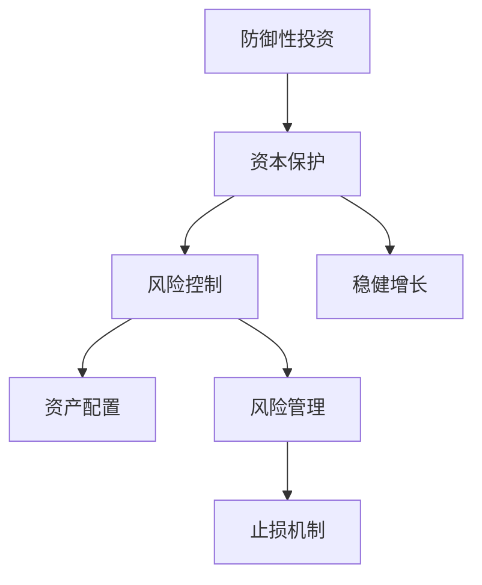
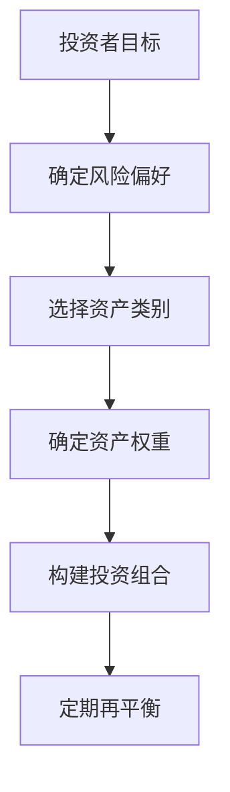
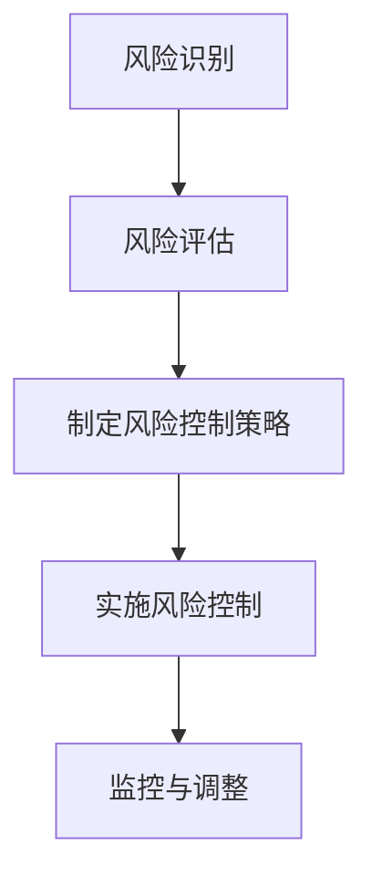

                 


# 防御性投资：在市场动荡中保护资本的策略

> 关键词：防御性投资、资本保护、风险管理、投资策略、市场动荡、价值投资、逆向思维

> 摘要：防御性投资是一种在市场波动中保护资本的重要策略。本文将详细探讨防御性投资的核心概念、理论基础、具体策略、风险管理方法，并通过实际案例分析，帮助读者在市场动荡中有效保护资本，实现稳健投资。

---

## 目录

1. [防御性投资概述](#防御性投资概述)
   1.1 [防御性投资的定义与核心概念](#防御性投资的定义与核心概念)
   1.2 [防御性投资的背景与现状](#防御性投资的背景与现状)
   1.3 [防御性投资的核心要素](#防御性投资的核心要素)
2. [现代投资组合理论与防御性投资](#现代投资组合理论与防御性投资)
   2.1 [现代投资组合理论概述](#现代投资组合理论概述)
   2.2 [防御性投资与有效前沿](#防御性投资与有效前沿)
   2.3 [资产配置在防御性投资中的作用](#资产配置在防御性投资中的作用)
3. [防御性投资的核心策略](#防御性投资的核心策略)
   3.1 [分散投资策略](#分散投资策略)
   3.2 [价值投资策略](#价值投资策略)
   3.3 [逆向投资策略](#逆向投资策略)
4. [防御性投资的风险管理](#防御性投资的风险管理)
   4.1 [风险识别与评估](#风险识别与评估)
   4.2 [风险控制策略](#风险控制策略)
   4.3 [止损与止盈机制](#止损与止盈机制)
5. [防御性投资的实战应用](#防御性投资的实战应用)
   5.1 [防御性投资的案例分析](#防御性投资的案例分析)
   5.2 [防御性投资的经验总结](#防御性投资的经验总结)
   5.3 [防御性投资的心理与纪律](#防御性投资的心理与纪律)
6. [小结与展望](#小结与展望)
   6.1 [小结](#小结)
   6.2 [未来展望](#未来展望)

---

## 1. 防御性投资概述

### 1.1 防御性投资的定义与核心概念

防御性投资是一种以保护资本、降低投资风险为核心目标的投资策略。它强调在市场波动中通过合理的资产配置、风险管理和投资策略，避免重大损失，实现资本的稳健增长。防御性投资的核心在于“防御”，而非追求高收益，因此它更注重风险控制和长期稳健性。

#### 核心概念对比

| 概念 | 描述 |
|------|------|
| 防御性投资 | 强调资本保护，注重风险控制 |
| 攻击性投资 | 追求高收益，风险承受能力强 |
| 资本保全 | 确保资本不遭受重大损失 |

#### 防御性投资的结构图



### 1.2 防御性投资的背景与现状

随着全球市场的波动加剧，投资者对防御性投资的需求日益增长。尤其是在2008年金融危机后，防御性投资策略逐渐成为投资者的首选。当前市场环境下，防御性投资不仅仅是保护资本，更是通过合理配置资产在不同市场周期中实现稳健收益。

#### 当前市场环境的分析

当前市场环境复杂多变，主要体现在以下几个方面：
1. **全球经济不确定性**：地缘政治冲突、经济政策变化等增加了市场的不确定性。
2. **市场波动加剧**：近年来，股市、债市等波动性显著增加，投资者面临更大的风险。
3. **投资者行为变化**：越来越多的投资者倾向于选择防御性投资策略，以规避市场风险。

### 1.3 防御性投资的核心要素

防御性投资的核心要素包括：
1. **投资目标**：明确投资目标，如资本保值、稳健收益等。
2. **风险偏好**：根据自身风险承受能力调整投资策略。
3. **资产配置**：通过分散投资降低风险，合理配置不同资产类别。

---

## 2. 现代投资组合理论与防御性投资

### 2.1 现代投资组合理论概述

现代投资组合理论（MPT）由Harry Markowitz提出，是防御性投资的重要理论基础。MPT强调通过资产配置降低投资组合的整体风险。

#### 现代投资组合理论的核心公式

$$ E(r_p) = \sum w_i E(r_i) $$
$$ \sigma_p^2 = \sum w_i^2 \sigma_i^2 + 2 \sum_{i \neq j} w_i w_j \sigma_{i,j} $$

其中：
- \( E(r_p) \)：投资组合的期望收益
- \( w_i \)：资产i的权重
- \( E(r_i) \)：资产i的期望收益
- \( \sigma_p \)：投资组合的波动性
- \( \sigma_{i,j} \)：资产i和资产j的相关性

#### 资产配置的决策流程



### 2.2 防御性投资与有效前沿

有效前沿是指在给定风险水平下，能够提供最高期望收益的投资组合。防御性投资者通常会选择有效前沿上的投资组合，以实现风险与收益的最佳平衡。

#### 有效前沿的数学表达

$$ \text{有效前沿} = \{ (r, \sigma) | \forall r', \sigma', r \geq r' \text{ 且 } \sigma \leq \sigma' \} $$

---

## 3. 防御性投资的核心策略

### 3.1 分散投资策略

分散投资是防御性投资的核心策略之一。通过投资不同资产类别、行业和地区的资产，可以有效降低投资组合的波动性。

#### 分散投资的实现步骤

1. **资产类别分散**：将资金分配到股票、债券、现金等不同资产类别。
2. **行业分散**：投资不同行业的资产，避免单一行业风险。
3. **地域分散**：在全球范围内配置资产，降低区域风险。

#### 分散投资的代码实现

```python
import numpy as np

def calculate_volatility(weights, covariance_matrix):
    return np.sqrt(np.dot(weights.T, np.dot(covariance_matrix, weights)))

# 示例权重
weights = np.array([0.3, 0.3, 0.4])
covariance_matrix = np.array([
    [0.02, 0.01, 0.01],
    [0.01, 0.03, 0.02],
    [0.01, 0.02, 0.04]
])

volatility = calculate_volatility(weights, covariance_matrix)
print(f"投资组合的波动性为：{volatility}")
```

### 3.2 价值投资策略

价值投资强调寻找被市场低估的资产，长期持有，等待其价值回归。

#### 价值投资的核心要素

1. **基本面分析**：关注企业的财务状况、盈利能力等。
2. **安全边际**：买入价格低于内在价值。
3. **长期视角**：不因短期波动而改变投资决策。

### 3.3 逆向投资策略

逆向投资在市场恐慌时买入，在市场狂热时卖出，利用市场情绪的非理性获利。

#### 逆向投资的实施步骤

1. **识别市场情绪**：判断市场是否处于恐慌或狂热状态。
2. **逆向操作**：在市场低点买入，在市场高点卖出。
3. **长期持有**：避免频繁交易，降低交易成本。

---

## 4. 防御性投资的风险管理

### 4.1 风险识别与评估

防御性投资的第一步是识别潜在风险，如市场风险、流动性风险等。

#### 风险识别的关键指标

- **VaR（Value at Risk）**：在给定置信水平下，投资组合的最大可能损失。
- **CVaR（Conditional Value at Risk）**：VaR的延伸，考虑超过VaR部分的平均损失。

### 4.2 风险控制策略

1. **止损策略**：设定止损点，当投资组合下跌至一定水平时卖出。
2. **动态调整**：根据市场变化定期调整投资组合。
3. **分散风险**：通过多样化投资降低特定风险。

#### 风险控制流程图



### 4.3 止损与止盈机制

1. **止损机制**：设定止损点，当投资组合下跌至止损线时卖出。
2. **止盈机制**：设定止盈点，当投资组合上涨至目标收益时卖出。

#### 止损与止盈的代码实现

```python
def stop_loss(price, stop_loss_price):
    return price < stop_loss_price

# 示例价格数据
current_price = 100
stop_loss_price = 95

if stop_loss(current_price, stop_loss_price):
    print("触发止损，卖出资产")
else:
    print("未触发止损，继续持有")
```

---

## 5. 防御性投资的实战应用

### 5.1 防御性投资的案例分析

#### 案例1：2008年金融危机

在2008年金融危机期间，防御性投资者通过持有债券、黄金等避险资产，有效保护了资本。

#### 案例2：新冠疫情冲击

在新冠疫情期间，防御性投资者通过分散投资、价值投资策略，避免了市场的大幅波动。

### 5.2 防御性投资的经验总结

1. **长期视角**：避免短期波动，关注长期稳健收益。
2. **分散投资**：通过多样化降低风险。
3. **风险管理**：制定并严格执行风险管理策略。

### 5.3 防御性投资的心理与纪律

1. **心理因素**：投资者需要克服贪婪与恐惧，保持冷静。
2. **纪律性**：严格执行投资计划，避免情绪化决策。

---

## 6. 小结与展望

### 6.1 小结

防御性投资是一种以保护资本、降低风险为核心的投资策略。通过合理资产配置、分散投资、风险管理等方法，投资者可以在市场波动中实现稳健收益。

### 6.2 未来展望

随着市场环境的变化，防御性投资策略将不断完善。未来，投资者需要更加注重全球化配置、技术驱动的投资工具以及风险管理的创新。

---

## 作者：AI天才研究院 & 禅与计算机程序设计艺术

感谢您的阅读！如需进一步探讨或获取更多内容，请联系：[联系作者](#)。

---

