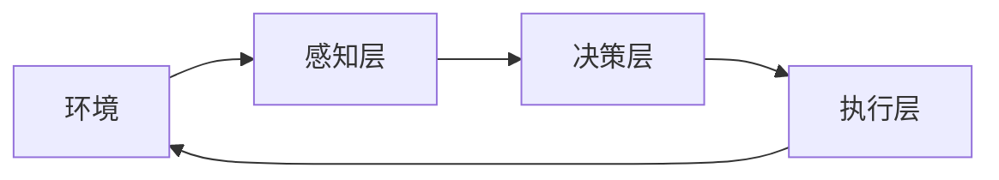

                 


# 零售业AI Agent应用策略

## 关键词：AI Agent、零售业、人工智能、算法原理、系统架构、项目实战

## 摘要：本文探讨了AI Agent在零售业中的应用策略，涵盖背景分析、核心概念、算法原理、系统架构设计、项目实战以及最佳实践。通过详细讲解AI Agent的原理和应用，帮助读者理解如何在零售业中有效利用AI Agent提升客户体验和运营效率。

---

## 第一部分：AI Agent与零售业的结合

### 第1章：AI Agent的背景与定义

#### 1.1 AI Agent的基本概念
AI Agent（人工智能代理）是指能够感知环境、自主决策并执行任务的智能实体。在零售业中，AI Agent可以以虚拟助手、智能推荐系统或聊天机器人等形式出现，帮助商家和客户更高效地完成交易和服务。

#### 1.2 零售业中的AI Agent应用现状
随着技术的进步，AI Agent在零售业的应用逐渐普及。例如，智能客服机器人能够24/7为客户提供支持，智能推荐系统可以根据客户的购买历史和偏好推荐商品。

#### 1.3 AI Agent的核心优势
- 提升客户体验：通过个性化推荐和即时响应，增强客户满意度。
- 优化运营效率：自动化处理订单和库存管理，减少人工干预。
- 降低成本：通过智能化决策减少资源浪费。

---

### 第2章：AI Agent在零售业中的应用优势

#### 2.1 提升客户体验
- 智能导购：通过分析客户的行为和偏好，提供个性化的购物建议。
- 24/7客服：通过AI Agent实现全天候客户支持，解决客户问题。

#### 2.2 优化运营效率
- 智能库存管理：通过实时数据分析，优化库存周转率。
- 自动化订单处理：通过AI Agent自动化处理订单和物流，提高效率。

#### 2.3 降低成本
- 减少人工成本：通过自动化处理减少对人工客服的依赖。
- 提高决策效率：通过数据分析和预测，减少资源浪费。

---

## 第二部分：AI Agent的核心概念与技术

### 第3章：AI Agent的核心概念

#### 3.1 AI Agent的基本原理
AI Agent通过感知环境、分析数据、做出决策并执行任务来实现目标。其核心组成部分包括感知层、决策层和执行层。

#### 3.2 AI Agent的类型
根据功能和应用场景的不同，AI Agent可以分为以下几种类型：
- 基于规则的AI Agent：通过预定义的规则进行决策。
- 基于知识的AI Agent：利用知识库进行推理和决策。
- 基于学习的AI Agent：通过机器学习模型不断优化决策能力。

#### 3.3 AI Agent的技术栈
AI Agent的实现通常涉及多种技术，包括自然语言处理、机器学习、数据库管理等。

---

### 第4章：AI Agent的算法原理

#### 4.1 强化学习
强化学习是一种通过试错机制优化决策的算法。在零售业中，强化学习可以用于智能推荐系统，通过不断试错优化推荐策略。



#### 4.2 自然语言处理
自然语言处理（NLP）用于理解和生成人类语言。在零售业中，NLP可以用于智能客服，通过解析客户的问题生成相应的回答。

#### 4.3 推荐算法
推荐算法是AI Agent在零售业中的重要应用之一。基于协同过滤、基于内容的推荐算法等，可以帮助商家向客户推荐相关商品。

---

## 第三部分：AI Agent的系统架构设计

### 第5章：系统分析与架构设计

#### 5.1 需求分析
在设计AI Agent系统时，需要明确系统的目标、功能和性能需求。例如，智能客服系统需要具备实时响应、多轮对话等功能。

#### 5.2 系统设计
系统设计包括功能模块划分、数据流设计等。例如，智能客服系统可以分为用户请求接收、问题解析、知识库查询、生成回答等模块。

#### 5.3 接口设计
AI Agent需要与前端界面、后端数据库等进行交互。通过API接口实现模块之间的通信。

#### 5.4 交互设计
设计良好的用户界面和交互流程，确保客户能够方便地与AI Agent互动。

---

### 第6章：项目实战

#### 6.1 环境安装
在开始开发AI Agent之前，需要安装必要的开发工具和库。例如，Python的安装、TensorFlow的安装等。

#### 6.2 代码实现
以智能导购系统为例，以下是部分代码实现：

```python
class AIAssistant:
    def __init__(self, knowledge_base):
        self.knowledge_base = knowledge_base

    def query(self, question):
        # 根据问题查询知识库
        return self.knowledge_base.get_answer(question)

# 初始化知识库
knowledge_base = KnowledgeBase()

# 创建AI助手实例
assistant = AIAssistant(knowledge_base)

# 客户提问
question = "如何选择适合的鞋子？"
answer = assistant.query(question)
print(answer)
```

#### 6.3 案例分析
通过实际案例分析，展示AI Agent在零售业中的应用效果。例如，通过智能推荐系统提高客户购买率。

---

## 第四部分：AI Agent的最佳实践与总结

### 第7章：最佳实践

#### 7.1 小结
本文详细探讨了AI Agent在零售业中的应用策略，包括背景分析、核心概念、算法原理、系统架构设计和项目实战。

#### 7.2 注意事项
在实际应用中，需要注意数据隐私、算法的可解释性等问题。

#### 7.3 扩展阅读
推荐阅读《机器学习实战》、《深度学习入门》等相关书籍，进一步深入了解AI Agent的实现技术。

---

## 作者：AI天才研究院 & 禅与计算机程序设计艺术

---

这篇文章系统地介绍了AI Agent在零售业中的应用策略，从理论到实践，帮助读者全面理解如何在零售业中应用AI Agent。

