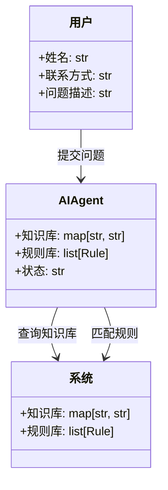
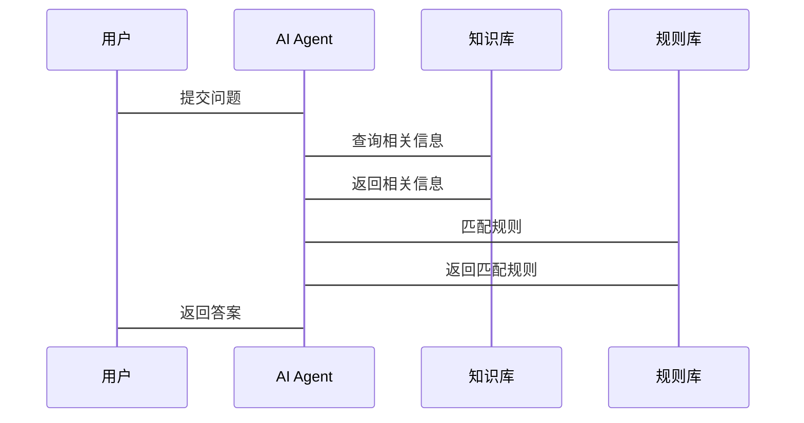

                 


# 预测2025年AI Agent技术的发展方向

## 关键词：AI Agent, 人工智能, 生成式AI, 技术发展, 智能代理, 大语言模型, 人机交互

## 摘要：  
本文预测了2025年AI Agent技术的发展方向，分析了AI Agent的核心概念、技术原理、系统架构、算法原理以及实际应用场景。文章从AI Agent的基本概念出发，逐步深入探讨其技术细节，并结合生成式AI和大语言模型的技术趋势，预测了AI Agent在2025年可能的发展方向。通过对AI Agent的系统分析与架构设计、项目实战、算法实现和数学模型的详细解读，本文为读者提供了全面的技术视角，帮助读者更好地理解AI Agent技术的发展前景。

---

# 第一部分: AI Agent技术的发展背景与现状

## 第1章: AI Agent的基本概念与背景介绍

### 1.1 AI Agent的定义与核心要素
#### 1.1.1 什么是AI Agent
AI Agent（人工智能代理）是指能够感知环境、做出决策并采取行动以实现目标的智能实体。它通过与环境交互，主动完成任务，具有自主性、反应性和社会性等特征。

#### 1.1.2 AI Agent的核心要素与组成
AI Agent的核心要素包括：
- **感知**：通过传感器或数据输入获取环境信息。
- **决策**：基于感知信息，利用算法进行推理和选择最优行动方案。
- **执行**：通过执行器或接口将决策转化为实际行动。
- **知识库**：存储任务相关的知识和经验，用于辅助决策。
- **目标**：AI Agent行动的驱动力，通常表现为具体的目标或任务。

#### 1.1.3 AI Agent与传统AI的区别
AI Agent与传统AI的区别主要体现在以下几个方面：
- **自主性**：AI Agent能够自主决策和行动，而传统AI通常需要外部指令。
- **动态性**：AI Agent能够实时响应环境变化，而传统AI更多是静态处理。
- **社会性**：AI Agent能够与其他实体（包括其他AI Agent）进行交互和协作，而传统AI更多是独立运行。

### 1.2 AI Agent的背景与问题背景
#### 1.2.1 当前AI技术的发展趋势
近年来，AI技术发展迅速，尤其是在生成式AI、大语言模型和深度学习领域的突破，为AI Agent的发展提供了坚实的技术基础。

#### 1.2.2 AI Agent在实际应用中的问题背景
随着AI Agent技术的广泛应用，其在实际应用中面临以下问题：
- **复杂环境的适应性**：AI Agent需要在动态、不确定的环境中完成任务。
- **多目标冲突**：在多个目标之间权衡时，如何做出最优决策是一个挑战。
- **可解释性与透明性**：AI Agent的决策过程需要具备可解释性，以便用户理解和信任。

#### 1.2.3 AI Agent技术的核心问题描述
AI Agent技术的核心问题包括：
- 如何实现高效的感知与决策机制。
- 如何设计合理的行动策略以实现目标。
- 如何在复杂环境中保持稳定性和高效性。

### 1.3 AI Agent的现状与应用领域
#### 1.3.1 当前AI Agent的主要应用场景
当前，AI Agent已经应用于多个领域，包括：
- **智能客服**：通过自然语言处理技术为用户提供24/7的客服支持。
- **自动驾驶**：作为自动驾驶汽车的核心技术，AI Agent负责感知、决策和执行。
- **智能助手**：如Siri、Alexa等，通过语音交互帮助用户完成日常任务。
- **游戏AI**：在电子游戏中，AI Agent可以作为对手或队友，提供智能化的游戏体验。
- **机器人**：AI Agent驱动的机器人可以在制造业、物流等领域完成复杂任务。

#### 1.3.2 AI Agent在不同领域的应用实例
- **金融领域**：AI Agent可以用于智能投资顾问、风险管理等场景。
- **医疗领域**：AI Agent可以辅助医生进行诊断、制定治疗方案。
- **教育领域**：AI Agent可以作为虚拟教师，为学生提供个性化的学习支持。

#### 1.3.3 AI Agent技术的局限性与挑战
尽管AI Agent技术发展迅速，但仍面临以下挑战：
- **技术复杂性**：需要结合多种AI技术，如自然语言处理、计算机视觉、强化学习等。
- **数据依赖性**：AI Agent的性能高度依赖于数据的质量和数量。
- **伦理与安全问题**：AI Agent的自主性可能引发伦理和安全问题，如隐私泄露、误用等。

### 1.4 本章小结
本章介绍了AI Agent的基本概念、核心要素、与传统AI的区别，以及当前的应用现状和面临的挑战。通过对AI Agent技术背景的分析，为后续的技术发展预测奠定了基础。

---

# 第二部分: AI Agent的核心概念与技术原理

## 第2章: AI Agent的核心概念与联系

### 2.1 AI Agent的核心概念原理
#### 2.1.1 AI Agent的感知机制
感知是AI Agent与环境交互的第一步，通过传感器或数据输入获取环境信息。感知机制包括：
- **数据采集**：通过摄像头、麦克风、传感器等设备获取环境数据。
- **数据处理**：对采集到的数据进行清洗、特征提取和预处理。
- **知识表示**：将处理后的数据转化为可理解的知识表示，如符号逻辑、概率分布等。

#### 2.1.2 AI Agent的决策机制
决策是AI Agent的核心，基于感知信息，利用算法进行推理和选择最优行动方案。决策机制包括：
- **状态表示**：将环境状态表示为一个或多个变量。
- **目标函数**：定义AI Agent的目标，通常是一个需要优化的函数。
- **决策算法**：如基于规则的决策树、基于模型的强化学习、基于生成式AI的推理等。

#### 2.1.3 AI Agent的执行机制
执行是AI Agent的最终目标，通过执行器或接口将决策转化为实际行动。执行机制包括：
- **动作规划**：制定从当前状态到目标状态的动作序列。
- **动作执行**：通过执行器或API调用完成动作。
- **反馈机制**：根据执行结果调整后续的感知和决策。

### 2.2 AI Agent的核心属性特征对比
AI Agent的核心属性特征对比可以通过以下表格展示：

| **属性**       | **基于规则的AI Agent**                     | **基于模型的AI Agent**                     | **生成式AI Agent**                        |
|----------------|-------------------------------------------|-------------------------------------------|-------------------------------------------|
| **决策方式**    | 预先定义的规则和逻辑                       | 基于模型的推理和预测                       | 基于生成式AI的创造性推理                 |
| **适应性**      | 较低，难以应对未预见的情况                 | 较高，能够根据模型进行预测和调整           | 较高，能够生成新的解决方案               |
| **应用领域**    | 简单、规则明确的任务                       | 复杂、需要动态调整的任务                   | 创意生成、内容创作等需要创新的任务       |
| **计算资源**    | 较低，依赖规则库的大小                     | 较高，依赖模型的训练和计算资源             | 高，依赖生成式AI模型的计算资源           |

### 2.3 AI Agent的ER实体关系图
以下是AI Agent的ER实体关系图：

```mermaid
erdiagram
actor 用户
agent AI Agent
goal 目标
environment 环境
action 行动
knowledge 知识库
rule_set 规则库
training_data 训练数据
interaction 交互
```

### 2.4 本章小结
本章通过对比分析AI Agent的核心概念与技术原理，明确了不同类型AI Agent的特点及其适用场景，为后续的技术发展预测提供了理论基础。

---

## 第3章: AI Agent的算法原理与数学模型

### 3.1 AI Agent的算法原理
#### 3.1.1 基于规则的AI Agent算法
基于规则的AI Agent算法通过预定义的规则和逻辑进行决策，适用于任务简单、规则明确的场景。其算法流程如下：

1. **感知环境**：获取环境数据。
2. **匹配规则**：将感知数据与预定义的规则进行匹配。
3. **执行动作**：根据匹配的规则执行相应的动作。

例如，一个简单的交通灯控制AI Agent可以根据当前的交通信号灯状态匹配相应的规则，执行放行或停止的动作。

#### 3.1.2 基于模型的AI Agent算法
基于模型的AI Agent算法通过构建环境模型进行推理和预测，适用于任务复杂、需要动态调整的场景。其算法流程如下：

1. **感知环境**：获取环境数据。
2. **构建模型**：基于感知数据构建或更新环境模型。
3. **推理与预测**：利用模型进行推理和预测，生成决策方案。
4. **执行动作**：根据决策方案执行相应的动作。

例如，一个自动驾驶AI Agent可以通过构建道路、车辆和行人的动态模型，推理出最优的行驶路径。

#### 3.1.3 基于生成式AI的AI Agent算法
基于生成式AI的AI Agent算法通过生成式模型进行创造性推理，适用于需要创新解决方案的场景。其算法流程如下：

1. **感知环境**：获取环境数据。
2. **生成解决方案**：利用生成式模型生成多种可能的解决方案。
3. **选择最优方案**：根据目标函数选择最优的解决方案。
4. **执行动作**：根据选择的方案执行相应的动作。

例如，一个创意设计AI Agent可以通过生成式模型生成多种设计方案，选择最优的方案进行实施。

### 3.2 AI Agent的数学模型
#### 3.2.1 基于规则的数学模型
基于规则的数学模型通常是一个简单的条件语句：

$$
\text{if } P \text{ then } A
$$

其中，$P$是感知条件，$A$是执行动作。

#### 3.2.2 基于模型的数学模型
基于模型的数学模型通常是一个概率模型，例如：

$$
P(A|P) = \frac{P(P|A)P(A)}{P(P)}
$$

其中，$P(A|P)$是执行动作$A$在感知条件$P$下的概率，$P(P|A)$是感知条件$P$在动作$A$下的概率，$P(A)$是动作$A$的先验概率，$P(P)$是感知条件$P$的边际概率。

#### 3.2.3 基于生成式AI的数学模型
基于生成式AI的数学模型通常是一个生成模型，例如：

$$
G_{\theta}(z) = \theta \cdot z + b
$$

其中，$G_{\theta}$是生成模型，$\theta$是模型参数，$z$是输入噪声，$b$是偏置项。

### 3.3 AI Agent的算法实现
以下是一个简单的基于规则的AI Agent算法的Python实现示例：

```python
class RuleBasedAI:
    def __init__(self, rules):
        self.rules = rules  # 预定义规则

    def perceive(self, environment):
        # 获取环境数据
        return environment

    def decide(self, perception):
        # 根据感知数据匹配规则
        for rule in self.rules:
            if rule["condition"](perception):
                return rule["action"]
        return None

    def execute(self, action):
        # 执行动作
        print(f"执行动作：{action}")
```

### 3.4 本章小结
本章详细讲解了AI Agent的三种主要算法原理，包括基于规则的算法、基于模型的算法和基于生成式AI的算法，并通过数学公式和代码示例进行了说明。

---

# 第三部分: AI Agent的系统分析与架构设计

## 第4章: 系统分析与架构设计方案

### 4.1 问题场景介绍
假设我们正在开发一个智能客服AI Agent，用于为用户提供24/7的客服支持。用户可以通过文本或语音与AI Agent交互，提出各种问题和请求。

### 4.2 项目介绍
项目名称：智能客服AI Agent  
项目目标：开发一个能够理解用户需求、提供准确答案的智能客服系统。  
项目范围：支持文本和语音交互，覆盖常见问题解答、订单查询、技术支持等功能。

### 4.3 系统功能设计
#### 4.3.1 领域模型设计
以下是智能客服AI Agent的领域模型：



#### 4.3.2 系统架构设计
以下是系统的架构图：


#### 4.3.3 系统接口设计
系统接口设计如下：
- **输入接口**：用户通过文本或语音输入问题。
- **输出接口**：AI Agent通过文本或语音输出答案。
- **知识库接口**：AI Agent通过知识库查询相关信息。
- **规则库接口**：AI Agent通过规则库匹配规则。

#### 4.3.4 系统交互设计
以下是系统交互的序列图：



### 4.4 本章小结
本章通过智能客服AI Agent的案例，详细分析了系统的功能设计、架构设计和交互设计，为后续的项目实现奠定了基础。

---

## 第5章: 项目实战

### 5.1 环境安装
要实现一个简单的智能客服AI Agent，需要以下环境：
- Python 3.8及以上版本
- 基础的Python库，如`re`、`json`

### 5.2 系统核心实现源代码
以下是一个简单的基于规则的智能客服AI Agent的Python实现：

```python
import json
import re

class RuleBasedAI:
    def __init__(self, rules):
        self.rules = rules  # 预定义规则

    def perceive(self, input_str):
        # 获取环境数据
        return input_str

    def decide(self, perception):
        # 根据感知数据匹配规则
        for rule in self.rules:
            pattern = rule["condition"]
            if re.match(pattern, perception):
                return rule["action"]
        return None

    def execute(self, action):
        # 执行动作
        return action

# 示例规则
rules = [
    {
        "condition": r"订单查询",
        "action": "查询订单"
    },
    {
        "condition": r"技术支持",
        "action": "联系技术支持"
    },
    {
        "condition": r"退款申请",
        "action": "处理退款"
    }
]

# 创建AI Agent实例
ai = RuleBasedAI(rules)

# 示例交互
input_str = "我需要查询我的订单状态"
action = ai.decide(input_str)
output = ai.execute(action)
print(f"用户输入：{input_str}")
print(f"AI Agent决策：{action}")
print(f"AI Agent执行：{output}")
```

### 5.3 代码应用解读与分析
- **规则定义**：规则定义了一个条件和一个动作，条件是一个正则表达式，动作是对应的执行动作。
- **感知**：AI Agent通过`perceive`方法获取用户的输入。
- **决策**：AI Agent通过`decide`方法匹配规则，返回最优动作。
- **执行**：AI Agent通过`execute`方法执行动作。

### 5.4 实际案例分析
假设用户输入“我需要查询我的订单状态”，AI Agent会匹配到规则中的“订单查询”条件，执行“查询订单”动作，并返回相应的订单信息。

### 5.5 项目小结
本章通过一个简单的项目实战，展示了AI Agent的实现过程，包括环境安装、代码实现、规则定义和交互测试。

---

## 第6章: 最佳实践与总结

### 6.1 最佳实践
- **明确目标**：在开发AI Agent之前，明确其目标和应用场景。
- **选择合适的算法**：根据任务需求选择合适的AI Agent算法。
- **注重可解释性**：确保AI Agent的决策过程具备可解释性。
- **持续优化**：根据实际应用中的反馈，持续优化AI Agent的性能和用户体验。

### 6.2 本章小结
本章总结了AI Agent开发中的最佳实践，为读者提供了宝贵的开发经验。

### 6.3 注意事项
- **数据隐私**：在处理用户数据时，必须注意数据隐私和安全。
- **系统稳定性**：确保AI Agent在复杂环境中的稳定性和可靠性。
- **用户反馈**：及时收集用户反馈，优化AI Agent的性能和用户体验。

### 6.4 拓展阅读
- **相关书籍**：《AI Agent原理与应用》、《生成式AI入门》
- **技术博客**：关注AI Agent领域的技术博客和社区动态。

---

# 第四部分: 结语

## 7.1 结语
AI Agent技术的发展前景广阔，尤其是在生成式AI和大语言模型的推动下，AI Agent将具备更强的自主性和创造力。未来，AI Agent将在更多领域发挥重要作用，为人类社会带来更多的便利和创新。

---

# 作者：AI天才研究院/AI Genius Institute & 禅与计算机程序设计艺术/Zen And The Art of Computer Programming

---

本文通过对AI Agent技术的背景、核心概念、算法原理、系统架构和项目实战的详细分析，预测了2025年AI Agent技术的发展方向。通过对AI Agent技术的深入探讨，本文为读者提供了全面的技术视角，帮助读者更好地理解AI Agent技术的发展前景。

