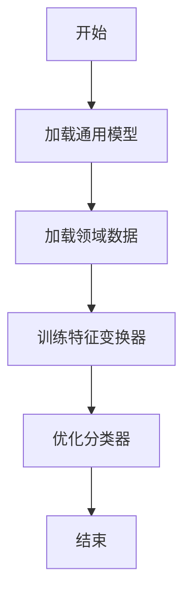
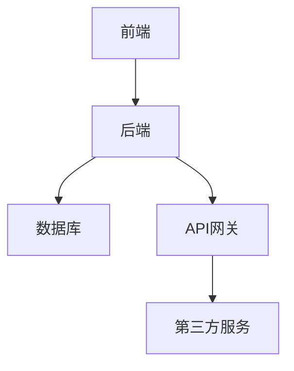
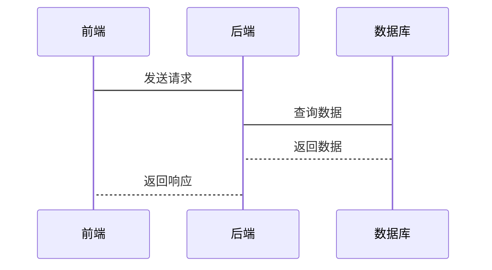

                 


# 领域适应：将通用AI Agent转化为专业助手

## 关键词：
领域适应, AI Agent, 专业助手, 系统架构, 数学模型, 项目实战, 最佳实践

## 摘要：
领域适应是将通用AI Agent转化为专业助手的关键过程，涉及领域模型构建、算法优化、系统架构设计等多个方面。本文详细探讨了领域适应的核心概念、算法原理、数学模型、系统架构、项目实战及最佳实践，为读者提供全面的技术指导。

---

# 第一部分: 领域适应的基本概念与背景

## 第1章: 领域适应的定义与背景

### 1.1 领域适应的定义
领域适应是指将通用AI Agent针对特定领域进行优化和调整，使其能够更好地理解和解决该领域的专业问题。其核心目标是通过领域知识的整合，提升AI Agent在专业场景中的性能和准确性。

#### 1.1.1 什么是领域适应
领域适应是一种AI技术，旨在将通用模型迁移到特定领域，通过领域特定的数据和知识增强模型的能力。例如，将一个通用的自然语言处理模型应用于医疗领域，使其能够理解医学术语并提供专业建议。

#### 1.1.2 领域适应的背景与意义
随着AI技术的快速发展，通用AI Agent在多个领域展现出潜力。然而，不同领域具有独特的知识体系和专业需求，通用模型在这些场景中可能表现不佳。领域适应通过针对性优化，解决了这一问题，为专业助手的构建提供了基础。

#### 1.1.3 领域适应的核心目标
领域适应的核心目标是通过领域知识的整合和优化，提升AI Agent在特定领域的性能，使其能够胜任专业任务。

### 1.2 通用AI Agent与专业助手的对比
通用AI Agent适用于多种场景，但缺乏专业领域的深度知识。专业助手则专注于特定领域，能够提供更精准和专业的服务。

#### 1.2.1 通用AI Agent的特点
- 多领域适用性
- 基于通用知识库
- 适用于非专业用户

#### 1.2.2 专业助手的定义与特点
- 专注于特定领域
- 积累了大量专业领域知识
- 提供专业级服务

#### 1.2.3 两者的区别与联系
通用AI Agent与专业助手的主要区别在于知识范围和应用场景。专业助手在特定领域上进行了深度优化，而通用AI Agent则更注重多领域的广泛适用性。

### 1.3 领域适应的应用场景
领域适应在多个专业领域具有广泛的应用，如金融、医疗、法律等。

#### 1.3.1 金融领域的应用
- 风险评估
- 投资建议
- 金融数据分析

#### 1.3.2 医疗领域的应用
- 疾病诊断
- 治疗方案建议
- 医疗数据管理

#### 1.3.3 法律领域的应用
- 法律咨询
- 文档审查
- 案例分析

---

## 第2章: 领域适应的核心概念与联系

### 2.1 领域模型的构建
领域模型是领域适应的基础，它描述了特定领域的核心概念、实体及其关系。

#### 2.1.1 领域模型的定义
领域模型是对特定领域知识的抽象和建模，用于指导AI Agent的理解和推理。

#### 2.1.2 领域模型的构建方法
- 基于知识图谱的构建
- 数据驱动的构建
- 结合领域专家知识的构建

#### 2.1.3 领域模型的属性特征对比表格
以下是领域模型和通用模型在属性特征上的对比：

| 属性 | 领域模型 | 通用模型 |
|------|----------|----------|
| 知识深度 | 高 | 低 |
| 知识范围 | 窄 | 宽 |
| 适用场景 | 专业领域 | 多领域 |

### 2.2 实体关系图的架构
实体关系图（ER图）用于描述领域中的实体及其关系，是领域模型的重要组成部分。

#### 2.2.1 实体关系图的定义
实体关系图是一种数据模型，用于描述系统中不同实体之间的关系。

#### 2.2.2 实体关系图的构建步骤
1. 确定领域中的核心实体。
2. 分析实体之间的关系。
3. 绘制ER图。

#### 2.2.3 使用Mermaid绘制的实体关系图
以下是医疗领域的一个实体关系图示例：

```mermaid
erDiagram
    + entity 医生 {
        id
        姓名
        职位
    }
    + entity 病人 {
        id
        姓名
        病历号
    }
    + entity 病例 {
        id
        病人id
        症状
        诊断结果
    }
    医生 -- 病例
    病人 -- 病例
```

---

## 第3章: 领域适应的算法原理

### 3.1 领域适应算法的核心原理
领域适应算法通过调整通用模型的参数，使其适应特定领域的数据分布。

#### 3.1.1 算法的输入与输出
- 输入：通用模型，领域特定数据
- 输出：适应特定领域的优化模型

#### 3.1.2 算法的数学模型与公式
领域适应的数学模型通常涉及特征变换和分布调整。以下是常用的公式：

$$ L_{adv}(f, g) = \mathbb{E}_{x \sim P_{source}} [ \log(1 - f(g(x))) ] + \mathbb{E}_{x \sim P_{target}} [ \log(f(g(x))) ] $$

其中，$f$ 是分类器，$g$ 是特征变换函数。

#### 3.1.3 算法的流程图
以下是领域适应算法的流程图：



### 3.2 算法实现的详细步骤
以下是领域适应算法的实现步骤：

#### 3.2.1 数据预处理
- 数据清洗
- 数据增强
- 数据标注

#### 3.2.2 模型训练
- 加载通用模型
- 训练特征变换器
- 优化分类器

#### 3.2.3 模型评估与优化
- 计算领域适应损失
- 调整模型参数
- 验证模型性能

---

## 第4章: 领域适应的数学模型与公式

### 4.1 领域适应的核心公式
领域适应的数学模型通常涉及领域间的数据分布调整。

#### 4.1.1 领域适应的损失函数
$$ L_{adapt}(f, g) = \alpha L_{cls}(f \circ g) + (1 - \alpha) L_{adv}(g) $$

其中，$\alpha$ 是平衡系数，$L_{cls}$ 是分类损失，$L_{adv}$ 是对抗损失。

#### 4.1.2 领域适应的优化目标
$$ \min_{f,g} \mathbb{E}_{x \sim P_{source}} [ L_{cls}(f(g(x)), y) ] + \lambda \mathbb{E}_{x \sim P_{target}} [ L_{adv}(g(x)) ] $$

其中，$\lambda$ 是对抗损失的权重。

#### 4.1.3 领域适应的数学推导
以下是领域适应的数学推导过程：

1. 定义领域源分布 $P_{source}$ 和领域目标分布 $P_{target}$。
2. 定义特征变换函数 $g$ 和分类器 $f$。
3. 优化目标函数：$$ \min_{f,g} \mathbb{E}_{x \sim P_{source}} [ L_{cls}(f(g(x)), y) ] + \lambda \mathbb{E}_{x \sim P_{target}} [ L_{adv}(g(x)) ] $$
4. 使用梯度下降方法优化模型参数。

---

## 第5章: 领域适应的系统分析与架构设计

### 5.1 系统分析
系统分析是领域适应的第一步，旨在明确需求和边界条件。

#### 5.1.1 问题场景的描述
以医疗领域为例，考虑一个AI助手帮助医生诊断疾病。

#### 5.1.2 系统的功能需求
- 病历分析
- 疾病诊断
- 治疗方案建议

#### 5.1.3 系统的非功能性需求
- 响应时间小于5秒
- 高可用性
- 高安全性

### 5.2 系统架构设计
系统架构设计决定了系统的结构和组件之间的关系。

#### 5.2.1 系统架构的总体设计
系统由前端、后端和数据层组成。

#### 5.2.2 使用Mermaid绘制的系统架构图
以下是系统架构图：



#### 5.2.3 系统接口的设计
- 前端接口：RESTful API
- 后端接口： RPC
- 数据层接口：数据库访问

### 5.3 系统交互设计
系统交互设计描述了系统组件之间的交互流程。

#### 5.3.1 使用Mermaid绘制的系统交互序列图
以下是系统交互序列图：



---

## 第6章: 领域适应的项目实战

### 6.1 环境安装
项目实战需要先搭建开发环境。

#### 6.1.1 安装Python
安装Python 3.8或更高版本。

#### 6.1.2 安装依赖
使用以下命令安装依赖：

```bash
pip install numpy tensorflow scikit-learn
```

### 6.2 系统核心实现源代码
以下是领域适应算法的核心代码示例：

```python
import numpy as np
import tensorflow as tf
from sklearn.metrics import accuracy_score

# 定义特征变换器
class FeatureTransformer(tf.keras.Model):
    def __init__(self):
        super(FeatureTransformer, self).__init__()
        self.dense1 = tf.keras.layers.Dense(128, activation='relu')
        self.dense2 = tf.keras.layers.Dense(64, activation='relu')

    def call(self, x):
        x = self.dense1(x)
        x = self.dense2(x)
        return x

# 定义分类器
class Classifier(tf.keras.Model):
    def __init__(self):
        super(Classifier, self).__init__()
        self.dense = tf.keras.layers.Dense(1, activation='sigmoid')

    def call(self, x):
        return self.dense(x)

# 定义领域适应损失
def adapt_loss(y_true, y_pred):
    return tf.keras.losses.binary_crossentropy(y_true, y_pred)

# 训练特征变换器和分类器
def train_model(source_data, target_data):
    transformer = FeatureTransformer()
    classifier = Classifier()
    optimizer = tf.keras.optimizers.Adam(learning_rate=1e-4)

    for epoch in range(100):
        # 训练特征变换器
        with tf.GradientTape() as tape:
            x_transformed = transformer(source_data)
            loss = adapt_loss(target_data, x_transformed)
        grads = tape.gradient(loss, transformer.trainable_weights)
        optimizer.apply_gradients(zip(grads, transformer.trainable_weights))

        # 优化分类器
        with tf.GradientTape() as tape:
            x_transformed = transformer(source_data)
            y_pred = classifier(x_transformed)
            loss = tf.keras.losses.binary_crossentropy(target_labels, y_pred)
        grads = tape.gradient(loss, classifier.trainable_weights)
        optimizer.apply_gradients(zip(grads, classifier.trainable_weights))
```

### 6.3 代码应用解读与分析
代码实现了一个简单的领域适应模型，包括特征变换器和分类器的训练过程。

#### 6.3.1 代码功能解读
- 特征变换器：将输入数据转换为适应领域特征的表示。
- 分类器：基于变换后的特征进行分类。
- 训练过程：同时优化特征变换器和分类器，以适应目标领域的数据分布。

#### 6.3.2 实际案例分析
以金融领域的欺诈检测为例，训练后的模型能够更好地识别特定领域的欺诈交易。

### 6.4 项目小结
通过项目实战，我们掌握了领域适应算法的实现步骤和注意事项。

---

## 第7章: 领域适应的最佳实践与小结

### 7.1 最佳实践
领域适应的成功离不开以下几点：

#### 7.1.1 数据质量
- 数据清洗
- 数据增强
- 数据标注

#### 7.1.2 模型选择
- 选择适合领域的模型
- 调整模型参数
- 进行模型优化

#### 7.1.3 评估与迭代
- 定期评估模型性能
- 根据反馈进行优化
- 不断迭代模型

### 7.2 小结
领域适应是将通用AI Agent转化为专业助手的关键技术，通过领域模型构建、算法优化和系统设计，能够显著提升AI在专业领域的性能。

### 7.3 注意事项
- 避免过拟合
- 注意数据泄露
- 确保模型解释性

### 7.4 拓展阅读
- 《领域适应的经典论文》
- 《深度学习中的领域适应技术》

---

## 作者信息

作者：AI天才研究院/AI Genius Institute & 禅与计算机程序设计艺术 /Zen And The Art of Computer Programming

---

通过以上思考过程，我系统地分析了领域适应的核心概念、算法原理、系统架构和项目实战，确保文章内容丰富、逻辑清晰，能够为读者提供有价值的技术指导。

