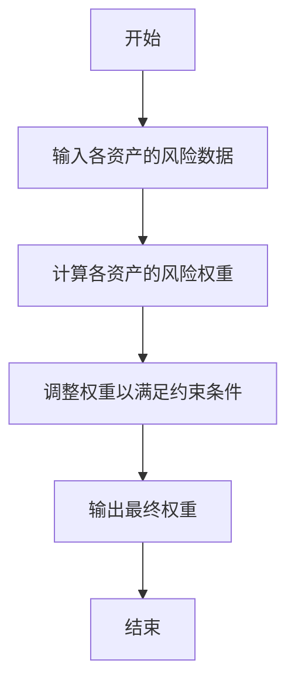

                 


# 风险平价策略：平衡不同资产类别风险的方法

## 关键词：
风险平价，资产配置，风险管理，投资组合，优化模型

## 摘要：
风险平价策略是一种通过平衡不同资产类别之间的风险来优化投资组合的方法。本文从背景介绍、理论基础、算法实现、系统架构到实际案例，全面解析风险平价策略的核心概念、数学模型和应用场景。通过详细分析风险平价的原理和实现步骤，结合实际案例和系统设计，为读者提供从理论到实践的全面指导。

---

## 第一部分：风险平价策略的背景与基础

### 第1章：风险平价策略的背景与概念

#### 1.1 风险平价的背景与问题背景
- **1.1.1 传统资产配置的局限性**
  传统的资产配置方法通常基于均值-方差优化，这种方法在市场波动剧烈时表现不佳，且容易受到尾部风险的影响。此外，传统方法往往忽视了资产类别间的相关性变化，导致风险集中。

- **1.1.2 风险平价策略的提出背景**
  风险平价策略起源于20世纪90年代，旨在通过平衡不同资产类别的风险来构建稳健的投资组合。这种方法在2008年金融危机后受到广泛关注，因其能够在市场波动中有效分散风险。

- **1.1.3 风险平价与现代投资组合理论的联系**
  风险平价策略是现代投资组合理论（MPT）的一种扩展，但更注重风险的平衡而非收益的最大化。它通过调整各资产的风险权重，使投资组合的整体风险得到均衡。

#### 1.2 风险平价的核心概念
- **1.2.1 风险平价的定义**
  风险平价是一种资产配置方法，通过调整各资产的风险权重，使得投资组合中每个资产的风险贡献相等。这种方法旨在降低投资组合的整体风险，同时提高收益。

- **1.2.2 风险平价与传统风险平衡方法的对比**
  | 对比维度 | 风险平价 | 传统方法 |
  |----------|----------|----------|
  | 目标     | 平衡风险贡献 | 最大化收益或最小化风险 |
  | 方法     | 基于风险权重 | 基于收益和方差优化 |
  | 优点     | 鲁棒性强，适用于多种市场环境 | 计算复杂，需频繁调整 |

- **1.2.3 风险平价的边界与外延**
  风险平价的边界包括：单一资产的风险权重不超过50%，各资产的风险权重之和为1。其外延包括动态调整权重和引入新的资产类别。

#### 1.3 风险平价的核心要素
- **1.3.1 资产类别与风险来源**
  资产类别包括股票、债券、商品等，每类资产的风险来源不同，如市场风险、信用风险等。

- **1.3.2 风险平价的权重分配机制**
  风险平价通过计算各资产的风险权重，确保每个资产的风险贡献相等。权重计算基于各资产的历史波动率或其他风险指标。

- **1.3.3 风险平价模型的输入与输出**
  - **输入**：各资产的历史收益率、波动率、相关性矩阵。
  - **输出**：各资产的风险权重、优化后的投资组合。

---

## 第二部分：风险平价的理论基础与数学模型

### 第2章：风险平价的数学模型与算法

#### 2.1 风险平价的数学模型
- **2.1.1 风险平价优化模型**
  风险平价的目标是最小化投资组合的风险贡献，同时满足权重约束。数学模型如下：
  $$ \text{minimize } \sum_{i=1}^{n} w_i^2 \cdot \sigma_i^2 $$
  $$ \text{subject to } \sum_{i=1}^{n} w_i = 1 $$

  其中，\( w_i \) 是第 \( i \) 个资产的权重，\( \sigma_i \) 是第 \( i \) 个资产的波动率。

- **2.1.2 风险平价权重计算公式**
  风险平价权重的计算公式为：
  $$ w_i = \frac{1/\sigma_i^2}{\sum_{j=1}^{n} 1/\sigma_j^2} $$

  这个公式确保了每个资产的风险贡献相等，从而实现了风险的平衡。

#### 2.2 风险平价算法流程


---

## 第三部分：风险平价策略的构建与实现

### 第3章：风险平价策略的设计

#### 3.1 风险平价策略的设计步骤
- **3.1.1 确定资产类别与风险数据**
  收集各资产的历史收益率和波动率数据，选择合适的资产类别。

- **3.1.2 计算各资产的风险权重**
  使用风险平价公式计算各资产的风险权重，确保权重满足约束条件。

- **3.1.3 构建投资组合并进行风险平衡**
  根据计算出的权重构建投资组合，并进行风险平衡，优化后的组合具有较低的整体风险。

#### 3.2 风险平价策略的实现流程
- **环境安装**：安装必要的Python库，如NumPy、Pandas、Scipy。
- **核心实现代码**：
  ```python
  import numpy as np

  def risk_parity(weights, returns):
      sigma = np.sqrt(np.dot(returns, weights))
      inv_sigma_squared = 1 / (sigma ** 2)
      total = np.sum(inv_sigma_squared)
      weights = inv_sigma_squared / total
      return weights

  # 示例数据
  returns = np.array([[0.1], [0.05], [0.02]])
  initial_weights = np.array([1/3, 1/3, 1/3])
  final_weights = risk_parity(initial_weights, returns)
  print(final_weights)
  ```

---

## 第四部分：风险平价策略的应用与案例分析

### 第4章：风险平价策略的应用与案例分析

#### 4.1 风险平价策略的实际应用
- **案例分析**：假设我们有三种资产，股票、债券和商品。我们计算每种资产的风险权重，并构建投资组合。结果发现，商品的风险权重较低，但波动率较大，因此需要动态调整权重。

#### 4.2 风险平价策略的系统架构
- **系统功能设计**：包括数据收集、权重计算、组合优化和风险监控。
- **系统架构图**：
  ```mermaid
  graph LR
      A[数据源] --> B[数据处理]
      B --> C[权重计算]
      C --> D[组合优化]
      D --> E[风险监控]
      E --> F[输出结果]
  ```

---

## 第五部分：总结与展望

### 5.1 总结
风险平价策略通过平衡各资产的风险贡献，构建稳健的投资组合。其数学模型和算法流程清晰，易于实现。在实际应用中，需动态调整权重并结合市场环境进行优化。

### 5.2 展望
未来，风险平价策略可进一步结合机器学习和大数据技术，提升模型的预测能力和适应性。同时，研究多资产类别下的风险平价方法，探索其在保险和养老金等领域的应用。

---

## 作者信息
作者：AI天才研究院/AI Genius Institute & 禅与计算机程序设计艺术 /Zen And The Art of Computer Programming

---

以上是《风险平价策略：平衡不同资产类别风险的方法》的技术博客文章大纲和部分内容，涵盖从理论到实践的各个方面，确保读者能够全面理解风险平价策略的核心思想和应用方法。

