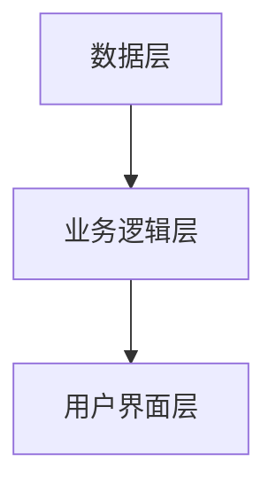
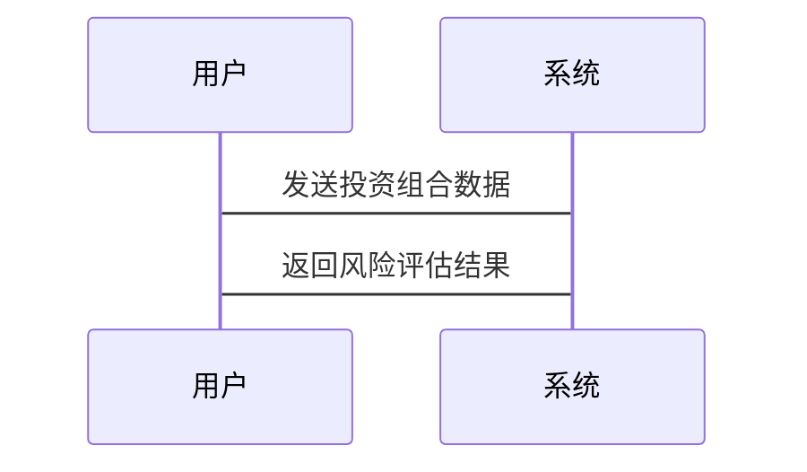

                 


# 风险管理技术：保护投资组合的工具和策略

> **关键词**: 风险管理, 投资组合, 量化方法, VaR, CVaR, 系统设计

> **摘要**: 本文深入探讨了风险管理在投资组合保护中的重要性，分析了多种风险管理工具和策略，结合量化方法和系统设计，为读者提供了全面的理论与实践指导。通过详细讲解风险评估、风险缓解和风险监控的工具与策略，本文旨在帮助投资者更好地理解和管理投资组合中的风险，确保投资组合的稳定性和可持续性。

---

# 第一部分: 风险管理技术基础

## 第1章: 风险管理的概述

### 1.1 风险管理的基本概念

#### 1.1.1 什么是风险管理
风险管理是指识别、评估和应对可能影响目标的不确定性。它是通过系统的方法，分析潜在风险，制定应对策略，以最小化风险的影响。

#### 1.1.2 风险管理的目标
风险管理的目标包括：
1. 降低潜在损失的概率。
2. 最小化风险对目标的影响。
3. 优化决策以应对不确定性。

#### 1.1.3 风险管理的流程
风险管理的流程包括以下步骤：
1. 风险识别：识别可能影响目标的潜在风险。
2. 风险评估：评估风险的性质（概率和影响）。
3. 风险缓解：制定和实施应对策略。
4. 风险监控：持续监控风险并调整应对策略。

### 1.2 投资组合风险管理的重要性

#### 1.2.1 投资组合的基本概念
投资组合是指将资金分配到不同资产（如股票、债券、基金等）上的配置方式。投资组合的风险和收益取决于资产的分配和市场条件。

#### 1.2.2 风险对投资组合的影响
风险是投资组合收益的不确定性来源。高风险意味着潜在收益和损失的波动性更大。

#### 1.2.3 风险管理在投资组合中的作用
有效的风险管理可以：
1. 降低投资组合的波动性。
2. 提高投资组合的稳定性。
3. 实现风险调整后的收益最大化。

---

## 第2章: 风险管理的核心工具

### 2.1 风险评估工具

#### 2.1.1 风险评估的基本方法
风险评估可以通过定性和定量方法进行。定性方法包括风险矩阵，定量方法包括VaR和CVaR。

#### 2.1.2 风险矩阵
风险矩阵是一种常用的定性工具，用于评估风险的概率和影响。

| 风险概率 | 高 | 中 | 低 |
|----------|----|----|----|
| 风险影响 | 高 | 中 | 低 |

#### 2.1.3 风险概率与影响分析
风险概率是风险发生的可能性，风险影响是风险发生后的影响程度。

### 2.2 风险缓解工具

#### 2.2.1 风险分散
通过将资金分配到不同的资产类别或行业中分散风险。

#### 2.2.2 投保与保险
通过购买保险来转移部分风险。

#### 2.2.3 风险对冲
通过做空相关资产或使用衍生品来对冲风险。

### 2.3 风险监控工具

#### 2.3.1 实时监控系统
实时监控市场波动和投资组合的表现。

#### 2.3.2 定期报告与审查
定期生成风险报告并进行审查。

#### 2.3.3 风险预警机制
设置阈值和警报，及时发现潜在风险。

---

# 第二部分: 投资组合风险管理策略

## 第3章: 投资组合风险的分类与管理

### 3.1 市场风险

#### 3.1.1 市场风险的定义
市场风险是指由于市场波动导致资产价格下跌的风险。

#### 3.1.2 市场风险的来源
市场风险的来源包括宏观经济波动、政策变化和市场情绪等。

#### 3.1.3 市场风险的管理策略
1. 分散投资：通过投资不同资产类别降低市场风险。
2. 使用衍生品：如期货和期权对冲市场风险。

### 3.2 信用风险

#### 3.2.1 信用风险的定义
信用风险是指借款人或交易对手无法履行其义务的风险。

#### 3.2.2 信用风险的评估方法
信用风险可以通过信用评级和违约概率进行评估。

#### 3.2.3 信用风险的管理策略
1. 选择高信用评级的资产。
2. 分散投资于不同信用等级的资产。

### 3.3 流动性风险

#### 3.3.1 流动性风险的定义
流动性风险是指无法快速将资产转换为现金的风险。

#### 3.3.2 流动性风险的影响因素
流动性风险的影响因素包括市场深度和资产种类。

#### 3.3.3 流动性风险的管理策略
1. 保持足够的现金储备。
2. 投资于流动性较高的资产。

---

## 第4章: 投资组合风险管理的量化方法

### 4.1 风险价值（VaR）

#### 4.1.1 VaR的定义
VaR是指在一定置信水平下，投资组合可能遭受的最大损失。

#### 4.1.2 VaR的计算方法
VaR的计算方法包括历史模拟法、方差-协方差法和蒙特卡罗模拟法。

#### 4.1.3 VaR的应用与局限性
VaR广泛应用于风险管理和投资决策，但存在假设不准确和尾部风险忽略的局限性。

### 4.2 穿透风险（CVaR）

#### 4.2.1 CVaR的定义
CVaR是指在VaR的基础上，考虑超过VaR的风险。

#### 4.2.2 CVaR的计算方法
CVaR的计算方法包括条件期望和优化模型。

#### 4.2.3 CVaR的应用与优势
CVaR更全面地考虑了风险，适用于风险厌恶型投资者。

### 4.3 风险调整后的收益（RAROC）

#### 4.3.1 RAROC的定义
RAROC是指风险调整后的资本回报率。

#### 4.3.2 RAROC的计算公式
$$ RAROC = \frac{ROE - R}{R} $$
其中，ROE是风险调整后的收益，R是风险资本。

#### 4.3.3 RAROC的应用与意义
RAROC帮助投资者在考虑风险的基础上评估收益。

---

# 第三部分: 投资组合风险管理的系统设计

## 第5章: 投资组合风险管理系统的架构

### 5.1 系统功能模块

#### 5.1.1 数据采集模块
数据采集模块负责收集市场数据和资产价格。

#### 5.1.2 风险评估模块
风险评估模块利用VaR和CVaR等方法评估投资组合的风险。

#### 5.1.3 风险监控模块
风险监控模块实时监控市场波动和投资组合的风险。

#### 5.1.4 风险报告模块
风险报告模块生成风险报告并提供决策支持。

### 5.2 系统架构设计

#### 5.2.1 分层架构
分层架构包括数据层、业务逻辑层和用户界面层。

#### 5.2.2 系统架构图


#### 5.2.3 系统接口设计
系统接口设计包括API接口和数据接口。

#### 5.2.4 系统交互流程图


---

## 第6章: 投资组合风险管理系统的实现

### 6.1 环境安装

#### 6.1.1 安装Python
安装Python 3.8或更高版本。

#### 6.1.2 安装依赖库
安装Pandas、NumPy、Scipy等依赖库。

### 6.2 核心代码实现

#### 6.2.1 VaR的实现
```python
import numpy as np

def calculate VaR(data, confidence_level):
    sorted_data = np.sort(data)
    index = int(len(sorted_data) * (1 - confidence_level))
    VaR_value = sorted_data[index]
    return VaR_value
```

#### 6.2.2 CVaR的实现
```python
import numpy as np

def calculate CVaR(data, confidence_level):
    sorted_data = np.sort(data)
    index = int(len(sorted_data) * (1 - confidence_level))
    CVaR_value = np.mean(sorted_data[index:])
    return CVaR_value
```

### 6.3 案例分析

#### 6.3.1 案例背景
假设我们有一个包含股票和债券的投资组合，我们需要评估其在95%置信水平下的VaR和CVaR。

#### 6.3.2 数据分析
使用历史数据计算投资组合的收益和损失。

#### 6.3.3 风险报告
生成风险报告，包括VaR和CVaR的结果。

### 6.4 项目小结

---

## 第7章: 总结与展望

### 7.1 总结

### 7.2 注意事项

### 7.3 未来趋势

### 7.4 拓展阅读

---

作者：AI天才研究院/AI Genius Institute & 禅与计算机程序设计艺术 /Zen And The Art of Computer Programming

