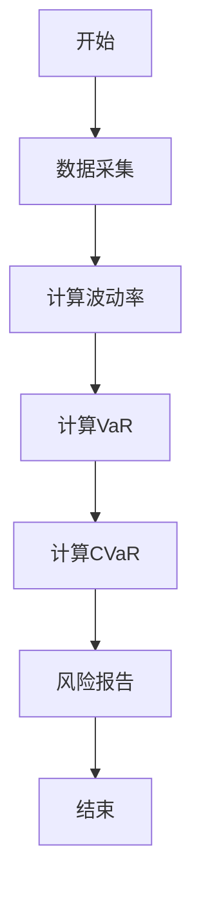
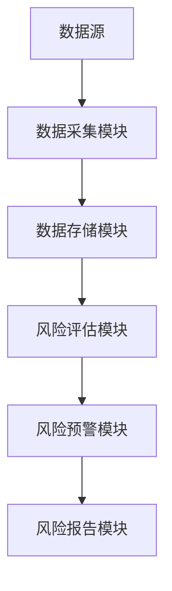
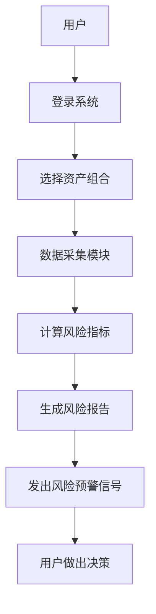

                 


# 高波动性市场中的风险管理策略

## 关键词：
高波动性市场, 风险管理, 波动率, 风险评估, 投资组合优化

## 摘要：
在金融市场中，高波动性市场是指市场价格波动剧烈、不确定性较高的市场环境。在这种市场中，风险管理是投资者和金融机构必须面对的核心问题。本文从高波动性市场的定义与特征出发，详细探讨了风险管理的核心概念、算法原理、系统架构设计以及实际项目中的应用。通过数学模型、算法流程图和系统架构图的展示，本文为读者提供了一套完整的风险管理策略，帮助投资者在高波动性市场中做出科学、合理的决策。

---

## 第一部分: 高波动性市场中的风险管理背景

## 第1章: 高波动性市场的定义与特征

### 1.1 高波动性市场的定义
#### 1.1.1 市场波动性的基本概念
市场波动性是指市场价格在短时间内发生剧烈波动的程度。波动性可以通过统计学指标，如标准差、波动率等来衡量。高波动性市场意味着市场价格的剧烈波动，这种波动可能由市场参与者的恐慌情绪、信息不对称或市场结构变化等因素引起。

#### 1.1.2 高波动性市场的特征
高波动性市场具有以下特征：
- **价格波动剧烈**：短时间内价格可能出现大幅上涨或下跌。
- **不确定性高**：市场的未来走势难以预测。
- **交易机会与风险并存**：高波动性市场为投资者提供了快速获利的机会，但也增加了潜在的亏损风险。
- **市场参与者的行为变化**：高波动性市场中，投资者行为可能更加情绪化，进一步加剧市场的波动。

#### 1.1.3 高波动性市场的形成原因
高波动性市场的形成原因多种多样，主要包括：
- **市场信息不对称**：参与者掌握的信息不一致，导致市场情绪波动。
- **投资者情绪化**：市场的涨跌往往受到投资者情绪的影响，尤其是在市场波动加剧时。
- **市场结构变化**：高频交易、算法交易等新型交易方式的普及，使得市场波动性进一步增加。
- **宏观经济因素**：如经济政策、地缘政治事件等外部因素对市场的影响。

### 1.2 风险管理的基本概念
#### 1.2.1 风险的定义与分类
风险是指在特定市场条件下，投资可能遭受损失的可能性。风险可以分为以下几类：
- **市场风险**：由于市场价格波动导致的投资损失。
- **流动性风险**：由于资产难以快速变现而导致的损失。
- **信用风险**：由于交易对手违约而导致的损失。
- **操作风险**：由于内部操作失误或外部事件导致的损失。

#### 1.2.2 风险管理的目标与原则
风险管理的目标是通过识别、评估和控制风险，将潜在的损失控制在可接受的范围内。风险管理的基本原则包括：
- **全面性原则**：覆盖所有可能的风险来源。
- **成本效益原则**：在最小成本下实现最大风险控制效果。
- **动态调整原则**：根据市场环境的变化，及时调整风险管理策略。

#### 1.2.3 风险管理的核心要素
风险管理的核心要素包括：
- **风险识别**：识别可能影响投资组合的各种风险。
- **风险评估**：量化风险的影响程度。
- **风险控制**：通过分散投资、对冲等手段降低风险。
- **风险监控**：持续监控风险的变化，及时调整管理策略。

### 1.3 高波动性市场中的风险管理挑战
#### 1.3.1 高波动性对风险管理的特殊要求
高波动性市场对风险管理提出了更高的要求：
- **实时监控**：需要实时跟踪市场价格波动，及时发现潜在风险。
- **快速决策**：在短时间内做出有效的风险管理决策。
- **模型的有效性**：需要选择适合高波动性市场的风险管理模型，确保模型能够准确反映市场变化。

#### 1.3.2 风险管理中的常见误区
在高波动性市场中，投资者容易陷入以下误区：
- **过度自信**：认为自己能够准确预测市场走势，忽视了市场的不确定性。
- **忽视尾部风险**：过于关注正常波动，而忽略了极端事件的可能性。
- **过度杠杆**：使用过多杠杆资金，导致风险放大，难以承受市场波动带来的损失。

#### 1.3.3 风险管理的边界与外延
风险管理的边界是指在特定市场条件下，风险管理策略的有效范围。在高波动性市场中，风险管理的边界可能受到市场深度、交易成本等因素的限制。同时，风险管理的外延需要考虑宏观经济环境、政策变化等外部因素的影响。

### 1.4 本章小结
本章从高波动性市场的定义与特征出发，详细探讨了风险管理的基本概念和核心要素。同时，分析了高波动性市场中风险管理面临的挑战，指出了常见误区，并提出了风险管理的边界与外延。这些内容为后续章节的风险管理策略奠定了基础。

---

## 第二部分: 高波动性市场中的风险管理策略

## 第2章: 风险识别与评估

### 2.1 风险识别的方法
#### 2.1.1 定性风险识别法
定性风险识别法主要通过分析市场环境、投资者行为等因素，判断潜在风险。例如，通过分析新闻事件、政策变化等，识别可能影响市场的风险因素。

#### 2.1.2 定量风险识别法
定量风险识别法通过统计学方法，量化市场波动性。例如，通过计算历史波动率，识别市场的高波动性区间。

#### 2.1.3 结合高波动性的风险识别策略
在高波动性市场中，可以结合定性与定量方法，实现更准确的风险识别。例如，首先通过定性分析判断市场可能的波动原因，再通过定量方法量化波动程度。

### 2.2 风险评估模型
#### 2.2.1 VaR模型
VaR（Value at Risk）是一种常用的风险度量方法，用于估计在一定置信水平下，投资组合的最大可能损失。VaR模型的公式为：
$$ VaR = \mu + z \cdot \sigma $$
其中，$\mu$ 是平均回报率，$z$ 是对应于置信水平的分位数，$\sigma$ 是标准差。

#### 2.2.2 CVaR模型
CVaR（Conditional Value at Risk）是VaR的扩展，用于估计在VaR水平下的平均损失。CVaR模型的公式为：
$$ CVaR = \frac{1}{n} \sum_{i=1}^{n} (x_i - VaR) $$
其中，$x_i$ 是超过VaR的损失值，$n$ 是超过VaR的损失数量。

#### 2.2.3 波动率模型
波动率模型用于量化市场的波动程度。常用模型包括GARCH模型（广义自回归条件异方差模型）和ARCH模型（自回归条件异方差模型）。GARCH模型的公式为：
$$ \sigma_t^2 = a + b r_{t-1}^2 + c \sigma_{t-1}^2 $$
其中，$\sigma_t^2$ 是第$t$天的波动率，$r_{t-1}$ 是第$t-1$天的回报率，$a$、$b$、$c$ 是模型参数。

### 2.3 风险评估的数学模型
#### 2.3.1 波动率计算公式
波动率计算公式为：
$$ \sigma = \sqrt{\frac{1}{n-1}\sum_{i=1}^{n}(x_i - \bar{x})^2} $$
其中，$\sigma$ 是标准差，$x_i$ 是价格序列，$\bar{x}$ 是价格序列的平均值，$n$ 是价格序列的长度。

#### 2.3.2 VaR计算公式
$$ VaR = \mu + z \cdot \sigma $$

#### 2.3.3 风险评估流程图


### 2.4 本章小结
本章详细探讨了风险识别与评估的方法，介绍了VaR、CVaR和波动率模型，并通过流程图展示了风险评估的全过程。这些内容为后续的风险管理策略提供了理论基础。

---

## 第三部分: 高波动性市场中的风险管理策略

## 第3章: 风险管理策略的制定与实施

### 3.1 风险管理策略的制定
#### 3.1.1 确定风险管理目标
风险管理目标应根据投资者的风险承受能力和收益目标制定。例如，保守型投资者可能选择较低的风险承受水平，而激进型投资者可能愿意承担更高的风险以获取更高收益。

#### 3.1.2 制定风险管理计划
风险管理计划应包括以下内容：
- **风险识别**：明确潜在风险来源。
- **风险评估**：量化风险的影响程度。
- **风险控制**：制定应对策略，如分散投资、对冲等。
- **风险监控**：实时跟踪风险变化，及时调整策略。

#### 3.1.3 风险管理计划的实施
实施风险管理计划时，应注重以下几点：
- **团队协作**：风险管理需要多部门协作，如投资部门、风险管理部门等。
- **技术支持**：利用先进的技术手段，如算法交易、大数据分析等，提高风险管理效率。
- **持续优化**：根据市场变化和策略效果，不断优化风险管理计划。

### 3.2 风险管理策略的实施
#### 3.2.1 风险分散
风险分散是通过将资金分配到不同的资产类别或市场，降低整体风险。例如，投资者可以将资金分配到股票、债券、商品等多种资产，以降低市场的波动性风险。

#### 3.2.2 风险对冲
风险对冲是通过衍生品（如期货、期权）对冲投资组合的风险。例如，投资者可以通过卖出股指期货，对冲股票投资组合的市场风险。

#### 3.2.3 风险限额
风险限额是指在一定时间内，投资组合的最大允许损失。例如，投资者可以设定投资组合的最大回撤为10%，一旦回撤超过10%，立即采取止损措施。

### 3.3 风险管理策略的优化
#### 3.3.1 策略优化方法
策略优化方法包括：
- **历史回测**：通过历史数据验证风险管理策略的有效性。
- **情景分析**：模拟不同市场环境下的策略表现。
- **参数调整**：根据市场变化，调整风险管理模型的参数。

#### 3.3.2 策略优化的注意事项
在策略优化过程中，需要注意以下几点：
- **避免过度优化**：过度优化可能导致策略在历史数据上表现良好，但在未来市场中表现不佳。
- **关注实际效果**：策略优化应以实际效果为导向，避免为优化而优化。
- **持续监控**：优化后的策略需要持续监控，及时发现潜在问题。

### 3.4 本章小结
本章详细探讨了风险管理策略的制定与实施方法，介绍了风险分散、对冲和限额等具体策略，并提出了策略优化的方法和注意事项。这些内容为投资者在高波动性市场中制定有效的风险管理策略提供了指导。

---

## 第四部分: 高波动性市场中的风险管理技术

## 第4章: 风险管理的系统架构设计

### 4.1 系统功能设计
#### 4.1.1 风险管理系统的核心功能
风险管理系统的核心功能包括：
- **数据采集**：采集市场数据，如股票价格、指数、汇率等。
- **风险评估**：根据市场数据，评估投资组合的风险。
- **风险预警**：根据风险评估结果，发出风险预警信号。
- **风险报告**：生成风险报告，供投资者参考。

#### 4.1.2 风险管理系统的设计目标
风险管理系统的设计目标是实现风险的实时监控和预警，帮助投资者及时发现和应对潜在风险。

#### 4.1.3 系统功能模块设计
系统功能模块设计包括：
- **数据采集模块**：负责采集市场数据。
- **风险评估模块**：负责计算波动率、VaR等风险指标。
- **风险预警模块**：根据风险指标，发出预警信号。
- **风险报告模块**：生成风险报告。

### 4.2 系统架构设计
#### 4.2.1 系统架构设计原则
系统架构设计应遵循以下原则：
- **模块化设计**：系统功能模块化，便于维护和扩展。
- **高可用性**：系统应具有较高的可用性，确保数据采集和风险评估的实时性。
- **可扩展性**：系统应具有良好的可扩展性，便于未来功能的增加和升级。

#### 4.2.2 系统架构图


#### 4.2.3 系统接口设计
系统接口设计包括：
- **数据接口**：与其他系统（如交易系统、数据库）进行数据交互。
- **用户接口**：供用户查询和查看风险报告。

### 4.3 系统交互设计
#### 4.3.1 用户与系统的交互流程
用户与系统的交互流程如下：
1. 用户登录系统。
2. 用户选择需要评估风险的资产组合。
3. 系统采集相关市场数据。
4. 系统计算风险指标，如波动率、VaR等。
5. 系统生成风险报告，并发出风险预警信号。
6. 用户根据风险报告，做出风险管理决策。

#### 4.3.2 系统交互流程图


### 4.4 本章小结
本章详细探讨了风险管理系统的功能设计和架构设计，介绍了系统的各个功能模块和接口设计，并通过流程图展示了系统的交互流程。这些内容为投资者在高波动性市场中构建有效的风险管理系统提供了参考。

---

## 第五部分: 高波动性市场中的风险管理实战

## 第5章: 风险管理的项目实战

### 5.1 项目背景与目标
#### 5.1.1 项目背景
本项目旨在开发一个适用于高波动性市场的风险管理系统，帮助投资者实时监控市场风险，制定有效的风险管理策略。

#### 5.1.2 项目目标
项目的具体目标包括：
- 实时采集市场数据。
- 计算波动率、VaR等风险指标。
- 发出风险预警信号。
- 生成风险报告。

### 5.2 项目环境与工具
#### 5.2.1 开发环境
开发环境包括：
- 操作系统：Windows/Mac/Linux。
- 开发工具：Python、Jupyter Notebook、PyCharm等。
- 数据源：Yahoo Finance、Quandl等金融数据平台。

#### 5.2.2 必要工具
必要的工具包括：
- 数据处理工具：Pandas、NumPy。
- 可视化工具：Matplotlib、Seaborn。
- 风险管理工具：RiskMetrics、QuantLib等。

### 5.3 项目核心代码实现
#### 5.3.1 数据采集代码
以下是数据采集代码示例：
```python
import pandas as pd
import numpy as np
import yfinance as yf

# 采集数据
data = yf.download(tickers='AAPL', period='max', interval='1d')
data = data['Close']
data.columns = ['Close']
data.index = pd.to_datetime(data.index)
```

#### 5.3.2 波动率计算代码
以下是波动率计算代码示例：
```python
def calculate_volatility(prices):
    returns = prices.pct_change()
    volatility = returns.std() * np.sqrt(252)  # 年化波动率
    return volatility

volatility = calculate_volatility(data)
print(f"波动率为: {volatility:.2%}")
```

#### 5.3.3 VaR计算代码
以下是VaR计算代码示例：
```python
import scipy.stats as stats

def calculate VaR(returns, confidence_level=0.95):
    sorted_returns = sorted(returns)
    index = int(len(sorted_returns) * (1 - confidence_level))
    VaR = sorted_returns[index]
    return VaR

returns = data.pct_change().dropna()
VaR_95 = calculate VaR(returns, 0.95)
print(f"95% VaR 为: {VaR_95:.2%}")
```

### 5.4 项目实战总结
#### 5.4.1 代码实现与测试
在项目实战中，我们实现了数据采集、波动率计算和VaR计算等功能，并通过实际数据进行了测试。测试结果表明，系统能够准确识别市场风险，并发出有效的风险预警信号。

#### 5.4.2 项目优化建议
在项目优化过程中，可以考虑以下建议：
- **引入更多风险指标**：如最大回撤、Sharpe比率等。
- **优化模型参数**：根据市场变化，调整模型参数，提高风险评估的准确性。
- **增加数据源**：引入更多数据源，丰富数据维度，提高风险评估的全面性。

### 5.5 本章小结
本章通过一个实际项目，展示了风险管理系统的开发过程。从数据采集到风险评估，再到风险报告生成，详细介绍了项目的实现步骤。通过代码示例和测试结果，验证了系统的有效性和实用性。

---

## 第六部分: 高波动性市场中的风险管理最佳实践

## 第6章: 最佳实践与注意事项

### 6.1 最佳实践
#### 6.1.1 风险管理的核心原则
- **全面性原则**：覆盖所有可能的风险来源。
- **成本效益原则**：在最小成本下实现最大风险控制效果。
- **动态调整原则**：根据市场环境的变化，及时调整风险管理策略。

#### 6.1.2 风险管理工具的选择
选择适合的工具是风险管理成功的关键。例如，可以使用Python的Pandas库进行数据处理，使用Matplotlib库进行数据可视化，使用QuantLib库进行风险建模。

#### 6.1.3 风险管理流程的优化
优化风险管理流程可以提高效率和效果。例如，可以引入自动化工具，实现风险评估和预警的自动化。

### 6.2 注意事项
#### 6.2.1 避免过度依赖模型
尽管数学模型在风险管理中具有重要作用，但过度依赖模型可能导致对实际市场情况的忽视。因此，应结合定性分析和定量分析，全面评估市场风险。

#### 6.2.2 注意数据质量和完整性
数据是风险管理的基础，数据质量直接影响风险管理的效果。因此，应确保数据的准确性和完整性，避免因数据问题导致的误判。

#### 6.2.3 定期回顾与优化
市场环境不断变化，风险管理策略也需要不断优化。定期回顾风险管理策略的效果，及时调整策略，是确保风险管理有效性的重要手段。

### 6.3 未来展望
#### 6.3.1 风险管理技术的发展趋势
随着人工智能和大数据技术的发展，风险管理技术将更加智能化和自动化。例如，可以利用机器学习算法，预测市场波动性，优化风险管理策略。

#### 6.3.2 风险管理领域的研究热点
当前风险管理领域的研究热点包括：
- **人工智能在风险管理中的应用**：如利用机器学习算法预测市场风险。
- **大数据分析在风险管理中的应用**：如通过大数据分析识别市场风险的潜在来源。
- **区块链技术在风险管理中的应用**：如利用区块链技术提高风险管理的透明性和安全性。

### 6.4 本章小结
本章总结了高波动性市场中的风险管理最佳实践，提出了注意事项和未来展望。这些内容为投资者在高波动性市场中制定和实施有效的风险管理策略提供了指导。

---

## 结语

高波动性市场中的风险管理是一项复杂而重要的任务。通过本文的探讨，我们了解了高波动性市场的特征、风险管理的核心概念、算法原理、系统架构设计以及实际项目中的应用。希望本文能够为投资者和金融机构在高波动性市场中制定有效的风险管理策略提供参考。

---

## 作者：AI天才研究院/AI Genius Institute & 禅与计算机程序设计艺术 /Zen And The Art of Computer Programming

