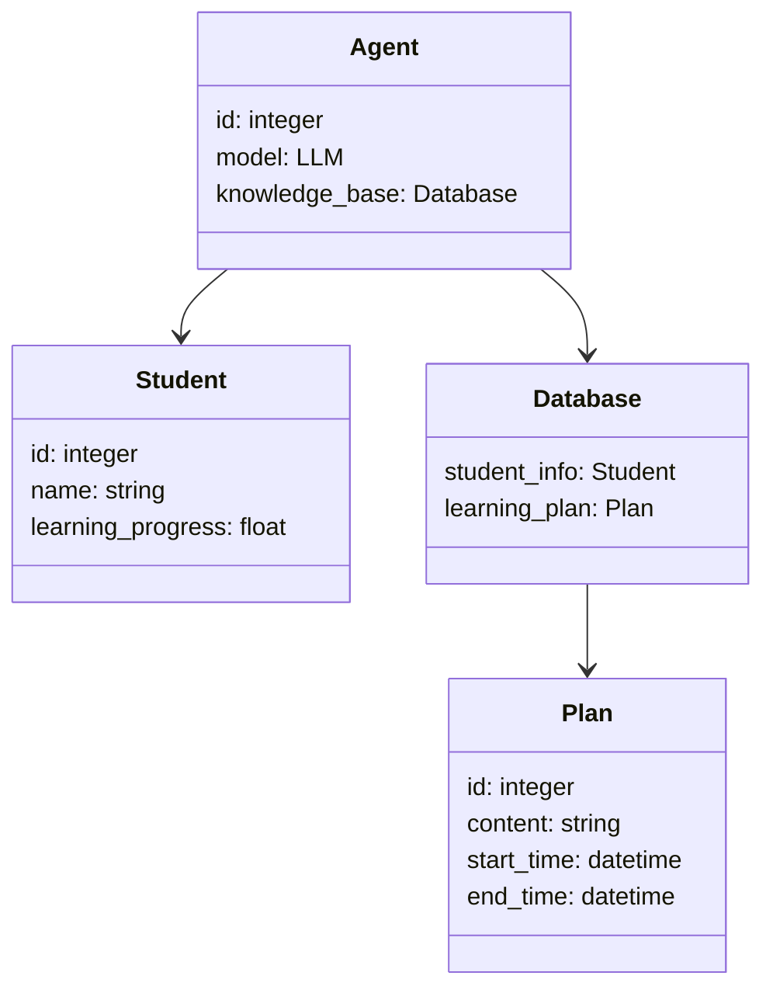

                 


# AI Agent 在教育领域的应用：LLM 驱动的智能导师

**关键词：** AI Agent, 教育应用, LLM, 智能导师, 人工智能, 教育科技

**摘要：**  
随着人工智能技术的迅速发展，AI Agent（人工智能代理）在教育领域的应用日益广泛。本文深入探讨了AI Agent的核心概念、LLM（大语言模型）的原理及其在教育中的具体应用，分析了AI Agent在智能导师系统中的作用，并通过实际案例展示了其在个性化学习和教育创新中的潜力。文章从背景介绍、核心概念、技术原理、系统设计、项目实战到总结展望，全面解析了AI Agent在教育领域的应用前景。

---

## 第一章: AI Agent 在教育领域的背景介绍

### 1.1 AI Agent 的定义与核心概念

#### 1.1.1 AI Agent 的定义
AI Agent 是一种能够感知环境、自主决策并执行任务的智能实体。在教育领域，AI Agent 可以通过自然语言处理、机器学习等技术，为学生提供个性化的学习支持。

#### 1.1.2 AI Agent 的核心要素
- **感知能力：** 通过传感器或数据输入获取环境信息。
- **决策能力：** 基于感知信息，利用算法做出决策。
- **执行能力：** 执行决策并输出结果。

#### 1.1.3 AI Agent 在教育中的定位
AI Agent 作为智能导师，旨在辅助学生学习，提供个性化的学习建议和实时反馈。

---

### 1.2 教育领域的 AI Agent 应用背景

#### 1.2.1 传统教育模式的局限性
- 缺乏个性化：传统教育模式通常以教师为中心，难以满足每个学生的个性化需求。
- 低效：教师精力有限，难以关注每个学生的学习进展。

#### 1.2.2 AI 技术在教育领域的潜力
- 提供个性化学习路径：AI Agent 可以根据学生的学习情况，制定个性化的学习计划。
- 提高学习效率：通过实时反馈和智能推荐，帮助学生更高效地学习。

#### 1.2.3 LLM 驱动的 AI Agent 的优势
- 自然语言处理能力：LLM 能够理解并生成自然语言，使 AI Agent 更加智能化。
- 深度学习能力：通过大量数据训练，LLM 能够捕捉到复杂的学习模式。

---

## 第二章: AI Agent 的核心概念与联系

### 2.1 AI Agent 的核心概念

#### 2.1.1 AI Agent 的行为模式
AI Agent 的行为模式包括反应式和规划式两种。反应式 Agent 基于当前输入做出实时反应，而规划式 Agent 则通过规划未来步骤来行动。

#### 2.1.2 AI Agent 的决策机制
- 基于规则的决策：根据预设的规则做出决策。
- 基于机器学习的决策：通过训练模型，AI Agent 能够从数据中学习，做出更复杂的决策。

#### 2.1.3 AI Agent 的决策机制对比
| 决策机制 | 基于规则 | 基于机器学习 |
|----------|----------|---------------|
| 优点     | 简单易实现 | 更加灵活，能够处理复杂问题 |
| 缺点     | 难以应对复杂情况 | 需要大量数据和计算资源 |

---

### 2.2 AI Agent 的核心概念对比表

#### 2.2.1 AI Agent 与传统教育工具的对比
| 特性         | AI Agent                     | 传统教育工具                 |
|--------------|------------------------------|------------------------------|
| 个性化       | 高                          | 低                          |
| 实时反馈     | 高                          | 低                          |
| 自适应能力   | 高                          | 低                          |

#### 2.2.2 AI Agent 与传统 AI 系统的对比
| 特性         | AI Agent                     | 传统 AI 系统                 |
|--------------|------------------------------|------------------------------|
| 交互性       | 高                          | 中                          |
| 独立性       | 高                          | 中                          |

#### 2.2.3 AI Agent 与 LLM 的对比
| 特性         | AI Agent                     | LLM                         |
|--------------|------------------------------|------------------------------|
| 核心能力     | 执行任务                     | 处理自然语言                |
| 应用场景     | 教育、医疗                   | 语言生成、文本理解          |

---

## 第三章: LLM 的原理与数学模型

### 3.1 LLM 的基本原理

#### 3.1.1 LLM 的基本架构
- **编码器：** 将输入的文本转化为向量表示。
- **解码器：** 根据编码器的输出生成目标文本。

#### 3.1.2 LLM 的训练过程
- **前向传播：** 输入数据通过网络生成预测输出。
- **损失计算：** 计算预测输出与真实输出之间的差异。
- **反向传播：** 根据损失调整网络参数。

#### 3.1.3 LLM 的推理机制
- **贪心算法：** 每一步选择概率最高的词。
- **采样算法：** 通过随机采样生成多样化的输出。

---

### 3.2 LLM 的数学模型

#### 3.2.1 概率分布与语言模型
- 语言模型的目标是最大化给定文本的概率：  
  $$ P(w_1, w_2, ..., w_n) $$

#### 3.2.2 损失函数与优化目标
- 常用的损失函数是交叉熵损失：  
  $$ \text{Loss} = -\sum_{i=1}^{n} \log P(w_i | w_{<i}) $$

#### 3.2.3 解码器与编码器的数学表达
- 解码器的输出概率：  
  $$ P(w_i | \text{编码器输出}) $$

---

## 第四章: AI Agent 在教育中的应用场景

### 4.1 智能导师系统

#### 4.1.1 AI Agent 作为智能导师的优势
- 提供 24/7 的学习支持。
- 根据学生的学习进度实时调整教学策略。

#### 4.1.2 AI Agent 在智能导师系统中的角色
- 学生信息收集与分析。
- 学习计划制定与执行。
- 学习效果评估与反馈。

---

### 4.2 个性化学习与辅助教学

#### 4.2.1 个性化学习路径的制定
- 基于学生的学习历史和能力，制定个性化的学习计划。

#### 4.2.2 辅助教学工具的开发
- 提供实时的作业指导和答疑。

---

## 第五章: 系统分析与架构设计

### 5.1 问题场景介绍

#### 5.1.1 系统目标
开发一个基于 LLM 的 AI Agent，用于辅助学生学习。

#### 5.1.2 项目介绍
项目名称：智能教育助手  
目标：为学生提供个性化的学习支持。

---

### 5.2 系统功能设计

#### 5.2.1 领域模型设计


---

### 5.3 系统架构设计

#### 5.3.1 系统架构图
```mermaid
client --> Agent: 请求处理
Agent --> Database: 查询数据
Agent --> LLM: 获取模型输出
Agent --> client: 返回结果
```

---

## 第六章: 项目实战

### 6.1 环境搭建

#### 6.1.1 环境需求
- Python 3.8+
- 安装必要的库：transformers、numpy、torch

---

### 6.2 核心代码实现

#### 6.2.1 代码实现
```python
from transformers import AutoTokenizer, AutoModelForCausalLM
import torch

# 初始化模型和tokenizer
model_name = "gpt2"
tokenizer = AutoTokenizer.from_pretrained(model_name)
model = AutoModelForCausalLM.from_pretrained(model_name)

# 定义生成函数
def generate_response(prompt, max_length=50):
    inputs = tokenizer.encode(prompt, return_tensors="pt")
    outputs = model.generate(inputs, max_length=max_length, do_sample=True)
    response = tokenizer.decode(outputs[0], skip_special_tokens=True)
    return response
```

#### 6.2.2 代码解读
- 使用 GPT-2 模型进行文本生成。
- 生成函数根据输入提示生成指定长度的响应。

---

## 第七章: 总结与展望

### 7.1 最佳实践 tips

#### 7.1.1 系统设计
- 明确系统目标和功能需求。
- 设计合理的数据结构和接口。

#### 7.1.2 开发注意事项
- 确保数据安全和隐私保护。
- 定期更新模型和知识库。

---

### 7.2 小结

本文系统地介绍了 AI Agent 在教育领域的应用，详细讲解了 LLM 的原理及其在智能导师系统中的作用。通过实际案例分析，展示了 AI Agent 在个性化学习中的潜力和优势。

---

### 7.3 未来展望

随着 AI 技术的不断进步，AI Agent 在教育中的应用将更加广泛。未来的挑战包括如何进一步提高模型的准确性和如何更好地保护学生隐私。

---

**作者：AI天才研究院/AI Genius Institute & 禅与计算机程序设计艺术 /Zen And The Art of Computer Programming**

