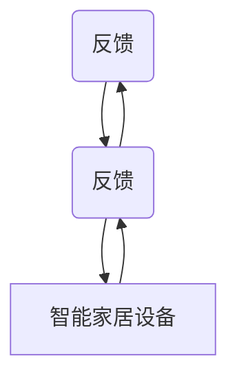
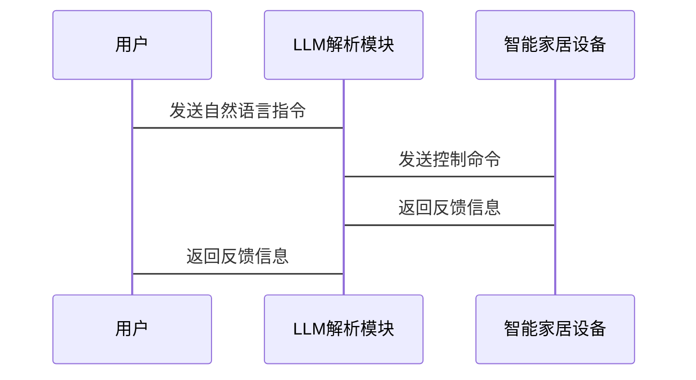

                 


# AI Agent 在智能家居中的应用：LLM 控制物联网设备

> 关键词：AI Agent, 智能家居, LLM, 物联网, 自然语言处理

> 摘要：本文探讨了AI Agent在智能家居中的应用，特别是如何利用大语言模型（LLM）来控制物联网设备。文章详细介绍了AI Agent的基本概念、LLM的工作原理，以及它们在智能家居系统中的集成和实际应用。通过分析系统架构、算法原理和项目实战，本文为读者提供了从理论到实践的全面指导，帮助理解并实现基于LLM的智能家居控制方案。

---

# 第1章: 智能家居与AI Agent的背景介绍

## 1.1 智能家居的发展历程

### 1.1.1 智能家居的概念与特点
智能家居是指通过物联网技术将家中的各种设备（如照明、空调、安防监控等）连接在一起，实现智能化管理。其特点包括：**智能化**、**自动化**、**远程控制**和**高效节能**。

智能家居的发展经历了以下几个阶段：
1. **初步阶段**：简单的设备连接与远程控制。
2. **发展阶段**：设备间的联动控制，如通过手机APP实现多设备联动。
3. **智能化阶段**：引入AI技术，设备能够根据用户习惯和环境自动调整。

### 1.1.2 智能家居的发展阶段
智能家居的发展可以分为以下几个阶段：
1. **单品智能阶段**：单一设备的智能化，如智能灯泡。
2. **设备联动阶段**：多个设备通过智能中枢联动，如通过智能音箱控制灯光和空调。
3. **智能化决策阶段**：设备能够自主决策，基于用户行为和环境数据优化家居体验。

### 1.1.3 当前智能家居的应用场景
当前智能家居的应用场景包括：
1. **家庭自动化**：如自动开启灯光、空调等。
2. **远程控制**：通过手机或平板远程控制家中设备。
3. **场景模式**：如离家模式、回家模式等。
4. **智能安防**：通过摄像头和门锁实现家庭安全监控。

## 1.2 AI Agent的基本概念

### 1.2.1 AI Agent的定义与特点
AI Agent（人工智能代理）是指能够感知环境并采取行动以实现目标的智能体。其特点包括：
1. **自主性**：能够在没有外部干预的情况下自主决策。
2. **反应性**：能够实时感知环境并做出反应。
3. **目标导向**：所有行为都以实现特定目标为导向。
4. **学习能力**：能够通过经验改进自身行为。

### 1.2.2 AI Agent的核心功能
AI Agent的核心功能包括：
1. **感知环境**：通过传感器或其他输入设备获取环境数据。
2. **信息处理**：对获取的数据进行分析和处理。
3. **决策制定**：基于处理后的信息做出决策。
4. **执行行动**：通过执行器将决策转化为实际行动。

### 1.2.3 AI Agent与传统自动控制系统的区别
AI Agent与传统自动控制系统的区别主要体现在以下几个方面：
1. **智能性**：AI Agent具有学习和决策能力，而传统控制系统通常基于固定的规则。
2. **适应性**：AI Agent能够根据环境变化调整行为，而传统控制系统通常需要手动调整。
3. **自主性**：AI Agent能够在没有外部干预的情况下自主运行，而传统控制系统通常需要人工干预。

## 1.3 AI Agent在智能家居中的应用背景

### 1.3.1 智能家居与AI Agent的结合意义
将AI Agent应用于智能家居，可以实现以下目标：
1. **提升用户体验**：通过智能化的决策和控制，为用户提供更加便捷和舒适的家居体验。
2. **优化能源利用**：通过智能调节设备状态，实现能源的高效利用。
3. **增强安全性**：通过智能监控和报警系统，提升家庭安全性。

### 1.3.2 当前智能家居中的AI Agent应用现状
当前，AI Agent在智能家居中的应用主要体现在以下几个方面：
1. **智能音箱**：通过语音交互实现设备控制。
2. **智能家电**：通过AI Agent实现家电的智能化控制。
3. **智能安防**：通过AI Agent实现智能监控和报警。

### 1.3.3 未来发展趋势
未来，AI Agent在智能家居中的应用将更加广泛和深入：
1. **更加智能化**：AI Agent将具备更强的自主决策能力和学习能力。
2. **更加普及**：随着技术的进步，AI Agent将应用于更多的智能家居设备。
3. **更加个性化**：AI Agent将根据用户的个性化需求提供定制化的服务。

---

# 第2章: AI Agent的核心概念与工作原理

## 2.1 AI Agent的体系结构

### 2.1.1 分层结构
AI Agent的体系结构可以分为以下几个层次：
1. **感知层**：负责感知环境数据。
2. **决策层**：负责对感知数据进行处理和决策。
3. **执行层**：负责将决策转化为实际行动。

### 2.1.2 模块化设计
AI Agent的模块化设计包括以下几个模块：
1. **感知模块**：负责数据的采集和处理。
2. **决策模块**：负责数据的分析和决策。
3. **执行模块**：负责将决策转化为实际行动。

### 2.1.3 组件间的交互关系
AI Agent的组件间交互关系如下：
1. **感知模块**将环境数据传递给**决策模块**。
2. **决策模块**根据感知数据做出决策，并将决策结果传递给**执行模块**。
3. **执行模块**根据决策结果执行相应的动作。

## 2.2 AI Agent的工作流程

### 2.2.1 信息感知
AI Agent通过传感器或其他输入设备感知环境数据，例如温度、湿度、光照强度等。

### 2.2.2 信息处理与决策
AI Agent对感知数据进行分析和处理，基于预设的规则或机器学习模型做出决策。

### 2.2.3 执行与反馈
AI Agent根据决策结果执行相应的动作，并通过反馈机制不断优化自身的决策和行为。

## 2.3 AI Agent的核心要素

### 2.3.1 感知能力
AI Agent的感知能力是指其通过传感器或其他输入设备获取环境数据的能力。

### 2.3.2 决策能力
AI Agent的决策能力是指其根据感知数据和预设规则做出决策的能力。

### 2.3.3 执行能力
AI Agent的执行能力是指其通过执行器将决策结果转化为实际行动的能力。

### 2.3.4 学习能力
AI Agent的学习能力是指其通过经验改进自身行为的能力。

---

# 第3章: LLM的基本原理与应用

## 3.1 LLM的基本原理

### 3.1.1 自然语言处理的基础
自然语言处理（NLP）是研究如何让计算机理解和生成人类语言的学科。其核心任务包括文本理解、文本生成、信息抽取等。

### 3.1.2 大语言模型的训练过程
大语言模型（LLM）的训练过程包括以下几个步骤：
1. **数据收集**：收集大量的文本数据。
2. **数据预处理**：对数据进行清洗和标注。
3. **模型构建**：构建深度学习模型，如Transformer模型。
4. **模型训练**：通过反向传播算法优化模型参数。
5. **模型评估**：通过测试数据评估模型性能。

### 3.1.3 LLM的工作原理
LLM的工作原理基于深度学习模型，通过大量数据训练，模型能够理解和生成人类语言。

## 3.2 LLM在智能家居中的应用

### 3.2.1 通过LLM实现自然语言交互
LLM可以用于实现用户与智能家居设备之间的自然语言交互，例如通过语音指令控制设备。

### 3.2.2 LLM在设备控制中的应用
LLM可以通过解析用户的自然语言指令，实现对智能家居设备的控制。

### 3.2.3 LLM在场景模式中的应用
LLM可以根据用户的语言指令，自动调整智能家居设备的状态，例如“我回家了”可以触发回家模式。

---

# 第4章: 基于LLM的智能家居系统设计

## 4.1 系统架构设计

### 4.1.1 系统组成
基于LLM的智能家居系统包括以下几个组成部分：
1. **用户输入模块**：负责接收用户的自然语言指令。
2. **LLM解析模块**：负责解析用户的指令并生成相应的控制命令。
3. **设备控制模块**：负责将控制命令传递给智能家居设备。
4. **设备反馈模块**：负责将设备的反馈信息传递给用户。

### 4.1.2 系统架构图


## 4.2 系统功能设计

### 4.2.1 语言解析功能
系统能够解析用户的自然语言指令，并生成相应的控制命令。

### 4.2.2 设备控制功能
系统能够根据生成的控制命令，实现对智能家居设备的控制。

### 4.2.3 反馈交互功能
系统能够将设备的反馈信息传递给用户，例如“灯光已关闭”或“空调已开启”。

## 4.3 系统接口设计

### 4.3.1 用户输入接口
用户可以通过语音或文本输入指令。

### 4.3.2 设备控制接口
系统通过API或其他通信协议与智能家居设备进行交互。

### 4.3.3 设备反馈接口
设备通过API或其他通信协议将反馈信息传递给系统。

## 4.4 系统交互流程

### 4.4.1 交互流程图


---

# 第5章: 项目实战——基于Python的LLM智能家居控制

## 5.1 环境搭建

### 5.1.1 安装Python
需要安装Python 3.6或更高版本。

### 5.1.2 安装依赖库
需要安装以下依赖库：
- `transformers`
- `torch`

安装命令：
```bash
pip install transformers torch
```

## 5.2 系统核心实现

### 5.2.1 LLM解析模块实现
```python
from transformers import pipeline

# 初始化LLM模型
llm = pipeline('text-generation', model='gpt2')

def parse_command(command):
    # 解析用户的自然语言指令
    response = llm(command, max_length=50, num_return_sequences=1)
    return response[0]['generated_text']
```

### 5.2.2 设备控制模块实现
```python
class SmartHomeDevice:
    def __init__(self):
        self.state = 'idle'  # 可能的状态：idle, running, stopped
    
    def receive_command(self, command):
        # 根据命令调整设备状态
        if command == 'turn on':
            self.state = 'running'
        elif command == 'turn off':
            self.state = 'stopped'
    
    def get_feedback(self):
        # 返回设备当前状态
        return f'设备已 {self.state}'
```

## 5.3 代码实现与解读

### 5.3.1 整体代码
```python
from transformers import pipeline
from time import sleep

class SmartHomeDevice:
    def __init__(self):
        self.state = 'idle'  # 可能的状态：idle, running, stopped
    
    def receive_command(self, command):
        if command == 'turn on':
            self.state = 'running'
        elif command == 'turn off':
            self.state = 'stopped'
    
    def get_feedback(self):
        return f'设备已 {self.state}'

def main():
    # 初始化LLM模型
    llm = pipeline('text-generation', model='gpt2')
    
    # 初始化智能家居设备
    device = SmartHomeDevice()
    
    while True:
        # 用户输入自然语言指令
        command = input("请输入指令：")
        
        # 解析指令
        response = llm(command, max_length=50, num_return_sequences=1)
        parsed_command = response[0]['generated_text']
        
        # 发送控制命令
        device.receive_command(parsed_command)
        
        # 获取设备反馈
        feedback = device.get_feedback()
        print(feedback)
        
        # 模拟延迟
        sleep(1)

if __name__ == "__main__":
    main()
```

### 5.3.2 代码解读
1. **LLM解析模块**：使用`transformers`库中的`pipeline`工具初始化LLM模型，能够解析用户的自然语言指令并生成控制命令。
2. **设备控制模块**：定义了一个`SmartHomeDevice`类，能够根据接收到的控制命令调整设备状态，并返回反馈信息。
3. **主函数**：实现了用户输入、指令解析、设备控制和反馈输出的完整流程。

## 5.4 实际案例分析

### 5.4.1 案例描述
用户输入指令：“请帮我关闭客厅的灯光。”

### 5.4.2 解析过程
1. **用户输入**：“请帮我关闭客厅的灯光。”
2. **指令解析**：LLM解析模块将用户的指令解析为“turn off”。
3. **设备控制**：设备接收到“turn off”命令后，将灯光关闭。
4. **反馈输出**：设备返回“灯光已关闭”。

## 5.5 项目小结
通过本项目，我们实现了基于Python的LLM智能家居控制系统，展示了如何利用大语言模型实现智能家居设备的自然语言控制。

---

# 第6章: 最佳实践与小结

## 6.1 最佳实践 tips

### 6.1.1 系统设计
1. **模块化设计**：确保系统模块化，便于维护和扩展。
2. **安全性**：确保系统的安全性，防止未经授权的访问。
3. **可扩展性**：设计时考虑系统的可扩展性，便于未来添加新的设备和功能。

### 6.1.2 环境搭建
1. **依赖管理**：确保所有依赖库的版本一致，避免冲突。
2. **性能优化**：根据需要优化模型和算法，提升系统的运行效率。

### 6.1.3 代码实现
1. **代码规范**：遵循代码规范，确保代码的可读性和可维护性。
2. **注释与文档**：添加详细的注释和文档，便于团队协作和后期维护。

## 6.2 小结
本文详细介绍了AI Agent在智能家居中的应用，特别是如何利用大语言模型（LLM）实现智能家居设备的自然语言控制。通过理论分析和实际案例，展示了基于LLM的智能家居控制系统的实现过程。

## 6.3 注意事项
1. **数据隐私**：在实际应用中，需要注意用户数据的隐私保护。
2. **系统稳定性**：确保系统的稳定性和可靠性，避免因系统故障导致的安全问题。
3. **用户体验**：在设计系统时，要注重用户体验，提供友好的交互界面和反馈机制。

## 6.4 拓展阅读
1. **深度学习模型**：进一步学习大语言模型的内部机制和优化方法。
2. **智能家居协议**：研究智能家居设备的通信协议，如ZigBee、Wi-Fi、蓝牙等。
3. **自然语言处理**：深入学习自然语言处理技术，提升系统的理解和生成能力。

---

# 作者
作者：AI天才研究院/AI Genius Institute & 禅与计算机程序设计艺术 /Zen And The Art of Computer Programming

---

以上就是《AI Agent 在智能家居中的应用：LLM 控制物联网设备》的技术博客文章，希望对您有所帮助！

