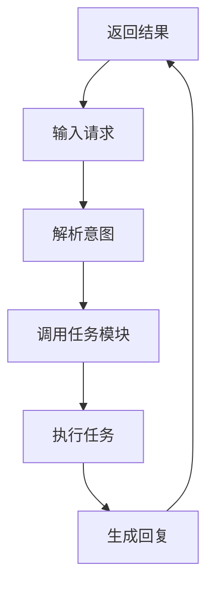
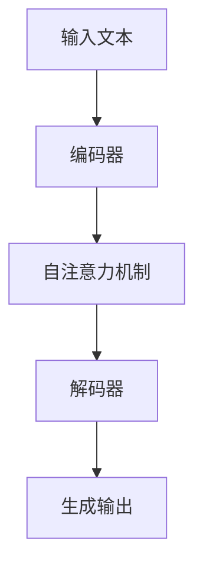
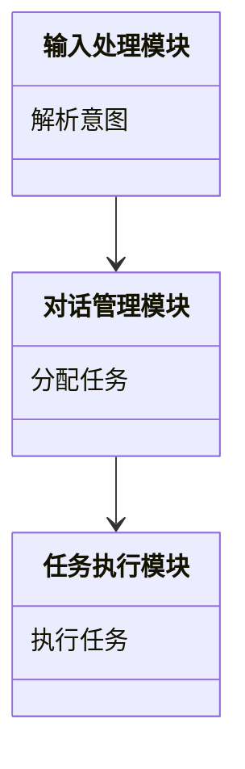
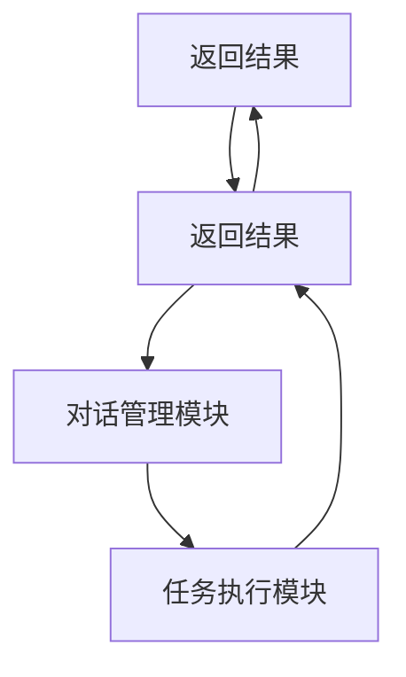
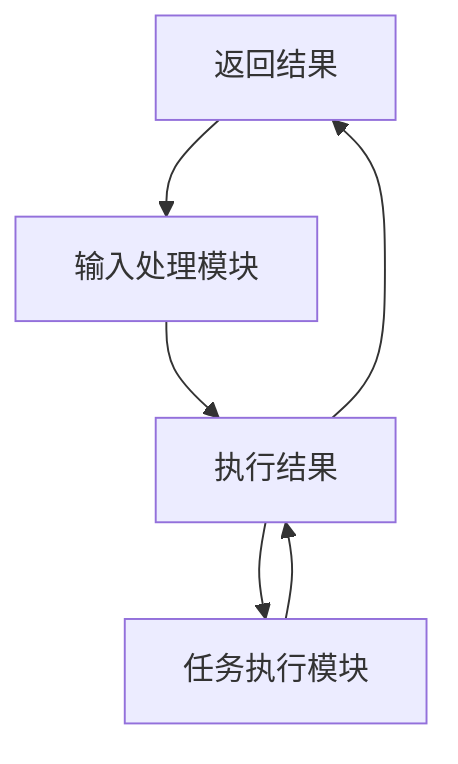

                 


# AI Agent 架构设计：基于 LLM 的智能助手系统构建

> **关键词**：AI Agent，LLM，智能助手，架构设计，系统构建  
> **摘要**：本文详细探讨了基于大语言模型（LLM）的AI Agent 架构设计，从背景介绍、核心概念、算法原理到系统架构设计、项目实战及最佳实践，全面解析了构建智能助手系统的各个方面。文章通过清晰的逻辑和详实的内容，帮助读者理解AI Agent 的核心原理和实际应用，同时提供了丰富的技术细节和实战经验。

---

## 目录

1. [背景与概述](#背景与概述)
2. [AI Agent 的核心概念与原理](#ai-agent-的核心概念与原理)
3. [基于 LLM 的 AI Agent 算法原理](#基于 LLM 的 AI Agent 算法原理)
4. [系统分析与架构设计](#系统分析与架构设计)
5. [项目实战](#项目实战)
6. [最佳实践与总结](#最佳实践与总结)

---

## 1. 背景与概述

### 1.1 AI Agent 的基本概念

#### 1.1.1 什么是 AI Agent
AI Agent（人工智能代理）是一种能够感知环境并采取行动以实现目标的智能系统。它可以理解用户的输入、执行任务、提供反馈，并通过与环境的交互不断优化自身的行为。

#### 1.1.2 AI Agent 的特点与优势
- **智能性**：基于 LLM 的 AI Agent 能够理解自然语言并生成合理的回复。
- **自主性**：能够在没有人工干预的情况下独立完成任务。
- **适应性**：能够根据环境的变化调整自身的行为策略。

#### 1.1.3 AI Agent 的应用场景
- **智能助手**：如 Siri、Alexa 等。
- **客服机器人**：用于自动处理客户咨询和问题。
- **自动化工具**：用于自动化工作流程和任务执行。

### 1.2 问题背景与问题描述

#### 1.2.1 当前人机交互的痛点
- 传统的人机交互方式（如按钮式菜单）效率低下，用户体验较差。
- 人类语言复杂多变，传统的规则引擎难以覆盖所有场景。

#### 1.2.2 AI Agent 如何解决这些问题
- 提供自然语言交互，降低用户使用门槛。
- 通过 LLM 的强大能力，实现更智能的任务处理。

#### 1.2.3 问题的边界与外延
AI Agent 的边界包括其功能范围和性能限制，外延则涉及其在不同领域的应用扩展。

### 1.3 问题解决与核心要素

#### 1.3.1 AI Agent 的核心功能
- **自然语言处理**：理解用户的输入并生成合理的回复。
- **任务执行**：根据用户指令完成特定任务。
- **状态管理**：维护当前对话的状态和上下文。

#### 1.3.2 构建 AI Agent 的关键要素
- **LLM 模型**：提供自然语言理解和生成的能力。
- **对话管理**：负责对话的流程控制。
- **任务执行模块**：负责具体任务的执行和反馈。

#### 1.3.3 核心要素的相互关系
AI Agent 的功能模块通过协同工作，实现从用户输入到任务执行的完整流程。

---

## 2. AI Agent 的核心概念与原理

### 2.1 AI Agent 的核心概念

#### 2.1.1 智能助手的基本原理
智能助手通过 LLM 模型理解和生成文本，结合任务执行模块完成用户的请求。

#### 2.1.2 基于 LLM 的 AI Agent 的特点
- **强大的语言理解能力**：基于 LLM 的模型能够理解复杂的自然语言输入。
- **动态推理能力**：能够根据上下文进行推理和决策。

#### 2.1.3 LLM 在 AI Agent 中的作用
LLM 作为 AI Agent 的核心，负责理解和生成文本，同时提供推理能力。

### 2.2 核心概念的联系

#### 2.2.1 AI Agent 的功能模块与交互流程
- **输入处理**：接收用户的输入并解析意图。
- **对话管理**：根据意图调用任务执行模块。
- **输出生成**：将任务执行的结果生成自然语言回复。

#### 2.2.2 LLM 与其他技术的结合
- **NLP 技术**：用于文本的理解和生成。
- **知识库**：提供特定领域的知识支持。

### 2.3 实体关系图与流程图

#### 2.3.1 AI Agent 的 ER 实体关系图
```mermaid
er
  actor: 用户
  agent: AI Agent
  task: 任务
  action: 行动
  link 用户 --> agent: 发起请求
  link agent --> task: 分配任务
  link task --> action: 执行行动
  link action --> 用户: 返回结果
```

#### 2.3.2 AI Agent 的交互流程图


---

## 3. 基于 LLM 的 AI Agent 算法原理

### 3.1 LLM 的基本原理

#### 3.1.1 大语言模型的结构与工作原理
- **模型结构**：基于 Transformer 架构，包含编码器和解码器。
- **工作原理**：通过自注意力机制处理输入文本，生成上下文相关的输出。

#### 3.1.2 常见的 LLM 模型及其特点
- **GPT 系列**：开源且易于微调。
- **PaLM**：在 Palm 列表上表现出色。

### 3.2 AI Agent 的算法流程

#### 3.2.1 LLM 的训练过程


#### 3.2.2 LLM 的推理机制
- **解码策略**：包括贪婪解码和随机采样。
- **温度参数**：控制生成结果的多样性。

### 3.3 数学模型与公式

#### 3.3.1 注意力机制的公式
$$ \text{Attention}(Q, K, V) = \text{softmax}\left(\frac{QK^T}{\sqrt{d_k}}\right)V $$

#### 3.3.2 解码过程的公式
$$ P(\text{output}_i | \text{input}_i, \text{context}) $$

---

## 4. 系统分析与架构设计

### 4.1 问题场景介绍

#### 4.1.1 项目介绍
- **项目名称**：智能助手系统。
- **项目目标**：构建一个基于 LLM 的 AI Agent，实现自然语言交互和任务执行。

### 4.2 系统功能设计

#### 4.2.1 系统功能模块
- **输入处理模块**：接收用户输入并解析意图。
- **对话管理模块**：负责对话流程的控制。
- **任务执行模块**：根据意图执行具体任务。

#### 4.2.2 系统功能类图


### 4.3 系统架构设计

#### 4.3.1 系统架构图


### 4.4 接口设计与交互流程图

#### 4.4.1 系统接口设计
- **输入接口**：接收用户的自然语言输入。
- **输出接口**：生成自然语言的回复。

#### 4.4.2 交互流程图


---

## 5. 项目实战

### 5.1 环境安装与配置

#### 5.1.1 环境要求
- Python 3.8+
- 必要的库：transformers、numpy

#### 5.1.2 安装步骤
```bash
pip install transformers numpy
```

### 5.2 核心代码实现

#### 5.2.1 输入处理模块
```python
def parse_intent(input_text):
    # 解析用户的意图
    pass
```

#### 5.2.2 对话管理模块
```python
def manage_conversation(intent):
    # 根据意图分配任务
    pass
```

#### 5.2.3 任务执行模块
```python
def execute_task(task):
    # 执行具体任务
    pass
```

### 5.3 案例分析与解读

#### 5.3.1 典型案例
- **用户输入**：查询天气。
- **系统处理**：解析意图，调用天气查询模块，返回结果。

#### 5.3.2 代码实现
```python
def main():
    input_text = input("请输入您的请求：")
    intent = parse_intent(input_text)
    task = manage_conversation(intent)
    result = execute_task(task)
    print(result)

if __name__ == "__main__":
    main()
```

### 5.4 项目总结与经验分享

#### 5.4.1 项目总结
- 成功实现了基于 LLM 的 AI Agent 系统。
- 系统具备自然语言处理和任务执行能力。

#### 5.4.2 经验分享
- **代码结构**：模块化设计有助于扩展和维护。
- **性能优化**：合理使用缓存技术可以提升效率。

---

## 6. 最佳实践与总结

### 6.1 最佳实践 tips

#### 6.1.1 系统设计
- 明确模块职责，确保代码结构清晰。
- 通过日志和监控工具进行系统维护。

#### 6.1.2 技术选型
- 根据需求选择合适的 LLM 模型。
- 确保系统的可扩展性和可维护性。

### 6.2 小结

通过本文的详细讲解，我们了解了基于 LLM 的 AI Agent 架构设计的核心内容。从背景概述到系统实现，再到项目实战，每一步都离不开对技术细节的深入理解和实践。

### 6.3 注意事项

- 在实际应用中，需注意数据安全和隐私保护。
- 系统的可解释性是提升用户信任的重要因素。

### 6.4 未来展望

AI Agent 的发展将朝着更加智能化和个性化的方向迈进，未来的挑战在于如何在不同场景下实现更高效的交互和任务处理。

---

## 作者

**作者：AI天才研究院/AI Genius Institute & 禅与计算机程序设计艺术 /Zen And The Art of Computer Programming**

