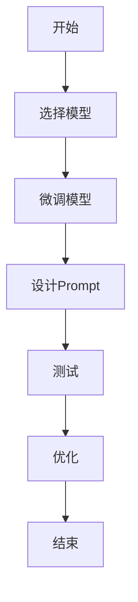
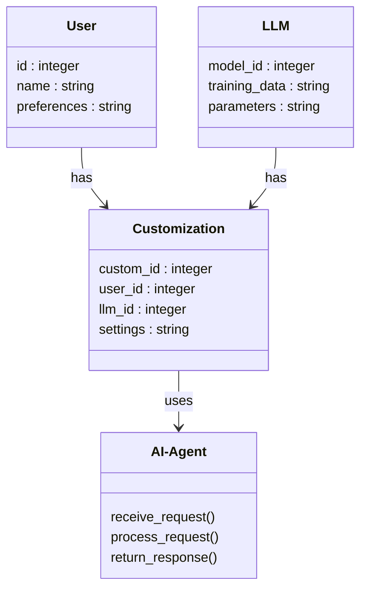
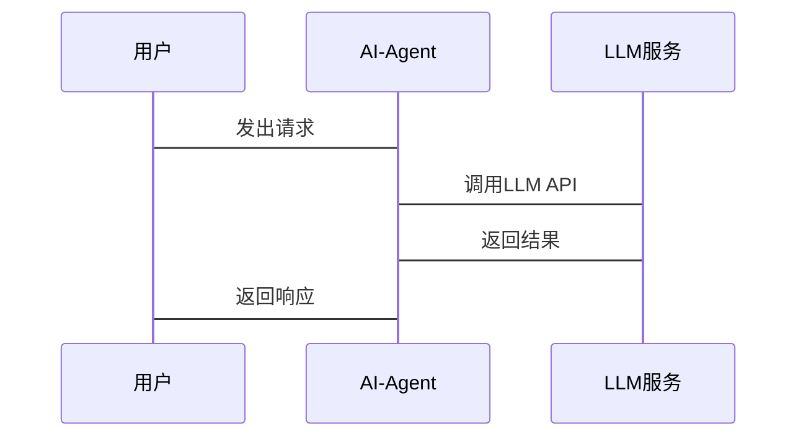

                 


# 目录大纲：《AI Agent 的个性化定制：调教 LLM 以适应不同用户》

## 第1章: 引言
### 1.1 什么是AI Agent？
### 1.2 什么是LLM？
### 1.3 个性化定制的必要性

## 第2章: 背景介绍
### 2.1 问题背景
### 2.2 问题描述
### 2.3 问题解决
### 2.4 边界与外延
### 2.5 核心要素组成

## 第3章: 核心概念与联系
### 3.1 AI Agent 的核心原理
### 3.2 LLM 的核心原理
### 3.3 核心概念对比表
### 3.4 ER实体关系图（Mermaid）

## 第4章: 算法原理讲解
### 4.1 调整LLM的参数
### 4.2 微调LLM
### 4.3 Prompt Engineering
### 4.4 算法流程图（Mermaid）
### 4.5 Python代码示例
### 4.6 数学模型与公式
### 4.7 举例说明

## 第5章: 系统分析与架构设计方案
### 5.1 问题场景介绍
### 5.2 项目介绍
### 5.3 系统功能设计（领域模型Mermaid类图）
### 5.4 系统架构设计（Mermaid架构图）
### 5.5 系统接口设计
### 5.6 系统交互流程（Mermaid序列图）

## 第6章: 项目实战
### 6.1 环境安装
### 6.2 系统核心实现源代码
### 6.3 代码应用解读与分析
### 6.4 实际案例分析和详细讲解剖析
### 6.5 项目小结

## 第7章: 最佳实践与小结
### 7.1 核心内容总结
### 7.2 实用建议与最佳实践
### 7.3 注意事项与常见问题
### 7.4 拓展阅读与学习资源

## 作者信息
作者：AI天才研究院/AI Genius Institute  
联系领域：禅与计算机程序设计艺术 / Zen And The Art of Computer Programming

---

# 第1章: 引言

## 1.1 什么是AI Agent？
AI Agent是指智能体，它能够感知环境并采取行动以实现目标。AI Agent可以是软件程序，也可以是物理机器人，它们通过传感器获取信息，并通过执行器与环境互动。

## 1.2 什么是LLM？
LLM是大型语言模型的缩写，指通过大量数据训练的深度学习模型，能够生成类似人类的文本。LLM的应用广泛，包括自然语言处理、机器翻译、问答系统等。

## 1.3 个性化定制的必要性
个性化定制使得AI Agent能够根据不同的用户需求进行调整，提供更贴合用户习惯的服务。这对于提高用户体验和满意度至关重要。

---

# 第2章: 背景介绍

## 2.1 问题背景
随着AI技术的发展，用户对AI代理的需求日益增长。然而，现有的LLM通常无法满足不同用户个性化的需求。

## 2.2 问题描述
不同用户对AI代理的期望不同，例如企业用户可能需要专业的数据分析功能，而个人用户可能更注重用户体验。

## 2.3 问题解决
通过个性化定制LLM，可以使其适应不同用户的需求，提供更精准的服务。

## 2.4 边界与外延
个性化定制的范围包括模型调整、功能扩展等，但需注意数据隐私和模型泛化能力的平衡。

## 2.5 核心要素组成
个性化定制的核心要素包括数据采集、模型调整、功能实现和用户反馈。

---

# 第3章: 核心概念与联系

## 3.1 AI Agent 的核心原理
AI Agent通过感知环境和采取行动来实现目标，通常包括感知层、决策层和执行层。

## 3.2 LLM 的核心原理
LLM基于大量的数据训练，通过神经网络生成文本，具有强大的自然语言处理能力。

## 3.3 核心概念对比表

| 比较维度 | AI Agent | LLM |
|----------|----------|-----|
| 功能     | 感知与执行 | 生成文本 |
| 应用场景 | 多领域     | NLP |
| 数据需求 | 多样化     | 大规模 |

## 3.4 ER实体关系图（Mermaid）

```mermaid
erDiagram
    user {
        +id : integer
        +name : string
        +preferences : string
    }
    llm {
        +model_id : integer
        +training_data : string
        +parameters : string
    }
    customization {
        +custom_id : integer
        +user_id : integer
        +llm_id : integer
        +settings : string
    }
    user -> customization : has
    llm -> customization : has
```

---

# 第4章: 算法原理讲解

## 4.1 调整LLM的参数
通过调整模型的超参数（如学习率、批量大小）来优化模型性能。

## 4.2 微调LLM
在预训练的基础上，使用特定领域的数据进行微调，以适应用户的个性化需求。

## 4.3 Prompt Engineering
通过设计特定的提示（prompt）来引导LLM生成符合预期的输出。

## 4.4 算法流程图（Mermaid）



## 4.5 Python代码示例

```python
import torch
from transformers import AutoModelForMaskedLM, AutoTokenizer

# 初始化模型和分词器
model_name = 'bert-base-uncased'
model = AutoModelForMaskedLM.from_pretrained(model_name)
tokenizer = AutoTokenizer.from_pretrained(model_name)

# 微调模型
def train_loop(model, tokenizer, train_loader, optimizer, criterion, epochs=3):
    for epoch in range(epochs):
        for batch in train_loader:
            optimizer.zero_grad()
            inputs = tokenizer(batch['input_ids'], return_tensors='pt', padding=True, truncation=True)
            outputs = model(**inputs)
            loss = criterion(outputs.logits, batch['labels'])
            loss.backward()
            optimizer.step()
    return model

# 定义超参数
batch_size = 8
learning_rate = 2e-5
```

## 4.6 数学模型与公式

损失函数的计算公式为：
$$
\text{loss} = \text{criterion}(\text{outputs.logits}, \text{batch.labels})
$$

优化过程使用Adam优化器：
$$
\text{optimizer} = \text{torch.optim.Adam}(model.parameters(), \text{lr}=2e-5)
$$

## 4.7 举例说明
通过调整模型参数和设计特定的Prompt，可以使得LLM在特定领域内表现更佳。

---

# 第5章: 系统分析与架构设计方案

## 5.1 问题场景介绍
用户希望有一个个性化的AI代理，能够根据其偏好提供定制服务。

## 5.2 项目介绍
开发一个支持个性化定制的AI Agent系统，基于LLM技术，满足不同用户的需求。

## 5.3 系统功能设计（领域模型Mermaid类图）



## 5.4 系统架构设计（Mermaid架构图）


## 5.5 系统接口设计
系统接口包括用户输入接口、LLM调用接口和结果返回接口。

## 5.6 系统交互流程（Mermaid序列图）



---

# 第6章: 项目实战

## 6.1 环境安装
安装必要的库，如transformers、torch等。

## 6.2 系统核心实现源代码

```python
from transformers import AutoTokenizer, AutoModelForCausalLM
import torch

# 加载预训练模型和分词器
tokenizer = AutoTokenizer.from_pretrained('gpt2')
model = AutoModelForCausalLM.from_pretrained('gpt2')

# 定制提示
prompt = "作为一个专家，解释量子计算的基本原理。"
inputs = tokenizer.encode(prompt, return_tensors='pt', max_length=512, truncation=True)

# 生成响应
with torch.no_grad():
    outputs = model.generate(inputs, max_length=512, do_sample=True)
response = tokenizer.decode(outputs[0], skip_special_tokens=True)
print(response)
```

## 6.3 代码应用解读与分析
通过上述代码，我们可以看到如何通过设计特定的提示来引导LLM生成所需的响应。

## 6.4 实际案例分析和详细讲解剖析
以量子计算为例，分析如何通过提示工程和模型微调来优化LLM的输出。

## 6.5 项目小结
项目成功的关键在于合理的设计提示和模型微调，同时需要不断测试和优化。

---

# 第7章: 最佳实践与小结

## 7.1 核心内容总结
个性化定制AI Agent需要理解用户需求，合理调整LLM的参数和提示。

## 7.2 实用建议与最佳实践
1. 理解用户需求，进行需求分析。
2. 合理设计提示，提高生成效果。
3. 定期测试和优化，确保系统稳定。

## 7.3 注意事项与常见问题
注意数据隐私和模型泛化能力，避免过度定制导致的模型性能下降。

## 7.4 拓展阅读与学习资源
推荐阅读《Effective Prompt Design for Large Language Models》和《Neural Networks and Deep Learning》。

---

# 作者信息
作者：AI天才研究院/AI Genius Institute  
联系领域：禅与计算机程序设计艺术 / Zen And The Art of Computer Programming

