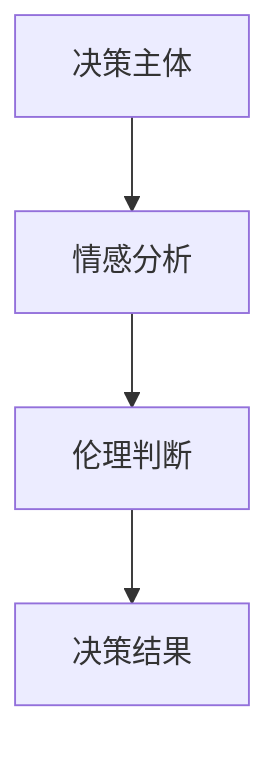
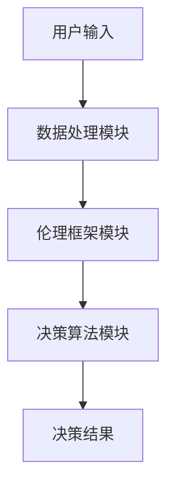
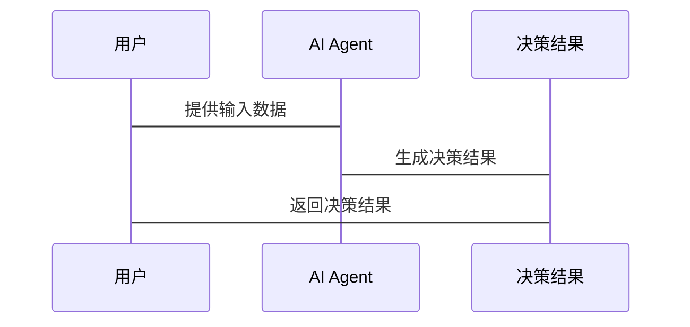

                 


# AI Agent 的伦理决策：在 LLM 中植入道德框架

> 关键词：AI Agent，伦理决策，LLM，道德框架，人工智能，决策算法

> 摘要：随着AI技术的快速发展，AI Agent 在各个领域的应用越来越广泛。然而，AI Agent 的决策过程需要符合伦理规范，以确保其行为符合人类社会的价值观。本文将深入探讨如何在大型语言模型（LLM）中植入道德框架，从而实现 AI Agent 的伦理决策。通过分析伦理决策的核心概念、算法原理、系统架构以及实际案例，本文将为读者提供一个全面的视角，帮助理解如何在AI Agent 中实现道德决策。

---

# 第一部分：AI Agent 伦理决策的背景与核心概念

## 第1章：AI Agent 伦理决策的背景与问题描述

### 1.1 AI Agent 的定义与核心特征

AI Agent（人工智能代理）是指能够感知环境并采取行动以实现目标的智能实体。AI Agent 的核心特征包括：

- **自主性**：能够在没有外部干预的情况下独立运作。
- **反应性**：能够根据环境的变化调整自己的行为。
- **目标导向性**：通过采取行动来实现预定目标。
- **学习能力**：能够通过经验改进自己的决策能力。

### 1.2 伦理决策的定义与核心要素

伦理决策是指在遵循伦理规范和价值观的前提下，做出合理的选择和行动。其核心要素包括：

- **决策主体**：进行决策的实体（如 AI Agent）。
- **决策客体**：决策所作用的对象（如用户、环境）。
- **决策环境**：决策所处的背景条件（如社会规范、法律法规）。
- **伦理框架**：指导决策的道德原则和价值观。

### 1.3 AI Agent 伦理决策的背景与问题

AI Agent 在医疗、金融、交通等领域发挥着重要作用。然而，AI Agent 的决策过程可能引发伦理问题，例如：

- **隐私问题**：AI Agent 可能会泄露用户的隐私信息。
- **公平性问题**：AI Agent 的决策可能对某些群体造成不公平影响。
- **责任问题**：当 AI Agent 的决策导致负面后果时，责任归属不明确。

因此，如何在 AI Agent 中植入伦理框架，使其在决策过程中遵循道德规范，成为一个亟待解决的问题。

---

## 第2章：伦理框架与 AI Agent 的结合

### 2.1 伦理框架的定义与分类

伦理框架是指导决策的规则和原则的集合。常见的伦理框架包括：

- **功利主义框架**：以最大化整体利益为目标。
- **义务论框架**：基于个体的义务和责任进行决策。
- **美德伦理框架**：以个体的美德和品格为决策依据。

### 2.2 AI Agent 中伦理框架的植入方式

AI Agent 可以通过以下方式植入伦理框架：

- **基于规则的伦理框架**：通过预定义的规则约束 AI Agent 的决策。
- **基于效用的伦理框架**：通过优化目标函数，使 AI Agent 的决策符合整体利益。
- **基于情感的伦理框架**：通过模拟人类情感和价值观，使 AI Agent 的决策更符合人类伦理。

### 2.3 伦理框架与 AI Agent 决策过程的关系

伦理框架对 AI Agent 的决策过程具有以下影响：

- **指导作用**：伦理框架为 AI Agent 提供决策的道德指南。
- **反馈机制**：AI Agent 的决策结果会反过来影响伦理框架的调整。
- **动态平衡**：AI Agent 需要在遵循伦理框架的同时，根据实际情况灵活调整决策。

---

## 第3章：AI Agent 伦理决策的核心概念与联系

### 3.1 伦理决策的核心概念

AI Agent 的伦理决策涉及以下几个核心概念：

- **决策主体**：AI Agent 本身。
- **决策客体**：用户、环境或其他实体。
- **决策环境**：包括法律法规、社会规范等外部条件。

### 3.2 核心概念的属性特征对比

以下是核心概念的属性特征对比表：

| 概念 | 主观性 | 可控性 | 社会性 |
|------|--------|--------|--------|
| 决策主体 | 高 | 高 | 高 |
| 决策客体 | 低 | 低 | 中 |
| 决策环境 | 中 | 低 | 高 |

### 3.3 ER 实体关系图

以下是 AI Agent 伦理决策的 ER 实体关系图：

```mermaid
erd
    entity AI Agent {
        id: string
        decision-making capability: boolean
        ethical framework: string
    }
    entity Ethical Decision {
        id: string
        decision_result: boolean
        ethical_principle: string
    }
    entity Decision Environment {
        id: string
        constraints: string
        context: string
    }
    AI Agent -o> Ethical Decision
    Ethical Decision -o> Decision Environment
```

---

# 第二部分：AI Agent 伦理决策的算法原理

## 第4章：伦理框架在 AI Agent 决策中的算法实现

### 4.1 基于规则的伦理决策算法

基于规则的伦理决策算法通过预定义的规则约束 AI Agent 的决策。例如：

- **规则1**：保护用户隐私。
- **规则2**：避免对弱势群体造成伤害。

### 4.2 基于效用的伦理决策算法

基于效用的伦理决策算法通过优化目标函数，使 AI Agent 的决策符合整体利益。数学模型如下：

$$
\text{目标函数} = \sum_{i=1}^{n} w_i x_i
$$

其中，$w_i$ 是权重，$x_i$ 是决策变量。

### 4.3 基于情感的伦理决策算法

基于情感的伦理决策算法通过模拟人类情感和价值观，使 AI Agent 的决策更符合人类伦理。例如：



---

## 第5章：伦理决策算法的实现与优化

### 5.1 伦理决策算法的实现步骤

1. **定义伦理框架**：确定 AI Agent 的伦理决策原则。
2. **构建决策模型**：设计 AI Agent 的决策算法。
3. **训练模型**：通过大量数据训练 AI Agent 的决策能力。
4. **测试与优化**：通过测试数据优化 AI Agent 的决策算法。

### 5.2 伦理决策算法的优化方法

- **规则优化**：根据实际应用调整预定义规则。
- **参数优化**：通过调整目标函数的权重优化决策结果。
- **反馈优化**：根据用户反馈调整 AI Agent 的决策策略。

---

# 第三部分：AI Agent 伦理决策的系统架构

## 第6章：AI Agent 伦理决策的系统架构设计

### 6.1 系统功能设计

- **伦理框架模块**：实现 AI Agent 的伦理决策规则。
- **决策算法模块**：实现 AI Agent 的决策算法。
- **数据处理模块**：处理输入数据并生成决策结果。

### 6.2 系统架构图



### 6.3 系统接口设计

- **输入接口**：接收用户的输入数据。
- **输出接口**：输出 AI Agent 的决策结果。
- **反馈接口**：接收用户的反馈信息。

### 6.4 系统交互流程图



---

## 第7章：AI Agent 伦理决策的实际应用

### 7.1 实际案例分析

#### 7.1.1 医疗领域

AI Agent 在医疗领域的伦理决策包括：

- **隐私保护**：确保患者隐私不被泄露。
- **治疗方案选择**：在多个治疗方案中选择最优解。

#### 7.1.2 金融领域

AI Agent 在金融领域的伦理决策包括：

- **风险评估**：评估投资项目的潜在风险。
- **公平性**：确保金融服务的公平分配。

### 7.2 案例实现与分析

以下是医疗领域 AI Agent 伦理决策的实现代码：

```python
class AI_Agent:
    def __init__(self, ethical_framework):
        self.ethical_framework = ethical_framework

    def make_decision(self, input_data):
        # 根据伦理框架生成决策结果
        decision = self.ethical_framework.analyze(input_data)
        return decision

class Ethical_Framework:
    def analyze(self, input_data):
        # 示例：保护患者隐私
        if 'patient_info' in input_data:
            return '保护隐私'
        else:
            return '公开信息'

# 使用示例
agent = AI_Agent(Ethical_Framework())
print(agent.make_decision({'patient_info': '敏感信息'}))  # 输出：保护隐私
```

---

# 第四部分：总结与展望

## 第8章：总结与最佳实践

### 8.1 本章小结

AI Agent 的伦理决策是一个复杂而重要的问题。通过植入伦理框架，可以确保 AI Agent 的决策符合人类社会的道德规范。

### 8.2 最佳实践 tips

- **明确伦理框架**：在 AI Agent 中明确伦理决策的原则和规则。
- **动态调整**：根据实际情况动态调整伦理框架。
- **用户反馈**：通过用户反馈不断优化 AI Agent 的决策算法。

### 8.3 注意事项

- **隐私保护**：确保 AI Agent 的决策不会泄露用户的隐私信息。
- **公平性**：避免 AI Agent 的决策对某些群体造成不公平影响。
- **责任归属**：明确 AI Agent 决策的责任归属。

### 8.4 拓展阅读

- **推荐书籍**：《机器学习与伦理决策》
- **推荐论文**：《基于伦理框架的AI决策系统研究》
- **推荐网站**：[伦理与人工智能](https://www.ethicsinai.org)

---

# 作者：AI天才研究院/AI Genius Institute & 禅与计算机程序设计艺术 /Zen And The Art of Computer Programming

