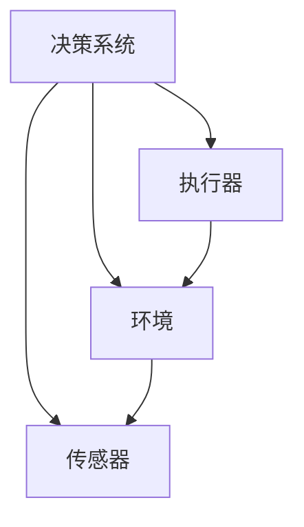
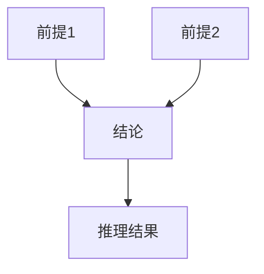
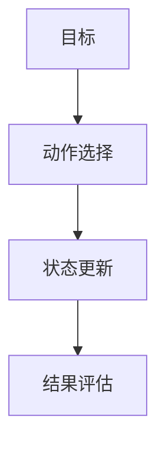
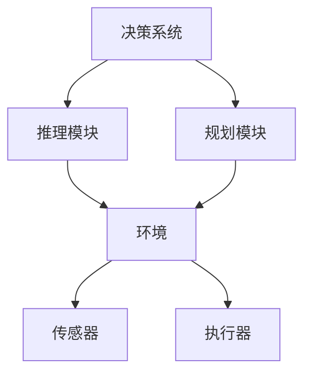
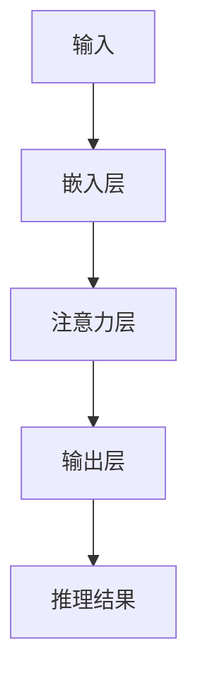
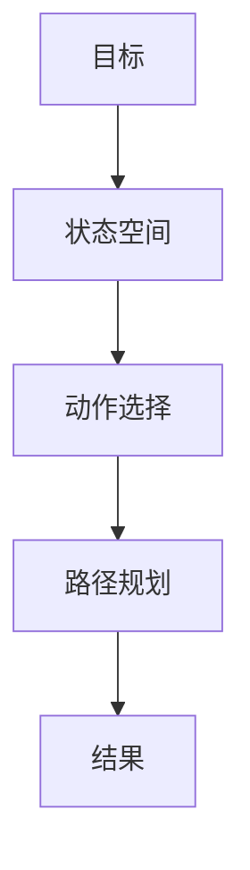
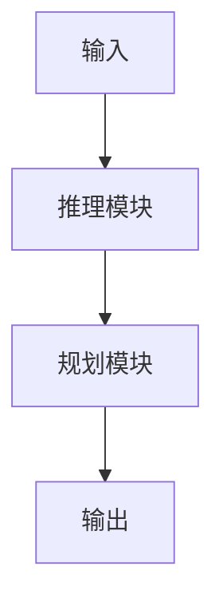
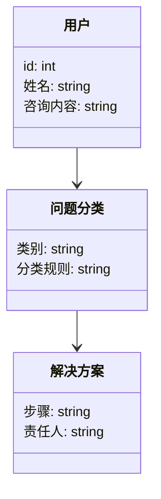
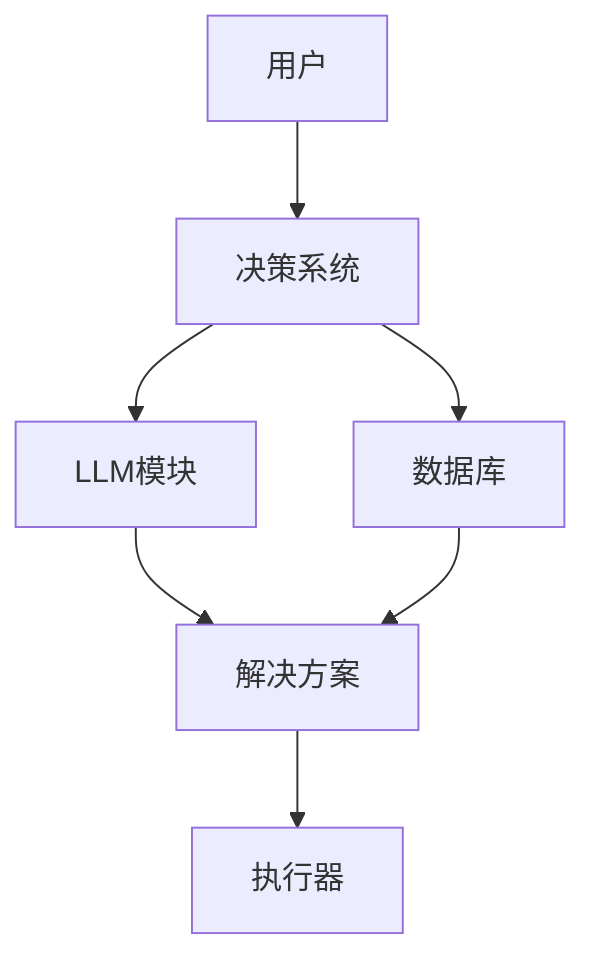
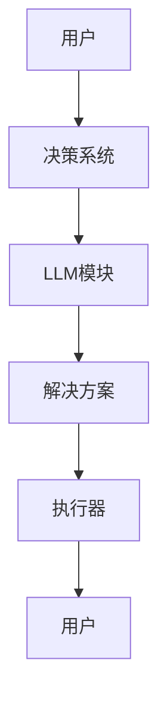

                 


# AI Agent 的决策系统：基于 LLM 的推理与规划

## 关键词：AI Agent, 大语言模型, 推理, 规划, 决策系统

## 摘要：本文详细探讨了AI Agent的决策系统，特别是基于大语言模型（LLM）的推理与规划机制。从AI Agent的基本概念到LLM在决策系统中的应用，从算法原理到系统架构设计，再到实际项目实战，全面解析AI Agent决策系统的构建与实现。通过本文，读者将深入了解如何利用LLM进行智能推理和规划，掌握AI Agent决策系统的开发方法。

---

## 第1章: AI Agent 的基本概念

### 1.1 AI Agent 的定义与特点

#### 1.1.1 AI Agent 的定义
AI Agent（人工智能代理）是指能够感知环境、自主决策并采取行动的智能实体。它通过传感器获取信息，利用计算模型进行分析，并通过执行器与环境交互。

#### 1.1.2 AI Agent 的核心特点
- **自主性**：能够自主决策，无需外部干预。
- **反应性**：能够实时感知环境并做出反应。
- **目标导向**：基于目标驱动行动。
- **学习能力**：通过经验改进决策策略。

#### 1.1.3 AI Agent 与传统 AI 的区别
| 特性       | 传统 AI                 | AI Agent             |
|------------|------------------------|----------------------|
| 行为模式     | 预定义规则驱动         | 自主决策驱动         |
| 环境交互     | 离线计算               | 实时交互             |
| 适应性       | 固定模式               | 可自适应环境变化       |

### 1.2 LLM 在 AI Agent 中的作用

#### 1.2.1 大语言模型的基本原理
大语言模型（LLM）通过大量数据训练，具备强大的自然语言理解和生成能力。它能够通过上下文推理，提供基于情境的决策建议。

#### 1.2.2 LLM 在决策系统中的应用
- **自然语言理解**：分析用户意图。
- **生成式对话**：提供个性化的交互体验。
- **多轮推理**：基于上下文进行复杂决策。

#### 1.2.3 LLM 的优势与局限性
| 优势         | 局限性           |
|--------------|----------------|
| 强大的语言处理能力 | 对上下文依赖过强 |
| 可解释性较弱   | 计算资源消耗大   |

### 1.3 AI Agent 决策系统的应用场景

#### 1.3.1 智能客服
通过LLM理解和生成自然语言，提供高效的客户服务。

#### 1.3.2 智能助手
帮助用户完成日程管理、信息查询等任务。

#### 1.3.3 自动驾驶
通过LLM辅助决策，提升自动驾驶系统的智能性。

### 1.4 本章小结
本章介绍了AI Agent的基本概念、LLM的作用及其应用场景，为后续内容奠定了基础。

---

## 第2章: AI Agent 决策系统的背景与挑战

### 2.1 AI Agent 的发展历史

#### 2.1.1 从规则驱动到数据驱动
早期AI Agent主要基于规则驱动，随着机器学习的发展，逐渐转向数据驱动。

#### 2.1.2 大语言模型的引入
LLM的引入极大提升了AI Agent的理解和生成能力。

#### 2.1.3 当前研究热点
- 多模态决策
- 实时推理
- 可解释性增强

### 2.2 决策系统的挑战

#### 2.2.1 不确定性处理
如何在不确定性环境下做出最优决策。

#### 2.2.2 多目标优化
在多个目标之间找到平衡点。

#### 2.2.3 实时性要求
在实时场景中快速响应。

### 2.3 本章小结
本章分析了AI Agent的发展背景及其面临的挑战，为后续的解决方案提供了背景支持。

---

## 第3章: AI Agent 的核心概念与联系

### 3.1 决策系统的概念模型

#### 3.1.1 实体关系图


#### 3.1.2 概念属性对比表
| 概念     | 属性           | 描述                           |
|----------|----------------|--------------------------------|
| 决策者   | 输入           | 环境信息                         |
|          | 输出           | 决策指令                         |
| 环境     | 输入           | 状态反馈                         |
|          | 输出           | 执行结果                         |

#### 3.1.3 核心要素组成
- **决策者**：负责推理和规划。
- **环境**：提供感知和执行空间。
- **传感器**：获取环境信息。
- **执行器**：执行决策指令。

### 3.2 推理与规划的原理

#### 3.2.1 推理机制


#### 3.2.2 规划算法


#### 3.2.3 两者的关系
推理是规划的基础，规划是推理的延伸。

### 3.3 系统架构图


### 3.4 本章小结
本章通过图表和对比分析，详细阐述了AI Agent决策系统的概念模型及其核心要素。

---

## 第4章: 基于 LLM 的推理与规划算法原理

### 4.1 大语言模型的训练原理

#### 4.1.1 前向传播
输入经过多层网络处理，生成输出。

#### 4.1.2 损失函数计算
使用交叉熵损失函数衡量预测与真实值的差距。

#### 4.1.3 梯度下降
通过反向传播更新模型参数，最小化损失。

### 4.2 推理与规划的算法实现

#### 4.2.1 推理算法


#### 4.2.2 规划算法


#### 4.2.3 组合算法
结合推理和规划，实现端到端决策。

### 4.3 算法流程图


### 4.4 本章小结
本章详细讲解了基于LLM的推理与规划算法原理，为实际应用提供了理论基础。

---

## 第5章: 系统分析与架构设计方案

### 5.1 问题场景介绍
以智能客服为例，设计一个基于LLM的决策系统。

### 5.2 项目介绍
项目目标是实现一个智能客服系统，能够理解用户意图并提供解决方案。

### 5.3 系统功能设计

#### 5.3.1 领域模型


#### 5.3.2 系统架构


### 5.4 系统接口设计
- 用户接口：提交咨询内容。
- 数据库接口：存储和检索问题分类。
- 执行器接口：输出解决方案。

### 5.5 系统交互流程图


### 5.6 本章小结
本章通过实际案例，详细分析了系统架构设计和实现方法。

---

## 第6章: 项目实战

### 6.1 环境安装
安装Python、TensorFlow、Hugging Face库。

### 6.2 核心代码实现

#### 6.2.1 模型加载
```python
from transformers import pipeline

nlp = pipeline("text-generation", model="gpt2")
```

#### 6.2.2 推理与规划
```python
def infer(context):
    response = nlp(context)
    return response[0]['generated_text']
```

### 6.3 案例分析
以电商推荐系统为例，展示如何利用LLM进行推理和规划。

### 6.4 项目小结
通过项目实战，验证了理论的可行性。

---

## 第7章: 最佳实践

### 7.1 小结
总结全文内容，强调LLM在决策系统中的重要性。

### 7.2 注意事项
- 数据质量至关重要。
- 模型调优不可忽视。
- 系统安全性和隐私保护。

### 7.3 扩展阅读
推荐相关领域的书籍和论文。

---

## 作者：AI天才研究院/AI Genius Institute & 禅与计算机程序设计艺术 /Zen And The Art of Computer Programming

---

这篇文章系统地介绍了AI Agent决策系统的构建与实现，从理论到实践，全面解析了基于LLM的推理与规划方法，为读者提供了深入的技术洞察和实践指导。

