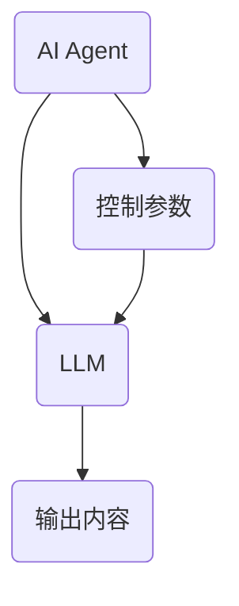
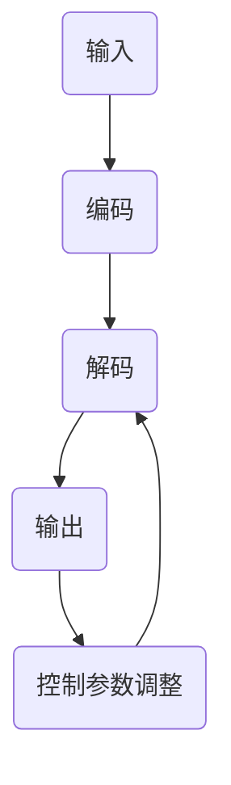
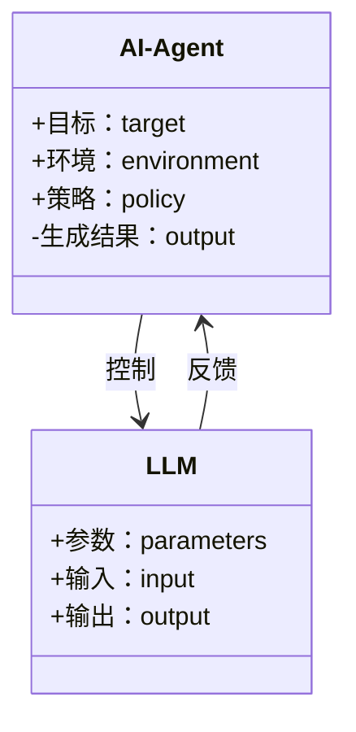

                 


```markdown
# AI Agent 的可控生成：精确控制 LLM 的输出

> 关键词：AI Agent, 可控生成, LLM, 大语言模型, 输出控制

> 摘要：本文深入探讨了AI Agent如何精确控制大语言模型（LLM）的输出，从理论基础到实际应用，系统性地分析了可控生成的关键技术与实现方案。文章首先介绍了AI Agent与LLM的基本概念及其相互关系，随后详细讲解了可控生成的算法原理、系统架构设计、项目实战及最佳实践，为读者提供了全面而深入的技术指导。

---

## 第一部分: AI Agent 的可控生成基础

### 第1章: 问题背景与核心概念

#### 1.1 问题背景

##### 1.1.1 大语言模型（LLM）的崛起

近年来，大语言模型（LLM）如GPT-3、GPT-4等的快速发展，为自然语言处理领域带来了革命性的变化。这些模型具备强大的生成能力，能够完成多种复杂的语言任务，如文本生成、对话交互、内容创作等。然而，随着生成能力的增强，如何精确控制LLM的输出成为一个亟待解决的问题。

##### 1.1.2 LLM 输出失控的挑战

尽管LLM展现了强大的生成能力，但其输出往往难以完全符合特定场景下的需求。例如，在企业应用中，生成的内容可能违反公司政策，或包含敏感信息；在用户交互中，生成的回复可能不符合用户的期望或语境。这些问题凸显了对LLM输出进行精确控制的必要性。

##### 1.1.3 AI Agent 在输出控制中的作用

AI Agent作为一种具备目标导向的智能体，能够通过分析上下文、用户需求和环境信息，动态调整LLM的生成策略。AI Agent的引入使得LLM的输出不仅具备生成能力，还能够根据具体场景进行定制化控制。

#### 1.2 核心概念

##### 1.2.1 AI Agent 的定义与特征

- **定义**：AI Agent是一种具备感知、决策和执行能力的智能实体，能够在特定环境中完成目标任务。
- **特征**：
  - 目标导向性：AI Agent的行为旨在实现特定目标。
  - 环境适应性：能够根据环境变化调整策略。
  - 学习能力：通过经验优化自身行为。

##### 1.2.2 可控生成的定义与目标

- **定义**：可控生成是指通过特定的控制机制，使得生成的内容符合预设的规则、风格或语义要求。
- **目标**：
  - 确保生成内容的准确性。
  - 适应不同场景的需求。
  - 提高生成结果的可解释性。

##### 1.2.3 LLM 输出控制的边界与外延

- **边界**：LLM输出控制的边界在于生成内容的语义和风格，而不涉及生成内容的原始信息。
- **外延**：控制机制可以扩展到多模态生成、实时交互等领域。

#### 1.3 问题描述与解决方案

##### 1.3.1 LLM 输出失控的典型问题

- **语义偏离**：生成内容与预期语义不符。
- **风格不合适**：生成文本的语气、风格不符合目标场景。
- **安全风险**：生成内容可能包含敏感信息或不当言论。

##### 1.3.2 可控生成的必要性

- 确保生成内容的安全性和合规性。
- 提高生成内容的实用性和用户体验。
- 适应不同场景的多样化需求。

##### 1.3.3 解决方案概述

通过引入AI Agent作为控制主体，结合LLM的生成能力，构建一个多维度的控制机制，从输入、生成、输出三个环节对LLM的生成过程进行干预和调整。

---

### 第2章: 核心概念与联系

#### 2.1 AI Agent 与 LLM 的关系

##### 2.1.1 AI Agent 对 LLM 的控制方式

AI Agent通过以下方式对LLM进行控制：

1. **输入干预**：调整输入内容，影响生成结果。
2. **参数调节**：动态调整LLM的生成参数，如温度、重复率等。
3. **后处理过滤**：对生成内容进行实时过滤和修正。

##### 2.1.2 LLM 作为 AI Agent 的能力基础

LLM为AI Agent提供了强大的自然语言处理能力，使其能够理解和生成人类语言，从而实现与用户的自然交互。

##### 2.1.3 两者协同工作的机制

AI Agent与LLM的协同机制如下：

1. AI Agent接收用户的输入或感知环境信息。
2. 分析需求，确定生成目标。
3. 调整LLM的生成参数或输入内容。
4. 监控生成过程，实时修正内容。
5. 输出最终结果并反馈给用户或系统。

#### 2.2 核心概念对比表

| **对比维度** | **AI Agent** | **传统程序** |
|--------------|--------------|--------------|
| 智能性       | 高           | 低           |
| 适应性       | 强           | 弱           |
| 学习能力     | 具备         | 无           |

#### 2.3 实体关系图



---

### 第3章: 可控生成的算法原理

#### 3.1 算法原理概述

##### 3.1.1 基于概率的生成模型

LLM基于概率模型生成文本，其核心是计算每个词的条件概率，公式如下：

$$ P(y|x) = \prod_{i=1}^{n} P(y_i|y_{<i},x) $$

##### 3.1.2 解码过程中的控制机制

AI Agent通过调整解码过程中的参数，如温度（temperature）、重复率（repetition penalty），来影响生成内容的多样性和相关性。

##### 3.1.3 多目标优化的实现思路

AI Agent需要在多个目标之间进行权衡，例如生成内容的准确性和相关性。通过构建多目标损失函数，实现生成结果的优化。

#### 3.2 算法流程图



#### 3.3 核心算法实现

##### 3.3.1 概率模型的数学表达

$$ P(y|x) = \prod_{i=1}^{n} P(y_i|y_{<i},x) $$

##### 3.3.2 解码过程的优化策略

通过动态调整解码过程中的温度参数，控制生成内容的多样性和相关性。

##### 3.3.3 多目标优化的权重分配

在多目标优化中，AI Agent根据具体场景，动态调整各目标的权重，例如：

$$ \text{loss} = \alpha \cdot \text{accuracy\_loss} + \beta \cdot \text{diversity\_loss} $$

---

### 第4章: 系统分析与架构设计

#### 4.1 问题场景介绍

##### 4.1.1 典型应用场景

- **企业级应用**：确保生成内容符合公司政策。
- **用户交互**：提供个性化且符合预期的对话体验。
- **内容创作**：生成符合特定风格和主题的内容。

##### 4.1.2 系统目标与约束

- **目标**：实现对LLM输出的精确控制。
- **约束**：生成内容需满足语义、风格和安全性的要求。

##### 4.1.3 关键技术选型

- **AI Agent实现**：基于强化学习或监督学习。
- **LLM选型**：根据具体需求选择合适的模型。
- **控制机制**：结合输入干预、参数调节和后处理过滤。

#### 4.2 系统功能设计

##### 4.2.1 领域模型设计



##### 4.2.2 系统架构设计


##### 4.2.3 接口和交互

AI Agent与LLM之间的交互流程如下：

1. AI Agent接收用户的输入或感知环境信息。
2. 分析需求，确定生成目标。
3. 调整LLM的生成参数或输入内容。
4. 监控生成过程，实时修正内容。
5. 输出最终结果并反馈给用户或系统。

---

### 第5章: 项目实战

#### 5.1 环境安装

- **工具安装**：安装Python、TensorFlow、Hugging Face库等。
- **LLM 模型选择**：选择合适的LLM模型，如GPT-2、GPT-3等。

#### 5.2 核心代码实现

##### 5.2.1 AI Agent实现代码

```python
class AI-Agent:
    def __init__(self):
        self.model = LLM()
        self.target = None
        self.environment = None

    def generate(self, input, target):
        self.target = target
        self.environment = environment
        output = self.model.generate(input)
        return self.control(output)

    def control(self, output):
        # 实现控制逻辑
        pass
```

##### 5.2.2 LLM生成代码

```python
class LLM:
    def __init__(self):
        self.parameters = {}

    def generate(self, input):
        # 实现生成逻辑
        return output
```

##### 5.2.3 实际案例分析

以企业级应用为例，AI Agent可以根据公司政策，实时调整LLM的生成参数，确保生成内容符合公司风格和合规要求。

#### 5.3 项目小结

通过实际项目的实现，验证了AI Agent对LLM输出控制的有效性，同时也发现了需要进一步优化的地方，例如控制策略的动态调整能力。

---

### 第6章: 最佳实践

#### 6.1 经验总结

- **控制策略的动态调整**：根据具体场景，动态调整控制参数。
- **模型的持续优化**：定期更新LLM模型和控制策略，以适应新的需求。

#### 6.2 注意事项

- **安全风险**：确保生成内容的安全性。
- **用户体验**：保持生成内容的连贯性和可读性。
- **性能优化**：优化AI Agent和LLM的运行效率。

#### 6.3 拓展阅读

- **相关书籍**：《Deep Learning》、《Pattern Recognition and Machine Learning》。
- **论文推荐**：关注最新的可控生成技术研究。

---

## 作者：AI天才研究院/AI Genius Institute & 禅与计算机程序设计艺术 /Zen And The Art of Computer Programming

---

**感谢您的阅读！** 如果您对本文内容有任何疑问或建议，请随时与我们联系。
```

