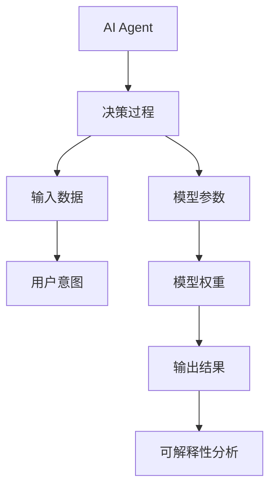
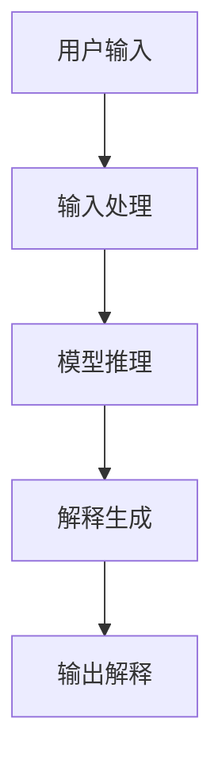

                 


# AI Agent 的可解释性：深入理解 LLM 的决策过程

> **关键词**：AI Agent, 可解释性, LLM, 决策过程, 大语言模型  
> **摘要**：本文将深入探讨AI Agent的可解释性问题，重点分析大语言模型（LLM）的决策过程，帮助读者理解如何提高LLM的可解释性，从而增强用户对AI系统的信任。

---

## 第1章: AI Agent 与可解释性概述

### 1.1 AI Agent 的基本概念
#### 1.1.1 什么是AI Agent
AI Agent（人工智能代理）是指能够感知环境并采取行动以实现目标的智能实体。它可以是一个软件程序、机器人或其他智能系统，能够自主决策并执行任务。

#### 1.1.2 AI Agent 的主要类型
AI Agent可以分为以下几类：
- **简单反射型代理**：基于简单的规则进行反应，如自动回复邮件。
- **基于模型的反射型代理**：使用内部模型来理解和预测环境，如自动驾驶汽车。
- **目标驱动型代理**：根据目标采取行动，如智能助手。
- **效用驱动型代理**：通过最大化效用函数来优化决策，如经济预测模型。

#### 1.1.3 可解释性的重要性
可解释性是指AI系统的行为能够被人类理解和解释。对于AI Agent来说，可解释性至关重要，因为它关系到系统的透明度、用户信任以及合规性。

---

### 1.2 LLM 的决策过程
#### 1.2.1 大语言模型的定义
大语言模型（LLM）是指基于大量数据训练的大型神经网络模型，如GPT系列、BERT系列等。这些模型能够生成自然语言文本，并在各种任务中表现出强大的能力。

#### 1.2.2 LLM 决策过程的特点
LLM的决策过程具有以下特点：
- **概率性**：模型基于概率分布生成输出，而非确定性决策。
- **黑箱性**：复杂的神经网络结构使得决策过程难以直接观察。
- **上下文依赖性**：模型的输出依赖于输入的上下文信息。

#### 1.2.3 可解释性在LLM中的挑战
- **复杂性**：模型参数众多，决策过程难以分解。
- **缺乏直观解释**：模型的内部机制难以用人类易懂的方式解释。
- **依赖训练数据**：模型的输出受到训练数据的影响，可能存在偏见。

---

### 1.3 可解释性在AI中的意义
#### 1.3.1 可解释性与信任的关系
可解释性是用户信任AI系统的基础。当用户能够理解AI的决策过程时，他们更愿意依赖和使用该系统。

#### 1.3.2 可解释性在实际应用中的价值
- **提升用户体验**：用户能够理解AI的决策过程，从而更愿意使用相关服务。
- **优化系统性能**：通过分析模型的决策过程，可以发现和修复模型的缺陷。
- **合规性与伦理审查**：许多行业和领域需要符合特定的法规和伦理标准，可解释性是合规的重要条件。

#### 1.3.3 可解释性与法规 compliance 的关系
随着AI技术的广泛应用，越来越多的法规要求AI系统具备可解释性。例如，在医疗、金融等领域，AI系统的决策需要符合监管要求，可解释性是关键因素。

---

## 第2章: 可解释性核心概念与联系

### 2.1 可解释性核心概念原理
#### 2.1.1 透明度的定义与实现
透明度是指AI系统的行为和决策过程对用户来说是清晰和可理解的。实现透明度需要通过可视化、日志记录等方式展示系统的工作原理。

#### 2.1.2 可解释性模型的关键属性
可解释性模型应具备以下关键属性：
- **可理解性**：模型的决策过程能够被人类理解。
- **可追溯性**：能够追踪模型的决策路径。
- **可验证性**：模型的决策过程可以被验证和测试。

#### 2.1.3 可解释性与模型复杂度的关系
模型的复杂度越高，通常可解释性越低。因此，在设计AI系统时需要在模型复杂度和可解释性之间进行权衡。

---

### 2.2 核心概念对比表格
以下表格对比了可解释性相关的核心概念：

| 概念       | 特性                               | 适用场景               | 示例                     |
|------------|------------------------------------|------------------------|--------------------------|
| 透明度     | 显示决策过程                       | 调试与优化             | 显示LLM生成输出的中间步骤 |
| 可解释性   | 明确性与逻辑性                     | 用户信任               | 解释LLM的推理路径       |
| 可理解性   | 易于用户理解                       | 教育与医疗             | 用简单语言解释复杂决策   |

---

### 2.3 ER实体关系图
以下是一个简单的ER图，展示了AI Agent的决策过程：



---

## 第3章: LLM 的决策机制分析

### 3.1 LLM 内部机制
#### 3.1.1 注意力机制的原理
注意力机制（Attention Mechanism）是LLM的重要组成部分，它允许模型关注输入中的重要部分。例如，在自然语言处理中，模型会根据上下文决定哪些词更重要。

#### 3.1.2 解码器的结构与作用
解码器（Decoder）是生成模型的重要部分，负责根据输入生成输出。例如，在文本生成任务中，解码器会逐步生成每个词。

#### 3.1.3 概率推理的过程
LLM通过概率推理生成输出，每个词的生成概率由模型的参数决定。例如，模型会计算每个可能词的概率，并选择概率最高的词作为输出。

---

### 3.2 LLM 决策过程的可视化
#### 3.2.1 生成式模型的注意力分布
通过可视化注意力分布，可以观察到模型在生成输出时关注了哪些输入部分。例如，在翻译任务中，模型可能关注输入句子中的某些关键词。

#### 3.2.2 解码器输出的路径分析
通过分析解码器的输出路径，可以了解模型生成每个词的具体过程。例如，模型可能首先生成主语，然后生成谓语。

#### 3.2.3 决策树的构建与分析
决策树是一种常用的可视化工具，可以展示模型的决策过程。例如，模型可能根据输入的关键词选择生成不同的句子。

---

### 3.3 决策过程的可解释性方法
#### 3.3.1 基于概率的解释方法
通过分析模型生成每个词的概率，可以理解模型的决策过程。例如，模型可能生成“天气好”这个词的概率较高，说明它认为天气好是一个重要的因素。

#### 3.3.2 基于梯度的解释方法
梯度解释方法通过计算模型输出对输入的敏感性，来理解模型的决策过程。例如，模型可能对某些关键词的敏感性较高，说明这些关键词对模型的决策有重要影响。

#### 3.3.3 基于规则的解释方法
基于规则的解释方法通过提取模型生成的规则，来理解模型的决策过程。例如，模型可能根据某些规则生成特定的输出。

---

## 第4章: 可解释性算法原理

### 4.1 可解释性方法的分类
#### 4.1.1 局部可解释性方法
局部可解释性方法专注于解释模型在特定输入下的行为。例如，LIME（Local Interpretable Model-agnostic Explanations）是一种常用的局部可解释性方法。

#### 4.1.2 全局可解释性方法
全局可解释性方法专注于解释模型的整体行为。例如，SHAP（SHapley Additive exPlanations）是一种常用的全局可解释性方法。

#### 4.1.3 混合可解释性方法
混合可解释性方法结合了局部和全局可解释性方法，旨在提供更全面的解释。例如，可以通过LIME和SHAP结合使用，来理解模型在不同输入下的行为。

---

### 4.2 LIME 算法原理
#### 4.2.1 LIME 的基本原理
LIME通过在输入数据附近生成扰动数据，并计算模型在这些数据上的预测结果，来解释模型的决策过程。

#### 4.2.2 LIME 的实现步骤
1. 选择一个输入数据点。
2. 生成扰动数据。
3. 计算模型在扰动数据上的预测结果。
4. 使用线性回归模型拟合扰动数据和预测结果。
5. 提取线性回归模型的系数，解释模型的决策过程。

#### 4.2.3 LIME 的优缺点
- **优点**：简单易懂，适用于多种模型。
- **缺点**：仅适用于局部解释，无法解释全局行为。

---

### 4.3 SHAP 值的计算与解释
#### 4.3.1 SHAP 值的定义
SHAP值是一种用于解释模型输出的指标，它衡量了每个特征对模型预测结果的贡献程度。

#### 4.3.2 SHAP 值的计算公式
$$ SHAP = \sum_{j} \phi_j = f(x) - \mathbb{E}[f] $$

其中，$\phi_j$ 是特征$j$的SHAP值，$f(x)$是模型在输入$x$处的预测结果，$\mathbb{E}[f]$是模型在整体数据上的期望预测值。

#### 4.3.3 SHAP 值的可视化
通过SHAP值的可视化，可以直观地理解每个特征对模型预测结果的影响。例如，在信用评分模型中，某些特征可能对评分结果有较大的影响。

---

## 第5章: 项目实战与总结

### 5.1 项目介绍
本项目旨在通过分析LLM的决策过程，提高模型的可解释性。我们将通过实际案例分析，探讨如何在实际应用中实现模型的可解释性。

---

### 5.2 系统分析与架构设计

#### 5.2.1 系统功能设计
- **输入处理**：接收用户输入并解析。
- **模型推理**：调用LLM进行推理。
- **解释生成**：根据模型的推理过程生成解释。

#### 5.2.2 系统架构设计


---

### 5.3 系统实现
#### 5.3.1 环境安装
- Python 3.8+
- LLM模型（如GPT）
- 可解释性工具（如LIME、SHAP）

#### 5.3.2 核心代码实现
```python
import lime
import shap

def explain_model(model, input_data):
    explainer = lime.lime_explanation.LimeExplainer()
    explanation = explainer.explain(model, input_data)
    return explanation
```

#### 5.3.3 代码应用解读与分析
- **输入处理**：解析用户输入并生成模型输入格式。
- **模型推理**：调用LLM生成输出。
- **解释生成**：使用LIME或SHAP解释模型的推理过程。

---

### 5.4 实际案例分析
#### 5.4.1 案例背景
假设我们有一个用于客户服务的AI Agent，需要解释模型的决策过程。

#### 5.4.2 案例分析
- **输入**：用户询问“如何处理退款问题？”
- **模型推理**：模型生成多个可能的回复，并选择最合适的回复。
- **解释**：通过LIME分析，模型选择了“退款流程”相关的关键词。

---

### 5.5 总结与展望
#### 5.5.1 本章小结
通过实际案例分析，我们展示了如何在实际应用中实现模型的可解释性。可解释性是提高用户信任和系统性能的关键因素。

#### 5.5.2 未来展望
未来，随着AI技术的不断发展，可解释性将成为AI系统设计的重要部分。我们需要进一步研究和优化可解释性方法，以应对更复杂的挑战。

---

## 作者：AI天才研究院/AI Genius Institute & 禅与计算机程序设计艺术 /Zen And The Art of Computer Programming

