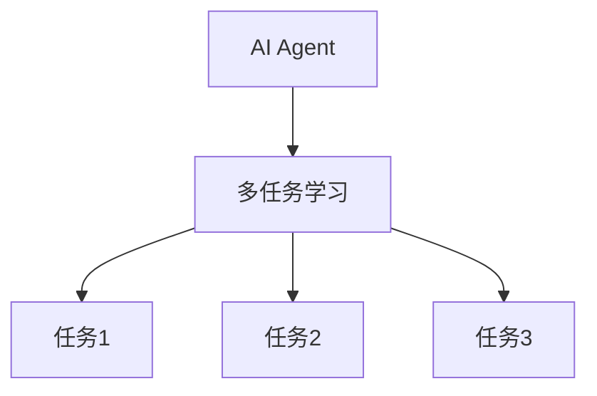
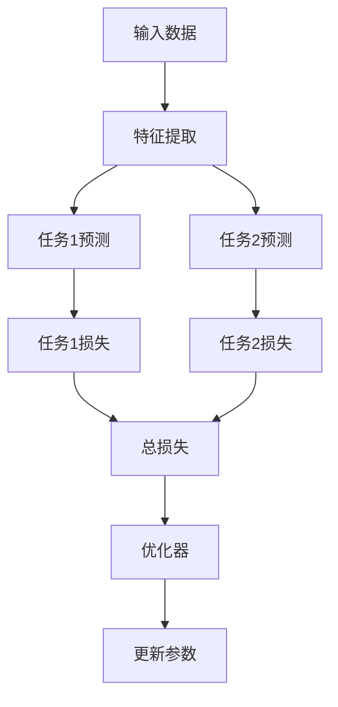
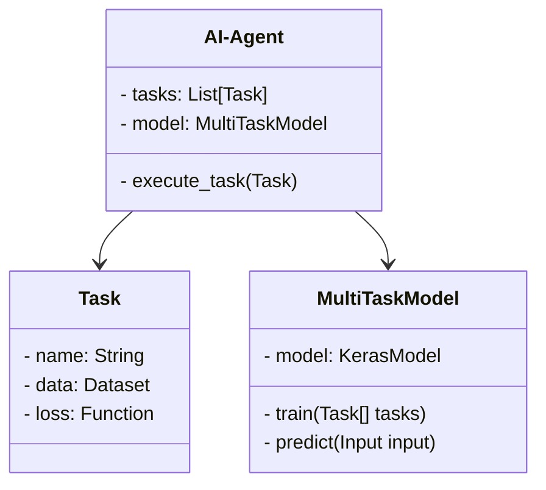
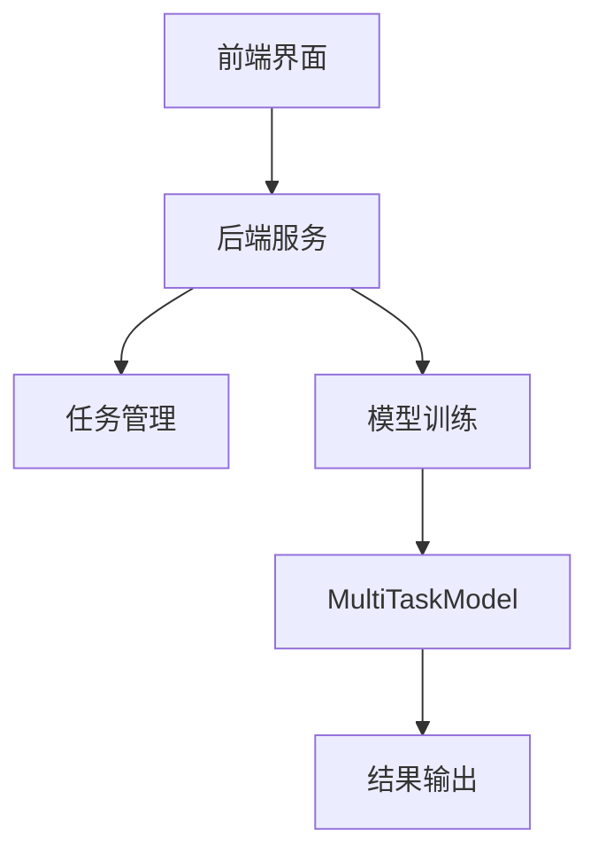

                 


# AI Agent 的多任务学习：增强 LLM 的泛化能力

## 关键词：AI Agent，多任务学习，LLM，泛化能力，自然语言处理，机器学习，算法设计

## 摘要：本文探讨了AI Agent如何通过多任务学习来提升大语言模型的泛化能力。文章从AI Agent的基本概念、多任务学习的原理到算法实现，再到系统设计和项目实战，详细介绍了多任务学习在增强LLM泛化能力中的应用。通过具体的技术手段和实例分析，本文为读者提供了从理论到实践的全面指导。

---

## 第1章 AI Agent 的基本概念与多任务学习概述

### 1.1 AI Agent 的定义与核心特征

AI Agent（人工智能代理）是一种能够感知环境、自主决策并执行任务的智能实体。其核心特征包括：

- **自主性**：能够自主决策和行动，无需外部干预。
- **反应性**：能够实时感知环境变化并做出反应。
- **目标导向**：基于目标驱动行动，优化决策过程。
- **学习能力**：通过经验或数据不断优化自身的性能。

AI Agent广泛应用于自动驾驶、智能助手、机器人等领域，其目标是通过智能化手段提高任务执行的效率和准确性。

### 1.2 多任务学习的定义与特点

多任务学习（Multi-Task Learning, MTL）是一种机器学习范式，旨在同时学习多个相关任务，以共享知识和提升整体性能。其特点包括：

- **知识共享**：通过共享参数或特征，提升不同任务之间的学习效率。
- **任务相关性**：任务之间存在某种关联性，可以共享某些特征或参数。
- **联合优化**：通过同时优化多个任务的损失函数，提升模型的泛化能力。

### 1.3 AI Agent 与多任务学习的关系

AI Agent 的任务通常涉及多个子任务，例如感知、决策、规划等，这些子任务可以通过多任务学习框架进行优化。通过多任务学习，AI Agent能够更高效地共享知识，提升整体任务执行的性能。

**对比表格：**

| 特性               | 单任务学习          | 多任务学习          |
|--------------------|---------------------|---------------------|
| 任务数量           | 单个任务           | 多个任务           |
| 知识共享           | 无或有限           | 高度共享           |
| 训练效率           | 较低               | 较高               |
| 模型泛化能力       | 较低               | 较高               |

**Mermaid图：**



---

## 第2章 多任务学习的核心概念与原理

### 2.1 多任务学习的核心概念

多任务学习的核心概念包括任务之间的关系、共享特征和任务独立性。任务之间的关系可以通过参数共享、任务权重分配等方式进行建模。

### 2.2 多任务学习的原理

多任务学习的实现依赖于参数共享机制、任务权重分配和跨任务梯度平衡。参数共享机制允许不同任务共享部分参数，从而提升学习效率和模型性能。

**Mermaid流程图：**



### 2.3 多任务学习的数学模型

多任务学习的数学模型通常包括损失函数的组合和参数共享机制。例如，总损失函数可以表示为多个任务损失函数的加权和。

**数学公式：**

总损失函数：
$$ L = \sum_{i=1}^{n} \lambda_i L_i $$
其中，$\lambda_i$是任务i的权重，$L_i$是任务i的损失函数。

参数共享机制：
$$ \theta = (\theta_1, \theta_2, ..., \theta_n) $$
其中，$\theta_i$是任务i的参数，$\theta$是所有任务共享的参数。

---

## 第3章 多任务学习的算法原理与实现

### 3.1 多任务学习的算法框架

多任务学习的算法框架包括基于参数共享的多任务学习、基于任务权重分配的多任务学习和基于梯度平衡的多任务学习。每种方法都有其优缺点。

### 3.2 多任务学习的实现步骤

实现多任务学习的步骤包括数据预处理、模型构建、模型训练和模型评估。

**Python代码示例：**

```python
import tensorflow as tf
from tensorflow.keras import layers

# 定义多任务模型
def multi_task_model(input_shape):
    inputs = layers.Input(shape=input_shape)
    x = layers.Dense(64, activation='relu')(inputs)
    task1_output = layers.Dense(1, name='task1_output')(x)
    task2_output = layers.Dense(1, name='task2_output')(x)
    model = tf.keras.Model(inputs=inputs, outputs=[task1_output, task2_output])
    return model

# 编译模型
model = multi_task_model((input_dim,))
model.compile(optimizer='adam', loss={'task1_output': 'mse', 'task2_output': 'mse'}, loss_weights=[1.0, 1.0])
```

### 3.3 多任务学习在LLM中的应用

多任务学习可以通过增强模型的泛化能力，提升LLM在多个任务中的表现。例如，模型可以在文本生成、问答系统和文本分类等多个任务上进行训练，从而提升整体性能。

---

## 第4章 增强 LLM 的泛化能力

### 4.1 LLM 的泛化能力问题

LLM的泛化能力不足主要表现在对特定领域或小样本数据的处理上。通过多任务学习，可以有效提升模型在这些方面的表现。

### 4.2 多任务学习对 LLM 泛化能力的增强

多任务学习通过共享知识和优化多个任务，提升了LLM的泛化能力。具体表现为模型能够更好地适应不同任务和数据分布。

### 4.3 多任务学习在 LLM 中的具体应用

多任务学习在LLM中的具体应用包括跨任务知识共享、任务权重分配和梯度平衡。这些方法可以有效提升模型的泛化能力。

---

## 第5章 系统分析与架构设计

### 5.1 问题场景介绍

在实际应用中，AI Agent需要处理多个相关任务，例如对话生成、意图识别和情感分析。通过多任务学习，可以提升这些任务的整体性能。

### 5.2 系统功能设计

系统功能设计包括任务管理、模型训练和结果输出。任务管理负责协调不同任务的执行，模型训练负责优化多任务模型，结果输出负责生成最终的输出结果。

**Mermaid类图：**



### 5.3 系统架构设计

系统架构设计包括前端界面、后端服务和模型训练模块。前端界面负责用户交互，后端服务负责任务处理，模型训练模块负责模型优化。

**Mermaid架构图：**



---

## 第6章 项目实战

### 6.1 环境安装与配置

安装必要的库和工具，例如Python、TensorFlow、Keras等。

### 6.2 核心代码实现

实现多任务学习的核心代码，包括任务管理、模型训练和结果输出。

### 6.3 案例分析

通过具体案例分析，展示多任务学习在提升LLM泛化能力中的实际应用。

---

## 第7章 总结与展望

### 7.1 总结

本文详细介绍了AI Agent如何通过多任务学习增强LLM的泛化能力。通过理论分析和实践案例，展示了多任务学习在提升模型性能中的重要作用。

### 7.2 展望

未来，随着技术的发展，多任务学习在AI Agent中的应用将更加广泛。可以通过进一步优化算法和探索新的任务组合，进一步提升模型的泛化能力。

---

## 作者：AI天才研究院 & 禅与计算机程序设计艺术

---

以上是文章的完整内容，涵盖从理论到实践的各个方面，帮助读者全面理解AI Agent的多任务学习及其在增强LLM泛化能力中的应用。

