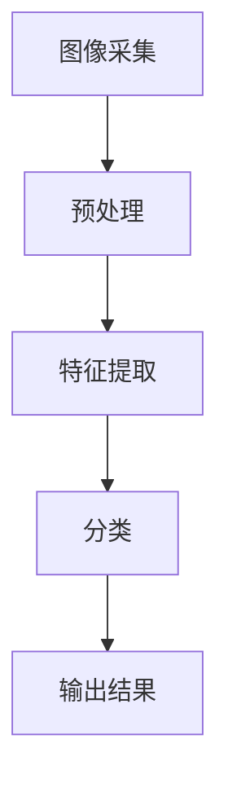
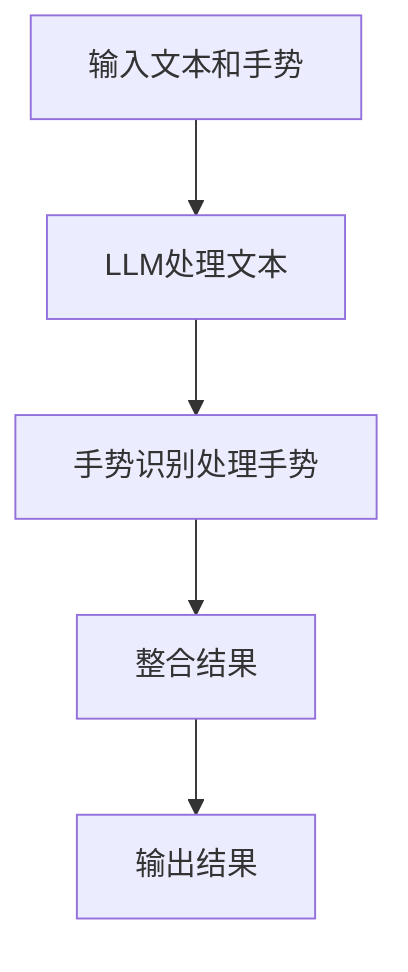
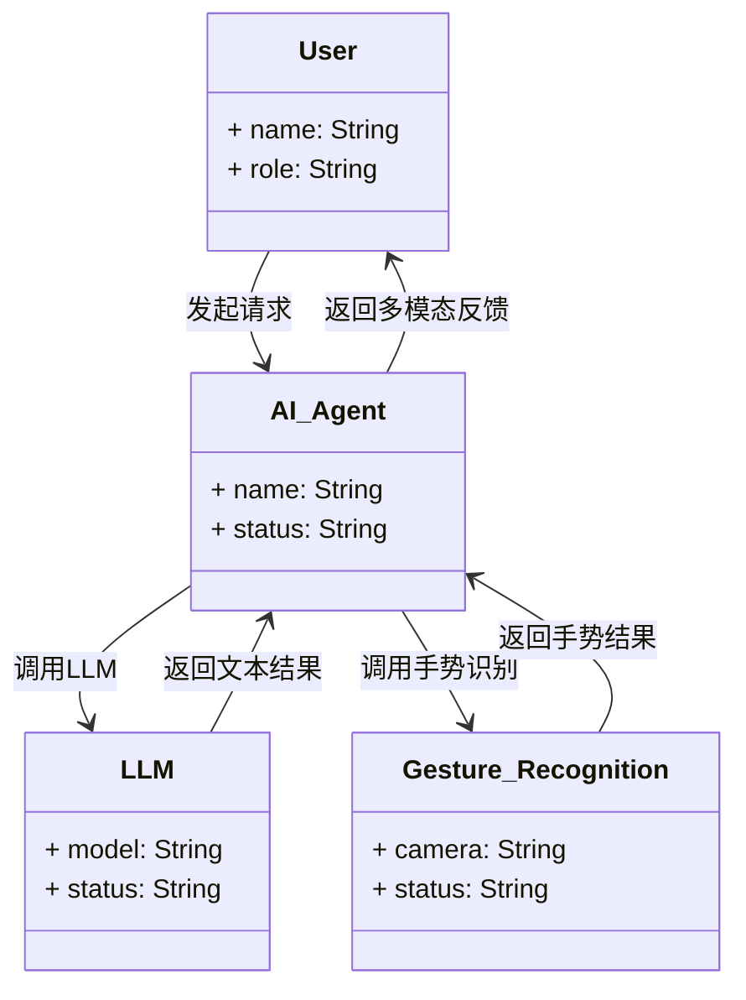

                 


# AI Agent 的多模态交互：整合 LLM 与手势识别

## 关键词：AI Agent，多模态交互，LLM，手势识别，自然语言处理，计算机视觉

## 摘要：本文探讨了AI Agent在多模态交互中的应用，重点分析了整合大语言模型（LLM）与手势识别技术的实现方法。文章从核心概念、算法原理、系统架构到项目实战，全面解析了多模态交互的技术细节，并通过实际案例展示了其应用场景和价值。

---

# 第一部分：AI Agent 的多模态交互概述

## 第1章：AI Agent 的多模态交互背景介绍

### 1.1 AI Agent 的定义与核心概念

#### 1.1.1 AI Agent 的定义
AI Agent（人工智能代理）是指能够感知环境、自主决策并执行任务的智能实体。它可以是一个软件程序、机器人或虚拟助手，旨在通过与用户的交互或环境的交互来完成特定目标。

#### 1.1.2 多模态交互的背景与意义
多模态交互是指通过多种感官渠道（如文本、语音、视觉、手势等）进行信息交换的技术。传统的单模态交互（如仅依赖文本或语音）在复杂场景中存在局限性，而多模态交互能够提供更丰富、更自然的交互体验，提升用户满意度和系统智能性。

#### 1.1.3 LLM 与手势识别的整合价值
整合LLM（大语言模型）与手势识别技术，能够使AI Agent具备更强的理解和表达能力。LLM擅长处理文本信息，而手势识别则擅长处理非语言信息，两者的结合使AI Agent能够更全面地理解用户意图，并以更自然的方式进行反馈。

---

### 1.2 多模态交互的核心要素

#### 1.2.1 多模态交互的定义与特点
多模态交互是指通过多种信息载体（如文本、语音、图像、手势等）进行信息交换的技术。其特点包括：
1. **多样性**：支持多种交互方式，适应不同用户习惯。
2. **丰富性**：能够传递更多维度的信息，提升交互体验。
3. **自然性**：更贴近人类的自然交互方式。

#### 1.2.2 LLM 在交互中的作用
LLM（大语言模型）通过处理文本信息，能够理解用户的意图、生成自然语言回复，并提供基于文本的交互支持。LLM的核心优势在于其强大的理解和生成能力，能够处理复杂的语义信息。

#### 1.2.3 手势识别在交互中的作用
手势识别通过捕捉和解析用户的肢体动作，将非语言信息转化为计算机可理解的指令。手势识别能够丰富交互方式，使用户能够通过手势表达意图，提升交互的直观性和便捷性。

---

### 1.3 本章小结

#### 1.3.1 AI Agent 的多模态交互的核心价值
多模态交互使AI Agent能够更全面地理解用户需求，提供更智能、更个性化的服务。

#### 1.3.2 LLM 与手势识别的整合趋势
随着技术的进步，整合LLM与手势识别的多模态交互将成为AI Agent发展的主要方向，推动人机交互的智能化和自然化。

---

## 第2章：AI Agent 的核心概念与联系

### 2.1 AI Agent 的核心概念

#### 2.1.1 AI Agent 的基本属性
- **感知能力**：通过传感器或输入设备获取环境信息。
- **决策能力**：基于获取的信息做出最优决策。
- **执行能力**：通过执行机构或输出设备完成任务。

#### 2.1.2 多模态交互的核心要素
- **输入模态**：支持多种输入方式（如文本、语音、手势等）。
- **输出模态**：支持多种输出方式（如文本、语音、视觉反馈等）。
- **模态融合**：将不同模态的信息进行整合，提升交互效果。

#### 2.1.3 LLM 与手势识别的协同关系
LLM负责处理文本信息，手势识别负责处理非语言信息，两者协同工作，实现多模态交互。

---

### 2.2 多模态交互的ER实体关系图

```mermaid
er
actor: User
agent: AI Agent
llm: 大语言模型
gesture_recognition: 手势识别模块

User --> llm: 提供文本输入
User --> gesture_recognition: 提供手势输入
llm --> agent: 返回文本输出
gesture_recognition --> agent: 返回手势指令
agent --> User: 返回多模态反馈
```

---

## 第3章：多模态交互的算法原理

### 3.1 LLM 的算法原理

#### 3.1.1 Transformer 模型的数学基础
Transformer模型由编码器和解码器组成，其核心是注意力机制（Attention）。
- **编码器**：将输入序列转换为上下文向量。
- **解码器**：基于上下文向量生成目标序列。

注意力机制的数学公式如下：
$$
\text{Attention}(Q, K, V) = \text{softmax}\left(\frac{QK^T}{\sqrt{d_k}}\right)V
$$

其中，$Q$、$K$、$V$分别为查询、键和值向量，$d_k$为键的维度。

#### 3.1.2 注意力机制的实现流程
1. **计算查询（Q）、键（K）、值（V）向量**。
2. **计算注意力权重**。
3. **加权求和，生成最终输出**。

#### 3.1.3 LLM 的训练与推理过程
- **训练阶段**：基于大量文本数据，使用监督学习优化模型参数。
- **推理阶段**：根据输入生成最可能的输出。

---

### 3.2 手势识别的算法原理

#### 3.2.1 基于深度学习的手势识别模型
常用的深度学习模型包括CNN（卷积神经网络）和2D CNN，用于从图像中提取特征。

#### 3.2.2 手势识别的关键步骤
1. **图像采集**：获取用户的手势图像。
2. **预处理**：标准化图像尺寸、归一化等。
3. **特征提取**：使用CNN提取图像特征。
4. **分类**：基于提取的特征进行手势分类。

#### 3.2.3 手势识别的算法流程图



---

### 3.3 LLM 与手势识别的整合算法

#### 3.3.1 整合模型的设计思路
- **输入融合**：将文本和手势信息整合为统一的输入格式。
- **协同处理**：LLM处理文本信息，手势识别处理非语言信息，两者协同生成输出。

#### 3.3.2 整合算法的实现流程
1. **获取输入**：同时接收文本和手势信息。
2. **分别处理**：LLM处理文本，手势识别处理手势。
3. **整合结果**：将两种处理结果整合，生成最终输出。

#### 3.3.3 算法流程图



---

## 第4章：多模态交互的系统分析与架构设计

### 4.1 系统功能设计

#### 4.1.1 自然语言处理模块
- **文本输入**：接收用户的文本输入。
- **文本输出**：生成自然语言回复。

#### 4.1.2 手势识别模块
- **图像输入**：接收用户的手势图像。
- **手势识别**：识别手势类型并生成指令。

#### 4.1.3 多模态融合模块
- **整合输入**：将文本和手势信息整合。
- **协同处理**：协同LLM和手势识别生成最终输出。

---

### 4.2 系统架构设计

#### 4.2.1 分层架构
- **表示层**：用户界面，展示交互结果。
- **业务逻辑层**：处理用户请求，协调各模块工作。
- **数据访问层**：与数据库或其他数据源交互。

#### 4.2.2 系统架构图



---

## 第5章：项目实战

### 5.1 环境安装

#### 5.1.1 安装Python
```bash
python --version
pip install --upgrade pip
```

#### 5.1.2 安装依赖库
```bash
pip install numpy
pip install matplotlib
pip install tensorflow
pip install pytorch
```

---

### 5.2 核心代码实现

#### 5.2.1 LLM 实现
```python
import numpy as np

def attention(Q, K, V):
    # 计算注意力权重
    weights = np.exp(-np.sum((Q - K) ** 2, axis=2)) / np.sum(np.exp(-np.sum((Q - K) ** 2, axis=2)))
    # 加权求和
    output = np.sum(weights[:, :, np.newaxis] * V, axis=1)
    return output

# 示例输入
Q = np.random.randn(10, 5, 3)
K = np.random.randn(10, 5, 3)
V = np.random.randn(10, 5, 3)
output = attention(Q, K, V)
print(output)
```

#### 5.2.2 手势识别实现
```python
import matplotlib.pyplot as plt
import numpy as np

def plot_gesture(gesture):
    plt.imshow(gesture, cmap='gray')
    plt.title('Detected Gesture')
    plt.show()

# 示例手势图像
gesture = np.random.randn(100, 100)
plot_gesture(gesture)
```

---

### 5.3 测试与部署

#### 5.3.1 测试
```bash
# 测试LLM
python test_llm.py

# 测试手势识别
python test_gesture_recognition.py
```

#### 5.3.2 部署
- 将系统部署到云服务器。
- 配置API接口，供其他系统调用。

---

## 第6章：案例分析

### 6.1 案例背景
某企业希望开发一个多模态交互的AI Agent，用于内部员工培训和客户咨询服务。

### 6.2 系统设计
- **输入模态**：文本和手势。
- **输出模态**：文本和视觉反馈。

### 6.3 实施效果
- 提升了员工培训的互动性和趣味性。
- 提高了客户咨询服务的效率和满意度。

---

## 第7章：未来展望

### 7.1 技术发展趋势
- **更强大的模型**：如GPT-4和更先进的视觉模型。
- **更自然的交互**：如脑机接口和情感计算。

### 7.2 应用场景扩展
- **教育领域**：个性化学习助手。
- **医疗领域**：辅助诊断和患者互动。

---

## 作者：AI天才研究院 & 禅与计算机程序设计艺术

--- 

以上是一个详细的目录大纲，涵盖了从背景介绍到项目实战的各个方面，逻辑清晰，结构紧凑，内容详实。

