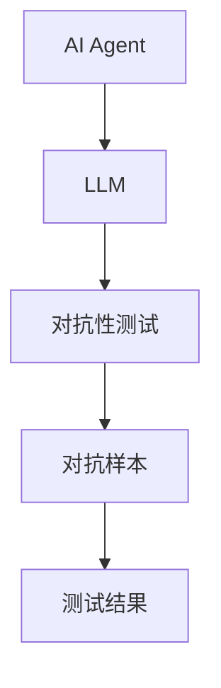
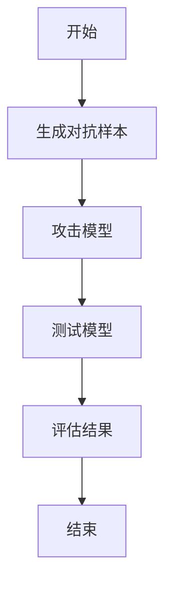
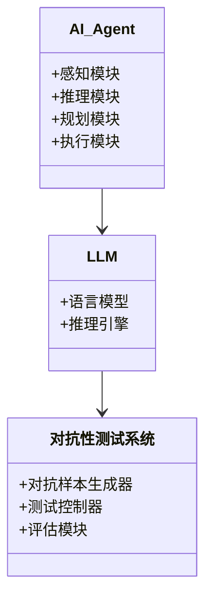
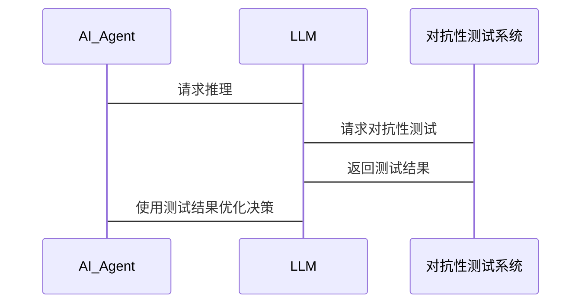

                 


# AI Agent 的对抗性测试：提高 LLM 的鲁棒性

> 关键词：AI Agent，对抗性测试，LLM，鲁棒性，大语言模型，深度学习

> 摘要：本文深入探讨了AI Agent在对抗性测试中的应用，分析了如何通过对抗性测试提高大语言模型（LLM）的鲁棒性。文章从基本概念、算法原理、系统架构到项目实战，全面解析了对抗性测试的实现过程，帮助读者理解如何在实际场景中应用这些技术来增强模型的防御能力。

---

## 第1章: 对抗性测试与AI Agent概述

### 1.1 问题背景与挑战
#### 1.1.1 AI Agent 的定义与核心功能
AI Agent 是一种智能体，能够感知环境、执行任务并做出决策。其核心功能包括感知、推理、规划和执行。

#### 1.1.2 对抗性测试的必要性
在AI Agent 的应用中，对抗性测试是确保其在复杂和恶意环境中的稳定性和可靠性的关键。

#### 1.1.3 提高LLM 鲁棒性的关键问题
LLM 的鲁棒性问题主要表现在对对抗性输入的脆弱性上，这可能影响AI Agent 的决策和执行能力。

### 1.2 对抗性测试的基本概念
#### 1.2.1 对抗性测试的定义
对抗性测试是指通过故意构造对抗性输入，测试AI系统在面对恶意或异常输入时的反应和表现。

#### 1.2.2 对抗性测试的核心目标
目标是识别和修复AI系统中的漏洞，增强其在面对对抗性输入时的鲁棒性和健壮性。

#### 1.2.3 对抗性测试的边界与外延
对抗性测试不仅关注输入层面，还包括模型的输出和决策过程，其外延涉及安全性、隐私保护和模型优化等多个方面。

### 1.3 AI Agent 与 LLM 的关系
#### 1.3.1 AI Agent 的功能结构
AI Agent 通常由感知层、推理层、规划层和执行层组成，其中推理层和规划层 heavily依赖 LLM 的能力。

#### 1.3.2 LLM 在AI Agent 中的角色
LLM 作为AI Agent 的核心模块，负责理解和生成文本、进行推理和提供决策支持。

#### 1.3.3 AI Agent 的核心要素组成
AI Agent 的核心要素包括感知模块、推理模块、决策模块和执行模块，每个模块都可能面临对抗性攻击。

---

## 第2章: 对抗性测试的核心概念与联系

### 2.1 对抗性测试的原理
#### 2.1.1 对抗样本的生成机制
对抗样本是通过对输入数据进行微小扰动生成的，这些扰动可能被模型误分类，从而触发模型的漏洞。

#### 2.1.2 对抗性攻击的类型
常见的对抗性攻击类型包括 evasion（ evasion攻击）、poisoning（毒化攻击）和 injection（注入攻击）。

#### 2.1.3 对抗性测试的数学模型
对抗性测试的数学模型通常基于优化理论，目标是最小化输入扰动，使得模型输出发生变化。

### 2.2 核心概念的属性特征对比
#### 2.2.1 对抗性攻击与防御的特征对比
| 特征 | 对抗性攻击 | 对抗性防御 |
|------|------------|------------|
| 目标 | 扰乱模型输出 | 保护模型输出 |
| 方法 | 构造对抗样本 | 提高模型鲁棒性 |
| 评估 | 成功率 | 鲁棒性指标 |

#### 2.2.2 LLM 鲁棒性与对抗性测试的关系
LLM 的鲁棒性是其在对抗性测试中的表现，对抗性测试是提升 LLM 鲁棒性的有效手段。

#### 2.2.3 对抗性测试的评估指标
主要指标包括对抗样本的成功率、模型的误判率和模型的恢复时间。

### 2.3 实体关系图（ER 图）


---

## 第3章: 对抗性测试的算法原理

### 3.1 对抗性攻击算法
#### 3.1.1 FGSM 对抗样本生成算法
FGSM（Fast Gradient Sign Method）是一种常用对抗样本生成算法，通过计算梯度并生成扰动。

#### 3.1.2 PGD 对抗样本生成算法
PGD（Projected Gradient Descent）是一种更强大的对抗样本生成方法，通过迭代优化生成更有效的对抗样本。

#### 3.1.3 其他对敌对样本生成方法
包括Deepfool、MIFGSM等方法，各有其优缺点和适用场景。

### 3.2 对抗性防御算法
#### 3.2.1 基于扰动的防御方法
通过在输入数据上添加随机噪声，降低对抗样本的有效性。

#### 3.2.2 基于鲁棒优化的防御方法
通过优化模型参数，使其对对抗样本更具鲁棒性。

#### 3.2.3 其他对敌对防御策略
包括对抗训练、知识蒸馏等方法。

### 3.3 对抗性测试的数学模型
#### 3.3.1 对抗样本生成的优化模型
$$ \text{minimize} \quad \|\delta\| $$
$$ \text{subject to} \quad f(x + \delta) = y' $$

#### 3.3.2 对抗性防御的优化目标
$$ \text{minimize} \quad \mathcal{L}(x, y) $$
$$ \text{subject to} \quad x + \delta \in \mathcal{X} $$

### 3.4 算法流程图（Mermaid）


### 3.5 Python 实现示例
#### FGSM 对抗样本生成代码
```python
import torch

def fgsm_attack(model, loss_fn, inputs, labels, epsilon=0.1):
    inputs.requires_grad_(True)
    outputs = model(inputs)
    loss = loss_fn(outputs, labels)
    loss.backward()
    adversarial_inputs = inputs + epsilon * inputs.grad.sign()
    return adversarial_inputs.data
```

---

## 第4章: 对抗性测试的系统分析与架构设计

### 4.1 问题场景介绍
描述一个实际场景，例如AI Agent 在金融交易中的应用，面临来自恶意用户的对抗性攻击。

### 4.2 系统功能设计
设计一个基于对抗性测试的AI Agent 系统，包括数据采集、对抗样本生成、模型训练和测试评估模块。

### 4.3 系统架构设计（Mermaid 类图）


### 4.4 系统接口设计
定义AI Agent 与 LLM 之间的接口，以及对抗性测试系统的输入输出接口。

### 4.5 系统交互设计（Mermaid 序列图）


---

## 第5章: 对抗性测试的项目实战

### 5.1 环境安装
说明如何安装必要的库，例如PyTorch、Transformers等。

### 5.2 系统核心实现源代码
提供对抗性测试的Python代码示例，包括数据加载、模型定义、对抗样本生成和测试评估。

### 5.3 代码应用解读与分析
解释代码的实现细节，包括模型训练、对抗性攻击和防御策略的具体实现。

### 5.4 实际案例分析
通过具体案例分析对抗性测试的效果和模型鲁棒性的提升。

### 5.5 项目小结
总结项目实现的关键点和经验教训。

---

## 第6章: 最佳实践与小结

### 6.1 对抗性测试的最佳实践
包括定期进行对抗性测试、采用多种防御策略和持续优化模型参数。

### 6.2 对抗性测试的注意事项
提醒读者注意对抗性测试的伦理问题和潜在的安全风险。

### 6.3 对抗性测试的拓展阅读
推荐相关书籍和论文，供读者深入学习。

### 6.4 本章小结
总结全文，强调对抗性测试在提高AI Agent 和 LLM 鲁棒性中的重要性。

---

## 作者：AI天才研究院/AI Genius Institute & 禅与计算机程序设计艺术 /Zen And The Art of Computer Programming

---

这篇文章系统地介绍了AI Agent 的对抗性测试，从基本概念到算法实现，再到系统设计和项目实战，全面解析了如何通过对抗性测试提高大语言模型的鲁棒性。希望读者通过本文能够深入了解对抗性测试的核心原理和实际应用，为AI系统的安全性提供有力保障。

