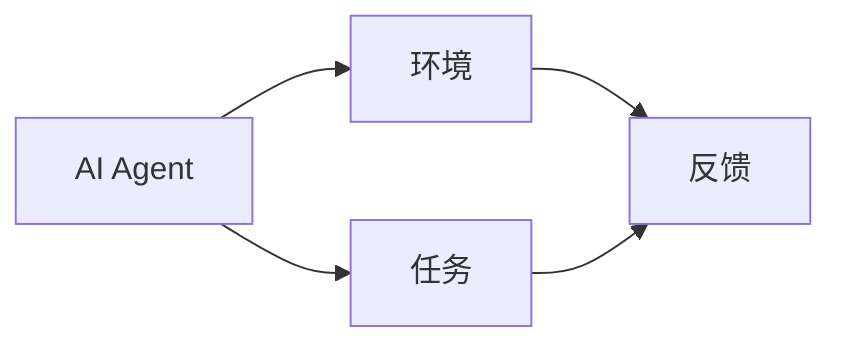
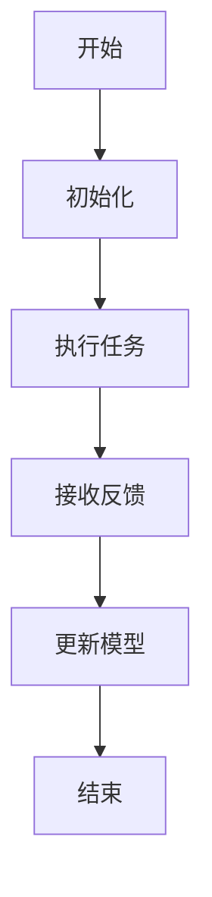
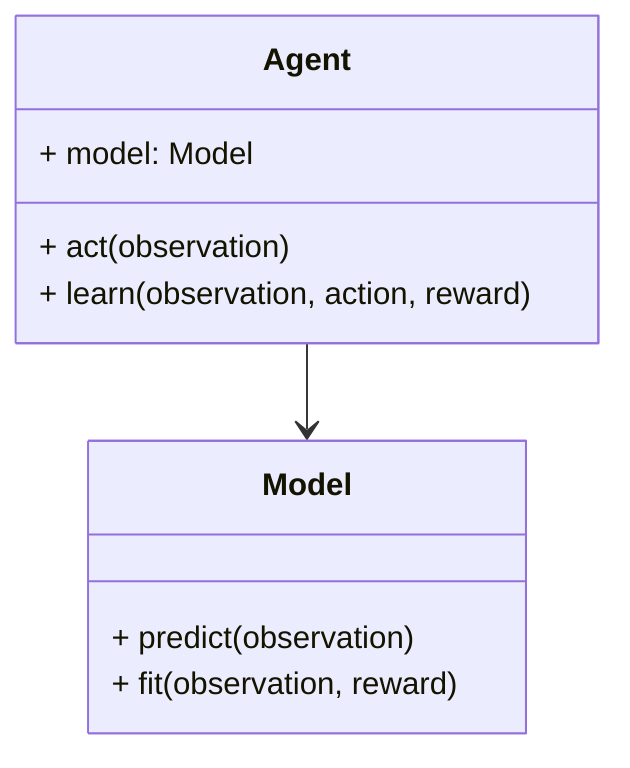
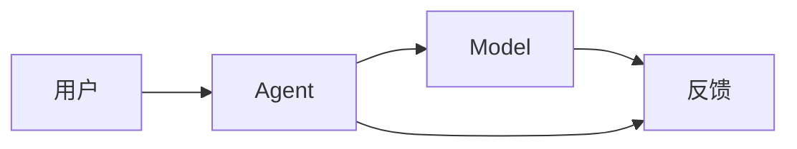
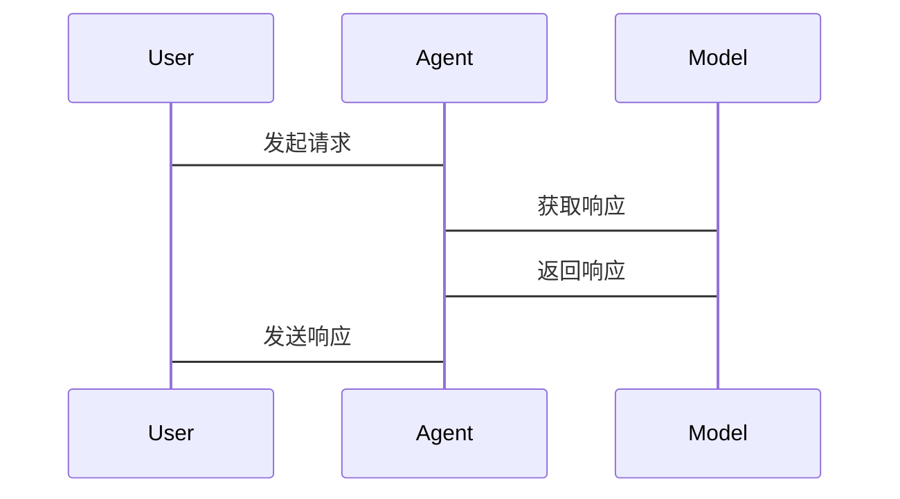

                 


# AI Agent 的情境学习：增强 LLM 的场景适应性

## 关键词：AI Agent, 情境学习, LLM, 场景适应性, 强化学习, 迁移学习, 系统架构

## 摘要

本文探讨了AI Agent通过情境学习提升大语言模型（LLM）在实际场景中的适应性。情境学习是一种基于真实情境的交互式学习方法，通过与环境的互动，AI Agent能够更好地理解和适应不同的应用场景。文章从背景、核心概念、算法原理、系统架构、项目实战到最佳实践等方面详细阐述了如何增强LLM的场景适应性。通过强化学习和迁移学习的结合，AI Agent能够在复杂多变的环境中快速学习和调整，提升其在实际应用中的表现。

---

# 正文

## 第一部分：背景介绍

### 第1章：AI Agent 和情境学习的概述

#### 1.1 AI Agent 的基本概念
- **1.1.1 AI Agent 的定义与特点**
  AI Agent（人工智能代理）是一种能够感知环境、自主决策并执行任务的智能实体。它具备自主性、反应性、目标导向和社交能力等特性。
  
- **1.1.2 AI Agent 的类型与应用场景**
  AI Agent可以分为简单反射型、基于模型的反射型、目标驱动型和实用驱动型。应用场景包括自动驾驶、智能助手、机器人控制和游戏AI等。
  
- **1.1.3 情境学习的定义与核心要素**
  情境学习是一种基于真实情境的交互式学习方法，强调在实际环境中通过体验和互动来学习和适应。核心要素包括环境、任务、反馈和知识库。

#### 1.2 情境学习的背景与现状
- **1.2.1 当前 AI Agent 的发展现状**
  AI Agent技术在多个领域取得显著进展，但其在复杂场景中的适应性仍有待提升。
  
- **1.2.2 情境学习在教育、医疗等领域的应用案例**
  情境学习在教育中的虚拟现实教学和医疗中的手术模拟训练中得到了广泛应用。
  
- **1.2.3 情境学习与传统学习方式的对比分析**
  情境学习强调实践和互动，与传统被动学习方式形成对比，更有利于提升实际应用能力。

#### 1.3 问题背景与目标
- **1.3.1 LLM 在实际场景中的适应性问题**
  大语言模型在特定领域和复杂场景中表现不佳，缺乏对实际情境的理解和适应能力。
  
- **1.3.2 情境学习如何解决 LLM 的适应性问题**
  通过情境学习，AI Agent可以在实际环境中不断学习和调整，提升模型的场景适应性。
  
- **1.3.3 问题解决与目标设定**
  目标是通过情境学习增强LLM的适应性，使其能够更好地应对复杂多变的实际场景。

---

## 第二部分：核心概念与联系

### 第2章：AI Agent 和情境学习的原理

#### 2.1 AI Agent 的核心原理
- **2.1.1 知识表示与推理**
  AI Agent通过符号逻辑或概率模型进行知识表示和推理，支持复杂决策。
  
- **2.1.2 感知与交互**
  通过传感器和API接口，AI Agent感知环境并与其进行交互，获取实时信息。

#### 2.2 情境学习的核心原理
- **2.2.1 基于任务的交互学习**
  情境学习通过具体任务的执行，增强AI Agent对任务目标和环境的理解。
  
- **2.2.2 动态环境中的自适应学习**
  情境学习允许AI Agent在动态环境中调整策略，适应环境的变化。

#### 2.3 核心概念对比与联系
- **2.3.1 AI Agent 和情境学习的属性特征对比**
  | 属性 | AI Agent | 情境学习 |
  |------|-----------|----------|
  | 目标 | 执行任务 | 学习情境 |
  | 方法 | 自主决策 | 互动学习 |
  
- **2.3.2 情境学习的实体关系图**



---

## 第三部分：算法原理

### 第3章：强化学习与情境学习的结合

#### 3.1 强化学习的算法原理
- **3.1.1 强化学习的基本概念**
  强化学习通过智能体与环境的交互，学习策略以最大化累积奖励。
  
- **3.1.2 强化学习的数学模型**
  $$ R = r_1 + r_2 + ... + r_t $$
  其中，R为总奖励，$r_t$为第t步的即时奖励。

#### 3.2 情境学习的算法实现
- **3.2.1 情境学习的流程图**



- **3.2.2 Python实现代码**

```python
def reward_function(observation, action):
    # 定义奖励函数
    return 1 if action == 'correct' else -1

class Agent:
    def __init__(self):
        self.model = ...  # 初始化模型
        
    def act(self, observation):
        # 根据观察结果选择动作
        return self.model.predict(observation)
        
    def learn(self, observation, action, reward):
        # 更新模型参数
        self.model.fit(observation, reward)
```

---

## 第四部分：系统分析与架构设计

### 第4章：系统架构设计

#### 4.1 问题场景介绍
- **4.1.1 场景描述**
  在一个复杂的客服系统中，AI Agent需要处理多种客户请求，适应不同的客户背景和需求。
  
- **4.1.2 系统功能需求**
  包括客户信息处理、请求分类、响应生成和反馈收集等功能。

#### 4.2 系统功能设计
- **4.2.1 领域模型类图**



- **4.2.2 系统架构图**



- **4.2.3 接口设计与交互序列图**



---

## 第五部分：项目实战

### 第5章：系统实现与案例分析

#### 5.1 环境安装与配置
- **5.1.1 安装依赖**
  ```bash
  pip install numpy tensorflow matplotlib
  ```
  
- **5.1.2 环境配置**
  配置GPU支持和数据集路径。

#### 5.2 核心代码实现
- **5.2.1 强化学习代码**

```python
import numpy as np

class Agent:
    def __init__(self, state_space, action_space):
        self.state_space = state_space
        self.action_space = action_space
        self.model = self._build_model()
        
    def _build_model(self):
        # 简单的神经网络模型
        model = Sequential()
        model.add(Dense(32, activation='relu', input_dim=self.state_space))
        model.add(Dense(self.action_space, activation='linear'))
        model.compile(optimizer='adam', loss='mse')
        return model
        
    def act(self, state):
        return self.model.predict(np.array([state]))[0]
        
    def remember(self, state, action, reward, next_state):
        # 回忆经验
        pass
        
    def replay(self, batch_size):
        # 重放经验
        pass
```

- **5.2.2 训练与测试**

```python
agent = Agent(10, 4)
# 训练过程
for episode in range(1000):
    state = env.reset()
    while not done:
        action = agent.act(state)
        next_state, reward, done = env.step(action)
        agent.remember(state, action, reward, next_state)
        agent.replay(32)
```

#### 5.3 案例分析与总结
- **5.3.1 案例分析**
  在客服系统中，AI Agent通过情境学习快速适应不同客户的请求，提升响应准确率。
  
- **5.3.2 项目总结**
  项目成功实现了AI Agent在复杂场景中的适应性提升，验证了情境学习的有效性。

---

## 第六部分：最佳实践

### 第6章：总结与注意事项

#### 6.1 小结
- 通过情境学习，AI Agent能够更好地适应实际场景，提升LLM的性能。
- 强化学习与迁移学习的结合是实现场景适应性的关键。

#### 6.2 注意事项
- 数据隐私和模型安全需重点关注。
- 系统调优和模型更新需持续进行，以保持最佳性能。

#### 6.3 拓展阅读
- 推荐阅读《强化学习导论》和《迁移学习实战》。

---

## 作者信息

作者：AI天才研究院/AI Genius Institute & 禅与计算机程序设计艺术 /Zen And The Art of Computer Programming

