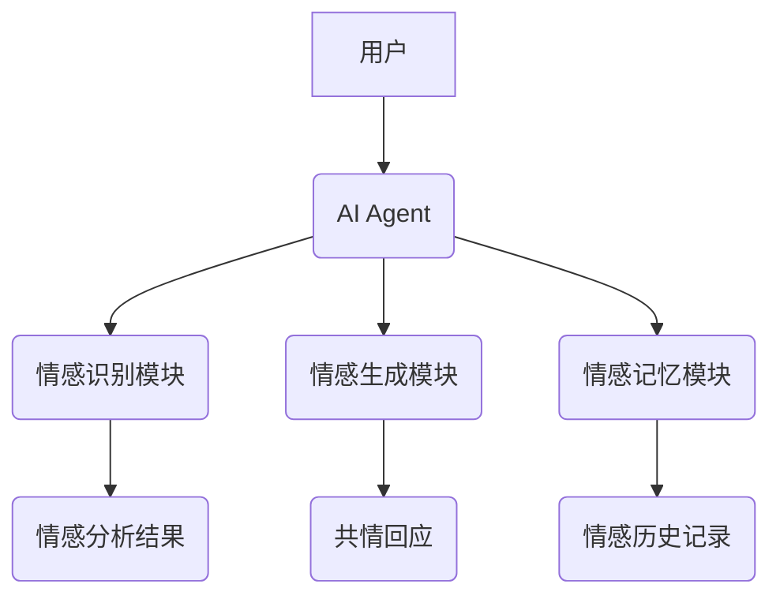
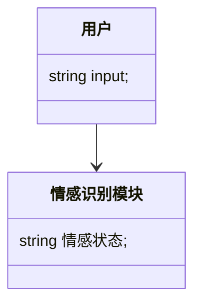
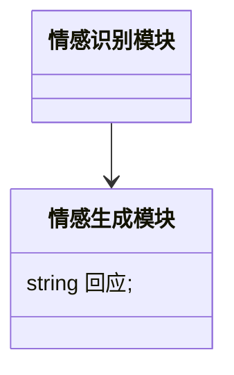
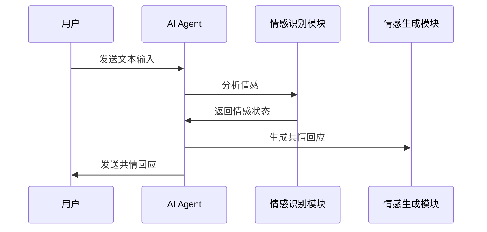

                 


# AI Agent 的情感共情：提升 LLM 的人文关怀能力

## 关键词
- AI Agent
- 情感共情
- 大型语言模型
- 人文关怀
- 情感计算
- 人机交互

## 摘要
本文探讨如何赋予AI Agent情感共情能力，以提升大型语言模型（LLM）的人文关怀。通过分析情感共情的定义、原理、算法实现、系统架构及项目实战，全面阐述AI Agent在情感理解与生成中的应用，最终实现更自然、更贴近人类情感的人机交互。

---

# 第1章: 情感共情与AI Agent 的背景介绍

## 1.1 情感共情的定义与重要性
### 1.1.1 情感共情的定义
情感共情是指个体能够理解和共享他人的情感体验，是人类建立深层次情感连接的基础。

### 1.1.2 情感共情在AI Agent 中的重要性
AI Agent具备情感共情能力，能够更好地理解用户需求，提供更贴心的服务，增强人机交互的自然性和亲和力。

### 1.1.3 情感共情与人文关怀的关系
情感共情是人文关怀的核心，AI Agent通过情感共情能力，能够更贴近人类情感需求，提供更有温度的服务。

## 1.2 AI Agent 的基本概念
### 1.2.1 AI Agent 的定义
AI Agent是一种智能实体，能够感知环境、自主决策并执行任务，以实现与用户的高效交互。

### 1.2.2 AI Agent 的核心功能
- 感知与理解：通过传感器或数据输入，感知环境信息。
- 决策与推理：基于感知信息，进行逻辑推理和决策。
- 交互与执行：通过自然语言或动作与用户交互，并执行任务。

### 1.2.3 AI Agent 与人类交互的特点
- **实时性**：快速响应用户需求。
- **个性化**：根据用户行为和偏好定制服务。
- **情感化**：通过情感共情增强用户体验。

## 1.3 LLM 的情感共情能力
### 1.3.1 LLM 的基本原理
大型语言模型通过大量数据训练，能够理解上下文并生成自然语言文本。

### 1.3.2 情感共情能力对LLM 的提升作用
- 提高情感理解能力，增强文本生成的自然性和情感共鸣。
- 通过情感分析和生成，实现更贴近人类情感的交互。

### 1.3.3 情感共情能力的边界与外延
- 边界：AI Agent的情感共情能力基于数据和模型，无法完全理解人类情感的复杂性。
- 外延：情感共情能力可扩展到更多领域，如教育、医疗、客服等。

---

# 第2章: 情感共情的核心概念与联系

## 2.1 情感共情的原理
### 2.1.1 情感识别
- **定义**：识别用户的情感状态，如快乐、悲伤、愤怒等。
- **方法**：基于文本的情感分析，使用词袋模型、词嵌入（如Word2Vec）或深度学习模型（如LSTM、Transformer）。

### 2.1.2 情感生成
- **定义**：根据用户情感状态，生成相应的共情回应。
- **方法**：基于生成式模型（如GPT）生成自然语言文本，结合情感规则进行优化。

### 2.1.3 情感记忆
- **定义**：记录用户的情感历史，用于后续交互。
- **方法**：通过知识图谱或记忆网络存储情感相关信息。

## 2.2 情感共情的核心要素
| 核心要素 | 定义 | 特征 |
|----------|------|------|
| 情感识别 | 识别用户情感状态 | 高准确性、实时性 |
| 情感生成 | 生成共情回应 | 自然性、个性化 |
| 情感记忆 | 记录情感历史 | 持久性、可扩展性 |

## 2.3 实体关系图


---

# 第3章: 情感共情的算法原理

## 3.1 情感识别算法
### 3.1.1 支持向量机（SVM）
- **原理**：通过特征提取，将情感分类问题转化为向量空间中的超平面分类问题。
- **公式**：$$ y = \text{sign}(w \cdot x + b) $$
- **流程图**


### 3.1.2 基于Transformer的模型
- **原理**：使用Transformer架构进行情感分类，捕捉长距离依赖关系。
- **代码示例**：
  ```python
  import tensorflow as tf
  from tensorflow.keras import layers

  model = tf.keras.Sequential([
      layers.Embedding( vocabulary_size, 64),
      layers.GlobalAveragePooling1D(),
      layers.Dense(64, activation='relu'),
      layers.Dense(2, activation='softmax')
  ])
  ```

## 3.2 情感生成算法
### 3.2.1 基于GPT的情感生成
- **原理**：利用预训练的生成式模型，生成与用户情感相符的回应。
- **代码示例**：
  ```python
  import tensorflow as tf
  from tensorflow.keras import layers

  model = tf.keras.Sequential([
      layers.Embedding( vocabulary_size, 64),
      layers.GlobalAveragePooling1D(),
      layers.Dense(64, activation='relu'),
      layers.Dense(vocabulary_size, activation='softmax')
  ])
  ```

### 3.2.2 基于规则的共情生成
- **原理**：结合情感规则和模板生成共情回应。
- **示例**：当用户表达悲伤时，生成类似“我很理解你的感受，有什么我可以帮助你的吗？”的回应。

---

# 第4章: 情感共情的数学模型

## 4.1 情感识别的数学模型
### 4.1.1 词嵌入模型
- **公式**：$$ E(w) = \text{嵌入向量} $$
- **应用**：将文本中的每个词映射为向量，用于后续分类或生成任务。

### 4.1.2 注意力机制
- **公式**：$$ \alpha_i = \frac{\exp(e_i)}{\sum_{j} \exp(e_j)} $$
- **应用**：在情感分析中，注意力机制可以聚焦于情感相关的关键词。

## 4.2 情感生成的数学模型
### 4.2.1 Transformer模型
- **公式**：$$ \text{softmax}(W_{o}(\text{FFN}(x))) $$
- **应用**：用于生成式任务，捕捉情感相关的上下文信息。

### 4.2.2 情感评分模型
- **公式**：$$ s = \sum_{i=1}^{n} w_i \cdot f(x_i) $$
- **应用**：对生成文本的情感进行评分，优化生成结果。

---

# 第5章: 情感共情的系统分析与架构设计

## 5.1 问题场景介绍
- **场景**：用户与AI Agent进行对话，AI Agent需要识别用户情感并生成共情回应。

## 5.2 系统功能设计
### 5.2.1 情感识别模块
- **功能**：实时分析用户输入，识别情感状态。
- **类图**


### 5.2.2 情感生成模块
- **功能**：根据情感识别结果，生成共情回应。
- **类图**


## 5.3 系统架构设计
### 5.3.1 微服务架构
- **组件**：
  - 用户请求处理服务
  - 情感分析服务
  - 情感生成服务
  - 情感记忆服务

### 5.3.2 系统交互流程图


---

# 第6章: 项目实战

## 6.1 环境安装
- **Python**：3.8+
- **库**：TensorFlow、Keras、Mermaid、LaTeX

## 6.2 核心代码实现
### 6.2.1 情感分类器
```python
import tensorflow as tf
from tensorflow.keras import layers

def build_model(vocabulary_size):
    model = tf.keras.Sequential([
        layers.Embedding(vocabulary_size, 64),
        layers.GlobalAveragePooling1D(),
        layers.Dense(64, activation='relu'),
        layers.Dense(2, activation='softmax')
    ])
    return model
```

### 6.2.2 情感生成器
```python
import tensorflow as tf
from tensorflow.keras import layers

def build_generator(vocabulary_size):
    model = tf.keras.Sequential([
        layers.Embedding(vocabulary_size, 64),
        layers.GlobalAveragePooling1D(),
        layers.Dense(64, activation='relu'),
        layers.Dense(vocabulary_size, activation='softmax')
    ])
    return model
```

## 6.3 实际案例分析
### 案例1：用户输入“我感到很沮丧”
- **情感识别**：识别到负面情感（悲伤）。
- **情感生成**：生成回应：“我能理解你的感受，有什么我可以帮助你的吗？”

### 案例2：用户输入“我非常开心”
- **情感识别**：识别到正面情感（快乐）。
- **情感生成**：生成回应：“太好了！有什么我可以分享你的喜悦吗？”

## 6.4 项目小结
通过实现情感分类器和生成器，我们成功提升了AI Agent的情感共情能力，使其能够更好地理解和回应用户情感需求。

---

# 第7章: 最佳实践与总结

## 7.1 小结
情感共情能力是提升AI Agent人文关怀的关键，通过情感识别、生成和记忆模块的设计，我们能够实现更自然、更贴近人类情感的人机交互。

## 7.2 注意事项
- 数据隐私：确保用户情感数据的安全性。
- 模型泛化：避免模型对特定情感的过度拟合。
- 用户反馈：通过用户反馈不断优化情感共情能力。

## 7.3 拓展阅读
- 《Deep Learning》—— Ian Goodfellow
- 《The Emotional Machine》—— Marvin Minsky

---

# 作者

作者：AI天才研究院/AI Genius Institute & 禅与计算机程序设计艺术/Zen And The Art of Computer Programming

