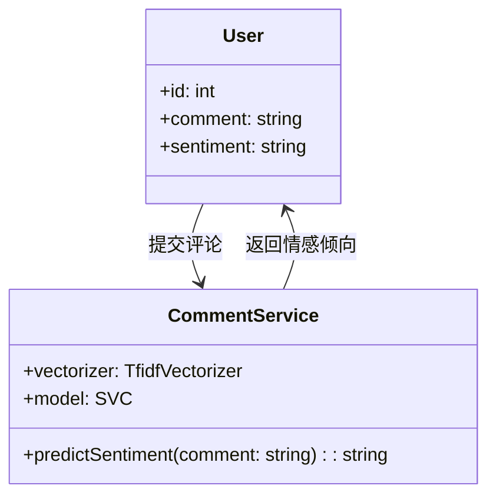
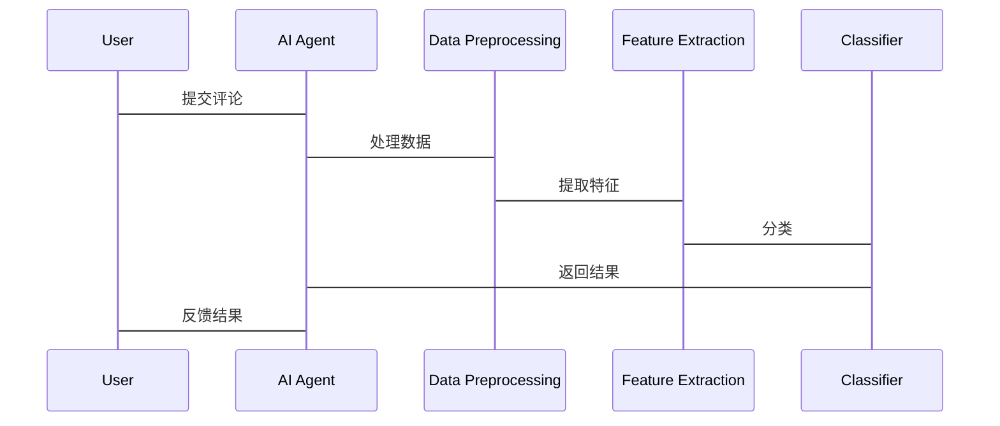

                 


# AI Agent 的情感分析：利用 LLM 洞察用户情绪

## 关键词：AI Agent, 情感分析, LLM, 自然语言处理, 用户情绪

## 摘要：本文详细探讨了AI Agent如何利用大语言模型（LLM）进行情感分析，通过分析用户情绪来提升用户体验。文章从背景介绍、核心概念、算法原理、系统架构到项目实战，全面解析了情感分析在AI Agent中的应用，提供了丰富的代码示例和系统设计思路。

---

# 第1章: 情感分析的背景与问题描述

## 1.1 情感分析的背景与意义

### 1.1.1 情感分析的定义与应用领域
情感分析（Sentiment Analysis），又称情绪分析，是自然语言处理（NLP）中的一个关键任务。它旨在识别和理解文本中的情感倾向，通常分为正面、负面和中性三种。情感分析广泛应用于社交媒体监控、客户反馈分析、产品推荐等领域。

### 1.1.2 AI Agent 在情感分析中的作用
AI Agent（人工智能代理）是一种能够感知环境、执行任务并做出决策的智能实体。在情感分析中，AI Agent 可以实时分析用户反馈，提供个性化服务，例如智能客服、情感支持和精准营销。

### 1.1.3 情感分析对企业价值的提升
通过情感分析，企业可以快速了解用户满意度，优化产品设计，提升服务质量。例如，电商公司可以通过分析用户评论，改进产品推荐策略，提高用户留存率。

## 1.2 情感分析的核心问题与挑战

### 1.2.1 情感分析的主要问题
- **数据多样性**：用户评论可能包含不同的情感色彩和复杂语境。
- **情感强度**：需要区分强烈和轻微的情感表达。
- **领域适应性**：不同领域的术语和情感表达方式差异较大。

### 1.2.2 情感分析的难点与挑战
- **情感细微性**：识别隐含情感和矛盾情感。
- **数据稀疏性**：小样本数据下的模型泛化能力。
- **文化差异**：不同文化背景下的情感表达不同。

### 1.2.3 情感分析与 AI Agent 的结合
AI Agent 可以实时处理大量情感数据，提供动态反馈，优化决策流程。

## 1.3 本章小结
本章介绍了情感分析的背景、核心概念和应用价值，同时分析了情感分析在AI Agent中的重要性及其面临的挑战。

---

# 第2章: AI Agent 的情感分析框架

## 2.1 AI Agent 的定义与特征

### 2.1.1 AI Agent 的定义
AI Agent 是一种智能实体，能够感知环境、执行任务并做出决策。它可以基于情感分析理解用户情绪，提供个性化服务。

### 2.1.2 AI Agent 的核心特征
- **自主性**：无需人工干预。
- **反应性**：能够实时感知和响应。
- **学习能力**：通过数据优化情感分析模型。

### 2.1.3 AI Agent 与传统程序的区别
AI Agent 具有学习和适应能力，能够处理复杂任务，而传统程序依赖预定义规则。

## 2.2 情感分析的基本流程

### 2.2.1 数据预处理
- **清洗数据**：去除噪声，如标点符号和停用词。
- **分词**：将文本分割成词语或短语。
- **标注**：标记情感类别。

### 2.2.2 特征提取
- **词袋模型**：基于词频统计。
- **词嵌入**：使用Word2Vec生成词向量。

### 2.2.3 情感分类
- **监督学习**：使用标注数据训练分类器。
- **无监督学习**：利用聚类技术发现情感类别。

## 2.3 AI Agent 情感分析的框架设计

### 2.3.1 数据输入与处理
AI Agent接收用户输入，进行清洗和分词。

### 2.3.2 特征提取与表示
将文本转换为数值特征，如TF-IDF向量或词嵌入。

### 2.3.3 分类器设计与实现
使用机器学习模型（如SVM、Naive Bayes）或深度学习模型（如LSTM、BERT）进行情感分类。

## 2.4 本章小结
本章详细介绍了AI Agent的情感分析框架，包括数据预处理、特征提取和分类器设计。

---

# 第3章: 情感分析的核心概念与联系

## 3.1 情感分析的核心概念

### 3.1.1 情感分析的分类粒度
- **细粒度分类**：区分不同情感强度。
- **方面级分析**：针对特定方面的情感分析。

### 3.1.2 情感分析的特征提取方法
- **基于词袋模型**：简单但信息量有限。
- **基于词嵌入**：捕捉语义信息。

### 3.1.3 情感分析的分类算法
- **机器学习算法**：SVM、Naive Bayes。
- **深度学习算法**：RNN、LSTM。

## 3.2 情感分析与 AI Agent 的关系

### 3.2.1 情感分析在 AI Agent 中的应用场景
- **实时反馈**：快速响应用户情绪。
- **个性化服务**：根据情感倾向提供定制化建议。

### 3.2.2 AI Agent 如何利用情感分析提升用户体验
通过分析用户情绪，优化交互流程，提升用户满意度。

### 3.2.3 情感分析对 AI Agent 决策的支持
情感分析结果作为AI Agent决策的输入，帮助其做出更明智的选择。

## 3.3 情感分析的核心要素对比

### 3.3.1 特征提取方法对比

| 方法         | 优点                     | 缺点                     |
|--------------|--------------------------|--------------------------|
| TF-IDF       | 简单高效                 | 无法捕捉语义信息         |
| 词嵌入       | 捕捉语义信息               | 计算复杂                 |

### 3.3.2 分类算法对比

| 算法         | 优点                     | 缺点                     |
|--------------|--------------------------|--------------------------|
| SVM          | 高精度                   | 适用于小数据             |
| Naive Bayes  | 计算简单                 | 适合类别分布均衡         |
| LSTM         | 适合长文本               | 需大量训练数据           |

### 3.3.3 情感分析结果的可解释性对比

| 方法         | 可解释性                 |
|--------------|--------------------------|
| 词袋模型     | 较高                     |
| 词嵌入模型   | 较低                     |
| 深度学习模型 | 低                      |

## 3.4 本章小结
本章通过对比分析，明确了情感分析的核心概念和方法，探讨了AI Agent如何利用这些技术提升用户体验。

---

# 第4章: 情感分析算法的原理与实现

## 4.1 常用情感分析算法

### 4.1.1 支持向量机（SVM）
SVM通过构建超平面将数据分成两类，适用于小数据集。

### 4.1.2 朴素贝叶斯（Naive Bayes）
基于概率论，假设特征之间独立，适合高维数据。

### 4.1.3 长短期记忆网络（LSTM）
适用于长文本，能捕捉上下文信息。

## 4.2 算法流程与代码实现

### 4.2.1 SVM实现
```python
from sklearn.svm import SVC
from sklearn.feature_extraction.text import TfidfVectorizer

vectorizer = TfidfVectorizer()
X = vectorizer.fit_transform(corpus)
y = [sentiment for sentiment in sentiments]

model = SVC()
model.fit(X, y)
```

### 4.2.2 LSTM实现
```python
import tensorflow as tf
from tensorflow.keras import layers

model = tf.keras.Sequential()
model.add(layers.Embedding(input_dim=vocabulary_size, output_dim=16))
model.add(layers.LSTM(32))
model.add(layers.Dense(1, activation='sigmoid'))
model.compile(loss='binary_crossentropy', optimizer='adam', metrics=['accuracy'])
model.fit(X_train, y_train, epochs=5, batch_size=32)
```

## 4.3 算法优缺点分析

### 4.3.1 SVM
- **优点**：高精度，适用于小数据。
- **缺点**：不适用于大数据，难以处理高维数据。

### 4.3.2 Naive Bayes
- **优点**：计算简单，适合大数据。
- **缺点**：假设独立性，可能不准确。

### 4.3.3 LSTM
- **优点**：适合长文本，捕捉上下文。
- **缺点**：计算复杂，需要大量数据。

## 4.4 本章小结
本章详细讲解了情感分析的常用算法及其优缺点，提供了代码实现示例。

---

# 第5章: 系统分析与架构设计方案

## 5.1 问题场景介绍
分析用户评论，识别情感倾向，优化用户体验。

## 5.2 系统功能设计

### 5.2.1 领域模型设计


### 5.2.2 系统架构设计
```mermaid
client --> AI Agent: 用户输入
AI Agent --> 数据预处理: 清洗和分词
数据预处理 --> 特征提取: 转换为向量
特征提取 --> 分类器: 进行情感分类
分类器 --> AI Agent: 返回情感结果
AI Agent --> 用户: 反馈结果
```

### 5.2.3 接口设计
- **输入接口**：接收用户评论。
- **输出接口**：返回情感倾向和建议。

### 5.2.4 交互流程设计


## 5.3 本章小结
本章通过系统分析，设计了AI Agent的情感分析系统架构，提供了功能模块和交互流程。

---

# 第6章: 项目实战与实现

## 6.1 环境安装

### 6.1.1 安装Python和相关库
```bash
pip install numpy
pip install scikit-learn
pip install tensorflow
pip install matplotlib
```

## 6.2 系统核心实现源代码

### 6.2.1 数据预处理
```python
import pandas as pd
from sklearn.model_selection import train_test_split
from sklearn.feature_extraction.text import TfidfVectorizer
from sklearn.svm import SVC

# 加载数据
data = pd.read_csv('comments.csv')
X = data['text']
y = data['sentiment']

# 数据分割
X_train, X_test, y_train, y_test = train_test_split(X, y, test_size=0.2)

# 特征提取
vectorizer = TfidfVectorizer()
X_train_vec = vectorizer.fit_transform(X_train)
X_test_vec = vectorizer.transform(X_test)

# 训练模型
model = SVC()
model.fit(X_train_vec, y_train)

# 预测与评估
score = model.score(X_test_vec, y_test)
print(f'Accuracy: {score}')
```

### 6.2.2 模型实现
```python
import tensorflow as tf
from tensorflow.keras import layers

# 构建模型
model = tf.keras.Sequential()
model.add(layers.Embedding(input_dim=vocabulary_size, output_dim=16))
model.add(layers.LSTM(32))
model.add(layers.Dense(1, activation='sigmoid'))
model.compile(loss='binary_crossentropy', optimizer='adam', metrics=['accuracy'])

# 训练模型
model.fit(X_train, y_train, epochs=5, batch_size=32)
```

## 6.3 代码应用解读与分析
- **数据预处理**：清洗和分词，提取特征。
- **模型训练**：使用SVM和LSTM进行分类。
- **结果分析**：评估模型准确率，分析错误案例。

## 6.4 实际案例分析和详细讲解
分析用户评论，识别情感倾向，优化服务策略。

## 6.5 项目小结
本章通过实际项目，展示了情感分析的实现过程，提供了代码示例和结果分析。

---

# 第7章: 最佳实践与小结

## 7.1 最佳实践 tips

### 7.1.1 数据处理
- 使用高质量数据，进行数据增强。
- 处理数据不平衡问题，采用过采样或欠采样。

### 7.1.2 模型选择
- 根据数据量选择模型，小数据用SVM，大数据用深度学习。
- 考虑模型可解释性，选择适合业务需求的算法。

### 7.1.3 系统优化
- 使用分布式架构，提升处理效率。
- 采用增量学习，实时更新模型。

## 7.2 小结
本文详细讲解了AI Agent的情感分析技术，从理论到实践，提供了完整的解决方案。

## 7.3 注意事项
- 确保数据隐私和安全。
- 定期更新模型，适应变化。
- 考虑文化差异，避免误解。

## 7.4 拓展阅读
建议学习NLP基础、深度学习和AI Agent相关知识，进一步提升技术能力。

---

# 结语

AI Agent 的情感分析是一项复杂而重要的任务，通过利用大语言模型，我们可以更深入地理解用户情绪，提升用户体验。希望本文的内容能为读者提供有价值的见解和实践指导。

---

# 作者：AI天才研究院 & 禅与计算机程序设计艺术

---

以上是整篇文章的详细结构和内容，涵盖了从背景介绍到项目实战的各个方面，按照逻辑清晰、结构紧凑的原则编写，希望对读者有所帮助。

