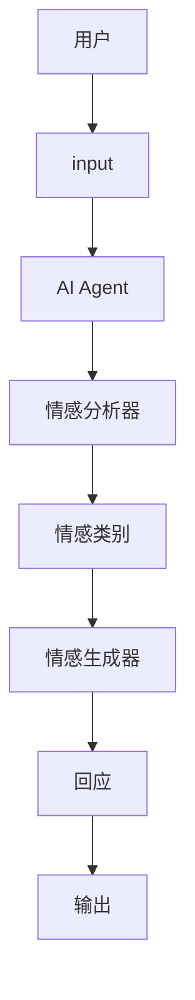
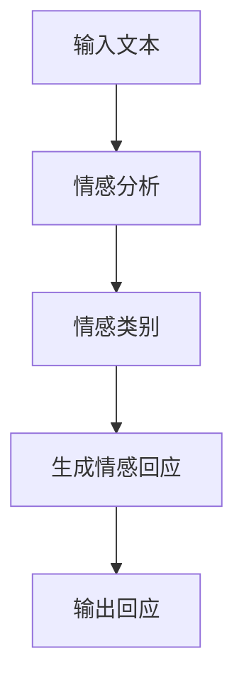

                 


# AI Agent 的情感调节：利用 LLM 进行情绪管理

## 关键词：
- AI Agent
- 情感调节
- 大语言模型（LLM）
- 情感分析
- 生成式AI
- 人机交互

## 摘要：
本文探讨了如何利用大语言模型（LLM）实现AI Agent的情感调节，重点分析了情感调节的核心概念、算法原理、系统架构以及实际应用。通过详细讲解情感分析与生成机制，结合实际案例和系统设计，为AI Agent的情感调节提供了一套完整的解决方案。

---

## 第一部分：AI Agent 情感调节的背景与核心概念

### 第1章：情感调节在AI Agent中的重要性

#### 1.1 问题背景与描述
- **AI Agent的基本概念与功能**：AI Agent是一种智能体，能够感知环境、执行任务并做出决策。它广泛应用于聊天机器人、智能助手、虚拟客服等领域。
- **情感调节的需求与应用场景**：在人机交互中，用户的情感状态直接影响用户体验。例如，当用户感到沮丧时，AI Agent需要能够识别并调整其回应方式，以提供更贴心的服务。
- **情感调节在人机交互中的作用**：情感调节使AI Agent更具人性化，能够更好地理解和满足用户的情感需求，从而提升用户满意度和忠诚度。

#### 1.2 情感调节的核心问题
- **情感识别与生成的挑战**：如何准确识别用户的情感状态，并生成恰当的情感回应。
- **情感调节的边界与外延**：情感调节不仅仅是生成情感化的语言，还包括理解情感背后的需求和意图。
- **情感调节与AI Agent的结合方式**：通过LLM实现情感分析和生成，构建情感调节的闭环系统。

#### 1.3 核心概念与联系
- **情感调节的基本原理**：通过分析用户输入的情感特征，生成符合情感需求的回应。
- **情感分析与生成机制的对比**：情感分析是理解用户情感，生成机制是根据情感生成回应。
- **ER实体关系图架构**：展示了情感调节过程中涉及的主要实体及其关系。

### 第2章：情感调节的核心概念与联系

#### 2.1 情感调节的基本原理
- **情感分析**：通过LLM对用户输入进行情感分析，识别情感类别（如正面、负面、中性）。
- **情感生成**：根据分析结果，生成符合情感需求的回应。
- **情感调节的闭环系统**：从情感分析到生成，形成一个完整的调节过程。

#### 2.2 情感分析与生成机制的对比
| 对比维度 | 情感分析 | 情感生成 |
|----------|----------|----------|
| 目标     | 识别情感 | 生成情感 |
| 输入     | 用户文本 | 情感类别 |
| 输出     | 情感类别 | 回应文本 |
| 示例     | 分析文本“我感到很生气”为负面情感 | 生成回应“我明白您现在心情不好，我们可以一起解决问题。” |

#### 2.3 ER实体关系图架构


---

## 第二部分：情感调节的算法原理

### 第3章：情感分析与生成算法

#### 3.1 情感分析算法
- **基于LLM的情感分析流程**：
  1. 输入文本经过预处理（分词、去停用词）。
  2. 使用预训练的情感分析模型进行分类。
  3. 输出情感类别（正面、负面、中性）。

- **情感分析的数学模型**：
  - 损失函数：交叉熵损失函数。
  - 示例：$$ \text{损失函数} = \text{交叉熵损失} $$

#### 3.2 情感生成算法
- **基于LLM的情感生成机制**：
  1. 根据情感类别，生成符合情感需求的回应。
  2. 使用生成式模型优化回应的自然度和相关性。
  - 示例：$$ P(y|x) = \text{生成模型的概率分布} $$

#### 3.3 算法流程图


---

### 第4章：情感调节的系统架构设计

#### 4.1 系统功能设计
- **领域模型类图**：
  ```mermaid
  classDiagram
  class AI_Agent {
      +string inputText
      +string outputResponse
      -LLM_Model model
      -EmotionAnalyzer analyzer
      -EmotionGenerator generator
      +void analyzeEmotion()
      +void generateResponse()
  }
  ```

- **系统架构设计**：
  ```mermaid
  graph TD
  User[用户] --> Agent[AI Agent]
  Agent --> EmotionAnalyzer[情感分析器]
  EmotionAnalyzer --> EmotionCategory[情感类别]
  EmotionCategory --> EmotionGenerator[情感生成器]
  EmotionGenerator --> Response[回应]
  Response --> Output[输出]
  ```

---

### 第5章：项目实战

#### 5.1 环境安装与配置
- 安装Python和相关库（如TensorFlow、PyTorch）。
- 安装Hugging Face库用于加载预训练模型。

#### 5.2 核心代码实现
```python
from transformers import pipeline

# 情感分析器
sentiment_analyzer = pipeline("sentiment-analysis")

# 情感生成器
generator = pipeline("text-generation")

def analyze_emotion(text):
    result = sentiment_analyzer(text)
    return result[0]['label']

def generate_response(emotion):
    if emotion == 'POSITIVE':
        prompt = "生成一个积极的回应："
    elif emotion == 'NEGATIVE':
        prompt = "生成一个消极的回应："
    else:
        prompt = "生成一个中性的回应："
    response = generator(prompt, max_length=50, num_return_sequences=1)
    return response[0]['generated_text']
```

#### 5.3 实际案例分析
- 输入文本：“我感到很沮丧。”
  - 情感分析：NEGATIVE
  - 情感生成：生成回应“我理解您的感受，我们可以一起找到解决方案。”

---

### 第6章：总结与展望

#### 6.1 最佳实践
- 在实际应用中，情感调节需要结合具体场景和用户需求。
- 定期更新模型以适应不同的情感表达方式。

#### 6.2 小结
本文详细探讨了AI Agent的情感调节，从理论到实践，为构建更智能、更人性化的人机交互系统提供了参考。

#### 6.3 注意事项
- 情感调节需要考虑文化差异和个体差异。
- 情感生成需要避免生成不适当的内容。

#### 6.4 拓展阅读
- 《大语言模型与情感计算》
- 《生成式AI在人机交互中的应用》

---

## 作者：
AI天才研究院  
禅与计算机程序设计艺术

