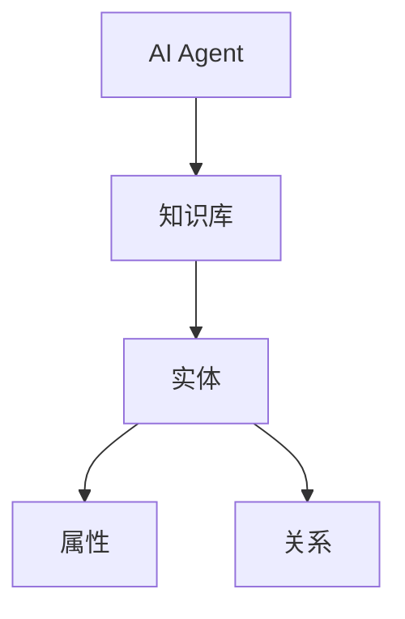
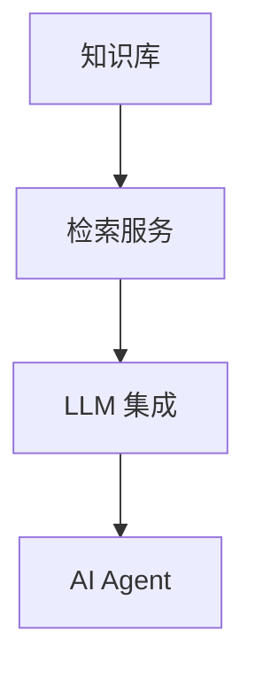
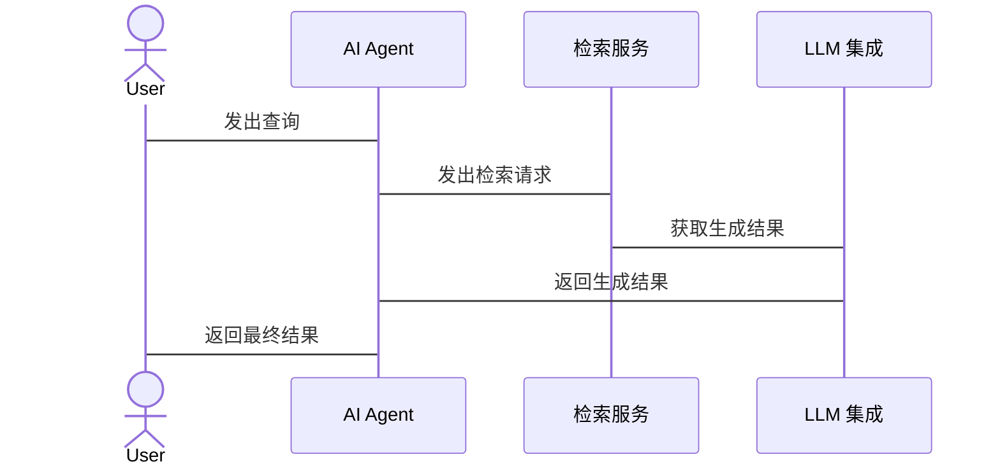

                 


# AI Agent 的知识检索增强：结合 LLM 与高效搜索算法

## 关键词：AI Agent、知识检索、LLM、高效搜索算法、增强技术、算法优化、系统设计

## 摘要：  
本文探讨了如何结合大语言模型（LLM）与高效搜索算法来增强AI Agent的知识检索能力。文章首先介绍了AI Agent和知识检索的基本概念，分析了LLM与高效搜索算法的优势与不足。接着，从算法原理、数学模型、系统架构等多个维度详细阐述了如何将LLM与高效搜索算法相结合，提升知识检索的效率和准确性。最后，通过实际案例展示了结合LLM与高效搜索算法的系统设计与实现，为AI Agent的知识检索增强提供了理论依据和实践指导。

---

## 第一部分：AI Agent 的知识检索增强概述

### 第1章：AI Agent 与知识检索增强

#### 1.1 AI Agent 的基本概念
##### 1.1.1 AI Agent 的定义与特点
AI Agent（人工智能代理）是指能够感知环境、自主决策并执行任务的智能体。AI Agent 具备以下特点：
- **自主性**：能够在没有外部干预的情况下自主运行。
- **反应性**：能够实时感知环境并做出反应。
- **目标导向**：具备明确的目标，并根据目标调整行为。
- **学习能力**：能够通过数据和经验不断优化自身的性能。

##### 1.1.2 知识检索在 AI Agent 中的作用
知识检索是 AI Agent 完成任务的核心能力之一。通过知识检索，AI Agent 可以从海量数据中提取有用的信息，支持决策和行动。例如，在自然语言处理任务中，AI Agent 需要检索相关知识以生成回答。

##### 1.1.3 AI Agent 的应用场景
AI Agent 广泛应用于多个领域，包括：
- **智能客服**：通过对话理解用户需求并提供解决方案。
- **自动驾驶**：实时感知环境并做出驾驶决策。
- **智能助手**：帮助用户完成日程管理、信息查询等任务。

#### 1.2 知识检索的核心问题
##### 1.2.1 知识检索的定义与挑战
知识检索是指从结构化或非结构化的数据中提取特定信息的过程。其核心挑战包括：
- **数据多样性**：数据来源广泛，格式多样。
- **检索效率**：如何在大规模数据中快速找到相关结果。
- **准确性**：如何确保检索结果的准确性。

##### 1.2.2 知识检索的边界与外延
知识检索的边界包括：
- **数据范围**：检索的范围是结构化数据还是非结构化数据。
- **检索粒度**：检索的粒度是细粒度还是粗粒度。
- **结果排序**：检索结果的排序规则。

知识检索的外延包括：
- **语义理解**：理解查询的语义并进行语义检索。
- **上下文理解**：基于上下文进行动态检索。

#### 1.3 LLM 与高效搜索算法的结合
##### 1.3.1 LLM 的基本原理
大语言模型（LLM）通过大规模的预训练数据学习语言规律，能够生成与上下文相关联的文本。LLM 的核心优势在于其强大的语义理解和生成能力。

##### 1.3.2 高效搜索算法的概述
高效搜索算法包括：
- **BM25**：基于概率的检索算法。
- **DPR**：基于密集向量的检索算法。
- **Annoy**：基于近似最近邻的检索算法。

##### 1.3.3 LLM 与搜索算法的结合优势
结合 LLM 与高效搜索算法可以充分发挥两者的优点：
- LLM 提供语义理解能力。
- 高效搜索算法提供快速、准确的检索能力。

---

## 第二部分：AI Agent 知识检索增强的核心概念

### 第2章：核心概念与联系

#### 2.1 核心概念与原理
##### 2.1.1 AI Agent 的知识表示
知识表示是 AI Agent 进行知识检索的基础。常用的知识表示方法包括：
- **符号表示**：使用符号和规则表示知识。
- **向量表示**：使用密集向量表示知识。
- **图结构表示**：使用图结构表示知识的关联性。

##### 2.1.2 知识检索的模式匹配
模式匹配是知识检索的关键技术之一。通过将查询与知识库中的实体进行匹配，可以找到最相关的知识。

##### 2.1.3 LLM 的生成式检索
生成式检索是一种基于生成模型的检索方法，通过生成与查询相关的文本片段来回答问题。

#### 2.2 核心概念对比分析
##### 2.2.1 LLM 与传统搜索算法的对比
| 对比维度 | LLM | 传统搜索算法 |
|----------|-----|--------------|
| 检索方式 | 基于生成 | 基于匹配 |
| 检索效率 | 较低 | 较高 |
| 检索准确性 | 高 | 中等 |

##### 2.2.2 知识检索的性能对比
| 对比维度 | 基于LLM的检索 | 基于传统算法的检索 |
|----------|----------------|---------------------|
| 检索速度 | 较慢 | 较快 |
| 检索准确性 | 高 | 中等 |
| 资源消耗 | 高 | 低 |

##### 2.2.3 算法复杂度与检索效率的对比
- LLM 的检索复杂度较高，但准确性高。
- 传统搜索算法的检索复杂度较低，但准确性有限。

#### 2.3 实体关系图


---

## 第三部分：AI Agent 知识检索增强的算法原理

### 第3章：算法原理讲解

#### 3.1 LLM 的工作流程
##### 3.1.1 LLM 的输入与输出
LLM 的输入是自然语言查询，输出是与查询相关的文本片段。

##### 3.1.2 LLM 的训练目标
LLM 的训练目标是通过最大化条件概率来学习语言模型：
$$ P(\text{output}|\text{input}) $$

##### 3.1.3 LLM 的推理过程
LLM 的推理过程包括：
- **编码**：将输入文本编码为向量。
- **解码**：生成与编码向量对应的输出文本。

#### 3.2 高效搜索算法的实现
##### 3.2.1 BM25 算法
BM25 是一种基于概率的检索算法，其核心公式为：
$$ \text{score}(i, q) = \frac{\text{tf}(i, q) \cdot \log(\text{idf}(i, q))}{\text{tf}(i, q) + k(1 - b + b \cdot \text{dl})} $$
其中，$k$ 是平滑参数，$b$ 是折扣因子，$\text{dl}$ 是平均文档长度。

##### 3.2.2 DPR 算法
DPR 算法通过将文本编码为密集向量，然后计算向量之间的余弦相似度：
$$ \text{score}(i, q) = \frac{\vec{v}_i \cdot \vec{v}_q}{\|\vec{v}_i\| \cdot \|\vec{v}_q\|} $$

##### 3.2.3 Annoy 算法
Annoy 算法是一种基于近似最近邻的检索算法，适用于高维数据。

#### 3.3 LLM 与搜索算法的结合
##### 3.3.1 结合方法
- **预处理**：将知识库中的数据进行预处理，生成向量表示。
- **混合检索**：结合 LLM 的生成能力和搜索算法的检索能力。

##### 3.3.2 代码实现
```python
def combine_retrieval_llm(search_algorithm, llm_model):
    def retrieve(query):
        results = search_algorithm.retrieve(query)
        return llm_model.generate(results)
    return retrieve
```

---

## 第四部分：AI Agent 知识检索增强的数学模型

### 第4章：数学模型与公式

#### 4.1 LLM 的训练目标
LLM 的训练目标是最大化条件概率：
$$ P(\text{output}|\text{input}) $$

#### 4.2 LLM 的损失函数
LLM 的损失函数通常采用交叉熵损失：
$$ \mathcal{L} = -\sum_{i=1}^{n} \log P(y_i|x_i) $$

#### 4.3 高效搜索算法的优化
BM25 算法的优化包括：
- 调整平滑参数 $k$ 和折扣因子 $b$。
- 优化查询处理流程，减少检索时间。

---

## 第五部分：AI Agent 知识检索增强的系统设计

### 第5章：系统分析与架构设计

#### 5.1 系统功能设计
- **知识库管理**：负责知识库的构建和维护。
- **检索服务**：提供高效的检索功能。
- **LLM 集成**：集成大语言模型，提供生成式检索功能。

#### 5.2 系统架构图


#### 5.3 系统接口设计
- **检索接口**：提供基于关键词的检索功能。
- **生成接口**：提供基于生成模型的检索功能。

#### 5.4 系统交互流程图


---

## 第六部分：AI Agent 知识检索增强的项目实战

### 第6章：项目实战

#### 6.1 环境安装
- 安装 Python 和相关依赖：
  ```bash
  pip install numpy pandas mermaid
  ```

#### 6.2 核心代码实现
##### 6.2.1 知识库构建
```python
import numpy as np

def build_knowledge_base(data):
    knowledge_base = {}
    for i, item in enumerate(data):
        knowledge_base[i] = item
    return knowledge_base
```

##### 6.2.2 高效检索算法实现
```python
def bm25检索(query, knowledge_base):
    scores = []
    for item in knowledge_base:
        score = 计算BM25分数(query, item)
        scores.append(score)
    排序并返回前k个结果
    return results
```

#### 6.3 案例分析
##### 6.3.1 案例背景
假设我们有一个关于“天气”的知识库，用户查询“明天北京的天气如何”。

##### 6.3.2 知识检索过程
1. AI Agent 接收用户的查询。
2. AI Agent 调用 BM25 算法进行检索。
3. BM25 算法返回相关结果。
4. AI Agent 调用 LLM 进行生成式检索，生成最终的回答。

#### 6.4 系统优化
- **索引优化**：优化知识库的索引结构，提高检索速度。
- **模型优化**：优化 LLM 的生成模型，提高生成准确性。

---

## 第七部分：AI Agent 知识检索增强的总结

### 第7章：总结与展望

#### 7.1 核心内容总结
本文详细探讨了如何结合 LLM 与高效搜索算法来增强 AI Agent 的知识检索能力，从算法原理、系统设计到项目实战进行了全面分析。

#### 7.2 最佳实践 tips
- 在实际应用中，根据具体需求选择合适的检索算法。
- 定期优化知识库和检索模型，提高检索效率和准确性。

#### 7.3 未来研究方向
- 研究更高效的检索算法。
- 探讨 LLM 与多模态检索的结合。

---

## 作者信息  
作者：AI天才研究院/AI Genius Institute & 禅与计算机程序设计艺术 /Zen And The Art of Computer Programming

