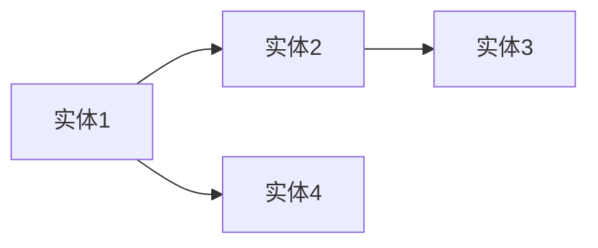
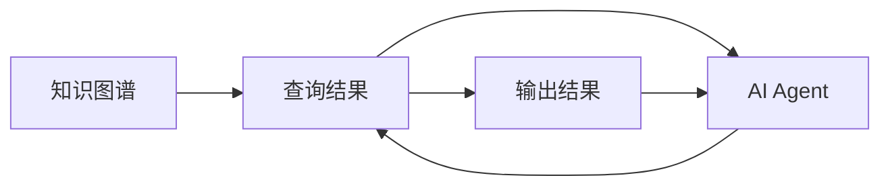
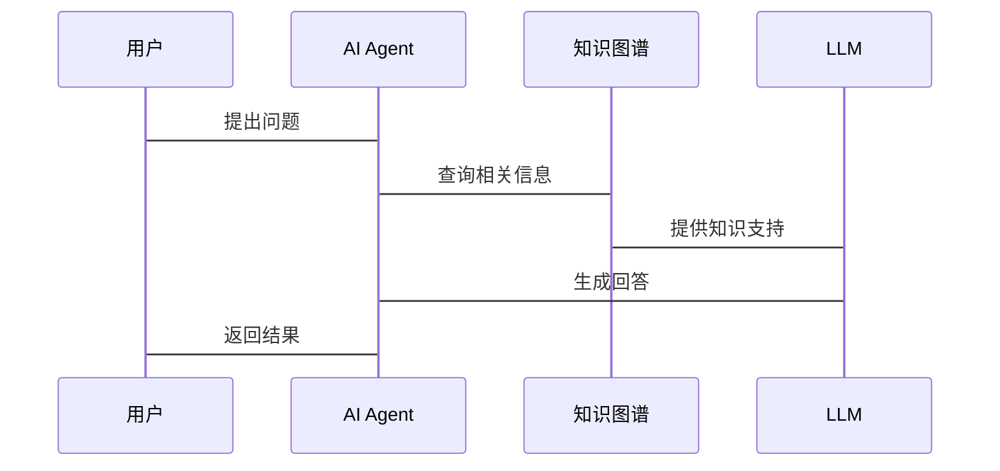

                 


# AI Agent 的知识溯源：提高 LLM 输出的可追溯性

> 关键词：AI Agent, 知识图谱, LLM, 可追溯性, 溯源算法, 系统架构

> 摘要：随着AI Agent和大语言模型（LLM）的广泛应用，提升LLM输出的可追溯性成为一个重要研究方向。本文将从AI Agent的知识表示与知识图谱构建入手，结合LLM的内部机制，深入探讨如何通过知识图谱增强LLM的可追溯性。我们将通过详细分析知识图谱构建的算法原理、系统架构设计，以及实际项目的实现，为读者提供一套完整的解决方案。

---

## 第一部分: AI Agent 的知识溯源基础

### 第1章: AI Agent 和知识图谱概述

#### 1.1 AI Agent 的基本概念

##### 1.1.1 AI Agent 的定义与分类
AI Agent（人工智能代理）是一种能够感知环境、自主决策并执行任务的智能体。它可以分为简单反射式 Agent、基于模型的反射式 Agent、目标驱动的 Agent 和效用驱动的 Agent。

##### 1.1.2 知识图谱的基本概念
知识图谱是一种以图结构形式表示知识的数据库，节点表示实体，边表示实体之间的关系。知识图谱通过结构化的知识表示，为AI Agent 提供了强大的知识库支持。

##### 1.1.3 AI Agent 与知识图谱的关系
AI Agent 可以利用知识图谱进行知识检索、推理和决策。知识图谱为 AI Agent 提供了可扩展的知识表示方式，而 AI Agent 则通过知识图谱实现智能交互和任务执行。

#### 1.2 LLM 的可追溯性问题

##### 1.2.1 LLM 的输出问题背景
大语言模型（LLM）在生成文本时，可能会引入不准确、过时或错误的信息。由于模型的“黑箱”特性，很难追踪输出结果的来源。

##### 1.2.2 可追溯性的重要性
可追溯性是指能够追踪LLM生成结果的来源和依据。通过可追溯性，可以验证模型输出的正确性，提升用户信任度，并支持模型的优化和改进。

##### 1.2.3 当前 LLM 输出的挑战
- 知识来源的不明确性
- 模型内部的黑箱特性
- 知识更新的滞后性

---

### 第2章: 知识图谱的构建与应用

#### 2.1 知识图谱的构建过程

##### 2.1.1 数据采集与预处理
从多种来源（如网页、数据库、文本文件）收集数据，并进行清洗、去重和格式转换。

##### 2.1.2 知识抽取与融合
使用NLP技术从文本中提取实体、关系和属性，并将不同数据源的信息进行融合。

##### 2.1.3 知识图谱的存储与管理
将构建的知识图谱存储在图数据库中，并设计高效的查询接口。

#### 2.2 知识图谱在 AI Agent 中的应用

##### 2.2.1 知识图谱驱动的推理
AI Agent 可以通过知识图谱进行路径推理，支持复杂的查询和决策。

##### 2.2.2 知识图谱的可追溯性增强
通过记录知识图谱的构建过程和来源信息，增强LLM输出的可追溯性。

---

### 第3章: LLM 的工作原理与知识表示

#### 3.1 LLM 的基本原理

##### 3.1.1 语言模型的训练过程
基于大量文本数据，使用深度学习模型（如Transformer）进行预训练。

##### 3.1.2 概率生成的机制
LLM 通过概率分布生成文本，输出结果依赖于训练数据中的统计规律。

##### 3.1.3 知识表示的多样性
LLM 中的知识表示是非结构化的，依赖于模型参数的权重分布。

#### 3.2 LLM 与知识图谱的结合

##### 3.2.1 知识图谱的嵌入表示
将知识图谱中的实体和关系嵌入到向量空间，为LLM提供结构化知识的表示。

##### 3.2.2 LLM 的知识检索与生成
结合知识图谱进行信息检索，生成更准确、可追溯的输出结果。

##### 3.2.3 知识图谱对 LLM 的增强作用
通过知识图谱，可以弥补LLM在知识准确性和可追溯性方面的不足。

---

## 第二部分: 知识溯源的核心概念与联系

### 第4章: 知识图谱与 AI Agent 的核心概念

#### 4.1 知识图谱的属性特征对比

| 属性 | 知识图谱 | 传统数据库 |
|------|----------|------------|
| 数据结构 | 图结构 | 行为结构 |
| 查询方式 | 图遍历 | 基于条件查询 |
| 可扩展性 | 高 | 低 |

#### 4.2 AI Agent 的实体关系图



---

### 第5章: 知识图谱与 LLM 的系统架构

#### 5.1 系统架构图



#### 5.2 系统接口设计

- 知识图谱查询接口：提供基于实体和关系的查询功能。
- LLM 接口：提供文本生成和知识检索功能。
- AI Agent 接口：提供与用户的交互接口。

#### 5.3 系统交互流程



---

## 第三部分: 算法原理与数学模型

### 第6章: 知识图谱构建的算法原理

#### 6.1 知识抽取算法

##### 6.1.1 实体识别
使用命名实体识别（NER）技术从文本中提取实体。

##### 6.1.2 关系抽取
基于句法分析和语义理解，识别实体之间的关系。

##### 6.1.3 属性抽取
从文本中提取实体的属性信息，如“书籍的作者”等。

#### 6.2 知识融合算法

##### 6.2.1 数据清洗
去除重复数据和噪声信息。

##### 6.2.2 数据合并
将不同数据源的信息进行合并，形成统一的知识图谱。

#### 6.3 知识图谱的存储与管理

##### 6.3.1 图数据库的选择
常用图数据库包括Neo4j、Gremlin等。

##### 6.3.2 查询优化
设计高效的查询算法，提升知识图谱的检索效率。

---

## 第四部分: 项目实战与优化

### 第7章: 项目实战

#### 7.1 环境安装

```bash
pip install neo4j requests
```

#### 7.2 核心代码实现

##### 知识图谱构建

```python
from neo4j import GraphDatabase
from neo4j.exceptions import Neo4jError

class KnowledgeGraph:
    def __init__(self, uri, user, password):
        self.driver = GraphDatabase.driver(uri, auth=(user, password))
    
    def create_entity(self, entity_type, entity_name):
        with self.driver.session() as session:
            session.run("CREATE (n:{entity_type} {{name: '{entity_name}'}})".format(
                entity_type=entity_type, entity_name=entity_name))
    
    def create_relation(self, start_entity, relation_type, end_entity):
        with self.driver.session() as session:
            session.run("MATCH (a), (b) "
                        "WHERE a.name = '{start_entity}' AND b.name = '{end_entity}' "
                        "CREATE (a)-[r:{relation_type}]->(b)".format(
                            start_entity=start_entity, relation_type=relation_type, end_entity=end_entity))
```

##### LLM 集成

```python
import openai

class LLMIntegrator:
    def __init__(self, api_key):
        self.client = openai.Client(api_key)
    
    def generate_response(self, prompt):
        response = self.client.chat.completions.create(
            model="gpt-3.5-turbo",
            messages=[{"role": "user", "content": prompt}]
        )
        return response.choices[0].message.content
```

##### 溯源模块

```python
def traceable_query(prompt):
    kg = KnowledgeGraph("bolt://localhost:7687", "neo4j", "password")
    llm = LLMIntegrator("your_openai_api_key")
    
    # 查询知识图谱
    entities = kg.get_entities(prompt)
    
    # 集成LLM生成回答
    response = llm.generate_response(prompt)
    
    return response
```

#### 7.3 代码解读与分析

- 知识图谱构建代码：通过Neo4j数据库实现实体和关系的存储。
- LLM 集成代码：使用OpenAI API调用大语言模型生成回答。
- 溯源模块代码：结合知识图谱和LLM，实现可追溯的查询功能。

#### 7.4 案例分析

##### 案例1：书籍推荐系统
- 用户输入：推荐一本人工智能领域的书籍。
- 系统查询知识图谱，找到相关实体（书籍、作者）。
- LLM生成推荐结果，并提供可追溯的来源信息。

##### 案例2：问答系统
- 用户输入：什么是量子计算？
- 系统通过知识图谱检索相关信息，结合LLM生成回答。
- 提供知识来源的可追溯性，增强用户信任。

#### 7.5 项目小结

通过本项目，我们实现了一个结合知识图谱和LLM的AI Agent系统。该系统不仅能够生成高质量的回答，还能够提供可追溯的知识来源，为后续的优化和改进提供了基础。

---

## 第五部分: 最佳实践与小结

### 第8章: 最佳实践与小结

#### 8.1 最佳实践

- 数据质量：确保知识图谱的数据准确性和完整性。
- 模型选择：根据具体需求选择合适的LLM模型。
- 系统优化：优化知识图谱的查询效率和LLM的推理速度。

#### 8.2 小结

本文详细探讨了AI Agent的知识溯源问题，提出了通过知识图谱增强LLM可追溯性的解决方案。通过系统设计、算法实现和项目实战，我们证明了该方案的有效性和可行性。

#### 8.3 展望

未来的研究方向包括：更高效的知识图谱构建算法、更强大的LLM模型，以及更智能的可追溯性优化方法。

---

## 作者

作者：AI天才研究院/AI Genius Institute & 禅与计算机程序设计艺术 /Zen And The Art of Computer Programming

---

以上是《AI Agent 的知识溯源：提高 LLM 输出的可追溯性》的完整目录和内容概要。希望对您有所帮助！

