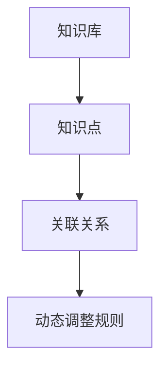
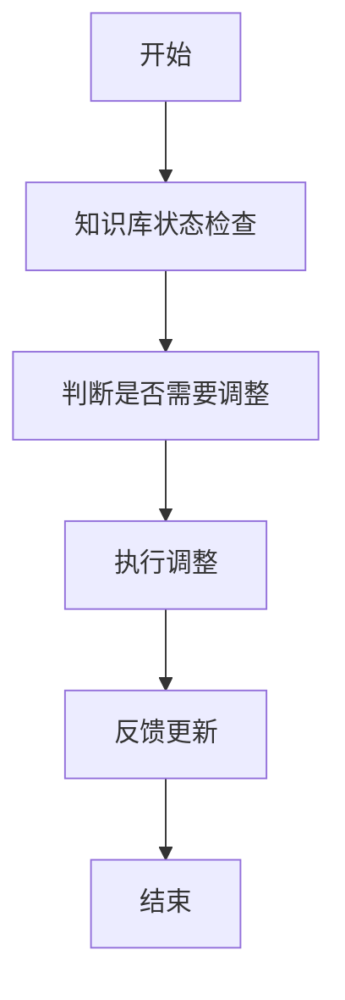
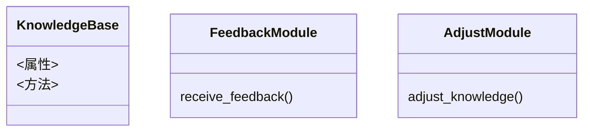

                 


# AI Agent 的知识编辑：动态调整 LLM 的知识库

## 关键词：AI Agent, 知识编辑, LLM, 动态知识库, 知识库管理, 人工智能代理, 大型语言模型

## 摘要：AI Agent需要动态调整其知识库以适应不断变化的环境和任务需求。本文详细探讨了如何有效地编辑和调整LLM的知识库，以增强AI Agent的性能和适应性。通过背景介绍、核心概念分析、算法原理讲解、系统设计与实战案例，本文为读者提供了一个全面的视角来理解动态知识库调整的必要性及其在AI Agent中的应用。

---

## 第一部分: AI Agent 的知识编辑基础

### 第1章: AI Agent与知识编辑概述

#### 1.1 AI Agent的基本概念
##### 1.1.1 AI Agent的定义与特点
AI Agent（人工智能代理）是指能够感知环境、自主决策并执行任务的智能实体。其特点包括自主性、反应性、目标导向和社交能力。

##### 1.1.2 知识编辑在AI Agent中的作用
知识编辑是AI Agent获取、处理和应用知识的过程，确保其能够根据环境变化做出适应性调整。

##### 1.1.3 动态知识库调整的必要性
AI Agent在动态环境中工作时，需要实时更新知识库以保持准确性，确保任务执行的有效性。

#### 1.2 LLM的基本原理
##### 1.2.1 大型语言模型的定义
LLM（Large Language Model）是一种基于深度学习的自然语言处理模型，能够理解和生成人类语言。

##### 1.2.2 LLM的核心技术与特点
LLM的核心技术包括神经网络、注意力机制和概率生成模型。其特点为高准确性和生成能力。

##### 1.2.3 LLM与知识库的关系
LLM依赖知识库提供上下文信息，而知识库则通过动态调整保持对模型的支持。

#### 1.3 动态调整知识库的背景与意义
##### 1.3.1 知识库动态调整的背景
随着信息的变化，静态知识库难以满足动态任务需求。

##### 1.3.2 动态调整知识库的意义
通过动态调整，知识库能够实时更新，确保AI Agent的信息准确性和决策能力。

##### 1.3.3 动态调整知识库的应用场景
适用于实时客服、智能推荐和动态知识问答等场景。

### 第2章: 知识编辑的核心概念与联系

#### 2.1 知识编辑的核心概念
##### 2.1.1 知识库的结构与组成
知识库由知识点、关联关系和动态调整规则组成。

##### 2.1.2 动态调整的机制与原理
动态调整机制包括检测、判断、执行和反馈四个步骤。

##### 2.1.3 知识编辑的边界与外延
知识编辑的边界在于数据范围，外延则涉及知识表示和推理。

#### 2.2 核心概念的属性对比
##### 2.2.1 知识编辑与传统知识库管理的对比
动态调整增加了实时性和自适应性。

##### 2.2.2 动态调整与静态知识库的差异
动态调整强调实时更新，静态知识库强调稳定性和一致性。

##### 2.2.3 知识编辑与机器学习的关系
知识编辑为机器学习提供数据支持，机器学习则为知识编辑提供优化方法。

#### 2.3 ER实体关系图


### 第3章: 动态调整知识库的算法原理

#### 3.1 算法原理概述
##### 3.1.1 动态调整的基本流程
流程包括知识检测、判断是否需要调整、执行调整和反馈更新。

##### 3.1.2 算法的核心思想
基于反馈机制，实时检测知识库状态并进行动态更新。

##### 3.1.3 算法的输入与输出
输入包括当前知识库状态和反馈信息，输出为调整后的知识库。

#### 3.2 算法流程图


#### 3.3 算法实现
##### 3.3.1 基于反馈机制的动态调整算法
```python
def dynamic_adjust(knowledge_base, feedback):
    if feedback['accuracy'] < 0.8:
        knowledge_base = update(knowledge_base, feedback)
    return knowledge_base
```

##### 3.3.2 数学模型与公式
动态调整的知识库更新公式：
$$
\text{new\_knowledge} = \text{knowledge} \oplus \text{feedback}
$$
其中，⊕表示融合操作。

---

## 第四部分: 项目实战与应用

### 第4章: 项目实战

#### 4.1 项目介绍
案例：动态调整知识库在智能客服中的应用。

#### 4.2 系统功能设计
##### 4.2.1 功能模块
知识库检测模块、调整模块、反馈模块和更新模块。

##### 4.2.2 领域模型


#### 4.3 系统架构设计
##### 4.3.1 系统架构图


#### 4.4 代码实现
##### 4.4.1 环境安装
Python 3.8及以上版本，安装相关库如numpy和pandas。

##### 4.4.2 核心代码实现
```python
def update_knowledge_base(current_knowledge, feedback):
    updated_knowledge = current_knowledge.copy()
    updated_knowledge['accuracy'] = max(
        updated_knowledge['accuracy'], 
        feedback['accuracy']
    )
    return updated_knowledge
```

##### 4.4.3 应用解读
通过反馈机制，实时更新知识库的准确性，提升AI Agent的响应质量。

#### 4.5 实际案例分析
以智能客服为例，展示动态调整知识库的实际效果和优势。

---

## 总结

动态调整LLM的知识库是提升AI Agent性能的关键。本文通过系统介绍和实践案例，详细阐述了动态调整的知识编辑方法，为读者提供了深入的理解和实际应用指导。

---

## 作者：AI天才研究院 & 禅与计算机程序设计艺术

