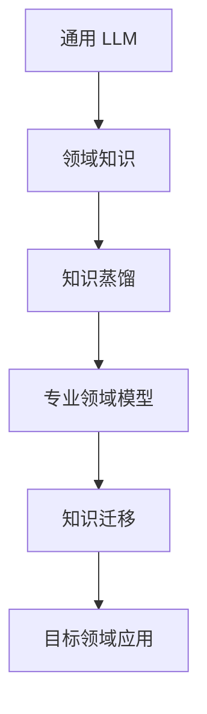

                 


# AI Agent 的知识蒸馏与迁移：从通用 LLM 到专业领域模型

> 关键词：AI Agent, 知识蒸馏, 知识迁移, 通用 LLM, 专业领域模型, 转移学习, 迁移学习

> 摘要：本文将深入探讨AI Agent的知识蒸馏与迁移这一重要技术，从通用大型语言模型（LLM）到专业领域模型的迁移过程。文章首先分析知识蒸馏与迁移的背景和核心概念，然后详细阐述知识蒸馏与迁移的算法原理，最后通过实际项目案例展示如何将通用LLM迁移至专业领域模型，并总结最佳实践和注意事项。

---

# 第1章: AI Agent 的知识蒸馏与迁移背景

## 1.1 问题背景与挑战

### 1.1.1 通用 LLM 的局限性

大型语言模型（LLM）如GPT系列在通用自然语言处理任务中表现出色，但在特定专业领域（如医疗、法律、金融等）的应用中存在以下问题：
- **领域适应性不足**：通用模型缺乏对特定领域的深度理解和专业知识。
- **计算资源消耗大**：直接在通用模型上微调专业领域数据需要大量计算资源。
- **知识更新困难**：通用模型难以快速适应领域内新增的知识和最新动态。

### 1.1.2 专业领域模型的需求

专业领域模型需要满足以下需求：
- **领域专用性**：模型必须深度理解特定领域的知识和术语。
- **高效性**：模型需要快速适应新数据和更新知识。
- **可解释性**：在医疗和法律等高风险领域，模型的决策需要可解释。

### 1.1.3 知识蒸馏与迁移的必要性

知识蒸馏与迁移技术可以将通用模型的知识提取并迁移到特定领域模型中，从而：
- **降低训练成本**：避免从头训练专业领域模型。
- **提高迁移效率**：快速适应新领域。
- **保持知识完整性**：确保领域模型具备通用模型的上下文理解能力。

---

## 1.2 问题描述与目标

### 1.2.1 知识蒸馏的核心问题

知识蒸馏的核心问题是将通用模型的潜在知识提取出来，并将其迁移到目标模型中。具体问题包括：
- 如何提取通用模型的知识表示？
- 如何设计蒸馏损失函数以保持知识的完整性？

### 1.2.2 知识迁移的关键挑战

知识迁移的关键挑战在于如何在目标领域中保持知识的适用性，具体包括：
- **领域适配性**：目标模型需要适应特定领域的数据分布。
- **知识表达方式**：目标模型需要以适合领域任务的形式表示知识。

### 1.2.3 目标与实现路径

知识蒸馏与迁移的目标是构建一个既具备通用理解能力，又适应特定领域需求的AI Agent。实现路径包括：
1. 从通用模型中提取知识表示。
2. 设计知识蒸馏算法，将知识迁移到目标模型。
3. 在目标领域数据上进行微调，优化模型性能。

---

## 1.3 问题解决与边界

### 1.3.1 知识蒸馏的解决方案

知识蒸馏的解决方案包括：
- **教师模型**：使用通用模型作为教师，为目标模型提供指导。
- **蒸馏损失函数**：设计损失函数，将教师模型的输出迁移到目标模型。

### 1.3.2 知识迁移的实现方法

知识迁移的实现方法包括：
- **迁移学习**：利用领域适应技术，将知识迁移到目标领域。
- **对抗训练**：通过对抗网络消除领域差异。

### 1.3.3 边界与外延分析

知识蒸馏与迁移的边界包括：
- **适用领域**：适用于需要从通用模型迁移知识的领域。
- **数据量限制**：目标领域需要有一定规模的数据支持微调。

---

## 1.4 核心概念与结构

### 1.4.1 核心概念组成

知识蒸馏与迁移的核心概念包括：
- **教师模型**：通用LLM。
- **学生模型**：目标领域模型。
- **蒸馏损失函数**：知识迁移的桥梁。

### 1.4.2 概念属性特征对比表

| 概念       | 属性             | 特征对比               |
|------------|------------------|------------------------|
| 教师模型    | 知识来源         | 通用LLM               |
| 学生模型    | 知识接收者       | 目标领域模型           |
| 蒸馏损失函数| 知识传递方式     | 将教师知识迁移到学生模型 |

### 1.4.3 ER实体关系图



---

## 1.5 本章小结

本章从背景、问题、目标、解决方案等多个角度分析了AI Agent的知识蒸馏与迁移技术，明确了其必要性和实现路径。

---

# 第2章: 知识蒸馏与迁移的核心概念

## 2.1 知识蒸馏原理

### 2.1.1 知识蒸馏的定义

知识蒸馏是一种将教师模型的知识迁移到学生模型的技术，通过蒸馏损失函数实现。

### 2.1.2 知识蒸馏的关键步骤

1. **提取教师模型的潜在表示**：获取教师模型的中间层输出。
2. **设计蒸馏损失函数**：将教师模型的输出迁移到学生模型。
3. **优化学生模型**：通过蒸馏损失函数优化学生模型参数。

### 2.1.3 知识蒸馏的数学模型

蒸馏损失函数可以表示为：

$$ L_{\text{distill}} = \alpha L_{\text{cls}} + (1-\alpha) L_{\text{kl}} $$

其中：
- $$ L_{\text{cls}} $$ 是分类损失。
- $$ L_{\text{kl}} $$ 是KL散度损失。
- $$ \alpha $$ 是平衡系数。

---

## 2.2 知识迁移原理

### 2.2.1 知识迁移的定义

知识迁移是将源领域知识迁移到目标领域的过程，通常通过对抗训练或领域适配技术实现。

### 2.2.2 知识迁移的实现方法

1. **领域适配**：通过域适配网络消除领域差异。
2. **对抗训练**：使用对抗网络保持领域一致性。

### 2.2.3 知识迁移的数学模型

领域适配损失可以表示为：

$$ L_{\text{adapt}} = \lambda L_{\text{source}} + (1-\lambda) L_{\text{target}} $$

其中：
- $$ L_{\text{source}} $$ 是源领域损失。
- $$ L_{\text{target}} $$ 是目标领域损失。
- $$ \lambda $$ 是平衡系数。

---

## 2.3 知识蒸馏与迁移的联系

### 2.3.1 知识蒸馏与迁移的关系

知识蒸馏与迁移是相辅相成的过程：
- 知识蒸馏负责知识的提取。
- 知识迁移负责知识的适配。

### 2.3.2 知识蒸馏与迁移的协同作用

知识蒸馏与迁移的协同作用体现在：
- 提高迁移效率。
- 保持知识完整性。

### 2.3.3 知识蒸馏与迁移的优化策略

优化策略包括：
- **渐进式蒸馏**：逐步将知识迁移到目标模型。
- **领域对抗训练**：通过对抗网络增强领域适应性。

---

## 2.4 本章小结

本章详细阐述了知识蒸馏与迁移的核心概念和实现原理，为后续的算法实现奠定了理论基础。

---

# 第3章: 知识蒸馏的算法原理

## 3.1 知识蒸馏算法概述

### 3.1.1 知识蒸馏算法的分类

知识蒸馏算法主要分为：
- **软蒸馏**：基于概率分布的蒸馏。
- **硬蒸馏**：基于类别标签的蒸馏。

### 3.1.2 知识蒸馏算法的优缺点

- **优点**：降低训练成本，保持知识完整性。
- **缺点**：需要教师模型的支持，计算资源消耗较大。

### 3.1.3 知识蒸馏算法的适用场景

适用于：
- 需要快速构建领域模型的场景。
- 计算资源有限的场景。

---

## 3.2 知识蒸馏算法的数学模型

### 3.2.1 知识蒸馏的损失函数

软蒸馏的损失函数可以表示为：

$$ L_{\text{distill}} = -\sum_{i=1}^{n} p_i \log q_i $$

其中：
- $$ p_i $$ 是教师模型的输出概率。
- $$ q_i $$ 是学生模型的输出概率。

### 3.2.2 知识蒸馏的优化目标

优化目标是通过最小化蒸馏损失函数，使学生模型的输出接近教师模型的输出。

### 3.2.3 知识蒸馏的数学公式

综合分类损失和蒸馏损失的总损失可以表示为：

$$ L = \alpha L_{\text{cls}} + (1-\alpha) L_{\text{distill}} $$

---

## 3.3 知识蒸馏算法的实现

### 3.3.1 算法实现的步骤

1. **加载教师模型**：加载预训练的通用模型。
2. **初始化学生模型**：定义目标领域的学生模型。
3. **定义蒸馏损失函数**：实现软蒸馏或硬蒸馏损失。
4. **优化学生模型**：通过反向传播优化学生模型参数。

### 3.3.2 算法实现的代码示例

以下是一个软蒸馏的Python实现示例：

```python
import torch
import torch.nn as nn

# 教师模型
teacher = ...  # 加载预训练模型
# 学生模型
student = ...  # 定义学生模型

# 定义蒸馏损失函数
class DistillLoss(nn.Module):
    def __init__(self, T=1):
        super(DistillLoss, self).__init__()
        self.T = T

    def forward(self, teacher_output, student_output):
        teacher_output = teacher_output / self.T
        student_output = student_output / self.T
        return nn.KLDivLoss(reduction='batchmean')(student_output, teacher_output) * self.T**2

# 初始化优化器
optimizer = torch.optim.Adam(student.parameters(), lr=1e-3)
# 训练过程
for batch in dataloader:
    inputs, labels = batch
    teacher_outputs = teacher(inputs)
    student_outputs = student(inputs)
    loss = DistillLoss()(teacher_outputs, student_outputs)
    optimizer.zero_grad()
    loss.backward()
    optimizer.step()
```

### 3.3.3 算法实现的优化技巧

优化技巧包括：
- **调整温度系数**：通过调整温度系数 $$ T $$ 改善蒸馏效果。
- **混合损失函数**：结合分类损失和蒸馏损失。

---

## 3.4 本章小结

本章详细介绍了知识蒸馏算法的实现原理和代码实现，为后续的知识迁移奠定了基础。

---

# 第4章: 知识迁移的算法原理

## 4.1 知识迁移算法概述

### 4.1.1 知识迁移算法的分类

知识迁移算法主要分为：
- **领域适配**：通过域适配网络消除领域差异。
- **对抗训练**：通过对抗网络保持领域一致性。

### 4.1.2 知识迁移算法的优缺点

- **优点**：提高模型的泛化能力。
- **缺点**：需要额外的计算资源。

### 4.1.3 知识迁移算法的适用场景

适用于：
- 数据分布差异较大的领域迁移。
- 需要保持领域一致性的场景。

---

## 4.2 知识迁移算法的数学模型

### 4.2.1 知识迁移的损失函数

领域适配损失可以表示为：

$$ L_{\text{adapt}} = \lambda L_{\text{source}} + (1-\lambda) L_{\text{target}} $$

其中：
- $$ L_{\text{source}} $$ 是源领域损失。
- $$ L_{\text{target}} $$ 是目标领域损失。
- $$ \lambda $$ 是平衡系数。

### 4.2.2 知识迁移的优化目标

优化目标是通过最小化领域适配损失，使源领域和目标领域数据的分布一致。

### 4.2.3 知识迁移的数学公式

综合领域适配和分类任务的总损失可以表示为：

$$ L = \alpha L_{\text{adapt}} + (1-\alpha) L_{\text{cls}} $$

---

## 4.3 知识迁移算法的实现

### 4.3.1 算法实现的步骤

1. **加载源领域数据**：加载通用领域的数据。
2. **加载目标领域数据**：加载特定领域的数据。
3. **定义域适配网络**：实现域适配模块。
4. **定义对抗训练模块**：实现对抗训练模块。
5. **优化模型参数**：通过反向传播优化模型参数。

### 4.3.2 算法实现的代码示例

以下是一个基于对抗训练的迁移学习代码示例：

```python
import torch
import torch.nn as nn

# 源领域数据
source_loader = ...  # 加载源领域数据
# 目标领域数据
target_loader = ...  # 加载目标领域数据
# 定义域适配网络
adapter = nn.Linear(256, 256)
# 定义对抗网络
 discriminator = nn.Linear(256, 1)
# 初始化优化器
adapter_optimizer = torch.optim.Adam(adapter.parameters(), lr=1e-3)
discrim

