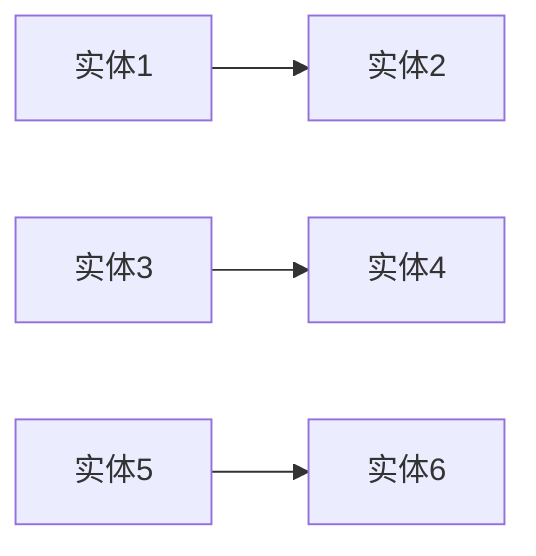
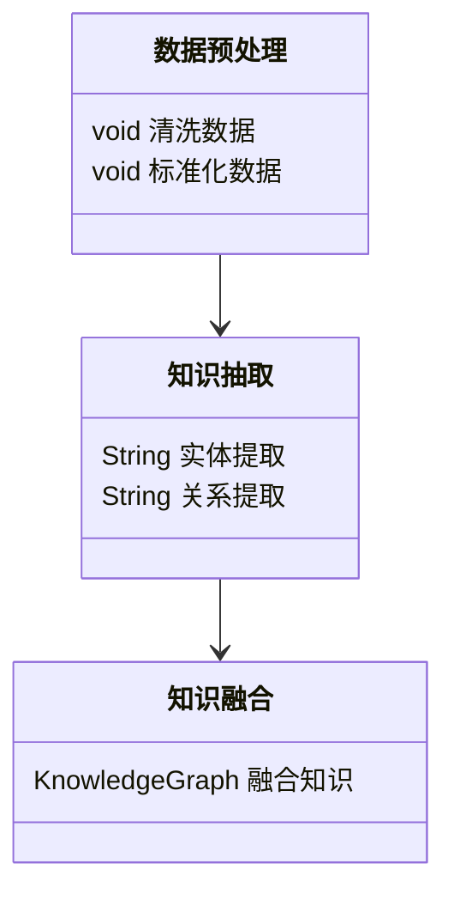
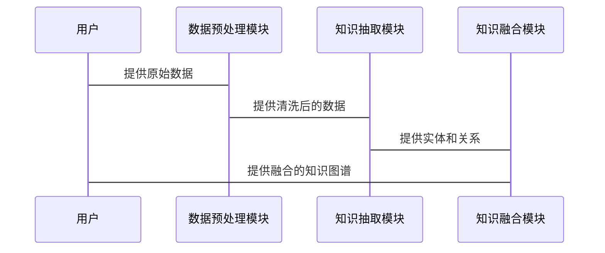

                 


# AI Agent 的知识融合：整合多源信息增强 LLM

## 关键词：
AI Agent, 知识融合, 多源信息, LLM, 知识图谱, 实体关系图, 系统架构设计

## 摘要：
本文详细探讨了AI Agent的知识融合技术，解释了如何整合多源信息以增强大语言模型（LLM）的能力。文章从背景介绍、核心概念、算法原理、系统设计到项目实战，全面解析了知识融合的实现过程，结合实际案例，提供了详细的代码示例和系统架构设计。通过本篇文章，读者可以系统地了解并掌握AI Agent的知识融合技术，提升LLM的性能和应用能力。

---

# 第一部分: AI Agent 的知识融合概述

## 第1章: AI Agent 与知识融合的背景介绍

### 1.1 AI Agent 的基本概念
#### 1.1.1 AI Agent 的定义与特点
- **定义**：AI Agent 是一种智能体，能够感知环境、执行任务并做出决策。
- **特点**：
  - 智能性：能够理解和处理复杂信息。
  - 自适应性：能够根据环境变化调整行为。
  - 社会性：能够与其他系统或人类交互协作。

#### 1.1.2 知识融合在 AI Agent 中的作用
- 知识融合是AI Agent 的核心能力，通过整合多源信息提升决策和执行能力。
- 知识融合帮助AI Agent更好地理解上下文，提供更准确的服务。

#### 1.1.3 LLM 与 AI Agent 的结合
- LLM（大语言模型）通过知识融合增强其语义理解和生成能力。
- 知识融合使AI Agent能够结合文本、结构化数据等多种信息源，提升其智能水平。

### 1.2 知识融合的背景与问题背景
#### 1.2.1 多源信息的挑战
- 数据来源多样化，包括文本、图像、结构化数据等。
- 数据格式多样，整合难度大。
- 数据可能存在冗余、噪声或冲突。

#### 1.2.2 知识融合的目标与意义
- 目标：将多源信息整合为一致、准确的知识表示。
- 意义：提升AI Agent 的智能水平，增强LLM的语义理解能力。

#### 1.2.3 当前技术的局限性
- 数据整合的复杂性：多源数据的异构性导致整合难度大。
- 知识抽取的准确性：如何从非结构化数据中准确提取知识是挑战。
- 知识融合的效率：大规模数据融合需要高效的算法。

### 1.3 知识融合的核心概念
#### 1.3.1 多源信息的类型与特点
- **文本数据**：非结构化数据，信息丰富但难以处理。
- **结构化数据**：表格数据，易于处理但信息有限。
- **图数据**：节点和边的表示，适合复杂关系的建模。

#### 1.3.2 知识融合的实现流程
1. 数据预处理：清洗、标准化、去重。
2. 知识抽取：从多源数据中提取实体、关系和属性。
3. 知识融合：将抽取的知识进行整合，消除冲突，构建统一的知识图谱。

#### 1.3.3 知识融合的边界与外延
- 边界：专注于多源信息的整合，不涉及后续应用。
- 外延：扩展到知识图谱的构建和应用，支持AI Agent 的决策过程。

### 1.4 本章小结
- 介绍了AI Agent 和知识融合的基本概念。
- 分析了多源信息的挑战和知识融合的意义。
- 描述了知识融合的实现流程和核心概念。

---

# 第二部分: 知识融合的核心概念与联系

## 第2章: 知识融合的核心概念与联系

### 2.1 多源信息的类型与特点
#### 2.1.1 文本数据
- 示例：新闻文章、社交媒体帖子。
- 特点：信息丰富，但需要自然语言处理技术提取关键信息。

#### 2.1.2 结构化数据
- 示例：数据库表、Excel表格。
- 特点：格式统一，便于处理，但信息量有限。

#### 2.1.3 图数据
- 示例：社交网络图、知识图谱。
- 特点：适合表示复杂关系，支持图计算。

### 2.2 知识融合的方法与选择
#### 2.2.1 基于规则的方法
- 使用预定义的规则进行数据清洗和整合。
- 优点：简单易懂，适用于规则明确的场景。
- 缺点：难以处理复杂或模糊的情况。

#### 2.2.2 基于统计的方法
- 使用统计模型分析数据，发现模式。
- 优点：适用于大数据场景，能够发现潜在关系。
- 缺点：需要大量数据支持，结果可能不够精确。

#### 2.2.3 基于学习的方法
- 使用机器学习模型进行知识融合。
- 优点：能够处理复杂关系，学习能力强。
- 缺点：需要大量标注数据，计算资源消耗大。

### 2.3 知识融合的实体关系图


### 2.4 知识融合的对比分析
#### 2.4.1 不同方法的优缺点对比
| 方法类型      | 优点                           | 缺点                           |
|----------------|--------------------------------|--------------------------------|
| 基于规则       | 简单易懂，规则明确               | 难以处理复杂或模糊的情况         |
| 基于统计       | 适用于大数据，发现潜在模式       | 需要大量数据，结果可能不够精确   |
| 基于学习       | 能够处理复杂关系，学习能力强     | 需要大量标注数据，资源消耗大     |

#### 2.4.2 实体关系图的构建与分析
- 通过实体关系图展示数据之间的关系，帮助理解数据结构。
- 分析实体关系图的复杂度和连通性，选择合适的知识融合方法。

### 2.5 本章小结
- 探讨了多源信息的类型及其特点。
- 对比分析了不同知识融合方法的优缺点。
- 使用实体关系图展示了知识融合的实现过程。

---

# 第三部分: 知识融合的算法原理

## 第3章: 知识融合的算法原理

### 3.1 知识融合的算法流程
#### 3.1.1 数据预处理
- 清洗数据：去除噪声、重复数据。
- 标准化：统一数据格式，便于后续处理。

#### 3.1.2 知识抽取
- 使用自然语言处理技术从文本中提取实体和关系。
- 示例：从新闻文章中提取“公司A”和“CEO”及其关系。

#### 3.1.3 知识融合
- 使用基于规则或学习的方法整合多源数据。
- 示例：将文本提取的关系与结构化数据中的关系进行对比和融合。

### 3.2 知识融合的算法实现
#### 3.2.1 数据预处理
```python
import pandas as pd

# 示例数据预处理代码
data = pd.read_csv('data.csv')
data.drop_duplicates(inplace=True)
data = data.dropna()
```

#### 3.2.2 知识抽取
```python
from spacy.lang.zh import Chinese
import spacy

nlp = Chinese()
doc = nlp("公司A的CEO是张三。")
entities = [ent.label_ for ent in doc.ents]
```

#### 3.2.3 知识融合
```python
import networkx as nx

G = nx.Graph()
G.add_edge("公司A", "张三", role="CEO")
```

### 3.3 知识融合的数学模型
#### 3.3.1 知识抽取的模型
$$ \text{实体提取} = f_{\text{抽取}}(text) $$

#### 3.3.2 知识融合的模型
$$ \text{融合结果} = g_{\text{融合}}(\text{实体1}, \text{实体2}, \dots) $$

### 3.4 本章小结
- 详细讲解了知识融合的算法流程。
- 提供了数据预处理和知识抽取的代码示例。
- 展示了知识融合的数学模型和实现方式。

---

# 第四部分: 知识融合的系统设计

## 第4章: 知识融合的系统架构设计

### 4.1 系统功能设计
#### 4.1.1 领域模型


#### 4.1.2 系统架构设计


#### 4.1.3 系统接口设计
- 数据预处理接口：接受原始数据，返回清洗后的数据。
- 知识抽取接口：接受清洗后的数据，返回提取的实体和关系。
- 知识融合接口：接受实体和关系，返回融合的知识图谱。

### 4.2 系统交互设计
#### 4.2.1 系统交互流程


### 4.3 本章小结
- 展示了知识融合系统的整体架构。
- 描述了系统各模块的功能和交互流程。
- 提供了系统接口设计的详细说明。

---

# 第五部分: 知识融合的项目实战

## 第5章: 知识融合的项目实战

### 5.1 项目背景
- 某公司希望整合新闻数据、公司信息和社交网络数据，构建企业知识图谱。

### 5.2 数据预处理
```python
import pandas as pd

# 示例数据预处理代码
data = pd.read_csv('data.csv')
data.drop_duplicates(inplace=True)
data = data.dropna()
```

### 5.3 知识抽取
```python
from spacy.lang.zh import Chinese
import spacy

nlp = Chinese()
doc = nlp("公司A的CEO是张三。")
entities = [ent.label_ for ent in doc.ents]
```

### 5.4 知识融合
```python
import networkx as nx

G = nx.Graph()
G.add_edge("公司A", "张三", role="CEO")
```

### 5.5 知识图谱的存储与应用
- 使用图数据库（如Neo4j）存储知识图谱。
- 在AI Agent 中应用知识图谱进行语义理解和服务推荐。

### 5.6 实际案例分析
- 案例1：新闻数据与公司信息的融合。
- 案例2：社交网络数据与知识图谱的结合。

### 5.7 本章小结
- 提供了知识融合项目的完整实现过程。
- 展示了知识图谱的构建与应用。
- 分析了实际案例，帮助读者理解知识融合的应用场景。

---

# 第六部分: 知识融合的最佳实践与总结

## 第6章: 知识融合的最佳实践

### 6.1 实践中的注意事项
- 数据质量：确保数据清洗和预处理的质量。
- 知识抽取的准确性：选择合适的NLP工具和模型。
- 知识融合的效率：优化算法和数据结构，提升处理速度。

### 6.2 知识融合的未来发展趋势
- 知识图谱的深度学习：结合图神经网络提升知识表示能力。
- 多模态数据融合：整合文本、图像等多种数据源。
- 实时知识融合：支持动态数据的实时处理。

### 6.3 本章小结
- 总结了知识融合的最佳实践。
- 展望了知识融合的未来发展趋势。

---

# 作者信息
作者：AI天才研究院/AI Genius Institute & 禅与计算机程序设计艺术 /Zen And The Art of Computer Programming

---

希望以上内容能满足您的需求。如果需要进一步修改或补充，请随时告诉我！

