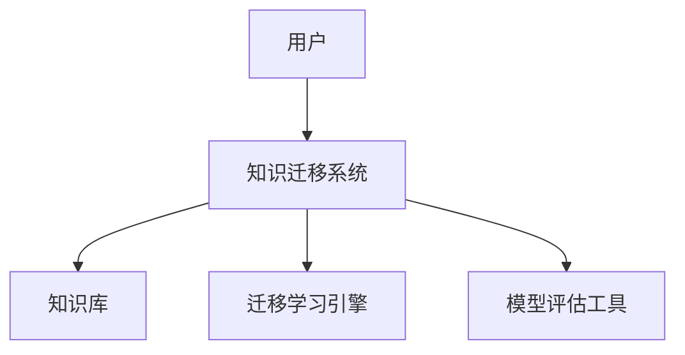
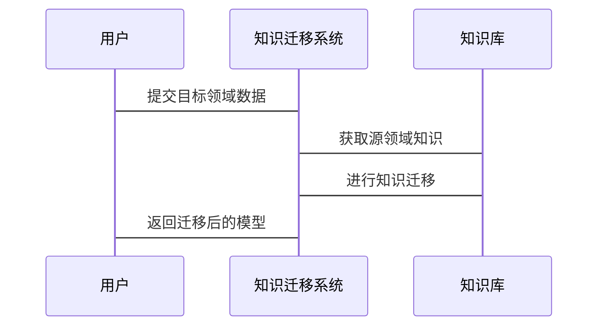

                 


# AI Agent 的知识迁移：跨领域应用 LLM 的能力

> **关键词**：AI Agent, 知识迁移, 大语言模型, 迁移学习, 跨领域应用

> **摘要**：本文探讨了AI Agent在跨领域应用中对大语言模型（LLM）的知识迁移能力。通过分析迁移学习的核心原理、算法实现、系统架构设计以及实际案例，揭示了AI Agent如何利用LLM进行高效的知识迁移，以实现跨领域任务的应用。文章还总结了知识迁移的关键点和未来研究方向，为技术开发者和研究人员提供了有价值的参考。

---

## 第一部分：背景与概述

### 第1章：AI Agent与知识迁移概述

#### 1.1 AI Agent的基本概念

AI Agent（人工智能代理）是指能够感知环境、自主决策并执行任务的智能实体。它可以是一个软件程序、机器人或其他智能系统，通过与环境交互，实现特定目标。

- **AI Agent的分类**：
  - **简单反射型**：基于规则执行任务，适用于简单场景。
  - **基于模型型**：通过内部模型推理环境状态，适用于复杂场景。
  - **目标驱动型**：以目标为导向，主动规划和执行任务。
  - **实用驱动型**：以效用最大化为目标，动态调整策略。

**知识迁移的基本概念**：知识迁移是指将一个领域的知识、技能或经验应用到另一个领域的能力。在AI Agent中，知识迁移的核心在于将LLM在源领域学到的知识，有效地应用到目标领域。

---

#### 1.2 LLM的基本原理

大语言模型（LLM）通过监督学习和强化学习训练，具备强大的文本生成和理解能力。LLM的知识来源于大量的训练数据，能够通过上下文推理解决问题。

- **LLM的核心能力**：
  - **文本生成**：生成连贯、合理的文本。
  - **文本理解**：理解上下文语义。
  - **推理能力**：基于上下文进行逻辑推理。

**知识迁移的必要性**：由于LLM是在特定领域数据上训练的，直接应用到其他领域时可能效果不佳。因此，通过知识迁移，可以增强LLM在跨领域的适应能力。

---

#### 1.3 知识迁移的背景与重要性

- **知识迁移的背景**：
  - AI Agent需要在不同领域中灵活应用，知识迁移是实现这一目标的关键。
  - LLM的知识局限性：LLM在训练数据中的知识可能无法覆盖所有领域，需要通过知识迁移进行扩展。

- **知识迁移的重要性**：
  - 提高AI Agent的适应性。
  - 扩展LLM的应用范围。
  - 降低跨领域应用的成本。

---

## 第二部分：核心概念与原理

### 第2章：知识迁移的核心原理

#### 2.1 迁移学习的基本原理

迁移学习是一种机器学习技术，通过将源领域学到的知识迁移到目标领域，提高目标领域的学习效率和性能。

- **迁移学习的分类**：
  - **有监督迁移学习**：基于标注数据进行迁移。
  - **无监督迁移学习**：基于未标注数据进行迁移。
  - **半监督迁移学习**：结合标注和未标注数据。

**知识迁移的关键步骤**：
1. **特征提取**：提取源领域和目标领域的共同特征。
2. **模型调整**：调整模型参数，适应目标领域。
3. **知识整合**：将源领域的知识整合到目标领域。

---

#### 2.2 LLM在迁移中的角色

- **LLM作为知识源**：
  - LLM通过大规模预训练，积累了丰富的知识，可以作为知识迁移的来源。
  - 通过微调（Fine-tuning）或提示（Prompt）方式，将LLM的知识迁移到目标领域。

- **知识迁移的策略**：
  - **领域适配**：调整LLM的参数，使其适应目标领域。
  - **领域混合**：将多个领域的知识混合，提高模型的泛化能力。

---

## 第三部分：算法原理与数学模型

### 第3章：迁移学习的算法原理

#### 3.1 迁移学习的算法步骤

以下是迁移学习的基本算法步骤：

1. **数据预处理**：对源领域和目标领域的数据进行清洗和标注。
2. **特征提取**：提取数据的特征向量。
3. **模型训练**：在源领域数据上训练模型。
4. **知识迁移**：调整模型参数，使其适应目标领域。
5. **模型评估**：在目标领域数据上评估模型的性能。

---

#### 3.2 基于LLM的迁移算法实现

以下是基于LLM的迁移学习算法实现的伪代码：

```python
def knowledge_transfer(source_data, target_data, model):
    # 在源领域数据上微调模型
    fine_tune_model(model, source_data)
    # 在目标领域数据上评估模型
    evaluate_model(model, target_data)
    # 返回迁移后的模型
    return model
```

---

#### 3.3 数学模型与公式

以下是一个简单的迁移学习模型的数学表达式：

$$
\theta_{\text{target}} = \theta_{\text{source}} + \alpha (\theta_{\text{target}} - \theta_{\text{source}})
$$

其中：
- $\theta_{\text{source}}$：源领域的模型参数。
- $\theta_{\text{target}}$：目标领域的模型参数。
- $\alpha$：调整系数。

---

## 第四部分：系统分析与架构设计

### 第4章：AI Agent的知识迁移系统

#### 4.1 系统功能设计

以下是知识迁移系统的功能模块：

1. **知识库管理**：管理源领域和目标领域的知识库。
2. **迁移学习引擎**：执行迁移学习算法。
3. **模型评估工具**：评估迁移后的模型性能。

---

#### 4.2 系统架构设计

以下是知识迁移系统的架构设计图：



---

#### 4.3 接口与交互设计

以下是知识迁移系统的交互序列图：



---

## 第五部分：项目实战

### 第5章：跨领域应用实战

#### 5.1 项目环境与工具安装

以下是项目环境配置示例：

```bash
# 安装依赖
pip install transformers
pip install torch
pip install mermaid
```

---

#### 5.2 核心代码实现

以下是知识迁移的核心代码实现：

```python
from transformers import AutoTokenizer, AutoModelForCausalLM
import torch

def knowledge_transfer(model, source_data, target_data):
    # 微调模型
    model.train()
    optimizer = torch.optim.Adam(model.parameters(), lr=1e-5)
    for batch in source_data:
        optimizer.zero_grad()
        outputs = model(batch)
        loss = outputs.loss
        loss.backward()
        optimizer.step()
    # 评估模型
    for batch in target_data:
        with torch.no_grad():
            outputs = model(batch)
    return model
```

---

#### 5.3 案例分析与效果评估

以下是一个跨领域应用的案例分析：

**案例**：将医疗领域的LLM迁移到法律领域。

- **数据预处理**：医疗领域的数据和法律领域的数据分别进行清洗和标注。
- **模型微调**：在医疗领域数据上微调模型。
- **模型评估**：在法律领域数据上评估模型的性能。

---

## 第六部分：总结与展望

### 第6章：总结与最佳实践

#### 6.1 知识迁移的关键点

- **特征提取**：提取源领域和目标领域的共同特征。
- **模型调整**：调整模型参数，适应目标领域。
- **知识整合**：将源领域的知识整合到目标领域。

---

#### 6.2 实际应用中的注意事项

- **数据质量**：确保源领域和目标领域的数据质量。
- **模型选择**：选择适合知识迁移的模型。
- **评估指标**：选择合适的评估指标。

---

#### 6.3 未来研究方向

- **多领域知识迁移**：研究如何在多个领域之间进行知识迁移。
- **自适应迁移学习**：研究如何实现自适应的迁移学习。
- **强化学习与迁移学习结合**：研究如何将强化学习与迁移学习结合。

---

## 作者：AI天才研究院/AI Genius Institute & 禅与计算机程序设计艺术 /Zen And The Art of Computer Programming

---

**本文是基于对AI Agent和知识迁移的深入研究，结合实际案例和系统设计，为技术开发者和研究人员提供有价值的参考。**

