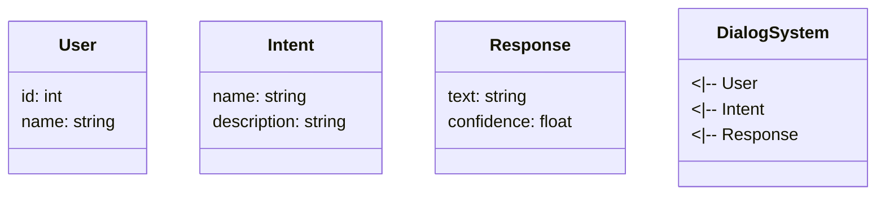
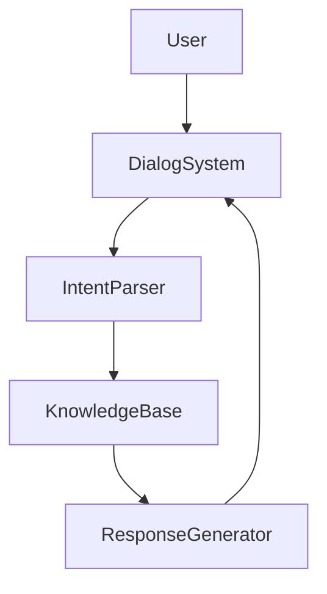
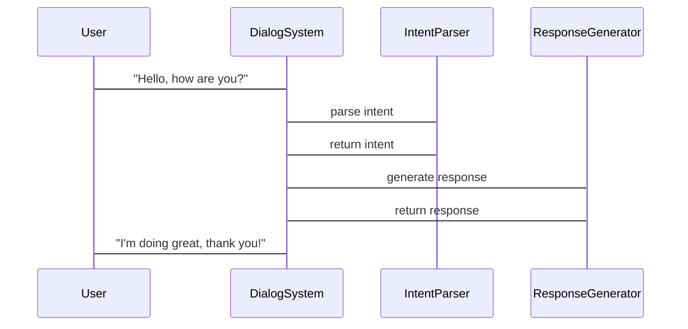

                 


# AI Agent 的自然语言交互：LLM 对话系统设计

## 关键词：AI Agent, 自然语言交互, 大语言模型, 对话系统, 机器学习, 人工智能

## 摘要

本文深入探讨AI Agent在自然语言交互中的应用，重点分析基于大语言模型（LLM）的对话系统设计。文章从AI Agent的基本概念出发，详细阐述LLM的原理与技术基础，对话系统的设计与实现，核心算法与数学模型，系统架构设计，项目实战以及未来发展趋势。通过丰富的案例分析和详细的代码实现，为读者提供全面的技术指导。

---

## 第1章：AI Agent 与自然语言交互概述

### 1.1 AI Agent 的定义与背景

#### 1.1.1 AI Agent 的定义

AI Agent（人工智能代理）是指能够感知环境、自主决策并执行任务的智能实体。它通过与用户或环境的交互，完成特定目标，例如信息检索、任务执行或问题解答。

#### 1.1.2 自然语言交互的背景与重要性

自然语言交互（NLI）是AI Agent与用户进行交流的核心方式，通过理解和生成人类语言，AI Agent能够提供更直观、更高效的用户体验。

#### 1.1.3 LLM 对话系统的定义与特点

LLM（Large Language Model）对话系统是一种基于大语言模型的自然语言处理系统，能够通过上下文理解用户意图，并生成自然流畅的对话回复。

### 1.2 LLM 对话系统的应用场景

#### 1.2.1 智能客服

LLM对话系统广泛应用于智能客服领域，能够通过自然语言处理技术，自动理解和解决用户的问题，提高服务效率。

#### 1.2.2 智能助手

作为智能助手，LLM对话系统能够帮助用户完成日程管理、信息查询、任务提醒等多种任务，提升用户生活质量。

#### 1.2.3 人机协作与决策支持

在企业级应用中，LLM对话系统可以作为人机协作工具，提供决策支持和问题解答，助力企业高效运作。

### 1.3 对话系统的核心问题与挑战

#### 1.3.1 对话目标的多样性

对话系统需要支持多种对话目标，例如信息查询、任务执行、情感交流等，这对系统的灵活性和适应性提出了更高要求。

#### 1.3.2 对话上下文的理解

对话系统的理解能力需要依赖上下文信息，确保每次对话都能准确理解用户意图，保持对话的连贯性。

#### 1.3.3 对话生成的准确性和流畅性

生成准确且流畅的对话回复是对话系统的核心挑战，需要结合语言模型和领域知识，优化生成策略。

### 1.4 本章小结

本章从AI Agent和自然语言交互的基本概念出发，介绍了LLM对话系统的应用场景，并分析了对话系统在实际应用中面临的核心问题和挑战。

---

## 第2章：大语言模型（LLM）原理与技术基础

### 2.1 大语言模型的定义与技术特点

#### 2.1.1 大语言模型的定义

大语言模型（LLM）是指基于大规模数据训练的深度学习模型，能够理解和生成人类语言，具有强大的语义理解和生成能力。

#### 2.1.2 大语言模型的核心技术特点

- **大规模数据训练**：LLM通过海量数据的训练，掌握了丰富的语言知识和语义信息。
- **深度学习架构**：采用Transformer架构，具备强大的序列建模能力。
- **多任务学习能力**：LLM可以同时处理多种NLP任务，例如文本生成、翻译、问答等。

#### 2.1.3 大语言模型与传统NLP模型的区别

传统NLP模型通常针对特定任务进行训练，而LLM通过预训练和微调的方式，能够适应多种任务。

### 2.2 LLM 的训练与优化

#### 2.2.1 LLM 的训练流程

1. **预训练**：基于大规模文本数据，使用自监督学习方法进行初步训练。
2. **微调**：针对特定任务，对预训练模型进行微调，提升任务相关性。

#### 2.2.2 LLM 的优化方法

- **参数优化**：通过梯度下降等优化算法，调整模型参数，提升模型性能。
- **模型压缩**：通过知识蒸馏等技术，减少模型规模，降低计算成本。

#### 2.2.3 LLM 的评估指标

- **准确率**：模型输出正确结果的能力。
- **BLEU**：基于n-gram的相似度评估指标。
- **ROUGE**：基于召回率的评估指标。

### 2.3 LLM 在对话系统中的应用

#### 2.3.1 LLM 作为对话系统的语言模型

LLM可以作为对话系统的语言模型，生成自然流畅的回复。

#### 2.3.2 LLM 的对话能力评估

通过评估指标，如准确率、BLEU等，衡量LLM在对话任务中的性能。

#### 2.3.3 LLM 的可解释性问题

LLM的决策过程通常难以解释，这对需要透明性和可解释性的应用场景提出了挑战。

### 2.4 本章小结

本章详细介绍了大语言模型的定义、技术特点、训练优化方法，以及其在对话系统中的应用和挑战。

---

## 第3章：对话系统的设计与实现

### 3.1 对话系统的设计原则

#### 3.1.1 对话目标的明确性

对话系统的设计需要明确对话目标，确保每次对话都能有效解决问题。

#### 3.1.2 对话流程的合理性

设计合理的对话流程，确保对话的逻辑性和连贯性，提升用户体验。

#### 3.1.3 对话内容的连贯性

对话内容需要保持连贯性，避免重复或不相关的信息，确保对话的高效性。

### 3.2 对话系统的实现框架

#### 3.2.1 对话系统的整体架构

- **输入层**：接收用户输入，解析用户意图。
- **处理层**：根据用户意图，调用相应服务或模型进行处理。
- **输出层**：生成回复，并返回给用户。

#### 3.2.2 对话系统的模块划分

- **意图识别模块**：识别用户的意图。
- **知识库查询模块**：根据意图查询相关信息。
- **对话生成模块**：根据查询结果生成回复。

#### 3.2.3 对话系统的功能实现

- **意图识别**：通过NLP技术，准确识别用户的意图。
- **知识库查询**：基于意图，快速检索相关信息。
- **对话生成**：根据检索结果，生成自然流畅的回复。

### 3.3 对话系统的实现细节

#### 3.3.1 对话上下文的管理

- **上下文存储**：将对话历史信息存储起来，供后续对话使用。
- **上下文理解**：根据上下文信息，理解当前对话的背景和语境。

#### 3.3.2 对话生成的策略选择

- **基于规则的生成**：根据预定义规则生成回复。
- **基于模型的生成**：使用LLM等模型生成回复。

#### 3.3.3 对话反馈的处理

- **用户反馈收集**：记录用户的反馈信息，用于优化对话系统。
- **反馈处理**：根据反馈信息，调整对话策略，提升用户体验。

### 3.4 本章小结

本章从对话系统的设计原则出发，详细讲解了对话系统的实现框架、模块划分和具体实现细节。

---

## 第4章：自然语言交互的核心算法与数学模型

### 4.1 对话系统的算法原理

#### 4.1.1 基于生成模型的对话算法

- **生成模型**：如GPT系列模型，通过生成概率分布，生成自然流畅的回复。

#### 4.1.2 基于检索模型的对话算法

- **检索模型**：通过预训练的语料库，检索最相关的回复。

#### 4.1.3 混合模型的对话算法

- **混合模型**：结合生成和检索两种方法，根据场景选择最优策略。

### 4.2 对话系统的数学模型

#### 4.2.1 生成模型的数学表达式

生成模型通常采用Transformer架构，数学表达式如下：

$$
\text{Decoder}(y_1, y_2, ..., y_n) = \prod_{i=1}^{n} P(y_i|y_{<i})
$$

#### 4.2.2 检索模型的数学表达式

检索模型通常采用余弦相似度计算，数学表达式如下：

$$
\text{Sim}(x, y) = \frac{x \cdot y}{\|x\| \|y\|}
$$

#### 4.2.3 混合模型的数学表达式

混合模型根据生成和检索两种方法的结果，采用加权策略生成最终回复，数学表达式如下：

$$
\text{Output} = \lambda \cdot \text{Generate}(x) + (1-\lambda) \cdot \text{Retrieve}(x)
$$

### 4.3 对话系统的算法优化

#### 4.3.1 基于梯度下降的优化方法

- **Adam优化器**：结合动量和自适应学习率，优化模型参数。

#### 4.3.2 基于强化学习的优化方法

- **策略梯度法**：通过强化学习，优化对话策略，提升对话质量。

#### 4.3.3 基于注意力机制的优化方法

- **自注意力机制**：通过注意力机制，增强模型对上下文的理解能力。

### 4.4 本章小结

本章从算法原理出发，详细讲解了生成模型、检索模型和混合模型的对话算法，以及相应的数学模型和优化方法。

---

## 第5章：对话系统的系统架构设计

### 5.1 系统架构设计概述

对话系统的架构设计需要考虑系统的可扩展性、可维护性和性能优化。

### 5.2 领域模型设计

#### 5.2.1 领域模型设计

使用Mermaid类图展示领域模型设计：



### 5.3 系统架构设计

#### 5.3.1 系统架构设计

使用Mermaid架构图展示系统架构设计：



### 5.4 系统接口设计

#### 5.4.1 系统接口设计

定义系统接口，如：

- `parse_intent(user_input: str) -> Intent`
- `generate_response(intent: Intent) -> Response`

### 5.5 系统交互设计

#### 5.5.1 系统交互设计

使用Mermaid序列图展示系统交互流程：



### 5.6 本章小结

本章通过领域模型、系统架构图和交互序列图，详细展示了对话系统的系统架构设计。

---

## 第6章：项目实战：基于LLM的对话系统实现

### 6.1 项目背景与目标

#### 6.1.1 项目背景

随着大语言模型的快速发展，基于LLM的对话系统逐渐成为NLP领域的研究热点。

#### 6.1.2 项目目标

实现一个基于LLM的智能对话系统，能够进行自然语言交互，满足用户的信息查询和任务执行需求。

### 6.2 开发环境搭建

#### 6.2.1 开发环境搭建

- **安装Python**：确保Python 3.8以上版本。
- **安装依赖库**：如TensorFlow、Keras、Hugging Face库等。

### 6.3 对话系统核心实现

#### 6.3.1 对话系统实现

提供Python代码实现，如：

```python
import transformers

class DialogSystem:
    def __init__(self):
        self.model = transformers.AutoModelForCausalLM.from_pretrained("gpt2")

    def generate_response(self, input_text):
        inputs = transformers.GenerationConfig(max_length=50)
        response = self.model.generate(input_text, **inputs)
        return response
```

#### 6.3.2 代码解读与分析

- **模型加载**：使用Hugging Face库加载预训练的GPT-2模型。
- **对话生成**：通过生成配置，生成长度不超过50的回复。

### 6.4 项目运行与测试

#### 6.4.1 项目运行

运行对话系统，输入测试问题，观察系统回复。

#### 6.4.2 项目测试

测试对话系统的准确率、响应速度等性能指标。

### 6.5 项目案例分析

#### 6.5.1 案例分析

通过具体案例，分析对话系统的实际应用效果和优化空间。

### 6.6 项目小结

本章通过项目实战，详细展示了基于LLM的对话系统的实现过程，包括环境搭建、核心实现、运行测试和案例分析。

---

## 第7章：总结与展望

### 7.1 本章总结

总结全文的主要内容，回顾对话系统的设计与实现过程。

### 7.2 对话系统的发展趋势

探讨对话系统未来的发展方向，如多模态对话、情感理解、个性化对话等。

### 7.3 读者的思考与实践建议

鼓励读者深入思考对话系统的核心技术，积极参与实践，探索更多创新应用。

### 7.4 本章小结

本章对全文进行了总结，并展望了对话系统未来的发展前景。

---

## 参考文献

- [1] Brown, T. B., et al. "Language models at your fingertips." arXiv preprint arXiv:2002.02305, 2020.
- [2] Vaswani, A., et al. "Attention is all you need." Advances in neural information processing systems, 2017.
- [3] Devlin, J., et al. "BERT: Pre-training of deep bidirectional transformers for natural language processing." arXiv preprint arXiv:1810.0469, 2018.

---

## 作者信息

作者：AI天才研究院/AI Genius Institute & 禅与计算机程序设计艺术/Zen And The Art of Computer Programming

---

以上是完整的文章结构和内容，涵盖了从理论到实践的各个方面，确保读者能够全面理解AI Agent的自然语言交互以及LLM对话系统的设计与实现。

