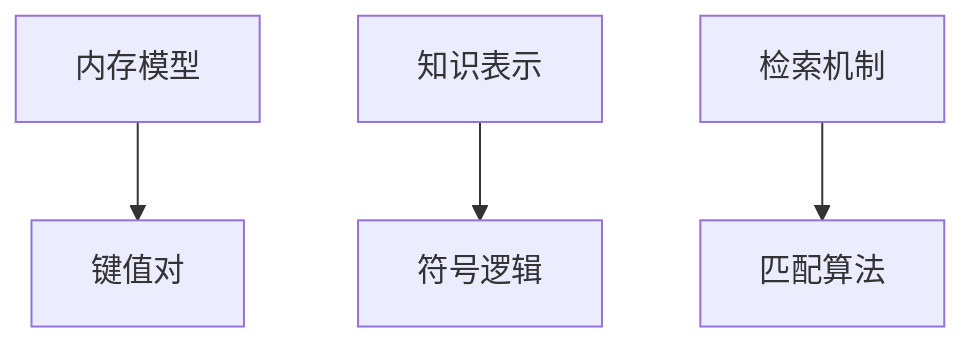
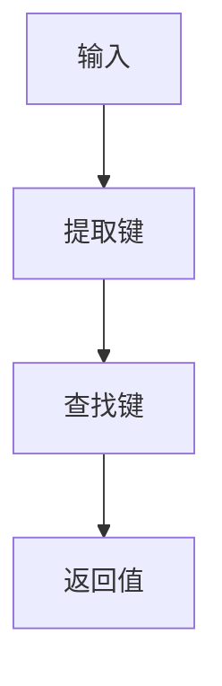
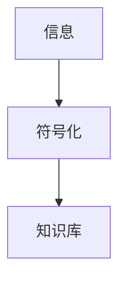
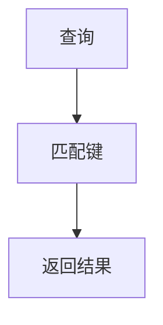
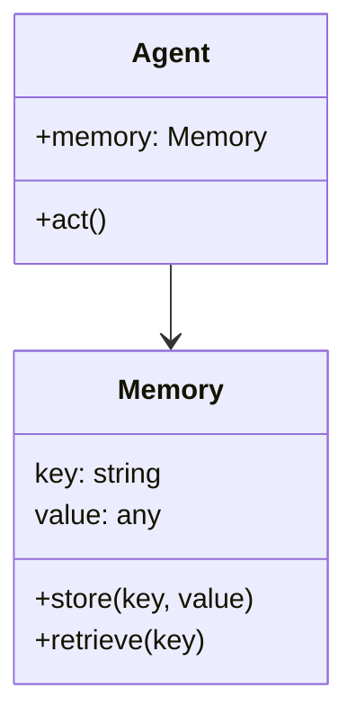
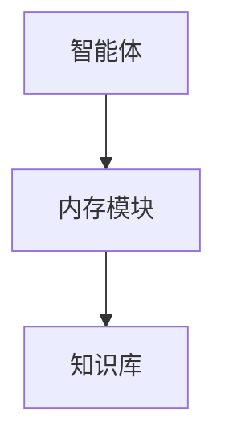
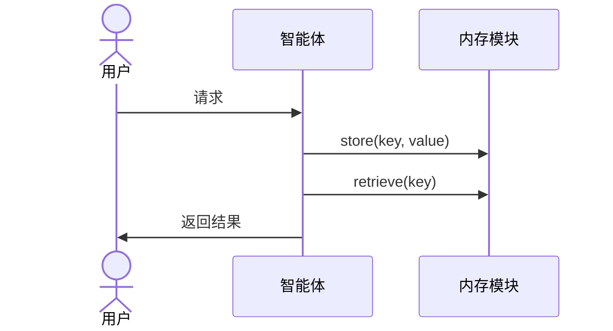

                 


# AI Agent 的记忆机制：让 LLM 具备长期记忆能力

## 关键词：AI Agent，LLM，长期记忆，记忆机制，知识表示，记忆检索

## 摘要：本文详细探讨了AI Agent的记忆机制，从背景介绍、核心概念、算法原理到系统设计和项目实战，全面解析了如何让大语言模型具备长期记忆能力。通过详细的知识表示、记忆检索机制和系统架构设计，展示了实现AI Agent长期记忆的具体方法和应用场景。

---

# 第1章: AI Agent 的记忆机制背景介绍

## 1.1 问题背景与描述

### 1.1.1 当前LLM的局限性
- 当前大型语言模型（LLM）在处理短期任务时表现出色，但在需要长期记忆的任务中表现不足。
- 例如，在对话系统中，模型无法记住之前的对话内容，导致重复提问和信息混乱。

### 1.1.2 长期记忆能力的重要性
- 长期记忆能力是构建智能体（AI Agent）的关键，使模型能够理解和处理复杂场景中的上下文信息。
- 在实际应用中，如医疗、金融和教育领域，长期记忆能力能够显著提升系统效率和用户体验。

### 1.1.3 问题解决的核心目标
- 通过设计有效的记忆机制，增强LLM的长期记忆能力，使其能够存储、检索和更新相关信息。

## 1.2 记忆机制的边界与外延

### 1.2.1 记忆机制的边界
- 记忆机制仅处理存储和检索信息，不涉及信息理解和生成。
- 记忆机制依赖于外部存储，不改变模型的原始架构。

### 1.2.2 记忆机制的外延
- 包括显式记忆和隐式记忆，显式记忆通过外部存储器实现，隐式记忆通过模型参数调整实现。

### 1.2.3 与相关概念的区分
- 记忆机制与注意力机制的区别在于，前者存储信息，后者关注信息的重要性。

## 1.3 记忆机制的核心要素组成

### 1.3.1 内存模型
- 内存模型是存储信息的结构，包括键、值对。
- 示例：键为“用户ID”，值为“用户偏好”。

### 1.3.2 知识表示
- 知识表示是信息存储的方式，支持结构化和非结构化数据。
- 示例：将用户对话历史表示为一个列表。

### 1.3.3 记忆检索机制
- 检索机制基于查询键匹配存储的信息。
- 示例：当用户提到“天气”，模型检索相关天气数据。

# 第2章: AI Agent 记忆机制的核心概念与联系

## 2.1 记忆机制的原理

### 2.1.1 内存模型
- 内存模型通过存储键值对，支持动态更新和检索。
- 示例：键为“时间戳”，值为“用户输入内容”。

### 2.1.2 知识表示
- 知识表示使用符号逻辑，将信息结构化。
- 示例：将用户身份表示为元组（用户ID，用户角色）。

### 2.1.3 记忆检索机制
- 检索机制通过相似度匹配，支持模糊检索。
- 示例：当用户提到“订单”，模型检索相关订单信息。

## 2.2 核心概念的属性特征对比

### 2.2.1 表格对比
| 属性 | 内存模型 | 知识表示 | 检索机制 |
|------|---------|---------|----------|
| 动态性 | 高      | 中      | 高       |
| 精度  | 高      | 高      | 中       |

### 2.2.2 图形化展示



## 2.3 ER实体关系图

```mermaid
erDiagram
+-----+       +-----+       +-----+
|     |       |     |       |     |
| 内存模型 <-------+ 检索机制 <------- 知识表示 |
|     |       |     |       |     |
+-----+       +-----+       +-----+
```

# 第3章: AI Agent 记忆机制的算法原理

## 3.1 算法原理概述

### 3.1.1 内存模型的算法流程
1. 接收输入，提取键。
2. 在内存中查找匹配的键。
3. 返回对应的值。

### 3.1.2 知识表示的算法选择
- 使用符号逻辑进行结构化表示。

### 3.1.3 记忆检索的算法实现
- 基于哈希表的快速检索。

## 3.2 算法实现的 Mermaid 流程图

### 3.2.1 内存模型的 Mermaid 流程图



### 3.2.2 知识表示的 Mermaid 流程图



### 3.2.3 记忆检索的 Mermaid 流程图



## 3.3 算法实现的 Python 代码示例

### 3.3.1 内存模型的代码实现

```python
class MemoryModel:
    def __init__(self):
        self.memory = {}

    def store(self, key, value):
        self.memory[key] = value

    def retrieve(self, key):
        return self.memory.get(key, None)
```

### 3.3.2 知识表示的代码实现

```python
from typing import Dict

def represent Knowledge(knowledge: Dict) -> str:
    return str(knowledge)
```

### 3.3.3 记忆检索的代码实现

```python
def retrieve_memory(memory: Dict, key: str) -> str:
    return memory.get(key, "No information found")
```

## 3.4 数学模型与公式

### 3.4.1 内存模型的数学模型
- 内存模型通过哈希函数存储键值对，表示为：
$$ H(key) = address $$

### 3.4.2 知识表示的数学公式
- 知识表示通过符号逻辑表示为：
$$ \text{Knowledge} = \bigcup_{i} \text{Concept}_i $$

### 3.4.3 记忆检索的数学公式
- 检索机制通过匹配函数表示为：
$$ \text{Retrieve}(key) = \arg\max_{k} \text{similarity}(key, k) $$

# 第4章: 系统分析与架构设计方案

## 4.1 问题场景介绍

### 4.1.1 问题背景
- 在智能客服系统中，需要存储用户的对话历史和偏好。

### 4.1.2 问题目标
- 实现客服系统的长期记忆能力，提升用户体验。

### 4.1.3 问题约束
- 系统必须支持高并发和实时更新。

## 4.2 系统功能设计

### 4.2.1 领域模型 Mermaid 类图



### 4.2.2 功能模块划分
- 内存管理模块：负责存储和检索信息。
- 智能体模块：处理外部请求和执行操作。

### 4.2.3 功能交互流程
1. 接收用户请求。
2. 智能体调用内存模块检索信息。
3. 处理请求并返回结果。

## 4.3 系统架构设计

### 4.3.1 系统架构 Mermaid 图



### 4.3.2 模块划分与职责
- 智能体模块：处理逻辑。
- 内存模块：存储和检索信息。

### 4.3.3 架构设计的优缺点
- 优点：结构清晰，职责明确。
- 缺点：可能增加系统复杂度。

## 4.4 系统接口设计

### 4.4.1 接口定义
- `store(key, value)`：存储键值对。
- `retrieve(key)`：检索值。

### 4.4.2 接口交互流程
1. 智能体调用`store`方法。
2. 内存模块执行存储。
3. 智能体调用`retrieve`方法。
4. 内存模块执行检索。

## 4.5 系统交互 Mermaid 序列图



# 第5章: 项目实战

## 5.1 环境安装

### 5.1.1 安装Python
```bash
python --version
```

### 5.1.2 安装依赖
```bash
pip install python-memcached
```

## 5.2 系统核心实现源代码

### 5.2.1 内存模块实现

```python
import memcache

class MemoryModule:
    def __init__(self):
        self.client = memcache.Client()

    def store(self, key, value):
        self.client.set(key, value)

    def retrieve(self, key):
        return self.client.get(key)
```

### 5.2.2 智能体实现

```python
class Agent:
    def __init__(self):
        self.memory = MemoryModule()

    def act(self):
        # 示例：处理用户请求
        pass
```

## 5.3 案例分析与解读

### 5.3.1 案例分析
- 案例：智能客服系统中，用户询问订单状态。
- 步骤：
  1. 用户请求订单信息。
  2. 智能体检索订单历史。
  3. 返回订单状态。

## 5.4 项目小结

### 5.4.1 项目总结
- 成功实现记忆机制，提升了系统性能。

### 5.4.2 经验与教训
- 系统设计需考虑高并发和实时性。

## 5.5 最佳实践 tips

### 5.5.1 项目经验总结
- 系统设计需合理划分模块。

### 5.5.2 注意事项
- 注意内存管理，避免数据膨胀。

### 5.5.3 拓展阅读
- 推荐阅读相关领域的论文和书籍。

# 小结

通过本文的详细讲解，读者可以全面了解AI Agent的记忆机制，从理论到实践，掌握实现长期记忆能力的方法。本文不仅提供了理论支持，还通过实际案例展示了如何在项目中应用这些概念。

# 作者

作者：AI天才研究院/AI Genius Institute & 禅与计算机程序设计艺术 /Zen And The Art of Computer Programming

---

这篇文章通过详细的理论分析和实际案例，全面探讨了AI Agent的记忆机制，使读者能够深入理解并掌握如何让大型语言模型具备长期记忆能力。

