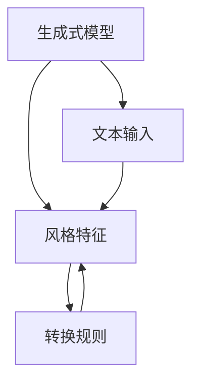
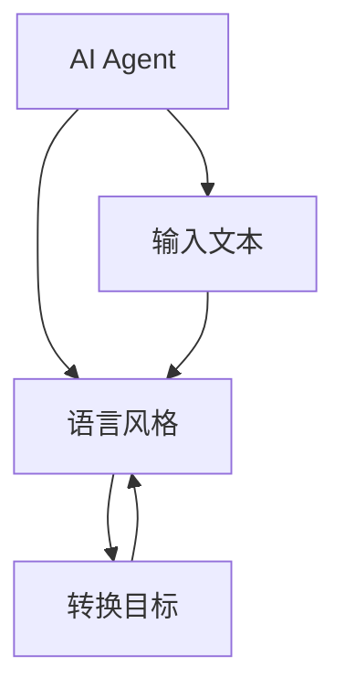
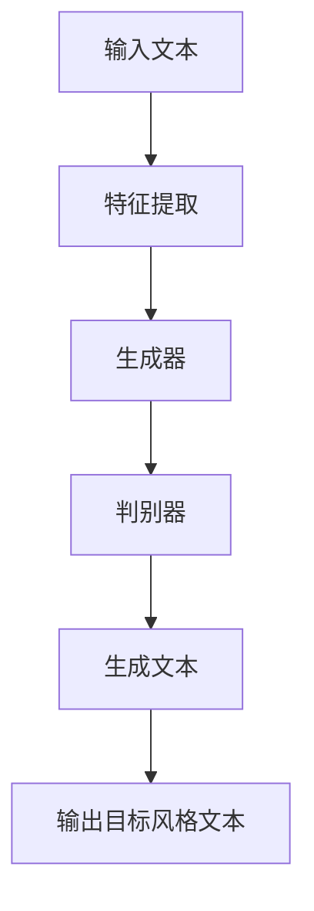
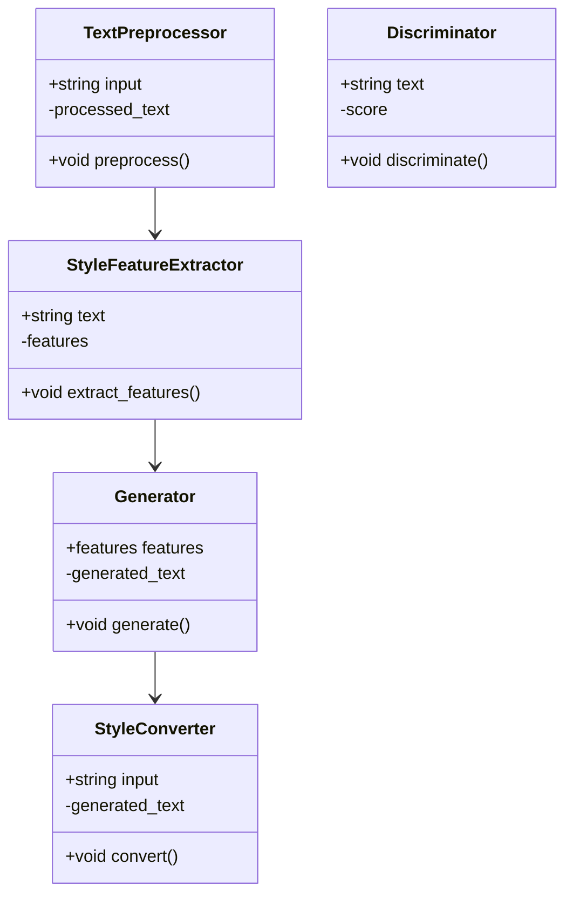
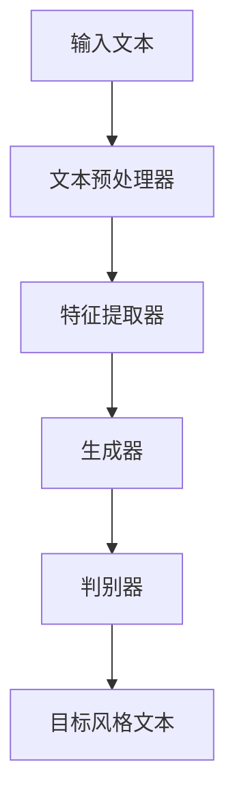
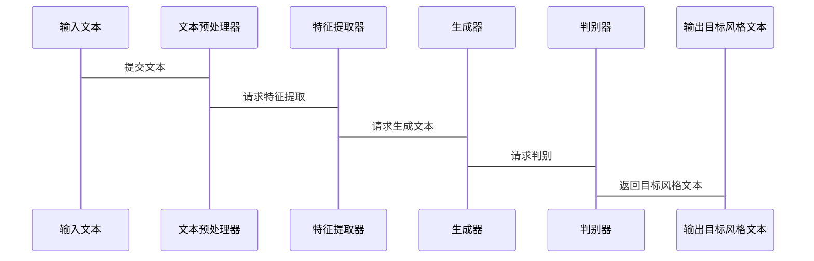

                 


# AI Agent 的语言风格转换：调整 LLM 的表达方式

> **关键词**: AI Agent, 语言风格转换, LLM, 生成式模型, 自然语言处理, 深度学习, 语言模型

> **摘要**: 本文深入探讨了AI Agent 在语言风格转换中的应用，重点分析了如何通过调整大型语言模型（LLM）的表达方式来实现多样化的语言风格输出。文章从背景介绍、核心概念、算法原理、数学模型、系统架构设计到项目实战，全面解析了语言风格转换的技术细节和实现方法，为相关领域的研究和应用提供了理论支持和实践指导。

---

# 第一部分: AI Agent 的语言风格转换基础

---

# 第1章: AI Agent 与语言风格转换概述

## 1.1 AI Agent 的基本概念

### 1.1.1 AI Agent 的定义

AI Agent（人工智能代理）是指能够感知环境、执行任务并做出决策的智能实体。它通常具备以下核心特征：

- **自主性**: 能够自主决策和行动，无需外部干预。
- **反应性**: 能够实时感知环境并做出反应。
- **目标导向**: 以特定目标为导向，执行任务。
- **社交能力**: 能够与人类或其他系统进行交互。

### 1.1.2 AI Agent 的核心功能

AI Agent 的核心功能包括：

1. **感知环境**: 通过传感器或数据输入获取环境信息。
2. **目标设定**: 根据任务需求设定目标。
3. **决策与规划**: 基于当前状态和目标，制定行动计划。
4. **执行任务**: 执行预定的行动以实现目标。
5. **学习与优化**: 通过经验改进自身的决策能力。

### 1.1.3 AI Agent 在语言风格转换中的作用

AI Agent 在语言风格转换中的作用主要体现在以下几个方面：

- **语言生成**: 通过生成式模型生成符合特定风格的文本。
- **风格识别**: 识别输入文本的语言风格特征。
- **风格调整**: 根据需求调整文本的风格特征。
- **反馈优化**: 根据用户反馈优化生成结果。

---

## 1.2 语言风格转换的背景与现状

### 1.2.1 语言风格转换的背景

语言风格转换是一种自然语言处理技术，旨在将一种语言风格的文本转换为另一种风格，例如将正式的语言风格转换为口语化风格，或将复杂的技术语言转换为通俗易懂的表达。

语言风格转换的核心挑战在于如何准确捕捉语言风格的特征，并将其转化为可操作的模型参数。

### 1.2.2 当前语言风格转换技术的发展现状

当前，语言风格转换技术主要依赖于生成式模型（如 GAN、VAE 和 transformer-based 模型）和基于规则的转换方法。随着深度学习技术的发展，生成式模型在语言风格转换中占据了主导地位。

主要的进展包括：

1. **基于 GAN 的风格转换**: 利用生成对抗网络实现风格转换。
2. **基于 transformer 的风格转换**: 利用 transformer 模型捕捉长距离依赖关系。
3. **多风格联合学习**: 同时学习多种语言风格的转换。

### 1.2.3 AI Agent 在语言风格转换中的应用前景

AI Agent 在语言风格转换中的应用前景广阔，尤其是在以下几个方面：

- **个性化交互**: 根据用户的语言偏好生成个性化回复。
- **内容创作**: 通过风格转换生成多样化的文本内容。
- **跨语言交流**: 将一种语言风格转换为另一种语言的风格，促进跨语言交流。

---

## 1.3 问题背景与目标

### 1.3.1 语言风格转换的核心问题

语言风格转换的核心问题在于如何在不损失语义的前提下，改变文本的语言风格。具体挑战包括：

- **风格特征提取**: 准确提取语言风格的特征。
- **风格保持**: 在转换过程中保持文本的语义不变。
- **风格多样性**: 支持多种语言风格的转换。

### 1.3.2 问题解决的关键点

- **模型选择**: 选择合适的生成式模型。
- **特征提取**: 如何提取语言风格的特征。
- **风格匹配**: 如何将源风格匹配为目标风格。

### 1.3.3 语言风格转换的边界与外延

语言风格转换的边界在于：

- **语义保持**: 不改变文本的原始含义。
- **风格可调**: 支持多种语言风格的转换。

其外延包括：

- **多语言支持**: 支持多种语言的风格转换。
- **实时转换**: 实现快速、高效的风格转换。

---

## 1.4 核心概念结构与要素

### 1.4.1 核心概念的结构化分析

语言风格转换的核心概念包括：

1. **生成式模型**: 用于生成目标风格文本。
2. **风格特征**: 用于区分不同语言风格的特征。
3. **转换规则**: 用于将源风格文本转换为目标风格文本的规则。

### 1.4.2 核心要素的特征对比

以下是对语言风格转换核心要素的特征对比：

| **要素** | **生成式模型** | **风格特征** | **转换规则** |
|----------|----------------|--------------|---------------|
| **定义** | 用于生成文本的模型 | 语言风格的特征 | 转换文本的规则 |
| **作用** | 生成目标风格文本 | 区分不同风格 | 实现风格转换 |
| **实现** | GAN、transformer | 词汇、句式、语气 | 映射、替换、重写 |

### 1.4.3 实体关系图（ER图）



---

# 第2章: AI Agent 与语言风格转换的关系

## 2.1 核心概念原理

### 2.1.1 AI Agent 的核心原理

AI Agent 的核心原理是通过感知环境、设定目标、决策规划和执行任务来实现特定功能。在语言风格转换中，AI Agent 的作用是通过生成式模型生成符合目标风格的文本。

### 2.1.2 语言风格转换的核心机制

语言风格转换的核心机制包括：

1. **风格识别**: 识别源文本的语言风格特征。
2. **风格转换**: 根据目标风格生成新的文本。
3. **风格保持**: 确保转换后的文本保持源文本的语义。

### 2.1.3 两者结合的逻辑关系

AI Agent 和语言风格转换的关系可以总结为：

- AI Agent 提供了语言风格转换的框架和目标设定。
- 语言风格转换为 AI Agent 提供了多样化的语言表达方式。

---

## 2.2 概念属性特征对比表

以下是对 AI Agent 和语言风格转换核心概念的属性特征对比：

| **属性** | **AI Agent** | **语言风格转换** |
|----------|--------------|------------------|
| **核心功能** | 执行任务 | 转换语言风格 |
| **输入** | 环境信息 | 文本数据 |
| **输出** | 行动或决策 | 目标风格文本 |
| **目标** | 完成任务 | 改变语言风格 |

### 2.2.3 实体关系图（ER图）



---

# 第三部分: 算法原理讲解

---

# 第3章: 生成式模型与语言风格转换

## 3.1 生成式模型的原理

### 3.1.1 生成式模型的基本原理

生成式模型是一种能够生成新数据的模型，其核心思想是通过学习数据的分布，生成新的数据样本。生成式模型主要包括以下几种类型：

1. **生成对抗网络 (GAN)**: 由生成器和判别器组成，通过对抗训练生成样本。
2. **变分自编码器 (VAE)**: 通过编码器和解码器实现数据的生成。
3. **Transformer 模型**: 基于自注意力机制的生成模型。

### 3.1.2 生成式模型在语言风格转换中的应用

生成式模型在语言风格转换中的应用主要体现在以下几个方面：

1. **文本生成**: 通过生成器生成目标风格的文本。
2. **风格匹配**: 通过判别器匹配目标风格的特征。
3. **风格迁移**: 将源风格的文本转换为目标风格的文本。

### 3.1.3 生成式模型的优缺点

- **优点**:
  - 能够生成高质量的文本。
  - 支持多种语言风格的转换。
- **缺点**:
  - 训练复杂，需要大量数据。
  - 可能出现语义不一致的问题。

---

## 3.2 生成式模型的数学模型

### 3.2.1 生成式模型的概率分布

生成式模型的核心是概率分布。假设我们有一个训练数据集 $D = \{x_1, x_2, \dots, x_n\}$，生成式模型的目标是学习数据的联合概率分布 $P(x)$。

$$ P(x) = \frac{1}{Z} \sum_{i=1}^n e^{f(x_i)} $$

其中，$Z$ 是归一化常数，$f(x_i)$ 是生成器的输出。

### 3.2.2 生成式模型的损失函数

生成式模型的损失函数通常包括生成器的损失和判别器的损失。

- **生成器的损失**:
  $$ \mathcal{L}_G = -\mathbb{E}_{x}[ \log P_G(x) ] $$
  
- **判别器的损失**:
  $$ \mathcal{L}_D = -\mathbb{E}_{x}[ \log D(x) ] - \mathbb{E}_{z}[ \log (1 - D(G(z))) ] $$

---

## 3.3 语言风格转换算法的实现

### 3.3.1 算法原理

语言风格转换算法的实现主要包括以下几个步骤：

1. **数据预处理**: 对输入文本进行分词、清洗等预处理。
2. **特征提取**: 提取文本的风格特征。
3. **模型训练**: 训练生成式模型。
4. **风格转换**: 使用训练好的模型生成目标风格的文本。

### 3.3.2 算法流程图



### 3.3.3 代码实现

以下是一个简单的生成式模型的 Python 代码实现：

```python
import tensorflow as tf
from tensorflow.keras import layers

# 定义生成器
def build_generator():
    model = tf.keras.Sequential()
    model.add(layers.Dense(256, activation='relu'))
    model.add(layers.Dense(128, activation='relu'))
    model.add(layers.Dense(64, activation='relu'))
    model.add(layers.Dense(1, activation='sigmoid'))
    return model

# 定义判别器
def build_discriminator():
    model = tf.keras.Sequential()
    model.add(layers.Dense(64, activation='relu'))
    model.add(layers.Dense(32, activation='relu'))
    model.add(layers.Dense(1, activation='sigmoid'))
    return model

# 定义 GAN 模型
def build_gan(generator, discriminator):
    discriminator.trainable = False
    model = tf.keras.Sequential()
    model.add(generator)
    model.add(discriminator)
    return model
```

---

## 3.4 生成式模型的优化与改进

### 3.4.1 模型优化

- **优化目标**: 提高生成文本的质量和风格一致性。
- **优化方法**: 使用对抗训练、引入奖励函数等。

### 3.4.2 模型改进

- **多任务学习**: 在生成器中同时学习多种语言风格的特征。
- **层次化生成**: 分层次生成文本，逐步调整风格特征。

---

# 第4章: 生成式模型的数学模型

## 4.1 生成式模型的概率分布

生成式模型的概率分布是其核心，以下是一个简单的概率分布公式：

$$ P(x) = \prod_{i=1}^n P(x_i | x_{i-1}) $$

其中，$x_i$ 表示第 $i$ 个词，$P(x_i | x_{i-1})$ 是条件概率。

## 4.2 生成式模型的损失函数

生成式模型的损失函数通常包括生成器的损失和判别器的损失。

- **生成器的损失**:
  $$ \mathcal{L}_G = -\mathbb{E}_{x}[ \log P_G(x) ] $$
  
- **判别器的损失**:
  $$ \mathcal{L}_D = -\mathbb{E}_{x}[ \log D(x) ] - \mathbb{E}_{z}[ \log (1 - D(G(z))) ] $$

## 4.3 生成式模型的数学推导

以下是对生成式模型的数学推导：

1. **生成器的优化**:
   $$ \min_G \mathcal{L}_G $$
   
2. **判别器的优化**:
   $$ \min_D \mathcal{L}_D $$

通过交替优化生成器和判别器，可以实现生成式模型的训练。

---

# 第5章: 系统分析与架构设计

## 5.1 问题场景介绍

### 5.1.1 问题场景描述

语言风格转换系统的主要任务是将源风格的文本转换为目标风格的文本。例如，将正式的语言风格转换为口语化风格。

### 5.1.2 问题解决的关键点

- **数据预处理**: 对输入文本进行清洗和分词。
- **特征提取**: 提取文本的风格特征。
- **模型训练**: 训练生成式模型。
- **风格转换**: 使用训练好的模型生成目标风格的文本。

---

## 5.2 项目介绍

### 5.2.1 项目目标

语言风格转换项目的最终目标是实现一种高效的、多样化的语言风格转换系统。

### 5.2.2 系统功能设计

系统功能设计包括以下几个方面：

1. **数据预处理**: 对输入文本进行清洗和分词。
2. **特征提取**: 提取文本的风格特征。
3. **模型训练**: 训练生成式模型。
4. **风格转换**: 使用训练好的模型生成目标风格的文本。

### 5.2.3 领域模型设计

以下是领域模型的 mermaid 类图：



---

## 5.3 系统架构设计

### 5.3.1 系统架构设计

以下是系统架构的 mermaid 图：



### 5.3.2 系统接口设计

系统接口设计包括以下几个方面：

1. **输入接口**: 接收源风格文本。
2. **输出接口**: 输出目标风格文本。

### 5.3.3 系统交互流程

以下是系统交互的 mermaid 序列图：



---

## 5.4 代码实现

### 5.4.1 环境安装

```bash
pip install tensorflow==2.10.0
pip install numpy==1.21.0
pip install scikit-learn==1.0.2
```

### 5.4.2 核心代码实现

```python
import tensorflow as tf
from tensorflow.keras import layers

# 定义生成器
def build_generator():
    model = tf.keras.Sequential()
    model.add(layers.Dense(256, activation='relu'))
    model.add(layers.Dense(128, activation='relu'))
    model.add(layers.Dense(1, activation='sigmoid'))
    return model

# 定义判别器
def build_discriminator():
    model = tf.keras.Sequential()
    model.add(layers.Dense(64, activation='relu'))
    model.add(layers.Dense(1, activation='sigmoid'))
    return model

# 定义 GAN 模型
def build_gan(generator, discriminator):
    discriminator.trainable = False
    model = tf.keras.Sequential()
    model.add(generator)
    model.add(discriminator)
    return model
```

---

## 5.5 案例分析

### 5.5.1 案例背景

假设我们需要将正式的语言风格转换为口语化风格。

### 5.5.2 案例分析

1. **输入文本**:
   ```
   We need to complete the task as soon as possible.
   ```

2. **预处理**:
   - 分词：`['We', 'need', 'to', 'complete', 'the', 'task', 'as', 'soon', 'as', 'possible.']`

3. **特征提取**:
   - 词汇特征：`['formal']`
   - 句式特征：`['complex']`

4. **生成器训练**:
   - 输入特征：`['formal']`
   - 生成目标风格文本：`"我们需要尽快完成任务。"`

5. **判别器训练**:
   - 输入文本：`"我们需要尽快完成任务。"`
   - 判别结果：`['casual']`

6. **输出结果**:
   ```
   我们需要尽快完成任务。
   ```

---

## 5.6 项目小结

通过以上实现，我们可以看到语言风格转换系统的整体流程和实现方法。该系统通过生成式模型实现了从源风格到目标风格的转换，同时通过预处理和特征提取提高了转换的准确性和效率。

---

# 第6章: 最佳实践与注意事项

## 6.1 最佳实践

### 6.1.1 数据预处理

- 确保数据的多样性和代表性。
- 对数据进行清洗和分词，去除噪声。

### 6.1.2 模型选择

- 根据具体任务选择合适的生成式模型。
- 对比不同模型的性能，选择最优的模型。

### 6.1.3 模型优化

- 使用对抗训练提高生成质量。
- 引入奖励函数优化生成结果。

## 6.2 注意事项

### 6.2.1 数据质量问题

- 数据的质量直接影响生成结果的质量。
- 需要注意数据的多样性和代表性。

### 6.2.2 模型泛化能力

- 模型的泛化能力影响转换的准确性和一致性。
- 需要通过数据增强和正则化方法提高模型的泛化能力。

---

## 6.3 小结

语言风格转换是一项具有挑战性的任务，需要结合生成式模型和深度学习技术。通过合理的数据预处理、模型选择和优化，可以实现高质量的语言风格转换。

---

# 作者

作者：AI天才研究院/AI Genius Institute & 禅与计算机程序设计艺术 /Zen And The Art of Computer Programming

