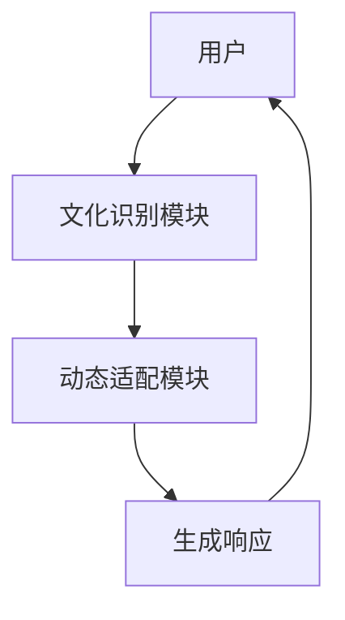
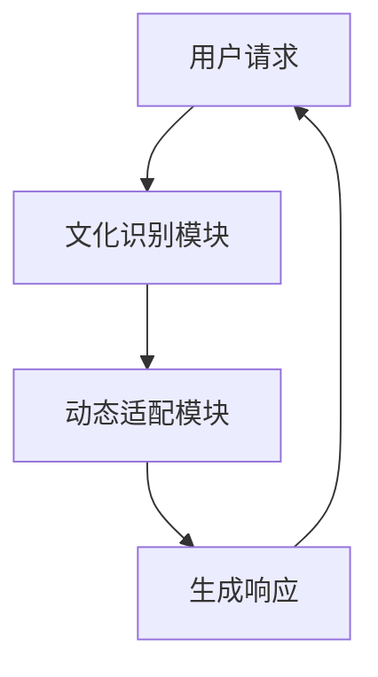
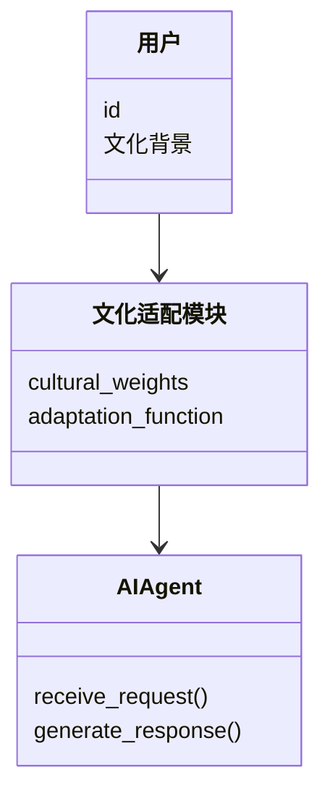
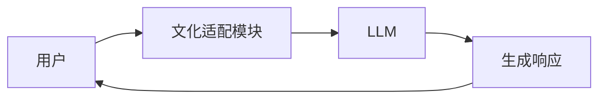
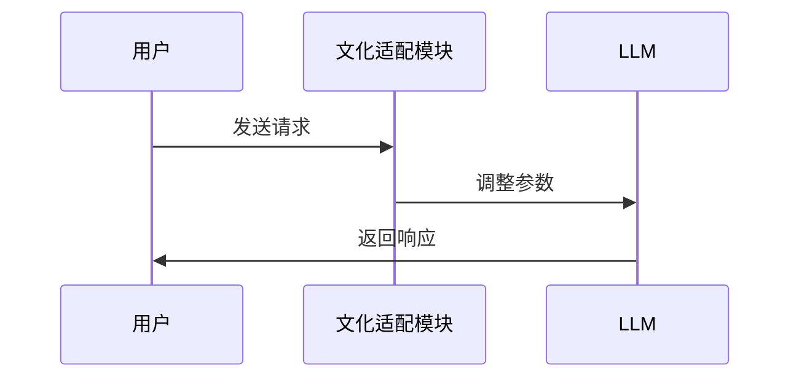

                 


# AI Agent 的跨文化交流：增强 LLM 的文化敏感度

## 关键词：AI Agent，跨文化交流，文化敏感度，LLM，自然语言处理

## 摘要：  
随着人工智能技术的快速发展，LLM（Large Language Model）在各种应用场景中展现出巨大的潜力。然而，LLM在处理跨文化交流时常常面临文化偏见和语境理解不足的问题。本文旨在探讨如何通过AI Agent 的方式增强LLM的文化敏感度，从而在跨文化交流中实现更精准、更自然的交互。本文从理论到实践，详细分析了AI Agent 的跨文化交互机制、算法原理、系统架构设计以及实际应用案例，为提升LLM的文化适应性提供了全面的解决方案。

---

# 第1章: 背景介绍

## 1.1 问题背景

### 1.1.1 当前AI技术的局限性  
目前的LLM虽然在文本生成和理解方面表现出色，但在跨文化交流中存在明显的局限性。例如，LLM可能无法准确理解不同文化背景下的隐含意义和非语言信号，导致交互中的误解和冲突。

### 1.1.2 文化敏感性的重要性  
在跨文化交流中，文化敏感性是确保有效沟通的关键。AI系统需要能够识别和适应不同文化背景下的语言习惯、价值观和社交规范。

### 1.1.3 AI Agent 在跨文化交流中的作用  
AI Agent 可以作为中介，通过动态调整其行为和响应方式，帮助LLM克服文化障碍，实现更自然的跨文化交互。

## 1.2 问题描述

### 1.2.1 LLM 的文化偏见问题  
LLM在训练过程中可能继承了训练数据中的文化偏见，导致其在处理跨文化问题时产生不准确或冒犯性的回答。

### 1.2.2 跨文化场景下的沟通障碍  
在跨文化场景中，用户的需求和表达方式可能与LLM的预期存在差异，导致交互失败。

### 1.2.3 AI Agent 的文化适应性需求  
AI Agent需要具备动态调整其行为的能力，以适应不同文化背景下的用户需求和交互规范。

## 1.3 问题解决

### 1.3.1 提升LLM文化敏感度的方法  
通过引入文化适配模块，LLM可以在生成文本时考虑文化背景，避免文化偏见。

### 1.3.2 AI Agent 的跨文化交互机制  
AI Agent通过分析用户的文化背景和语境，动态调整其响应方式，确保跨文化交互的流畅性。

### 1.3.3 跨文化语境下的AI行为规范  
制定明确的行为规范，指导AI Agent在跨文化场景中的行为，确保其符合社会伦理和文化习俗。

## 1.4 边界与外延

### 1.4.1 文化敏感性的边界  
文化敏感性并非要求AI完全消除文化差异，而是通过适应性调整，减少文化冲突的可能性。

### 1.4.2 跨文化AI的适用场景  
跨文化AI适用于跨国企业、国际社交、多语言客服等需要跨文化交互的场景。

### 1.4.3 AI Agent 的文化适应性极限  
AI Agent 的文化适应能力受到训练数据质量和算法复杂度的限制，需要在实际应用中不断优化。

## 1.5 概念结构与核心要素

### 1.5.1 文化敏感性的核心要素  
文化敏感性包括文化识别能力、文化适配能力和文化反馈能力。

### 1.5.2 AI Agent 的文化适配模块  
文化适配模块负责分析用户的文化背景，并动态调整AI Agent的响应策略。

### 1.5.3 跨文化交互的核心流程  
跨文化交互的核心流程包括文化识别、语境分析、动态响应生成和反馈优化。

---

# 第2章: 核心概念与联系

## 2.1 AI Agent 的核心原理

### 2.1.1 AI Agent 的定义与分类  
AI Agent 是一种能够感知环境并采取行动以实现目标的智能体。跨文化AI Agent专门针对跨文化场景设计，具备文化敏感性。

### 2.1.2 跨文化AI Agent 的特性  
跨文化AI Agent具备文化识别能力、动态适应能力和文化反馈能力。

### 2.1.3 文化敏感性在AI Agent 中的实现  
通过引入文化适配模块，AI Agent可以在交互过程中动态调整其行为，以适应不同文化背景下的用户需求。

## 2.2 跨文化交互的核心概念

### 2.2.1 文化语境的定义  
文化语境是指在特定文化背景下，语言和非语言信号所承载的隐含意义和社交规范。

### 2.2.2 跨文化语境的分类  
跨文化语境可以分为同文化、异文化、多文化等多种类型，每种类型都有其独特的挑战和特点。

### 2.2.3 跨文化交互的模式  
跨文化交互模式包括直接交互、中介交互和文化适配交互，每种模式都有其适用场景和优化策略。

## 2.3 核心概念的联系

### 2.3.1 AI Agent 与文化语境的关系  
AI Agent 通过感知文化语境，动态调整其交互策略，以实现跨文化场景下的高效沟通。

### 2.3.2 跨文化交互中的AI行为规范  
AI Agent 需要遵守跨文化行为规范，避免冒犯用户或违反文化习俗。

### 2.3.3 文化敏感性对AI决策的影响  
文化敏感性影响AI Agent 的决策过程，使其能够在不同文化背景下做出更合适的回应。

## 2.4 概念属性对比表

### 2.4.1 不同文化语境下的交互特点  
| 文化语境 | 交互特点                  |
|----------|---------------------------|
| 同文化   | 高效、直接                |
| 异文化   | 需要文化适配              |
| 多文化   | 需要动态调整和文化反馈    |

---

## 2.4.2 AI Agent 在不同文化语境下的行为模式  


---

## 2.4.3 跨文化交互的实体关系图  
```mermaid
er
    actor 用户
    actor 文化适配模块
    actor AI Agent
    boundary 跨文化场景
```

---

# 第3章: 算法原理讲解

## 3.1 文化敏感性模型的数学基础

### 3.1.1 模型输入  
输入包括用户的文本请求和文化背景信息。

### 3.1.2 模型输出  
输出为文化适配的文本响应。

### 3.1.3 文化适配算法  
文化适配算法通过分析用户的语言和行为，生成符合文化背景的响应。

### 3.1.4 文化适配函数  
文化适配函数通过调整LLM的生成参数，实现文化适配。

---

### 3.1.5 文化适配函数的实现  
```python
def cultural_adaptation_function(context, culture):
    # 根据文化背景调整模型参数
    model_params = adjust_params(context, culture)
    # 生成响应
    response = generate_response(model_params)
    return response
```

---

### 3.1.6 调整模型参数的数学公式  
$$ \text{调整参数} = \text{原始参数} \times \text{文化权重} $$

---

### 3.1.7 文化权重的计算方法  
$$ \text{文化权重} = \frac{\sum_{i=1}^{n} w_i}{n} $$  
其中，$w_i$ 是每个文化的权重系数，$n$ 是文化总数。

---

## 3.2 跨文化交互的算法流程

### 3.2.1 跨文化交互流程图  


---

### 3.2.2 动态适配模块的实现  
动态适配模块通过分析用户的文化背景，动态调整LLM的生成参数，确保生成的响应符合文化语境。

---

## 3.3 跨文化语境下的LLM优化策略

### 3.3.1 文化语境下的LLM优化  
通过引入文化适配模块，优化LLM在跨文化场景中的表现。

### 3.3.2 文化适配模块的优化策略  
文化适配模块需要不断学习和优化，以提高文化敏感性。

---

# 第4章: 系统分析与架构设计

## 4.1 项目场景介绍

### 4.1.1 项目目标  
提升LLM的文化敏感性，实现跨文化场景下的高效交互。

### 4.1.2 项目需求  
支持多语言、多文化场景下的交互，具备文化适配能力。

## 4.2 系统功能设计

### 4.2.1 领域模型设计  


---

### 4.2.2 系统架构设计  


---

## 4.3 系统接口设计

### 4.3.1 用户接口  
用户通过文本输入与AI Agent交互。

### 4.3.2 文化适配模块接口  
文化适配模块接收用户请求，分析文化背景，返回调整后的参数。

---

## 4.4 系统交互设计

### 4.4.1 跨文化交互流程  


---

## 4.5 系统架构优化

### 4.5.1 模块化设计  
将系统划分为文化适配模块、LLM模块和用户交互模块，确保各模块独立优化。

### 4.5.2 并行优化  
通过并行计算优化系统性能，确保跨文化场景下的高效响应。

---

# 第5章: 项目实战

## 5.1 环境安装

### 5.1.1 系统要求  
安装Python、LLM框架（如GPT-3.5）和相关依赖。

### 5.1.2 安装命令  
```bash
pip install -r requirements.txt
```

---

## 5.2 核心代码实现

### 5.2.1 文化适配模块  
```python
class CulturalAdapter:
    def __init__(self):
        self.cultural_weights = {}

    def adjust_params(self, context, culture):
        # 根据文化背景调整模型参数
        return self.cultural_weights[culture]
```

---

### 5.2.2 AI Agent 类  
```python
class AIAssistant:
    def __init__(self, model):
        self.model = model

    def generate_response(self, prompt, culture):
        # 调整模型参数
        adjusted_params = self.model.adapter.adjust_params(prompt, culture)
        # 生成响应
        response = self.model.generate(adjusted_params)
        return response
```

---

## 5.3 代码应用解读与分析

### 5.3.1 文化适配模块的实现  
文化适配模块通过分析用户请求的文化背景，动态调整模型参数，生成符合文化语境的响应。

### 5.3.2 AI Agent 的实现  
AI Agent 调用文化适配模块进行参数调整，生成符合文化背景的文本响应。

---

## 5.4 实际案例分析

### 5.4.1 案例场景  
用户在跨国会议中使用AI Agent 进行翻译和沟通。

### 5.4.2 系统响应  
AI Agent 根据用户的文化背景，生成符合会议场景的响应。

---

## 5.5 项目小结

### 5.5.1 实战经验  
通过实际案例分析，验证了AI Agent 在跨文化场景中的有效性。

### 5.5.2 优化建议  
进一步优化文化适配模块，提升系统整体性能。

---

# 第6章: 最佳实践、小结与展望

## 6.1 最佳实践 tips

### 6.1.1 文化适配模块的优化  
定期更新文化适配模块，提升系统文化敏感性。

### 6.1.2 系统架构的优化  
通过模块化设计和并行优化，提升系统性能。

## 6.2 小结

### 6.2.1 核心内容总结  
本文详细探讨了AI Agent 在跨文化交流中的应用，提出了文化适配模块的设计和优化方法。

### 6.2.2 未来展望  
未来研究将重点优化文化适配模块，提升AI Agent 的文化敏感性。

## 6.3 注意事项

### 6.3.1 数据隐私问题  
在跨文化场景中，需注意用户数据的隐私保护。

### 6.3.2 系统性能优化  
通过优化算法和架构设计，提升系统整体性能。

## 6.4 拓展阅读

### 6.4.1 推荐书籍  
1.《人工智能：一种现代的方法》
2.《自然语言处理入门》

### 6.4.2 推荐论文  
1.《Cross-Cultural Natural Language Processing》
2.《Cultural Adaptation in AI Systems》

---

# 作者：AI天才研究院/AI Genius Institute & 禅与计算机程序设计艺术 /Zen And The Art of Computer Programming

