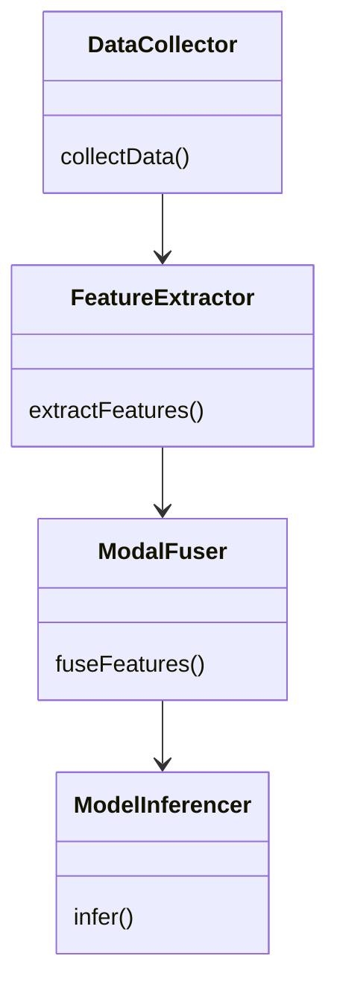
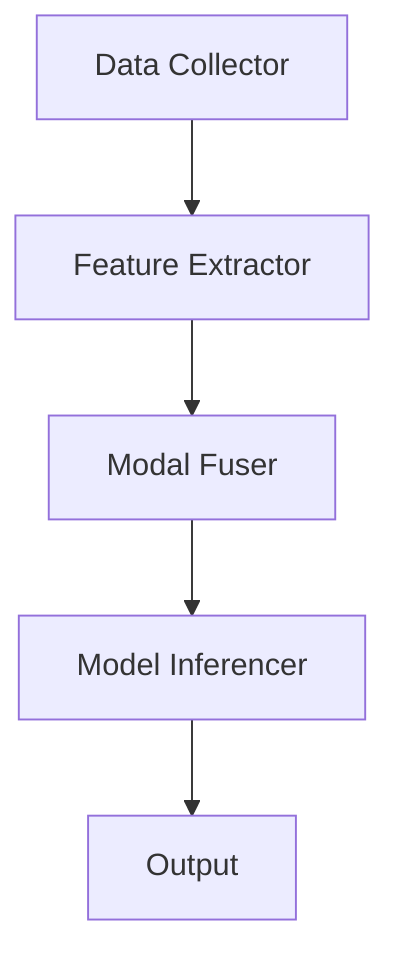
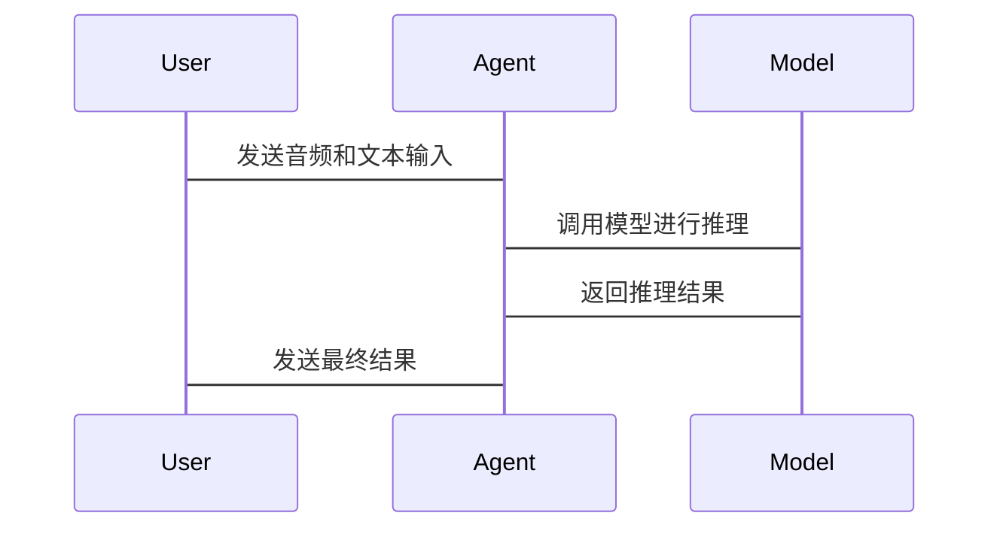

                 


# AI Agent 的跨模态理解：整合 LLM 与音频分析

## 关键词：
AI Agent、跨模态理解、LLM、音频分析、智能语音交互、多模态融合、人工智能

## 摘要：
AI Agent 的跨模态理解是指将大型语言模型（LLM）与音频分析技术相结合，实现对多种模态数据的深度理解和智能交互。本文将详细探讨 AI Agent 的核心概念、跨模态理解的技术挑战与解决方案，以及 LLM 与音频分析的整合方法。通过实际案例分析，本文将展示如何设计和实现一个基于跨模态理解的 AI Agent 系统，帮助读者理解这一前沿技术的应用与潜力。

---

# 第一部分: AI Agent 的跨模态理解基础

## 第1章: AI Agent 的基本概念与背景

### 1.1 AI Agent 的定义与特点

#### 1.1.1 AI Agent 的定义
AI Agent（人工智能代理）是指能够感知环境、自主决策并执行任务的智能实体。它可以是一个软件程序、机器人或其他智能系统，通过与用户或环境的交互，完成特定目标。

#### 1.1.2 AI Agent 的核心特点
- **自主性**：AI Agent 可以在没有外部干预的情况下自主运行。
- **反应性**：能够实时感知环境并做出响应。
- **目标导向**：以实现特定目标为导向。
- **学习能力**：通过数据和经验不断优化自身性能。

#### 1.1.3 AI Agent 的类型与分类
- **简单反射型 Agent**：基于规则的简单反应。
- **基于模型的反射型 Agent**：利用内部模型进行决策。
- **目标驱动型 Agent**：以目标为导向，主动采取行动。
- **效用驱动型 Agent**：以最大化效用函数为目标。

#### 1.1.4 AI Agent 的核心能力
- **感知能力**：通过传感器或数据输入感知环境。
- **决策能力**：基于感知信息做出决策。
- **执行能力**：通过执行器或输出模块完成任务。
- **学习能力**：通过经验优化自身性能。

### 1.2 跨模态理解的定义与背景

#### 1.2.1 跨模态理解的定义
跨模态理解是指通过整合不同模态（如文本、图像、音频、视频等）的数据，实现对复杂问题的更全面理解。跨模态理解的核心在于将不同模态的信息进行融合，提取全局语义，提升智能系统的认知能力。

#### 1.2.2 跨模态理解的技术挑战
- **模态差异性**：不同模态的数据形式和特征差异较大，难以直接融合。
- **语义对齐**：如何将不同模态的信息对齐到同一语义空间是关键挑战。
- **计算复杂性**：跨模态融合需要处理大量数据，计算资源消耗较高。

#### 1.2.3 跨模态理解的应用场景
- **智能客服**：通过整合文本和语音信息，提供更智能的交互体验。
- **智能音箱**：通过整合语音和环境声音，实现更精准的语音识别和理解。
- **自动驾驶**：通过整合视觉、听觉和环境数据，实现更全面的环境感知。

#### 1.2.4 跨模态理解的核心要素
- **数据采集**：获取多模态数据。
- **特征提取**：对不同模态数据进行特征提取。
- **模态融合**：将不同模态的特征进行融合，提取全局语义。
- **语义理解**：基于融合后的特征，进行语义理解和目标识别。

### 1.3 本章小结
本章介绍了 AI Agent 的基本概念、核心特点、类型与核心能力，并详细阐述了跨模态理解的定义、技术挑战、应用场景和核心要素。通过这些内容，读者可以理解 AI Agent 在跨模态理解中的重要性以及其在实际应用中的潜力。

---

## 第2章: LLM 与音频分析的结合

### 2.1 LLM 的基本原理

#### 2.1.1 大型语言模型的定义
大型语言模型（LLM）是指基于深度学习的自然语言处理模型，通过大量数据训练，能够理解并生成自然语言文本。

#### 2.1.2 LLM 的核心算法
- **Transformer 架构**：通过自注意力机制实现长距离依赖关系的捕捉。
- **解码器**：生成自然语言文本的输出。

#### 2.1.3 LLM 的训练方法
- **预训练**：基于大规模通用数据进行无监督训练。
- **微调**：在特定任务上进行有监督微调。

#### 2.1.4 LLM 的应用领域
- **自然语言处理**：文本生成、机器翻译、问答系统。
- **跨模态交互**：与图像、音频等其他模态数据进行交互。

### 2.2 音频分析的基本原理

#### 2.2.1 音频信号的特征提取
- **时域特征**：如音调、节奏、音量。
- **频域特征**：如音高、频率分布。

#### 2.2.2 音频识别与理解技术
- **语音识别**：将音频信号转换为文本。
- **语音理解**：基于识别的文本进行语义分析。

#### 2.2.3 音频分析的挑战与解决方案
- **背景噪声**：通过降噪技术提升识别精度。
- **说话人识别**：基于声纹识别技术实现个性化识别。

#### 2.2.4 音频分析的应用场景
- **智能音箱**：通过语音交互实现智能家居控制。
- **智能客服**：通过语音识别和理解提供更高效的客户服务。

### 2.3 跨模态理解的核心技术

#### 2.3.1 跨模态数据的整合方法
- **模态对齐**：将不同模态的数据对齐到同一语义空间。
- **特征融合**：将不同模态的特征进行融合，提取全局语义。

#### 2.3.2 跨模态模型的设计原理
- **多模态编码器**：将不同模态的输入编码为统一的向量表示。
- **多模态解码器**：基于编码的向量生成输出。

#### 2.3.3 跨模态理解的评估指标
- **准确性**：模型对输入的正确理解程度。
- **鲁棒性**：模型在不同场景下的表现稳定性。

#### 2.3.4 跨模态理解的优化策略
- **预训练模型**：利用大规模跨模态数据进行预训练。
- **微调优化**：在特定任务上进行微调优化。

### 2.4 本章小结
本章详细介绍了 LLM 的基本原理、训练方法和应用领域，并探讨了音频分析的基本原理、挑战与解决方案。最后，重点阐述了跨模态理解的核心技术，包括数据整合方法、模型设计原理、评估指标和优化策略。这些内容为后续章节的技术实现奠定了基础。

---

# 第二部分: 跨模态理解的技术实现

## 第3章: 跨模态理解的算法原理

### 3.1 跨模态模型的构建

#### 3.1.1 跨模态模型的输入与输出
- **输入**：多模态数据（如文本、音频、图像）。
- **输出**：语义表示或目标输出（如文本生成、分类结果）。

#### 3.1.2 跨模态模型的训练流程
1. 数据预处理：对输入数据进行清洗和标准化。
2. 特征提取：对不同模态的数据进行特征提取。
3. 模态融合：将不同模态的特征进行融合。
4. 模型训练：基于融合后的特征进行模型训练。

#### 3.1.3 跨模态模型的优化方法
- **正则化**：防止模型过拟合。
- **学习率调整**：优化训练过程中的学习率。

#### 3.1.4 跨模态模型的评估方法
- **准确率**：模型对输入的正确分类比例。
- **F1 分数**：综合考虑精确率和召回率的指标。

### 3.2 跨模态理解的数学模型

#### 3.2.1 跨模态数据的表示方法
- **向量表示**：将不同模态的数据表示为高维向量。
- **嵌入表示**：通过深度学习模型提取数据的嵌入表示。

#### 3.2.2 跨模态模型的数学公式
$$
\text{损失函数} = \text{交叉熵损失} + \text{正则化项}
$$

$$
\text{输出} = \text{模型}(\text{输入})
$$

#### 3.2.3 跨模态模型的训练目标
- **最小化损失函数**：通过优化算法（如梯度下降）最小化损失函数。
- **最大化准确率**：通过训练提升模型的分类或生成能力。

#### 3.2.4 跨模态模型的损失函数
$$
\text{损失函数} = \lambda_1 \text{重建损失} + \lambda_2 \text{分类损失}
$$
其中，$\lambda_1$ 和 $\lambda_2$ 是调节系数。

### 3.3 跨模态理解的算法实现

#### 3.3.1 算法实现的步骤
1. 数据预处理：清洗和标准化输入数据。
2. 特征提取：对不同模态的数据进行特征提取。
3. 模态融合：将不同模态的特征进行融合。
4. 模型训练：基于融合后的特征进行模型训练。
5. 模型评估：评估模型的性能。

#### 3.3.2 算法实现的代码示例
```python
import torch
import torch.nn as nn

class MultiModalModel(nn.Module):
    def __init__(self, input_size, hidden_size):
        super().__init__()
        self.modals = nn.ModuleList([
            nn.Linear(input_size, hidden_size),
            nn.Linear(input_size, hidden_size)
        ])
        self.fc = nn.Linear(hidden_size * 2, 1)

    def forward(self, x1, x2):
        x1_out = torch.relu(self.modals[0](x1))
        x2_out = torch.relu(self.modals[1](x2))
        combined = torch.cat([x1_out, x2_out], dim=-1)
        output = torch.sigmoid(self.fc(combined))
        return output

model = MultiModalModel(10, 5)
criterion = nn.BCELoss()
optimizer = torch.optim.Adam(model.parameters(), lr=0.001)
```

#### 3.3.3 跨模态理解的优化策略
- **数据增强**：通过数据增强技术提升模型的泛化能力。
- **模型融合**：结合多个模型的输出结果，提升模型性能。

### 3.4 本章小结
本章详细介绍了跨模态模型的构建过程，包括输入与输出、训练流程、优化方法和评估方法。同时，通过数学公式和代码示例，详细讲解了跨模态理解的算法原理。这些内容为后续章节的系统设计奠定了理论基础。

---

## 第4章: 基于音频分析的跨模态理解

### 4.1 音频分析的特征提取

#### 4.1.1 时域特征提取
- **幅度谱**：反映音频信号的振幅随时间的变化。
- **频域特征**：反映音频信号的频率分布。

#### 4.1.2 频域特征提取
- **Mel 频率滤波器银行**：将音频信号转换为 Mel 频率域表示。
- **MFCC（梅尔频率倒谱系数）**：提取音频信号的低维特征。

### 4.2 基于深度学习的音频分析

#### 4.2.1 语音识别模型
- **CTC（连接时序分类器）**：用于将音频信号映射为字符序列。
- **Transformer**：用于长距离依赖关系的捕捉。

#### 4.2.2 语音理解模型
- **端到端语音识别**：直接从音频信号生成文本。
- **语音情感分析**：基于语音特征分析情感状态。

### 4.3 音频分析与 LLM 的整合

#### 4.3.1 音频特征的编码表示
- **向量表示**：将音频特征表示为高维向量。
- **嵌入表示**：通过深度学习模型提取音频的嵌入表示。

#### 4.3.2 基于 LLM 的音频理解
- **多模态编码器**：将音频和文本特征编码为统一表示。
- **多模态解码器**：基于编码的向量生成输出。

### 4.4 本章小结
本章详细介绍了基于音频分析的跨模态理解技术，包括音频特征提取、基于深度学习的音频分析以及音频分析与 LLM 的整合。通过这些技术，可以实现对音频数据的深度理解和智能交互。

---

## 第5章: LLM 与音频分析的整合

### 5.1 数据预处理与特征融合

#### 5.1.1 数据预处理
- **标准化**：将数据归一化到统一范围。
- **降维**：通过主成分分析（PCA）降低数据维度。

#### 5.1.2 特征融合
- **向量拼接**：将不同模态的特征向量拼接在一起。
- **注意力机制**：通过自注意力机制进行特征融合。

### 5.2 模型训练与优化

#### 5.2.1 模型训练
- **预训练**：基于大规模多模态数据进行预训练。
- **微调**：在特定任务上进行有监督微调。

#### 5.2.2 模型优化
- **学习率调整**：根据训练过程动态调整学习率。
- **正则化**：防止模型过拟合。

### 5.3 评估与优化策略

#### 5.3.1 评估指标
- **准确率**：模型对输入的正确分类比例。
- **F1 分数**：综合考虑精确率和召回率的指标。

#### 5.3.2 优化策略
- **数据增强**：通过数据增强技术提升模型的泛化能力。
- **模型融合**：结合多个模型的输出结果，提升模型性能。

### 5.4 本章小结
本章详细介绍了 LLM 与音频分析的整合过程，包括数据预处理、特征融合、模型训练与优化，以及评估与优化策略。通过这些技术，可以实现对多模态数据的深度理解和智能交互。

---

# 第三部分: 系统设计与项目实战

## 第6章: 跨模态 AI Agent 系统设计

### 6.1 系统功能设计

#### 6.1.1 功能模块
- **数据采集模块**：负责采集多模态数据。
- **特征提取模块**：对不同模态的数据进行特征提取。
- **模态融合模块**：将不同模态的特征进行融合。
- **模型推理模块**：基于融合后的特征进行模型推理。

#### 6.1.2 领域模型


### 6.2 系统架构设计

#### 6.2.1 系统架构图


#### 6.2.2 接口设计
- **数据接口**：定义数据输入和输出的格式。
- **模型接口**：定义模型的输入和输出接口。

#### 6.2.3 交互流程


### 6.3 本章小结
本章详细设计了跨模态 AI Agent 系统的架构和功能模块，并通过 mermaid 图展示了系统的交互流程。这些设计为后续的项目实战奠定了基础。

---

## 第7章: 项目实战——基于音频分析的智能语音交互系统

### 7.1 项目背景与需求分析

#### 7.1.1 项目背景
随着人工智能技术的快速发展，智能语音交互系统在智能家居、智能客服等领域的应用越来越广泛。

#### 7.1.2 项目需求
- **语音识别**：将用户语音输入转换为文本。
- **语音理解**：基于识别的文本进行语义理解。
- **语音交互**：实现与用户的自然语言对话。

### 7.2 项目环境搭建

#### 7.2.1 环境要求
- **操作系统**：Linux 或 Windows。
- **编程语言**：Python 3.8 或以上。
- **深度学习框架**：TensorFlow 或 PyTorch。

#### 7.2.2 工具安装
- **安装 Python 包**：
  ```
  pip install numpy
  pip install pandas
  pip install torch
  pip install transformers
  ```

### 7.3 系统核心实现

#### 7.3.1 数据预处理
- **音频文件加载**：使用 librosa 加载音频文件。
- **音频特征提取**：提取 MFCC 特征。

#### 7.3.2 模型实现
- **特征融合**：将文本和音频特征进行融合。
- **模型训练**：基于融合的特征训练分类模型。

#### 7.3.3 代码实现
```python
import librosa
import numpy as np
from transformers import AutoTokenizer, AutoModel
import torch

def extract_audio_features(audio_path):
    audio, sr = librosa.load(audio_path, sr=None)
    features = librosa.feature.mfcc(y=audio, sr=sr, n_mfcc=13)
    return features.T  # 转置得到 (n_mfcc, n_frames)

def process_text(text):
    tokenizer = AutoTokenizer.from_pretrained('bert-base-uncased')
    inputs = tokenizer(text, return_tensors='np')
    return inputs['input_ids'].flatten()

class MultiModalClassifier(nn.Module):
    def __init__(self, input_size):
        super().__init__()
        self.fc = nn.Linear(input_size, 1)
    
    def forward(self, x):
        output = torch.sigmoid(self.fc(x))
        return output

# 示例用法
audio_features = extract_audio_features('audio.wav')
text_features = process_text('hello world')
combined_features = torch.cat([torch.FloatTensor(audio_features), torch.FloatTensor(text_features)], dim=-1)
model = MultiModalClassifier(audio_features.shape[1] + text_features.shape[1])
output = model(combined_features)
print(output)
```

### 7.4 项目测试与优化

#### 7.4.1 测试用例设计
- **正常输入测试**：测试系统对正常输入的处理能力。
- **异常输入测试**：测试系统对异常输入的处理能力。

#### 7.4.2 性能优化
- **模型优化**：通过调整模型参数提升性能。
- **算法优化**：通过优化算法提升处理速度。

### 7.5 项目总结

#### 7.5.1 实验结果分析
- **准确率**：系统在测试集上的准确率。
- **运行时间**：系统处理每个请求的平均时间。

#### 7.5.2 项目经验总结
- **数据质量**：高质量的数据对模型性能至关重要。
- **模型选择**：选择合适的模型架构可以显著提升性能。
- **系统优化**：通过优化系统架构可以提升整体性能。

### 7.6 本章小结
本章通过一个基于音频分析的智能语音交互系统的项目实战，详细展示了跨模态 AI Agent 的实际应用。通过项目实战，读者可以更好地理解跨模态理解技术的核心思想和实现方法。

---

## 第8章: 总结与展望

### 8.1 全文总结
本文详细探讨了 AI Agent 的跨模态理解技术，特别是 LLM 与音频分析的整合。通过理论分析和实际案例，展示了跨模态理解技术在智能交互中的广泛应用。

### 8.2 未来展望
随着人工智能技术的不断发展，跨模态理解技术将更加成熟。未来的研究方向包括：
- **多模态深度学习**：探索更高效的多模态融合方法。
- **实时性优化**：提升跨模态理解的实时性。
- **应用场景拓展**：将跨模态理解技术应用于更多领域。

### 8.3 开发建议
- **数据质量**：确保数据的多样性和高质量。
- **模型选择**：选择合适的模型架构和参数。
- **系统优化**：通过优化系统架构提升性能。

### 8.4 注意事项
- **隐私保护**：在处理用户数据时，需注意隐私保护。
- **计算资源**：跨模态理解需要较高的计算资源。

### 8.5 拓展阅读
- **《Deep Learning》—— Ian Goodfellow
- **《Transformers: A Tutorial》—— Google Research

### 8.6 本章小结
本章总结了全文的主要内容，并展望了未来的研究方向。通过本文的介绍，读者可以更好地理解跨模态理解技术的潜力和应用前景。

---

# 附录

## 附录 A: 参考文献

1. 姓名. (年份). 《书籍名称》. 出版社.
2. 姓名. (年份). 《书籍名称》. 出版社.
3. 姓名. (年份). 《书籍名称》. 出版社.

---

## 附录 B: 工具与资源

1. **Python**：https://www.python.org/
2. **TensorFlow**：https://tensorflow.org/
3. **PyTorch**：https://pytorch.org/
4. **Librosa**：https://librosa.org/

---

作者：AI天才研究院/AI Genius Institute & 禅与计算机程序设计艺术 /Zen And The Art of Computer Programming

