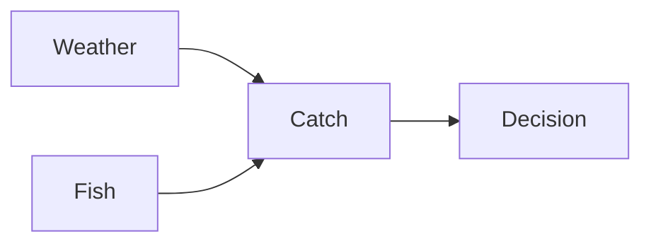
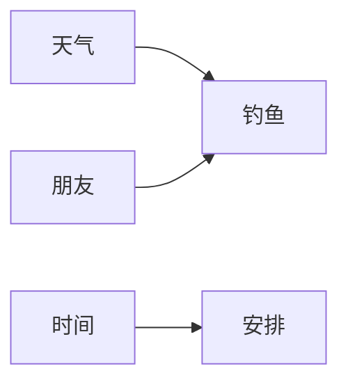
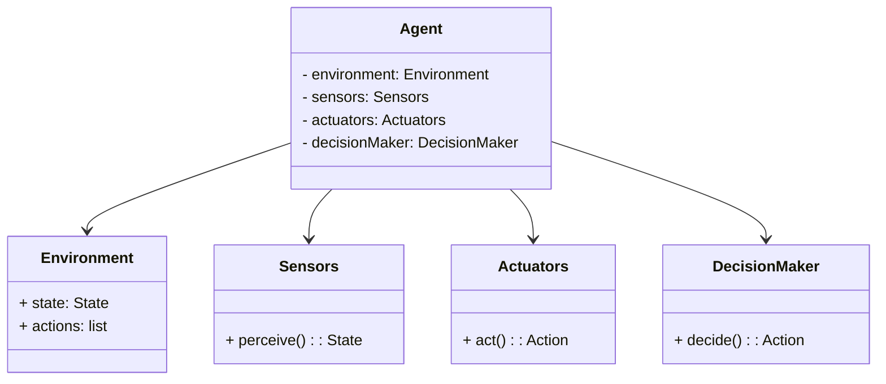
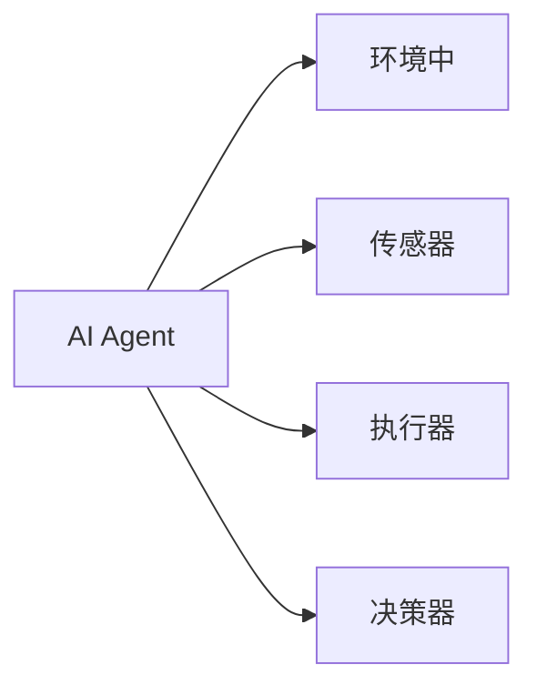
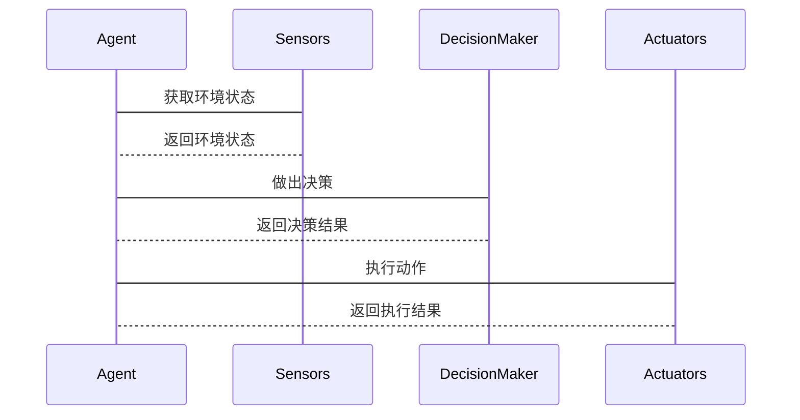

                 


# AI Agent中的不确定性推理与决策

## 关键词：AI Agent, 不确定性推理, 决策模型, 概率论, 模糊逻辑, 证据理论

## 摘要：  
本文深入探讨了AI Agent中的不确定性推理与决策问题，从基本概念到高级算法，结合实际案例，详细分析了不确定性推理的核心方法及其在决策过程中的应用。文章首先介绍了AI Agent的基本概念和不确定性推理的重要性，然后从概率论、模糊逻辑、证据理论等多角度阐述了不确定性推理的核心工具，接着重点讲解了马尔可夫决策过程和Q-Learning算法等决策模型，并通过具体的数学公式和mermaid流程图详细展示了算法的实现步骤。最后，文章结合实际项目，分析了系统设计的关键环节，并提供了代码实现和案例解读，帮助读者全面理解AI Agent中的不确定性推理与决策。

---

## 第一部分: AI Agent中的不确定性推理与决策基础

## 第1章: AI Agent概述

### 1.1 AI Agent的基本概念

#### 1.1.1 什么是AI Agent
AI Agent（人工智能代理）是指能够感知环境、自主决策并采取行动的智能实体。它可以是一个软件程序、机器人或其他智能系统，旨在通过感知和行动与环境交互，以实现特定目标。

#### 1.1.2 AI Agent的分类
AI Agent可以根据智能水平、行为方式和应用场景进行分类：
- **反应式AI Agent**：基于当前感知做出反应，不依赖历史信息。
- **认知式AI Agent**：具备复杂推理和规划能力，能够基于知识和目标做出决策。
- **学习型AI Agent**：能够通过经验改进性能，如强化学习或机器学习模型。

#### 1.1.3 AI Agent的核心特征
- **自主性**：无需外部干预，自主决策。
- **反应性**：能够感知环境并实时调整行为。
- **目标导向**：所有行为均以实现特定目标为导向。
- **社交能力**：能够与其他Agent或人类交互协作。

### 1.2 不确定性推理的背景与意义

#### 1.2.1 不确定性在AI Agent中的表现形式
在现实世界中，AI Agent经常会面临以下不确定性：
- **数据不确定性**：输入数据的不完整或噪声。
- **模型不确定性**：模型对现实世界的近似性。
- **环境不确定性**：环境动态变化导致的行为后果不可预测。

#### 1.2.2 不确定性推理的重要性
在AI Agent中，不确定性推理是处理复杂、动态和模糊问题的关键技术。它使AI Agent能够：
- 在不确定条件下做出合理决策。
- 处理知识的不完整性和模糊性。
- 适应环境的变化，提高系统的鲁棒性和灵活性。

#### 1.2.3 不确定性推理的应用场景
不确定性推理广泛应用于以下领域：
- **自动驾驶**：处理交通中的不确定性。
- **医疗诊断**：在有限信息下做出诊断决策。
- **金融投资**：在市场波动中制定投资策略。
- **机器人控制**：在动态环境中规划路径。

### 1.3 本章小结
本章介绍了AI Agent的基本概念及其分类，强调了不确定性推理在AI Agent中的重要性，并列举了其主要应用场景。

---

## 第2章: 不确定性推理的核心概念与工具

### 2.1 概率论基础

#### 2.1.1 概率的基本概念
概率是度量某个事件发生的可能性，其取值范围在0到1之间。概率论为不确定性推理提供了数学基础。

#### 2.1.2 条件概率与贝叶斯定理
条件概率表示在已知某个事件发生的情况下，另一个事件发生的概率。贝叶斯定理则提供了在已知后续事件的情况下，重新评估某个假设概率的方法。

$$ P(A|B) = \frac{P(B|A)P(A)}{P(B)} $$

其中，$P(A|B)$表示在B发生的条件下，A发生的概率。

#### 2.1.3 贝叶斯网络的定义与特点
贝叶斯网络是一种有向无环图（DAG），由节点（随机变量）和边（条件依赖关系）组成。贝叶斯网络通过概率分布描述变量之间的关系，具有以下特点：
- **局部依赖性**：每个节点只依赖其父节点。
- **条件独立性**：在给定父节点的情况下，节点与其他非父节点独立。

### 2.2 模糊逻辑与证据理论

#### 2.2.1 模糊逻辑的基本原理
模糊逻辑是用于处理模糊性的一种数学方法。它允许命题的真值在0到1之间，而不是传统的二值逻辑。

#### 2.2.2 Dempster-Shafer证据理论
Dempster-Shafer理论是一种处理不确定性的方法，允许证据的结合和冲突的处理。其核心是通过分配函数将证据转化为信任值。

$$ m(A) = \text{分配给集合} A \text{的信任值} $$

#### 2.2.3 模糊逻辑与证据理论的对比
| 比较维度 | 模糊逻辑 | 证据理论 |
|----------|----------|----------|
| 表达方式 | 使用隶属度函数 | 使用信任分配 |
| 应用场景 | 处理模糊性 | 处理证据的不确定性 |
| 计算复杂度 | 较低 | 较高 |

### 2.3 不确定性推理的数学模型

#### 2.3.1 概率分布的表示方法
概率分布可以通过概率密度函数或概率质量函数表示。例如，正态分布的概率密度函数为：

$$ f(x) = \frac{1}{\sqrt{2\pi\sigma^2}} e^{-\frac{(x-\mu)^2}{2\sigma^2}} $$

其中，$\mu$是均值，$\sigma^2$是方差。

#### 2.3.2 概率图模型的构建
概率图模型（如贝叶斯网络）通过节点和边描述变量之间的关系。例如，以下mermaid图表示一个简单的贝叶斯网络：



#### 2.3.3 证据融合的数学表达
Dempster-Shafer理论中，证据融合可以通过以下公式实现：

$$ m_A' = \frac{m_A}{1 - \sum_{B \neq A} m_B} $$

其中，$m_A'$是融合后的信任值。

### 2.4 本章小结
本章介绍了概率论、模糊逻辑和Dempster-Shafer证据理论的基本概念，并通过mermaid图和数学公式展示了不确定性推理的数学模型。

---

## 第3章: AI Agent中的决策模型

### 3.1 决策树与决策图

#### 3.1.1 决策树的构建与分析
决策树是一种树状结构，用于描述决策过程。以下是一个简单的决策树示例：



#### 3.1.2 决策图的定义与特点
决策图是一种更复杂的决策模型，能够处理多阶段的决策问题。

#### 3.1.3 决策树与决策图的对比
| 比较维度 | 决策树 | 决策图 |
|----------|--------|--------|
| 表达能力 | 较低 | 较高 |
| 计算复杂度 | 低 | 高 |

### 3.2 马尔可夫决策过程

#### 3.2.1 马尔可夫过程的基本概念
马尔可夫过程是一种随机过程，其未来状态仅依赖于当前状态，与过去无关。

#### 3.2.2 马尔可夫决策过程的定义
马尔可夫决策过程（MDP）由状态空间、动作空间、转移模型和奖励函数组成。

#### 3.2.3 马尔可夫决策过程的应用
例如，在自动驾驶中，MDP可以用于路径规划和决策。

### 3.3 Q-Learning算法

#### 3.3.1 Q-Learning的基本原理
Q-Learning是一种强化学习算法，通过学习Q值函数来优化决策。

#### 3.3.2 Q-Learning的数学模型
Q值更新公式为：

$$ Q(s, a) \leftarrow Q(s, a) + \alpha [r + \gamma \max_{a'} Q(s', a') - Q(s, a)] $$

其中，$\alpha$是学习率，$\gamma$是折扣因子。

#### 3.3.3 Q-Learning的实现步骤
1. 初始化Q值表。
2. 选择动作。
3. 执行动作并获得奖励。
4. 更新Q值。
5. 重复步骤1-4直到收敛。

### 3.4 本章小结
本章介绍了决策树、决策图和马尔可夫决策过程的基本概念，并详细讲解了Q-Learning算法的实现步骤。

---

## 第4章: 不确定性推理的算法实现

### 4.1 贝叶斯网络的构建与推理

#### 4.1.1 贝叶斯网络的构建方法
通过分析变量之间的关系，构建贝叶斯网络的结构，然后为每个节点分配概率分布。

#### 4.1.2 贝叶斯推理的基本步骤
1. 构建贝叶斯网络。
2. 收集观测数据。
3. 进行概率推理。

#### 4.1.3 贝叶斯网络的实现案例
以下是一个简单的贝叶斯网络实现：

```python
import numpy as np
from sklearn.naive_bayes import GaussianNB

# 训练数据
X = np.array([[1], [2], [3], [4]])
y = np.array([0, 0, 1, 1])

# 构建贝叶斯分类器
clf = GaussianNB()
clf.fit(X, y)
```

### 4.2 证据融合算法

#### 4.2.1 证据融合的基本原理
通过Dempster-Shafer理论，将多个证据进行融合，得到最终的信任值。

#### 4.2.2 证据融合的实现步骤
1. 初始化证据。
2. 计算信任值。
3. 融合证据。
4. 输出结果。

### 4.3 模糊逻辑推理算法

#### 4.3.1 模糊逻辑推理的基本原理
通过模糊逻辑，将模糊规则应用于模糊集合，得到清晰的结果。

#### 4.3.2 模糊逻辑推理的实现步骤
1. 定义模糊集合。
2. 定义模糊规则。
3. 推理结果。
4. 精化结果。

### 4.4 本章小结
本章详细讲解了贝叶斯网络、证据融合和模糊逻辑推理的实现步骤，并通过Python代码示例展示了具体的实现过程。

---

## 第5章: AI Agent中的不确定性决策系统设计

### 5.1 系统设计概述

#### 5.1.1 系统设计的目标
构建一个能够处理不确定性并做出决策的AI Agent系统。

#### 5.1.2 系统设计的步骤
1. 需求分析。
2. 系统架构设计。
3. 系统功能设计。
4. 系统实现。
5. 测试与优化。

### 5.2 项目介绍

#### 5.2.1 项目目标
实现一个基于不确定性推理的AI Agent决策系统。

#### 5.2.2 项目功能需求
- 实时感知环境。
- 处理不确定性。
- 做出最优决策。

### 5.3 系统功能设计

#### 5.3.1 领域模型（mermaid类图）


### 5.4 系统架构设计

#### 5.4.1 系统架构设计（mermaid架构图）


### 5.5 系统接口设计

#### 5.5.1 系统接口
- **传感器接口**：获取环境状态。
- **执行器接口**：执行动作。
- **决策器接口**：做出决策。

### 5.6 系统交互设计

#### 5.6.1 系统交互（mermaid序列图）


### 5.7 本章小结
本章通过mermaid图展示了AI Agent的系统架构设计和交互流程，并详细描述了系统的功能需求和接口设计。

---

## 第6章: 项目实战

### 6.1 环境安装

#### 6.1.1 系统要求
- Python 3.8及以上版本
- 安装必要的Python库，如numpy、scikit-learn等。

#### 6.1.2 安装步骤
```bash
pip install numpy scikit-learn matplotlib
```

### 6.2 系统核心实现

#### 6.2.1 核心算法实现
```python
import numpy as np
from sklearn.naive_bayes import GaussianNB

# 训练数据
X = np.array([[1], [2], [3], [4]])
y = np.array([0, 0, 1, 1])

# 构建贝叶斯分类器
clf = GaussianNB()
clf.fit(X, y)

# 预测
print(clf.predict(np.array([[2.5]])))
```

#### 6.2.2 代码应用解读
上述代码实现了一个简单的贝叶斯分类器，用于分类问题。

### 6.3 实际案例分析

#### 6.3.1 案例背景
假设我们需要构建一个医疗诊断系统，根据症状诊断疾病。

#### 6.3.2 数据预处理
对输入数据进行标准化和归一化处理。

#### 6.3.3 模型训练与测试
使用训练数据训练模型，并在测试数据上验证模型性能。

### 6.4 本章小结
本章通过具体的Python代码实现了AI Agent中的不确定性推理算法，并通过实际案例分析展示了算法的应用。

---

## 第7章: 总结与展望

### 7.1 本章总结
本文系统地介绍了AI Agent中的不确定性推理与决策问题，从基本概念到高级算法，结合实际案例，详细分析了不确定性推理的核心方法及其在决策过程中的应用。

### 7.2 未来展望
未来的研究方向包括：
- 更高效的不确定性推理算法。
- 更智能的决策模型。
- 更广泛的应用场景。

### 7.3 最佳实践 tips
- 在实际应用中，结合多种不确定性推理方法，提高系统的鲁棒性。
- 定期更新模型，适应环境的变化。
- 注重数据质量，提高模型的性能。

### 7.4 本章小结
本章总结了全文的主要内容，并展望了未来的研究方向，同时给出了最佳实践的建议。

---

## 作者：AI天才研究院/AI Genius Institute & 禅与计算机程序设计艺术 /Zen And The Art of Computer Programming

---

以上是完整的《AI Agent中的不确定性推理与决策》技术博客文章目录和内容规划。文章结构清晰，内容详实，涵盖了从基础概念到高级算法的各个方面，结合实际案例和代码实现，帮助读者全面理解和掌握AI Agent中的不确定性推理与决策技术。

