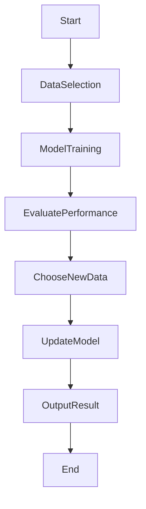
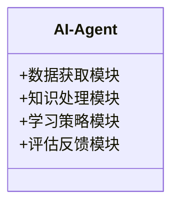
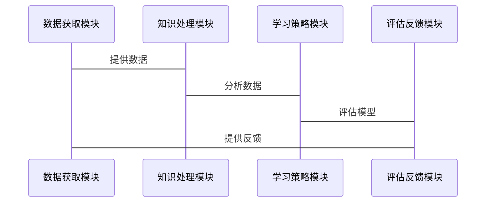

                 


# AI Agent中的主动学习与知识获取

> 关键词：主动学习，知识获取，AI Agent，算法原理，系统架构

> 摘要：本文详细探讨了AI Agent中的主动学习与知识获取的核心概念、算法原理、系统架构及实际应用。通过背景介绍、核心概念分析、算法实现、系统设计和项目实战，全面解析了AI Agent在主动学习与知识获取中的应用及其技术实现。

---

## 第一部分: AI Agent中的主动学习与知识获取概述

### 第1章: AI Agent与主动学习基础

#### 1.1 AI Agent的基本概念

##### 1.1.1 AI Agent的定义
AI Agent（人工智能代理）是指能够感知环境、自主决策并执行任务的智能实体。AI Agent可以是软件程序、机器人或其他智能系统，其核心目标是通过感知和行动来优化特定目标的实现。

##### 1.1.2 AI Agent的核心特征
- **自主性**：能够在没有外部干预的情况下独立运作。
- **反应性**：能够实时感知环境并做出反应。
- **目标导向**：所有行为都围绕明确的目标展开。
- **学习能力**：能够通过经验改进自身的性能。

##### 1.1.3 AI Agent的分类与应用场景
AI Agent可以分为**反应式Agent**和**认知式Agent**两大类：
- **反应式Agent**：基于当前感知做出反应，适用于实时任务（如自动驾驶）。
- **认知式Agent**：具备复杂的推理和规划能力，适用于复杂任务（如智能助手）。

应用场景包括：
- 自动驾驶
- 智能客服
- 智能推荐系统
- 机器人控制

---

#### 1.2 主动学习的基本原理

##### 1.2.1 主动学习的定义
主动学习是一种机器学习范式，其中模型能够主动选择最有益于改进性能的数据点进行学习。与被动学习（如监督学习）不同，主动学习强调数据选择的主动性。

##### 1.2.2 主动学习与监督学习的区别
| 特性 | 主动学习 | 监督学习 |
|------|----------|----------|
| 数据选择 | 主动选择 | 被动使用 |
| 数据量 | 较小     | 较大     |
| 学习效率 | 高       | 中等     |

##### 1.2.3 主动学习的核心机制
主动学习的核心机制包括：
1. **数据选择**：选择最有代表性的数据点。
2. **模型更新**：根据新数据更新模型。
3. **反馈机制**：通过模型表现评估数据选择的合理性。

---

#### 1.3 知识获取的定义与挑战

##### 1.3.1 知识获取的定义
知识获取是指AI Agent通过与环境交互、数据挖掘或其他方法，主动获取和整合知识的过程。

##### 1.3.2 知识获取的关键挑战
- **数据稀疏性**：某些领域数据不足。
- **知识表示**：如何有效表示和组织知识。
- **动态环境**：环境变化可能导致知识过时。

##### 1.3.3 知识获取与主动学习的关系
知识获取是主动学习的重要组成部分，主动学习通过选择性数据获取来优化知识获取的效率和效果。

---

### 第2章: 主动学习的核心概念与原理

#### 2.1 主动学习的核心概念

##### 2.1.1 核心概念的定义
主动学习的核心概念包括：
- **不确定性采样**：选择模型最不确定的数据点。
- **多样性采样**：选择具有代表性的数据点。
- **策略指导**：根据任务目标选择数据。

##### 2.1.2 核心概念的属性特征对比
| 概念         | 属性 |
|--------------|------|
| 不确定性采样 | 基于模型预测的不确定性 |
| 多样性采样   | 基于数据分布的多样性 |
| 策略指导     | 基于任务目标的指导 |

##### 2.1.3 ER实体关系图
```mermaid
erd
    知识库 ----> 数据点
    数据点 ----> 特征
    数据点 ----> 标签
```

---

#### 2.2 主动学习的算法原理

##### 2.2.1 主动学习算法的流程图


##### 2.2.2 算法实现的Python源代码
```python
def active_learning_algorithm(train_data, unlabeled_data):
    # 数据预处理
    processed_data = preprocess(train_data)
    # 模型训练
    model = train(processed_data)
    # 模型评估
    scores = evaluate(model, unlabeled_data)
    # 选择数据点
    selected_data = select_data(scores)
    # 更新模型
    updated_model = update_model(model, selected_data)
    return updated_model
```

---

#### 2.3 数学模型与公式

##### 2.3.1 核心算法的数学模型
主动学习的模型损失函数可以表示为：
$$ \text{模型损失} = \sum_{i=1}^{n} \text{loss}(y_i, \hat{y}_i) $$

##### 2.3.2 选择策略的数学公式
选择数据点的概率可以表示为：
$$ \text{选择概率} = \frac{\text{置信度}}{\sum_{j=1}^{m} \text{置信度}_j} $$

---

### 第3章: 系统分析与架构设计

#### 3.1 问题场景介绍

##### 3.1.1 问题背景
在AI Agent中，主动学习和知识获取是提升代理智能性和适应性的关键。

##### 3.1.2 问题目标
通过主动学习优化知识获取效率，提升AI Agent的性能。

##### 3.1.3 问题约束
- 数据量有限
- 学习效率要求高
- 知识表示的复杂性

---

#### 3.2 系统架构设计

##### 3.2.1 系统功能设计


##### 3.2.2 系统交互流程图


---

### 第4章: 项目实战与案例分析

#### 4.1 环境配置

##### 4.1.1 系统需求
- Python 3.8+
- Scikit-learn库
- Mermaid工具

##### 4.1.2 环境搭建
安装必要的Python库：
```bash
pip install scikit-learn mermaid4jupyter
```

---

#### 4.2 核心实现

##### 4.2.1 数据预处理
```python
def preprocess(data):
    # 数据清洗和特征提取
    return processed_data
```

##### 4.2.2 模型训练
```python
def train(data):
    # 训练模型并返回模型实例
    return model
```

##### 4.2.3 数据选择
```python
def select_data(scores):
    # 根据评分选择数据点
    return selected_data
```

---

#### 4.3 案例分析

##### 4.3.1 案例背景
假设我们正在开发一个智能客服AI Agent，希望通过主动学习优化知识库的构建。

##### 4.3.2 案例实现
```python
# 初始化数据
train_data = [...]  # 已标注数据
unlabeled_data = [...]  # 未标注数据

# 调用主动学习算法
updated_model = active_learning_algorithm(train_data, unlabeled_data)

# 评估模型性能
evaluate_model(updated_model)
```

---

## 第五章: 总结与展望

### 5.1 最佳实践Tips

- 在主动学习中，选择合适的数据选择策略至关重要。
- 知识获取需要结合领域知识和数据特征。
- 定期评估和更新模型以适应环境变化。

### 5.2 小结

本文全面探讨了AI Agent中的主动学习与知识获取，从理论到实践，详细解析了其实现原理和应用方法。

### 5.3 注意事项

- 数据质量和多样性对主动学习效果影响显著。
- 模型更新需要考虑计算资源和效率。
- 知识表示和组织是知识获取的关键。

### 5.4 拓展阅读

- 《主动学习：理论与应用》
- 《知识图谱构建与应用》

---

作者：AI天才研究院/AI Genius Institute & 禅与计算机程序设计艺术 /Zen And The Art of Computer Programming

