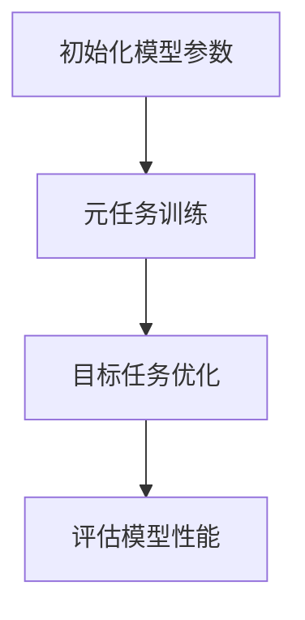
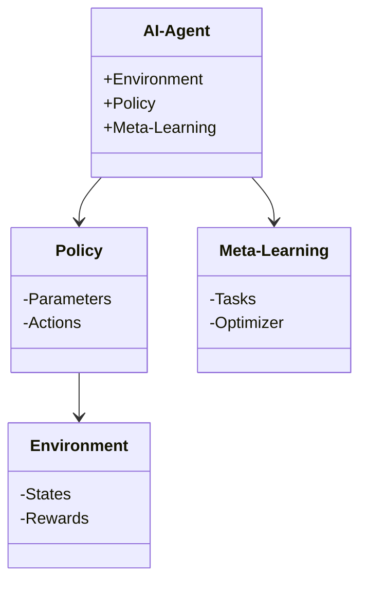
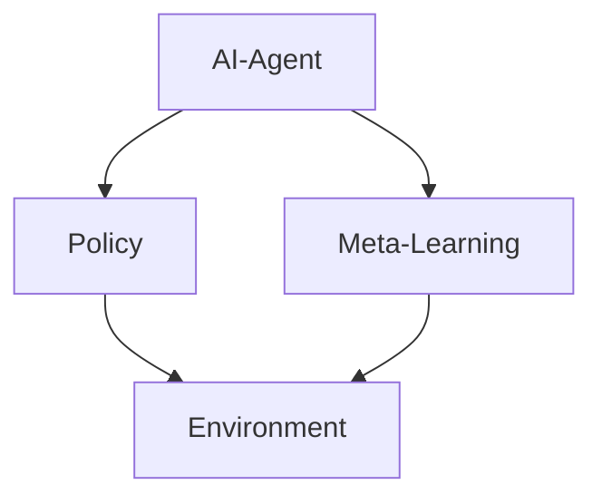
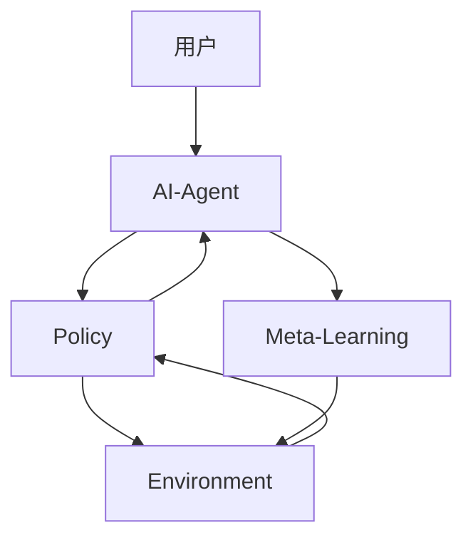

                 


# AI Agent中的元强化学习应用

> **关键词**：AI Agent, 元强化学习, 算法, 系统设计, 项目实战  
> **摘要**：本文深入探讨了AI Agent中元强化学习的应用，从基本概念、算法原理到系统设计与项目实战，全面解析了元强化学习在AI Agent中的核心作用及其实际应用场景。

---

## 第1章: AI Agent概述

### 1.1 AI Agent的基本概念

#### 1.1.1 什么是AI Agent
AI Agent（人工智能代理）是一种能够感知环境、做出决策并执行动作的智能实体。它可以是一个软件程序，也可以是一个物理设备，其目标是通过与环境交互来实现特定任务目标。AI Agent的核心特征包括自主性、反应性、目标导向性和社交能力。

#### 1.1.2 AI Agent的分类
AI Agent可以根据其智能水平和功能分为以下几类：
- **反应式AI Agent**：基于当前感知做出反应，不依赖内部状态。
- **认知式AI Agent**：具备复杂推理和规划能力，能够根据目标和环境信息做出决策。
- **学习型AI Agent**：能够通过经验改进自身性能，适应新环境。

#### 1.1.3 AI Agent的核心特征
- **自主性**：能够在没有外部干预的情况下自主运行。
- **反应性**：能够实时感知环境并做出响应。
- **目标导向性**：通过优化目标函数来实现特定任务。
- **社交能力**：能够与其他AI Agent或人类进行有效协作。

---

### 1.2 元强化学习的定义与特点

#### 1.2.1 元学习的动机与目标
元学习（Meta-Learning）的目标是通过学习如何学习，使模型能够快速适应新任务。与传统强化学习不同，元学习注重在多个任务之间共享知识，从而提高学习效率和泛化能力。

#### 1.2.2 元强化学习的核心概念
元强化学习是一种结合强化学习和元学习的方法，其核心在于通过元任务（Meta-Tasks）来优化强化学习算法。元任务通常是对多个任务的归纳与总结，目的是让模型具备快速适应新任务的能力。

#### 1.2.3 元强化学习与传统强化学习的区别
| 特性 | 元强化学习 | 传统强化学习 |
|------|------------|---------------|
| 学习目标 | 快速适应新任务 | 单一任务优化 |
| 知识共享 | 跨任务知识共享 | 任务独立学习 |
| 适应性 | 强 | 弱 |

---

## 第2章: 元强化学习的背景与应用

### 2.1 元强化学习的背景

#### 2.1.1 强化学习的局限性
- **样本效率低**：传统强化学习需要大量样本才能收敛。
- **适应性差**：面对新任务时，需要重新训练整个模型。

#### 2.1.2 元强化学习的提出
为了解决强化学习的局限性，元强化学习应运而生。它通过在元任务层面优化模型，使得模型能够快速适应新任务。

#### 2.1.3 元强化学习的优势
- **快速适应新任务**：通过元任务训练，模型能够在新任务上快速收敛。
- **跨任务知识共享**：多个任务之间的知识可以被复用，提高学习效率。

### 2.2 元强化学习的应用场景

#### 2.2.1 多任务学习
元强化学习在多任务学习中表现出色，能够同时优化多个任务，提高模型的泛化能力。

#### 2.2.2 快速适应新环境
在动态环境中，元强化学习能够帮助AI Agent快速适应新变化，减少训练时间。

#### 2.2.3 智能体的自适应决策
通过元强化学习，AI Agent能够根据环境反馈动态调整策略，做出更优决策。

---

## 第3章: 元强化学习的核心概念与联系

### 3.1 元强化学习的原理

#### 3.1.1 元学习的动机
元学习的核心动机是通过学习如何学习，使模型具备更强的适应能力。在元强化学习中，元任务通常是对多个任务的归纳与总结。

#### 3.1.2 元强化学习的算法框架
元强化学习的算法通常包括两个阶段：
1. **元任务训练**：在多个任务上预训练模型，使其具备跨任务的归纳能力。
2. **目标任务优化**：在特定任务上微调模型，使其快速适应新任务。

#### 3.1.3 元强化学习的核心要素
- **元任务设计**：设计合理的元任务是元强化学习成功的关键。
- **模型优化**：通过元任务优化模型，使其具备快速适应新任务的能力。

### 3.2 元强化学习与传统强化学习的对比

#### 3.2.1 从任务到元任务的转变
元强化学习通过引入元任务，将多个任务的学习目标统一起来，使得模型能够同时优化多个任务。

#### 3.2.2 元强化学习的灵活性与适应性
元强化学习能够快速适应新任务，而传统强化学习则需要从头开始训练。

#### 3.2.3 元强化学习的挑战与局限
- **元任务设计难度高**：设计合理的元任务需要深入理解任务之间的关系。
- **计算资源需求大**：元强化学习通常需要大量的计算资源。

---

## 第4章: 元强化学习的数学模型与算法原理

### 4.1 元强化学习的数学模型

#### 4.1.1 元强化学习的目标函数
元强化学习的目标函数通常包括两个部分：
1. **元任务损失**：用于优化模型的跨任务能力。
2. **目标任务损失**：用于优化模型在特定任务上的表现。

数学表达式如下：
$$
L_{\text{meta}} = \sum_{i=1}^{N} L_i
$$
其中，$L_i$ 是第 $i$ 个任务的损失函数。

#### 4.1.2 元强化学习的优化过程
元强化学习的优化过程通常包括以下几个步骤：
1. **初始化模型参数**：随机初始化模型参数。
2. **元任务训练**：在多个任务上优化模型参数。
3. **目标任务优化**：在特定任务上微调模型参数。

#### 4.1.3 元强化学习的收敛性分析
元强化学习的收敛性分析通常需要考虑模型的泛化能力和优化过程中的稳定性。

### 4.2 元强化学习的算法实现

#### 4.2.1 元强化学习的算法框架
以下是一个典型的元强化学习算法框架：



#### 4.2.2 元强化学习的训练流程
1. **初始化模型参数**：随机初始化模型参数。
2. **元任务训练**：在多个任务上优化模型参数。
3. **目标任务优化**：在特定任务上微调模型参数。

#### 4.2.3 元强化学习的代码实现
以下是一个简单的元强化学习代码示例：

```python
def meta_learning_algorithm():
    # 初始化模型参数
    model_params = initialize_parameters()
    # 元任务训练
    for meta_task in meta_tasks:
        model_params = optimize(model_params, meta_task)
    # 目标任务优化
    for target_task in target_tasks:
        model_params = fine_tune(model_params, target_task)
    return model_params
```

---

## 第5章: 系统分析与架构设计方案

### 5.1 系统分析

#### 5.1.1 问题场景介绍
本文设计了一个基于元强化学习的AI Agent系统，旨在通过元任务训练使AI Agent能够快速适应新任务。

#### 5.1.2 项目目标与范围
项目目标是实现一个高效的元强化学习系统，使其能够在多种任务中快速适应新环境。

#### 5.1.3 系统功能需求
- **元任务训练**：在多个任务上预训练模型。
- **目标任务优化**：在特定任务上微调模型。
- **性能评估**：评估模型在新任务上的表现。

### 5.2 系统架构设计

#### 5.2.1 领域模型设计
以下是一个典型的领域模型类图：



#### 5.2.2 系统架构图
以下是一个系统架构图：



#### 5.2.3 系统接口设计
系统主要接口包括：
- **输入接口**：接收环境状态和任务信息。
- **输出接口**：输出动作和优化后的模型参数。

#### 5.2.4 系统交互流程图
以下是一个系统交互流程图：



---

## 第6章: 项目实战

### 6.1 环境安装
首先，需要安装以下环境：
- Python 3.8+
- PyTorch
- numpy
- matplotlib

### 6.2 系统核心实现源代码

#### 6.2.1 元强化学习算法实现
以下是一个简单的元强化学习算法实现：

```python
import torch
import numpy as np

def meta_learning_algorithm(meta_tasks, target_tasks):
    # 初始化模型参数
    model_params = initialize_parameters()
    # 元任务训练
    for meta_task in meta_tasks:
        model_params = optimize(model_params, meta_task)
    # 目标任务优化
    for target_task in target_tasks:
        model_params = fine_tune(model_params, target_task)
    return model_params

def initialize_parameters():
    return torch.randn(10, 10)

def optimize(params, task):
    optimizer = torch.optim.SGD(params, lr=0.1)
    optimizer.zero_grad()
    # 前向传播
    outputs = model(params)
    # 计算损失
    loss = task_loss(outputs, task.label)
    # 反向传播
    loss.backward()
    optimizer.step()
    return params

def fine_tune(params, task):
    optimizer = torch.optim.SGD(params, lr=0.01)
    optimizer.zero_grad()
    # 前向传播
    outputs = model(params)
    # 计算损失
    loss = task_loss(outputs, task.label)
    # 反向传播
    loss.backward()
    optimizer.step()
    return params
```

#### 6.2.2 环境与任务定义
以下是一个简单的环境与任务定义：

```python
class Environment:
    def __init__(self):
        self.states = np.random.randn(100, 10)
        self.labels = np.random.randint(0, 2, 100)

    def get_state(self, index):
        return self.states[index]

    def get_label(self, index):
        return self.labels[index]

class Task:
    def __init__(self, environment, start_index, end_index):
        self.environment = environment
        self.start_index = start_index
        self.end_index = end_index

    def sample(self):
        indices = np.random.randint(self.start_index, self.end_index, 10)
        return self.environment.get_state(indices), self.environment.get_label(indices)
```

### 6.3 代码应用解读与分析

#### 6.3.1 元强化学习算法实现
上述代码实现了一个简单的元强化学习算法，包括模型参数的初始化、元任务训练和目标任务优化。

#### 6.3.2 环境与任务定义
通过定义Environment和Task类，我们可以模拟不同的环境和任务，从而测试模型的适应能力。

### 6.4 实际案例分析

#### 6.4.1 案例背景
假设我们有一个分类任务，数据分为训练集和测试集。训练集包含多个任务，测试集包含新任务。

#### 6.4.2 案例实现
以下是一个具体的实现示例：

```python
# 初始化环境
env = Environment()
meta_tasks = [Task(env, 0, 50), Task(env, 50, 75)]
target_tasks = [Task(env, 75, 100)]

# 运行元强化学习算法
model_params = meta_learning_algorithm(meta_tasks, target_tasks)

# 评估模型性能
test_env = Environment()
test_task = Task(test_env, 100, 150)
test_states, test_labels = test_task.sample()
outputs = model(model_params, test_states)
accuracy = np.sum(outputs == test_labels) / len(test_labels)
print(f"Accuracy: {accuracy}")
```

### 6.5 项目小结

---

## 第7章: 最佳实践与小结

### 7.1 最佳实践 tips
- **合理设计元任务**：元任务的设计直接影响模型的性能。
- **选择合适的算法框架**：不同的任务可能需要不同的算法。
- **充分利用计算资源**：元强化学习需要大量的计算资源。

### 7.2 小结
本文深入探讨了AI Agent中的元强化学习应用，从基本概念、算法原理到系统设计与项目实战，全面解析了元强化学习在AI Agent中的核心作用及其实际应用场景。

### 7.3 注意事项
- 元强化学习的计算资源需求较大。
- 元任务设计需要深入理解任务之间的关系。
- 模型的泛化能力依赖于元任务训练的质量。

### 7.4 拓展阅读
- **推荐书籍**：《Deep Learning》、《Reinforcement Learning: Theory and Algorithms》
- **推荐论文**：《Meta-Learning with梯度 Descent-ICE》、《Learning to Learn by Gradient Descent by Gradient Descent》

---

## 作者信息

**作者**：AI天才研究院/AI Genius Institute & 禅与计算机程序设计艺术 /Zen And The Art of Computer Programming

