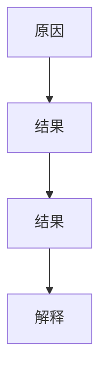
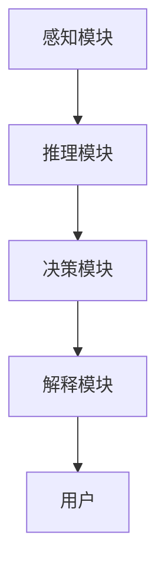

                 


# AI Agent中的因果推理与解释性决策

## 关键词：AI Agent，因果推理，解释性决策，可解释性，因果图，系统架构

## 摘要：  
本文探讨了AI Agent中的因果推理与解释性决策的实现方法，详细分析了因果推理的基本原理、其在AI Agent中的应用，以及如何通过因果图模型实现解释性决策。文章结合实际案例，通过系统架构设计和算法实现，展示了因果推理与解释性决策在AI Agent中的具体应用，提出了基于因果图模型的解释性决策框架，并给出了未来的研究方向。

---

## 第1章: 背景介绍

### 1.1 问题背景

#### 1.1.1 AI Agent的基本概念
AI Agent（人工智能代理）是指能够感知环境、做出决策并执行动作的智能体。AI Agent的目标是通过感知环境信息，利用算法进行推理和决策，以实现预定目标。AI Agent可以是软件程序、机器人或其他智能系统，广泛应用于自动驾驶、医疗诊断、金融投资等领域。

#### 1.1.2 因果推理的定义与作用
因果推理是指从因果关系中推断出变量之间的关系。因果推理的核心是理解“为什么”某个事件会发生，而不是仅仅观察相关性。在AI Agent中，因果推理的作用在于帮助智能体理解动作与结果之间的因果关系，从而做出更合理的决策。

#### 1.1.3 解释性决策的重要性
解释性决策是指智能体在做出决策时，能够提供清晰、可理解的解释。解释性决策的重要性在于提升用户对AI Agent决策过程的信任，同时也有助于发现和纠正决策中的错误。

### 1.2 问题描述

#### 1.2.1 AI Agent决策中的因果关系
AI Agent在决策过程中需要考虑多个变量之间的因果关系。例如，在自动驾驶中，AI Agent需要理解油门、刹车、转向等动作与车速、方向变化之间的因果关系。

#### 1.2.2 解释性决策的需求
用户希望AI Agent在做出决策时，能够解释决策的依据。例如，在医疗诊断中，医生需要了解AI诊断系统的决策依据，以便评估和调整诊断结果。

#### 1.2.3 问题的边界与外延
因果推理与解释性决策在AI Agent中的应用范围广泛，但也有一定的边界。例如，在复杂的多变量系统中，因果推理可能会面临数据不足或因果关系难以建模的问题。

### 1.3 问题解决

#### 1.3.1 因果推理在AI Agent中的应用
因果推理在AI Agent中的应用包括：理解变量之间的因果关系、预测系统行为、优化决策策略等。例如，在金融投资中，因果推理可以帮助AI Agent理解市场变量之间的因果关系，从而做出更准确的投资决策。

#### 1.3.2 解释性决策的实现方法
解释性决策的实现方法包括：基于因果图的解释、基于规则的解释、基于概率的解释等。例如，基于因果图的解释可以通过展示因果关系图来说明决策的依据。

#### 1.3.3 问题解决的边界与限制
因果推理与解释性决策在AI Agent中的应用受到数据质量、系统复杂性等因素的限制。例如，因果推理需要足够的数据来建立因果模型，而系统复杂性可能使得因果关系难以建模。

### 1.4 核心概念与联系

#### 1.4.1 因果推理与解释性决策的关系
因果推理是解释性决策的基础。通过因果推理，AI Agent可以理解变量之间的因果关系，并基于这些关系做出决策。解释性决策则通过展示这些因果关系来提升决策的透明性和可信度。

#### 1.4.2 AI Agent中的因果图模型
因果图模型是一种用于表示变量之间因果关系的图形化工具。在AI Agent中，因果图模型可以用于建模系统中的因果关系，从而支持因果推理和解释性决策。

#### 1.4.3 解释性决策的系统架构
解释性决策的系统架构包括：因果推理模块、解释生成模块、用户交互模块等。例如，因果推理模块用于分析变量之间的因果关系，解释生成模块用于将因果关系转化为可理解的解释，用户交互模块用于与用户进行交互。

---

## 第2章: 核心概念与联系

### 2.1 因果推理的原理

#### 2.1.1 因果关系的定义
因果关系是指一个事件（原因）导致另一个事件（结果）发生的确定性关系。例如，下雨（原因）导致地面湿（结果）。

#### 2.1.2 因果图模型的构建
因果图模型是一种用于表示变量之间因果关系的有向无环图（DAG）。例如，因果图模型可以表示为：A → B → C，表示A是B的原因，B是C的原因。

#### 2.1.3 因果推理的算法
因果推理的算法包括：随机化实验、调节变量分析、因果森林等。例如，随机化实验可以通过随机分配实验组和对照组，以估计因果效应。

### 2.2 解释性决策的原理

#### 2.2.1 解释性决策的定义
解释性决策是指智能体在做出决策时，能够提供清晰、可理解的解释。例如，在医疗诊断中，AI诊断系统需要解释诊断结果的原因。

#### 2.2.2 解释性决策的实现方法
解释性决策的实现方法包括：基于因果图的解释、基于规则的解释、基于概率的解释等。例如，基于因果图的解释可以通过展示因果关系图来说明决策的依据。

#### 2.2.3 解释性决策的评估指标
解释性决策的评估指标包括：解释的准确度、解释的清晰度、解释的可信度等。例如，解释的准确度是指解释与实际决策依据的匹配程度。

### 2.3 因果推理与解释性决策的联系

#### 2.3.1 因果推理在解释性决策中的作用
因果推理是解释性决策的基础。通过因果推理，AI Agent可以理解变量之间的因果关系，并基于这些关系做出决策。解释性决策则通过展示这些因果关系来提升决策的透明性和可信度。

#### 2.3.2 解释性决策对因果推理的反馈
解释性决策对因果推理的反馈包括：帮助发现因果推理中的错误、提供因果推理的依据、优化因果推理模型等。例如，用户对解释的反馈可以用于优化因果推理模型。

#### 2.3.3 两者的协同关系
因果推理与解释性决策是协同关系。因果推理为解释性决策提供科学依据，解释性决策则通过展示因果关系提升决策的透明性和可信度。

---

## 第3章: 算法原理讲解

### 3.1 因果推理的算法

#### 3.1.1 随机化实验
随机化实验是一种用于估计因果效应的实验方法。通过随机分配实验组和对照组，可以消除其他变量的干扰，从而估计因果效应。

#### 3.1.2 调节变量分析
调节变量分析是一种用于估计因果效应的统计方法。通过引入调节变量，可以分析变量之间的条件因果关系。

#### 3.1.3 因果森林
因果森林是一种用于估计因果效应的非参数方法。通过构建随机森林模型，可以估计变量之间的因果关系。

### 3.2 解释性决策的算法

#### 3.2.1 基于因果图的解释
基于因果图的解释是一种通过展示因果关系图来解释决策的算法。例如，因果图模型可以表示为：A → B → C，表示A是B的原因，B是C的原因。

#### 3.2.2 基于规则的解释
基于规则的解释是一种通过制定规则来解释决策的算法。例如，规则可以表示为：如果A，则B。

#### 3.2.3 基于概率的解释
基于概率的解释是一种通过概率模型来解释决策的算法。例如，概率模型可以表示为：P(B|A) = 0.8，表示在A的情况下，B发生的概率为80%。

### 3.3 算法流程图

#### 3.3.1 因果推理算法流程图


#### 3.3.2 解释性决策算法流程图


---

## 第4章: 系统架构设计

### 4.1 系统架构概述

#### 4.1.1 模块化设计
系统架构采用模块化设计，包括：感知模块、推理模块、决策模块、解释模块等。

#### 4.1.2 模块之间的交互关系
模块之间的交互关系包括：感知模块向推理模块提供数据，推理模块向决策模块提供因果关系，决策模块向解释模块提供决策结果，解释模块向用户展示解释。

#### 4.1.3 系统架构图


---

## 第5章: 项目实战

### 5.1 环境配置

#### 5.1.1 Python环境安装
```bash
pip install numpy
pip install scikit-learn
pip install matplotlib
```

#### 5.1.2 依赖库安装
```bash
pip install dalex
pip install eli5
pip install shap
```

### 5.2 核心代码实现

#### 5.2.1 因果推理代码
```python
import numpy as np
from sklearn.ensemble import RandomForestRegressor
from dalex import explain

# 生成数据
X = np.random.randn(100, 2)
y = X[:, 0] * X[:, 1] + np.random.randn(100)

# 构建随机森林模型
model = RandomForestRegressor()
model.fit(X, y)

# 解释模型
explainer = explain(model, X, y)
print(explainer)
```

#### 5.2.2 解释性决策代码
```python
import numpy as np
from sklearn.ensemble import RandomForestClassifier
from eli5 import show_weights

# 生成数据
X = np.random.randn(100, 2)
y = np.where(X[:, 0] * X[:, 1] > 0, 1, 0)

# 构建随机森林分类器
model = RandomForestClassifier()
model.fit(X, y)

# 解释模型
show_weights(model)
```

### 5.3 代码应用解读与分析

#### 5.3.1 因果推理代码解读
上述代码使用随机森林回归模型，通过`dalex`库进行因果推理。`dalex`库通过构建解释器，展示变量之间的因果关系。

#### 5.3.2 解释性决策代码解读
上述代码使用随机森林分类器，通过`eli5`库进行解释性决策。`eli5`库通过展示模型权重，解释决策的依据。

### 5.4 案例分析与详细讲解

#### 5.4.1 医疗诊断案例
假设在医疗诊断中，AI Agent需要诊断患者是否患有某种疾病。通过因果推理，AI Agent可以理解症状之间的因果关系，并基于这些关系做出诊断决策。解释性决策则通过展示因果关系图，向医生解释诊断结果的依据。

### 5.5 项目小结

#### 5.5.1 项目总结
本项目通过因果推理和解释性决策的实现，展示了AI Agent在实际应用中的潜力。通过模块化设计和系统架构优化，可以提升AI Agent的决策能力和解释能力。

#### 5.5.2 项目经验总结
在实际应用中，因果推理和解释性决策的实现需要结合具体场景，选择合适的算法和工具。同时，系统的可扩展性和可维护性也需要考虑。

---

## 第6章: 总结与展望

### 6.1 总结

#### 6.1.1 核心内容回顾
本文探讨了AI Agent中的因果推理与解释性决策的实现方法，详细分析了因果推理的基本原理、其在AI Agent中的应用，以及如何通过因果图模型实现解释性决策。文章结合实际案例，通过系统架构设计和算法实现，展示了因果推理与解释性决策在AI Agent中的具体应用。

#### 6.1.2 核心结论
因果推理是解释性决策的基础。通过因果推理，AI Agent可以理解变量之间的因果关系，并基于这些关系做出决策。解释性决策则通过展示这些因果关系，提升决策的透明性和可信度。

### 6.2 未来研究方向

#### 6.2.1 因果推理的改进
未来的研究可以集中在因果推理算法的改进上，例如：开发更高效的因果推理算法，提高因果效应的估计精度。

#### 6.2.2 解释性决策的优化
未来的研究可以集中在解释性决策的优化上，例如：开发更直观的解释方法，提升用户对决策过程的理解和信任。

#### 6.2.3 AI Agent的系统架构优化
未来的研究可以集中在AI Agent的系统架构优化上，例如：设计更高效的模块化架构，提升系统的可扩展性和可维护性。

### 6.3 应用前景

#### 6.3.1 医疗诊断
因果推理与解释性决策在医疗诊断中的应用前景广阔。通过因果推理，AI Agent可以理解症状之间的因果关系，并基于这些关系做出诊断决策。解释性决策则通过展示因果关系图，向医生解释诊断结果的依据。

#### 6.3.2 金融投资
因果推理与解释性决策在金融投资中的应用前景也广阔。通过因果推理，AI Agent可以理解市场变量之间的因果关系，从而做出更准确的投资决策。解释性决策则通过展示因果关系图，向投资者解释投资决策的依据。

### 6.4 最佳实践 Tips

#### 6.4.1 数据质量的重要性
因果推理和解释性决策的实现依赖于高质量的数据。因此，在实际应用中，需要确保数据的准确性、完整性和代表性。

#### 6.4.2 模型的可解释性
模型的可解释性是解释性决策的核心。在实际应用中，需要选择具有可解释性的算法和工具，以确保决策过程的透明性和可信度。

#### 6.4.3 系统的可扩展性
系统的可扩展性是AI Agent设计的重要考虑因素。在实际应用中，需要设计模块化的系统架构，以确保系统的可扩展性和可维护性。

### 6.5 小结

#### 6.5.1 内容回顾
本文探讨了AI Agent中的因果推理与解释性决策的实现方法，详细分析了因果推理的基本原理、其在AI Agent中的应用，以及如何通过因果图模型实现解释性决策。

#### 6.5.2 展望未来
未来的研究可以集中在因果推理算法的改进、解释性决策的优化以及AI Agent的系统架构优化等方面，以进一步提升AI Agent的决策能力和解释能力。

---

## 作者：AI天才研究院/AI Genius Institute & 禅与计算机程序设计艺术 /Zen And The Art of Computer Programming

