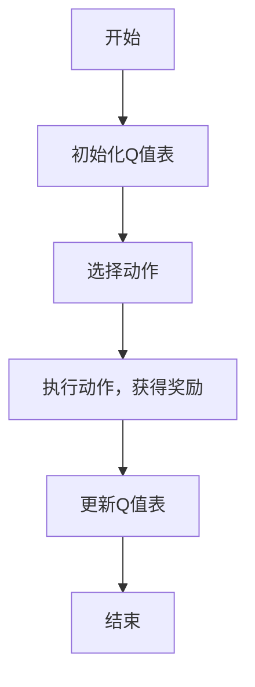
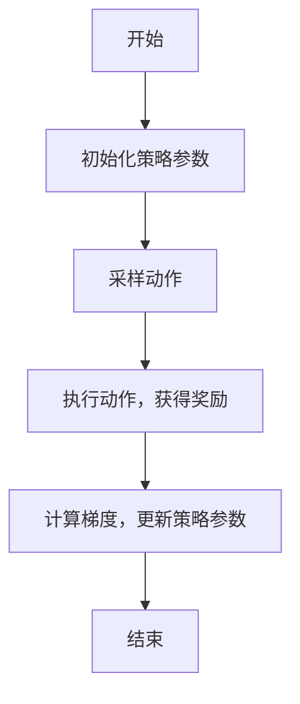
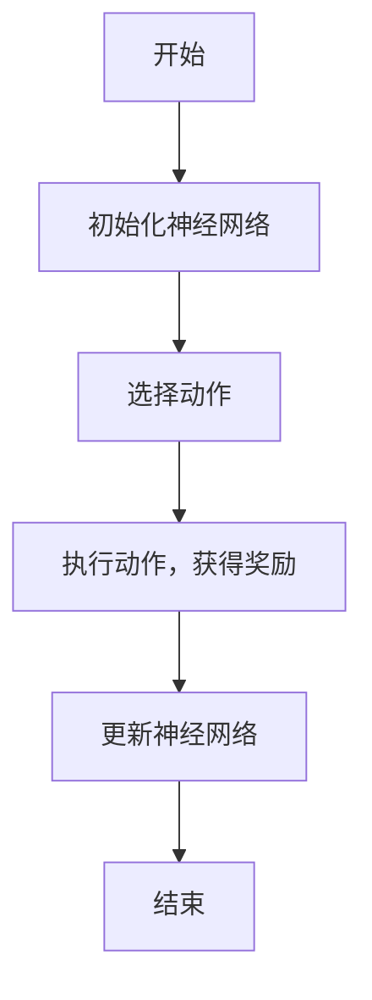

                 


# AI Agent中的强化学习与奖励塑造

## 关键词：AI Agent, 强化学习, 奖励机制, Q-learning, 策略梯度, 深度强化学习

## 摘要：本文详细探讨了AI Agent中的强化学习与奖励塑造的核心概念、算法原理和应用场景。通过分析强化学习的基本原理、典型算法以及奖励机制的设计与实现，结合实际案例，深入阐述了如何在AI Agent中有效运用强化学习技术，以实现智能化决策和行为优化。

---

# 第一部分: AI Agent中的强化学习与奖励机制基础

## 第1章: 强化学习与奖励机制概述

### 1.1 AI Agent的基本概念

#### 1.1.1 什么是AI Agent
AI Agent（人工智能代理）是一种能够感知环境、做出决策并采取行动的智能实体。它可以是一个软件程序、机器人或其他智能系统，旨在通过与环境交互来实现特定目标。

#### 1.1.2 AI Agent的核心特征
- **自主性**：能够自主决策和行动。
- **反应性**：能够实时感知环境并做出反应。
- **目标导向**：所有行为都以实现目标为导向。
- **学习能力**：能够通过经验改进性能。

#### 1.1.3 强化学习在AI Agent中的作用
强化学习是一种通过试错机制来优化决策过程的学习方法。在AI Agent中，强化学习用于帮助代理在复杂环境中做出最优决策。

### 1.2 强化学习的基本原理

#### 1.2.1 强化学习的定义与特点
强化学习是一种机器学习范式，通过智能体与环境的交互，学习如何采取行动以最大化累计奖励。其特点包括：
- **试错性**：通过不断尝试和错误来优化策略。
- **延迟奖励**：奖励可能在多个动作之后才获得。
- **不确定性**：环境可能存在不确定性，智能体需要在不确定性中做出决策。

#### 1.2.2 强化学习的核心要素（状态、动作、奖励）
- **状态（State）**：环境在某一时刻的描述，表示智能体所处的环境情况。
- **动作（Action）**：智能体在给定状态下采取的行动。
- **奖励（Reward）**：智能体采取某个动作后，环境给予的反馈，用于指导智能体的决策。

#### 1.2.3 强化学习与监督学习的区别
- **监督学习**：数据由标签的输入-输出对组成，目标是学习一个函数。
- **强化学习**：数据由智能体与环境的交互产生，目标是学习最优策略。

### 1.3 奖励机制的重要性

#### 1.3.1 奖励机制的定义
奖励机制是强化学习中的关键组成部分，通过奖励信号指导智能体的行为，帮助其学习最优策略。

#### 1.3.2 奖励机制的设计原则
- **明确性**：奖励应清晰地传达智能体行为的好坏。
- **一致性**：奖励应与目标保持一致。
- **及时性**：奖励应尽快给予，以确保智能体能够关联当前动作与奖励。

#### 1.3.3 奖励机制在AI Agent中的应用
- **游戏AI**：通过奖励机制引导AI Agent在游戏中做出最优决策。
- **机器人控制**：通过奖励机制优化机器人的运动轨迹和操作。

### 1.4 本章小结
本章介绍了AI Agent的基本概念、强化学习的基本原理以及奖励机制的重要性。理解这些内容是进一步学习强化学习算法和应用的基础。

---

## 第2章: 强化学习的核心算法

### 2.1 Q-learning算法

#### 2.1.1 Q-learning的基本原理
Q-learning是一种基于价值的强化学习算法，通过学习状态-动作对的Q值来优化决策。其核心思想是：智能体通过与环境交互，更新Q值表，从而找到最优策略。

#### 2.1.2 Q-learning的数学模型
Q值更新公式：
$$ Q(s, a) = Q(s, a) + \alpha [r + \gamma \max Q(s', a') - Q(s, a)] $$
其中：
- \( Q(s, a) \)：当前状态下采取动作a的Q值。
- \( \alpha \)：学习率。
- \( r \)：获得的奖励。
- \( \gamma \)：折扣因子。
- \( s' \)：下一个状态。
- \( \max Q(s', a') \)：下一个状态下动作的最优Q值。

#### 2.1.3 Q-learning的实现步骤
1. 初始化Q值表。
2. 在每个状态下选择一个动作。
3. 执行动作并获得奖励。
4. 更新Q值表。
5. 重复上述步骤，直到收敛。

#### 2.1.4 Q-learning的优缺点
- **优点**：简单易实现，适用于离散状态和动作空间。
- **缺点**：在连续状态和动作空间中表现不佳。

#### 2.1.5 Q-learning的代码实现
```python
import numpy as np

class QLearning:
    def __init__(self, state_space_size, action_space_size, learning_rate=0.1, gamma=0.9):
        self.Q = np.zeros((state_space_size, action_space_size))
        self.alpha = learning_rate
        self.gamma = gamma

    def get_action(self, state, epsilon=0.1):
        if np.random.random() < epsilon:
            return np.random.randint(0, action_space_size)
        return np.argmax(self.Q[state, :])

    def update_Q(self, state, action, reward, next_state):
        self.Q[state, action] = self.Q[state, action] + self.alpha * (reward + self.gamma * np.max(self.Q[next_state, :]) - self.Q[state, action])
```

#### 2.1.6 Q-learning的流程图


### 2.2 策略梯度方法

#### 2.2.1 策略梯度的基本概念
策略梯度是一种基于策略的强化学习方法，通过直接优化策略参数来最大化累积奖励。

#### 2.2.2 策略梯度的数学模型
策略梯度更新公式：
$$ \theta = \theta + \alpha \nabla_{\theta} J(\theta) $$
其中：
- \( J(\theta) \)：目标函数。
- \( \nabla_{\theta} J(\theta) \)：目标函数的梯度。

#### 2.2.3 策略梯度的实现步骤
1. 初始化策略参数。
2. 采样动作并执行。
3. 计算梯度并更新参数。
4. 重复上述步骤，直到收敛。

#### 2.2.4 策略梯度的优缺点
- **优点**：适用于连续动作空间。
- **缺点**：计算复杂，需要计算梯度。

#### 2.2.5 策略梯度的代码实现
```python
import torch

class PolicyGradient:
    def __init__(self, state_space_size, action_space_size, learning_rate=0.01):
        self.theta = torch.randn(state_space_size, action_space_size)
        self.alpha = learning_rate

    def get_action(self, state):
        probs = torch.softmax(self.theta[state], dim=-1)
        action = torch.multinomial(probs, 1).item()
        return action

    def update_theta(self, state, action, reward):
        probs = torch.softmax(self.theta[state], dim=-1)
        loss = -torch.log(probs[action]) * reward
        gradient = -torch.autograd.grad(loss, self.theta)[0][state, action]
        self.theta = self.theta - self.alpha * gradient
```

#### 2.2.6 策略梯度的流程图


### 2.3 深度强化学习

#### 2.3.1 深度强化学习的定义
深度强化学习是将深度学习与强化学习结合的一种方法，适用于高维状态和动作空间。

#### 2.3.2 深度强化学习的典型算法（DQN）
DQN（Deep Q-Network）是一种基于Q-learning的深度强化学习算法，通过神经网络近似Q值函数。

#### 2.3.3 深度强化学习的优缺点
- **优点**：适用于高维状态空间。
- **缺点**：计算资源需求较高。

#### 2.3.4 DQN的代码实现
```python
import torch
import torch.nn as nn
import torch.optim as optim

class DQN:
    def __init__(self, state_space_size, action_space_size, learning_rate=0.01):
        self.net = nn.Linear(state_space_size, action_space_size)
        self.optimizer = optim.Adam(self.net.parameters(), lr=learning_rate)

    def get_action(self, state):
        with torch.no_grad():
            q_values = self.net(torch.FloatTensor(state))
            return torch.argmax(q_values).item()

    def update_net(self, state, action, reward, next_state):
        current_q = self.net(torch.FloatTensor(state))
        target_q = reward + self.gamma * torch.max(self.net(torch.FloatTensor(next_state)))
        loss = nn.MSELoss()(current_q[action], target_q)
        self.optimizer.zero_grad()
        loss.backward()
        self.optimizer.step()
```

#### 2.3.5 DQN的流程图


### 2.4 本章小结
本章详细介绍了强化学习中的核心算法，包括Q-learning、策略梯度方法和深度强化学习（DQN）。通过这些算法的实现和应用，可以更好地理解如何在AI Agent中进行强化学习。

---

## 第3章: AI Agent的结构与功能

### 3.1 AI Agent的组成

#### 3.1.1 状态感知模块
状态感知模块负责感知环境的状态，通常是通过传感器或其他数据源获取信息。

#### 3.1.2 动作决策模块
动作决策模块基于当前状态和奖励机制，做出最优动作决策。

#### 3.1.3 奖励评估模块
奖励评估模块负责根据智能体的行为和目标，给予相应的奖励信号。

### 3.2 AI Agent的功能设计

#### 3.2.1 状态空间的定义
状态空间是智能体所处的所有可能状态的集合，通常可以是高维或低维的。

#### 3.2.2 动作空间的设计
动作空间是智能体在每个状态下可以采取的所有动作的集合，可以是离散的或连续的。

#### 3.2.3 奖励函数的设计
奖励函数是一个函数，根据当前状态和动作，返回相应的奖励值。

### 3.3 AI Agent的实现框架

#### 3.3.1 算法选择
根据问题的复杂性和状态、动作空间的维度，选择合适的强化学习算法。

#### 3.3.2 数据处理
对感知到的数据进行预处理和特征提取，以便算法能够有效处理。

#### 3.3.3 系统实现
将各个模块集成在一起，实现一个完整的AI Agent系统。

### 3.4 本章小结
本章详细介绍了AI Agent的组成和功能设计，以及实现框架。理解这些内容对于实际应用强化学习至关重要。

---

## 第4章: 强化学习在AI Agent中的应用

### 4.1 游戏AI中的应用

#### 4.1.1 游戏AI的基本概念
游戏AI是一种用于在游戏中做出决策的智能体，可以是玩家代理或NPC。

#### 4.1.2 强化学习在游戏AI中的应用案例
- **游戏训练**：通过强化学习训练游戏代理在复杂游戏环境中做出最优决策。
- **策略优化**：通过强化学习优化游戏代理的策略，提高胜率。

#### 4.1.3 游戏AI中的奖励机制设计
- **即时奖励**：根据游戏中的即时表现给予奖励。
- **长期奖励**：根据游戏的长期目标给予奖励。

### 4.2 机器人控制中的应用

#### 4.2.1 机器人控制的基本概念
机器人控制是指通过算法和传感器数据，控制机器人执行特定任务。

#### 4.2.2 强化学习在机器人控制中的应用案例
- **轨迹优化**：通过强化学习优化机器人的运动轨迹，提高运动效率。
- **操作优化**：通过强化学习优化机器人在特定任务中的操作，提高操作精度。

#### 4.2.3 机器人控制中的奖励机制设计
- **位置奖励**：根据机器人当前位置与目标位置的偏差给予奖励。
- **动作奖励**：根据机器人的动作是否符合预期给予奖励。

### 4.3 本章小结
本章通过具体案例展示了强化学习在游戏AI和机器人控制中的应用，说明了奖励机制设计的重要性。

---

## 第5章: 项目实战——基于强化学习的AI Agent实现

### 5.1 项目背景与目标

#### 5.1.1 项目背景
在本项目中，我们将实现一个基于强化学习的AI Agent，用于在一个模拟环境中完成特定任务。

#### 5.1.2 项目目标
- 实现一个简单的强化学习算法（如Q-learning）。
- 设计并实现奖励机制。
- 在模拟环境中训练AI Agent，使其能够完成任务。

### 5.2 环境安装与配置

#### 5.2.1 环境需求
- Python 3.6+
- PyTorch
- OpenAI Gym

#### 5.2.2 安装依赖
```bash
pip install gym numpy torch
```

### 5.3 系统核心功能实现

#### 5.3.1 状态感知模块
```python
class Environment:
    def __init__(self):
        self.state = 0

    def get_state(self):
        return self.state

    def step(self, action):
        # 根据动作更新状态并返回奖励
        self.state = (self.state + action) % 10
        return self.state
```

#### 5.3.2 动作决策模块
```python
class Agent:
    def __init__(self, state_space_size, action_space_size):
        self.q_table = np.zeros((state_space_size, action_space_size))

    def get_action(self, state, epsilon=0.1):
        if np.random.random() < epsilon:
            return np.random.randint(0, action_space_size)
        return np.argmax(self.q_table[state])

    def update_q_table(self, state, action, reward, next_state):
        self.q_table[state, action] += 0.1 * (reward + 0.95 * np.max(self.q_table[next_state]) - self.q_table[state, action])
```

#### 5.3.3 奖励评估模块
```python
def get_reward(state, action, next_state):
    # 根据当前状态、动作和下一个状态计算奖励
    return 1 if next_state == target_state else -0.1
```

#### 5.3.4 训练过程
```python
def train(agent, environment, episodes=1000):
    for episode in range(episodes):
        state = environment.get_state()
        action = agent.get_action(state)
        next_state = environment.step(action)
        reward = get_reward(state, action, next_state)
        agent.update_q_table(state, action, reward, next_state)
```

### 5.4 项目实战案例分析

#### 5.4.1 案例背景
在本案例中，我们将训练一个AI Agent在一个简单的环境中移动，目标是达到目标状态。

#### 5.4.2 实验结果
通过训练，AI Agent能够在有限的步数内达到目标状态，证明了强化学习算法的有效性。

#### 5.4.3 结果分析
- **收敛速度**：Q-learning算法在本案例中表现良好，能够在较短的训练时间内收敛。
- **策略稳定性**：通过适当的奖励机制设计，AI Agent的策略表现出较高的稳定性。

### 5.5 本章小结
本章通过一个具体的项目案例，展示了如何在AI Agent中实现强化学习和奖励机制。通过实验结果分析，验证了算法的有效性。

---

## 第6章: 总结与展望

### 6.1 总结

#### 6.1.1 强化学习的核心概念
- 状态、动作、奖励。
- Q-learning、策略梯度、深度强化学习。

#### 6.1.2 奖励机制的重要性
- 奖励机制是强化学习的核心，决定了智能体的行为方向。

#### 6.1.3 AI Agent的实现框架
- 状态感知、动作决策、奖励评估模块。

### 6.2 未来展望

#### 6.2.1 强化学习的未来发展方向
- 更复杂的环境建模。
- 更高效的算法设计。
- 更广泛的应用场景。

#### 6.2.2 奖励机制的未来发展方向
- 更智能的奖励设计。
- 更人性化的奖励反馈。
- 更自适应的奖励机制。

### 6.3 最佳实践 Tips

#### 6.3.1 奖励机制设计
- 奖励应清晰明确。
- 奖励应与目标一致。
- 奖励应及时反馈。

#### 6.3.2 算法选择
- 根据问题规模选择算法。
- 离散动作空间选择Q-learning。
- 连续动作空间选择策略梯度方法。

#### 6.3.3 系统设计
- 明确系统模块划分。
- 合理设计系统架构。
- 优化系统性能。

### 6.4 本章小结
本章总结了全文内容，并展望了强化学习和奖励机制的未来发展方向，同时给出了一些最佳实践的建议。

---

## 作者：AI天才研究院/AI Genius Institute & 禅与计算机程序设计艺术 /Zen And The Art of Computer Programming

