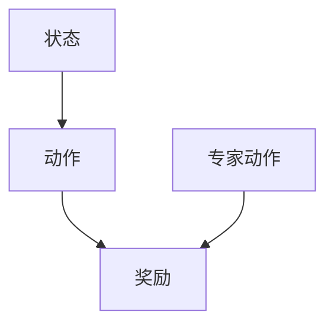
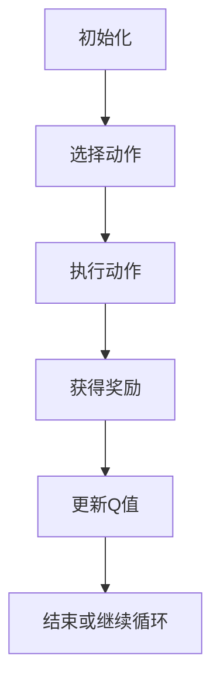
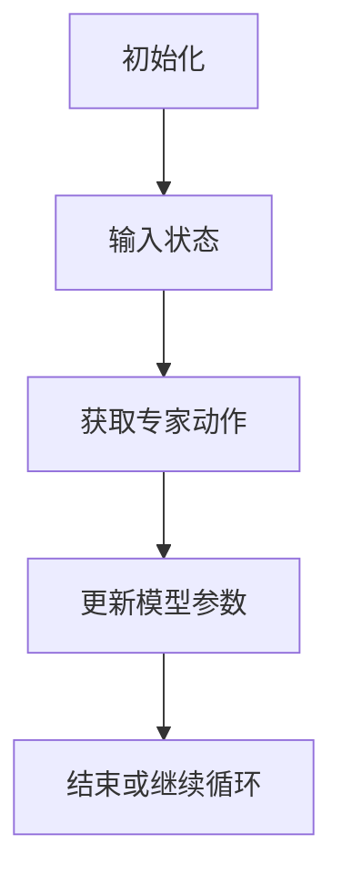
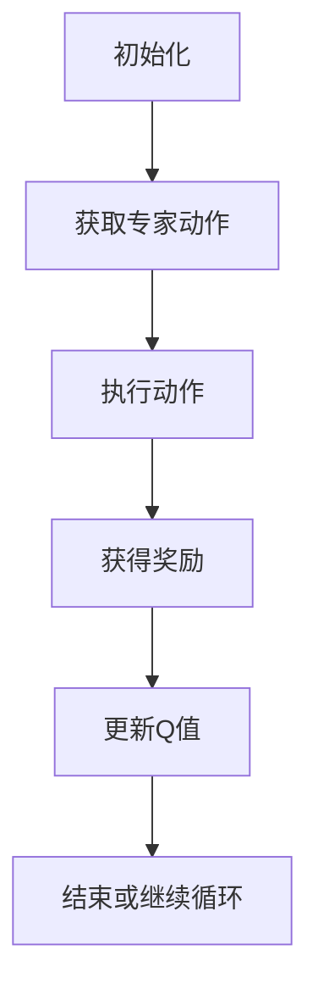
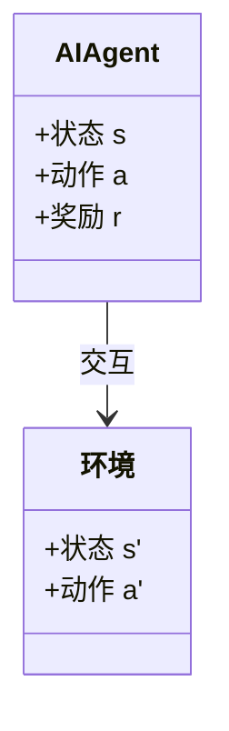
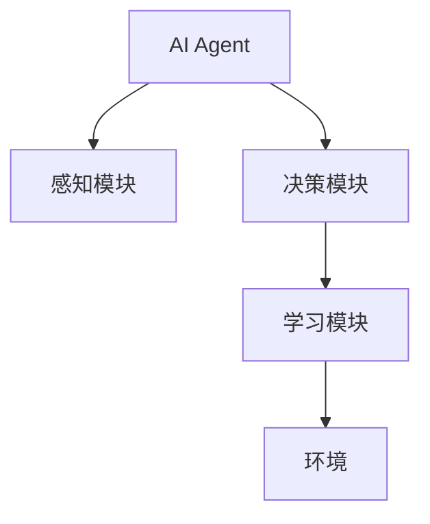

                 


```markdown
# AI Agent中的强化学习与模仿学习结合

> 关键词：AI Agent, 强化学习, 模仿学习, 算法结合, 系统设计, 应用场景

> 摘要：本文深入探讨了AI Agent中强化学习与模仿学习的结合方法，分析了两种学习方式的优缺点，提出了结合的策略，并通过实际案例展示了其在AI Agent中的应用价值。文章从理论到实践，详细讲解了结合过程中的关键问题，为AI Agent的设计提供了新的思路。

---

## 第1章: AI Agent的基本概念与背景

### 1.1 AI Agent的定义与特点
#### 1.1.1 AI Agent的定义
AI Agent（智能体）是指在环境中能够感知并自主行动以实现目标的实体。AI Agent可以是软件程序、机器人或其他智能系统，具备以下特点：
- **自主性**：无需外部干预，自主决策。
- **反应性**：能够感知环境并实时响应。
- **目标导向**：所有行为都以实现特定目标为导向。
- **学习能力**：能够通过经验改进自身性能。

#### 1.1.2 AI Agent的核心特点
- AI Agent能够与环境进行交互，通过感知和行动来改变环境状态。
- AI Agent的目标是最大化自身效用函数，通常表现为最大化奖励或最小化损失。
- AI Agent的学习能力使其能够适应不同环境和任务需求。

#### 1.1.3 AI Agent与传统AI的区别
AI Agent与传统AI的区别主要体现在自主性和目标导向上。传统AI（如专家系统）依赖于规则和知识库，而AI Agent具备自主决策能力，能够在动态环境中适应和调整策略。

### 1.2 强化学习与模仿学习的基本概念
#### 1.2.1 强化学习的定义与特点
强化学习（Reinforcement Learning, RL）是一种通过试错机制来学习最优策略的方法。智能体通过与环境交互，获得奖励或惩罚，并根据这些反馈调整自身行为，以最大化累积奖励。

- **马尔可夫决策过程（MDP）**：强化学习的核心模型，定义了状态、动作、奖励和转移概率。
- **Q-learning算法**：一种经典的强化学习算法，通过更新Q值表来学习最优策略。

#### 1.2.2 模仿学习的定义与特点
模仿学习（Imitation Learning）是一种通过观察和模仿专家行为来学习任务的方法。与强化学习不同，模仿学习直接从专家经验中学习，通常更适用于任务复杂且奖励函数难以定义的情况。

- **最大似然估计（MLE）**：模仿学习中常用的监督学习方法，通过拟合专家动作的概率分布来学习策略。
- **优势（Advantage）**：衡量动作在特定状态下相对于随机策略的优势程度。

#### 1.2.3 强化学习与模仿学习的优缺点对比
| 概念 | 强化学习 | 模仿学习 |
|------|----------|----------|
| 优点 | 简单高效，适用于复杂环境 | 策略直接，适用于明确任务 |
| 缺点 | 需要大量试错，收敛速度慢 | 需要高质量专家数据 |
| 适用场景 | 动态环境，奖励明确 | 任务明确，专家经验可得 |

### 1.3 AI Agent中强化学习与模仿学习的结合
#### 1.3.1 强化学习与模仿学习结合的背景
AI Agent在实际应用中往往需要应对复杂多变的环境，单纯依赖强化学习可能导致试错成本过高，而模仿学习虽然能够快速获取专家经验，但在动态环境中难以适应变化。

#### 1.3.2 结合的必要性与优势
- **必要性**：通过结合强化学习和模仿学习，可以在保持策略稳定的同时，具备快速适应环境变化的能力。
- **优势**：结合了两种方法的优点，既能够利用专家经验快速初始化策略，又能够通过强化学习不断优化策略。

#### 1.3.3 未来发展趋势
随着AI Agent在自动驾驶、机器人等领域应用的深入，强化学习与模仿学习的结合将更加紧密，未来可能会出现更多混合算法，进一步提升AI Agent的智能性和适应性。

---

## 第2章: 强化学习与模仿学习的核心概念与联系

### 2.1 强化学习的原理与数学模型
#### 2.1.1 强化学习的基本原理
强化学习通过定义一个价值函数Q(s, a)，表示在状态s下执行动作a所能获得的预期累积奖励。通过不断更新Q值，智能体可以学习到最优策略。

#### 2.1.2 状态、动作、奖励的定义
- **状态（State）**：环境中的当前情况，表示为s。
- **动作（Action）**：智能体选择的下一步行为，表示为a。
- **奖励（Reward）**：智能体执行动作后获得的反馈，表示为r。

#### 2.1.3 Q-learning算法的数学公式
$$ Q(s,a) = Q(s,a) + \alpha (r + \gamma \max Q(s',a') - Q(s,a)) $$

### 2.2 模仿学习的原理与数学模型
#### 2.2.1 模仿学习的基本原理
模仿学习通过最大化似然函数，使得模型输出的动作与专家动作一致。通过不断优化模型参数，使得模型能够模仿专家行为。

#### 2.2.2 最大似然估计在模仿学习中的应用
$$ L(\theta) = -\sum_{i=1}^{n} \log p_\theta(a_i|x_i) $$

### 2.3 强化学习与模仿学习的对比分析
#### 2.3.1 核心概念对比表格
| 概念 | 强化学习 | 模仿学习 |
|------|----------|----------|
| 输入 | 状态与动作 | 状态与专家动作 |
| 输出 | 动作 | 动作 |
| 反馈 | 奖励 | 无明确反馈 |

#### 2.3.2 ER实体关系图


---

## 第3章: 强化学习与模仿学习的算法原理

### 3.1 强化学习算法的流程图


### 3.2 模仿学习算法的流程图


### 3.3 强化学习与模仿学习结合的算法设计
#### 3.3.1 混合算法的设计思路
- **初始化**：利用模仿学习初始化策略。
- **优化**：通过强化学习不断优化策略。
- **平衡**：在强化学习过程中保持策略的稳定性。

#### 3.3.2 混合算法的流程图


---

## 第4章: AI Agent中的强化学习与模仿学习结合的应用

### 4.1 项目背景与目标
#### 4.1.1 项目背景
本项目旨在设计一个能够在动态环境中自主决策的AI Agent，结合强化学习和模仿学习的优势，提升智能体的适应能力和决策效率。

#### 4.1.2 项目目标
- 实现强化学习与模仿学习的结合。
- 在实际场景中验证算法的有效性。
- 提供可扩展的系统架构。

### 4.2 系统功能设计
#### 4.2.1 系统功能模块
- **感知模块**：负责获取环境状态信息。
- **决策模块**：根据状态信息选择动作。
- **学习模块**：负责策略优化。

#### 4.2.2 领域模型设计


#### 4.2.3 系统架构设计


### 4.3 项目实战

#### 4.3.1 环境安装
```bash
pip install gym numpy tensorflow
```

#### 4.3.2 核心代码实现
```python
import numpy as np
import gym

class AI-Agent:
    def __init__(self, env):
        self.env = env
        self.states = env.observation_space.shape[0]
        self.actions = env.action_space.n
        self.Q = np.zeros((self.states, self.actions))

    def choose_action(self, state):
        # 利用贪婪算法选择动作
        if np.random.random() < 0.9:
            return np.argmax(self.Q[state])
        else:
            return np.random.randint(self.actions)

    def update_Q(self, state, action, reward, next_state):
        # Q-learning算法更新Q值
        self.Q[state][action] += 0.1 * (reward + 0.95 * np.max(self.Q[next_state]) - self.Q[state][action])

    def run_episode(self):
        state = self.env.reset()
        while True:
            action = self.choose_action(state)
            next_state, reward, done, _ = self.env.step(action)
            self.update_Q(state, action, reward, next_state)
            if done:
                break
            state = next_state

if __name__ == "__main__":
    env = gym.make('CartPole-v0')
    agent = AI-Agent(env)
    for _ in range(1000):
        agent.run_episode()
```

---

## 第5章: 总结与展望

### 5.1 最佳实践 tips
- 在实际应用中，建议先通过模仿学习初始化策略，再通过强化学习进行优化。
- 注意平衡策略的稳定性和探索能力，避免陷入局部最优。

### 5.2 小结
本文详细探讨了AI Agent中强化学习与模仿学习的结合方法，分析了两种学习方式的优缺点，并通过实际案例展示了其在AI Agent中的应用价值。

### 5.3 注意事项
- 确保环境的动态性和复杂性，避免算法过于简单化。
- 在实际应用中，需要根据具体任务调整参数和算法。

### 5.4 拓展阅读
- Russell, S., & Norvig, P. (2010). Artificial Intelligence: A Modern Approach.
- Sutton, R. S., & Barto, A. G. (2018). Reinforcement learning: Theory and algorithms.

---

## 作者信息

作者：AI天才研究院/AI Genius Institute & 禅与计算机程序设计艺术 /Zen And The Art of Computer Programming
```

