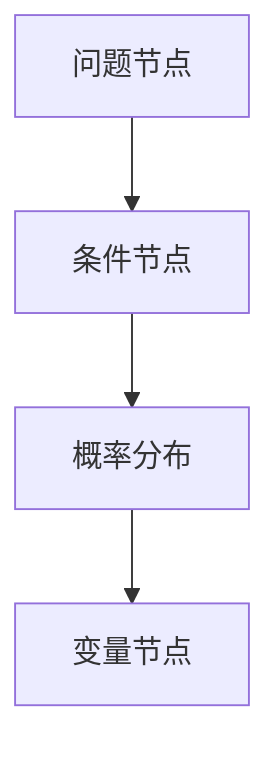
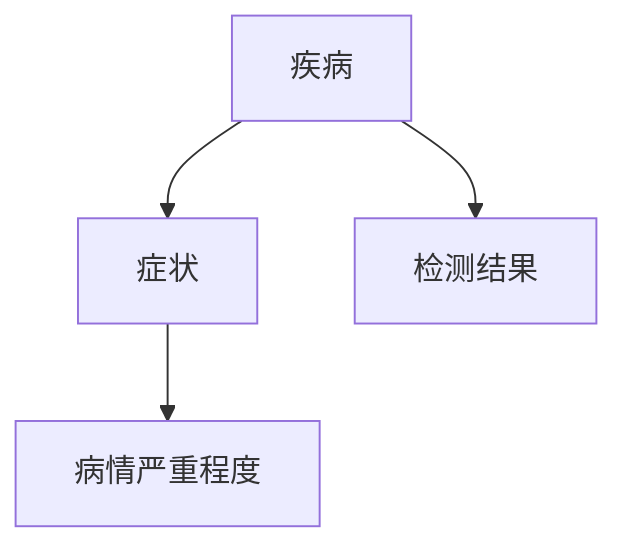
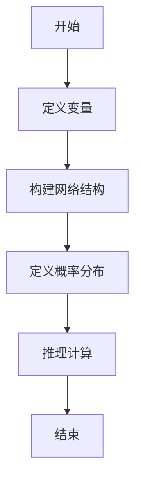
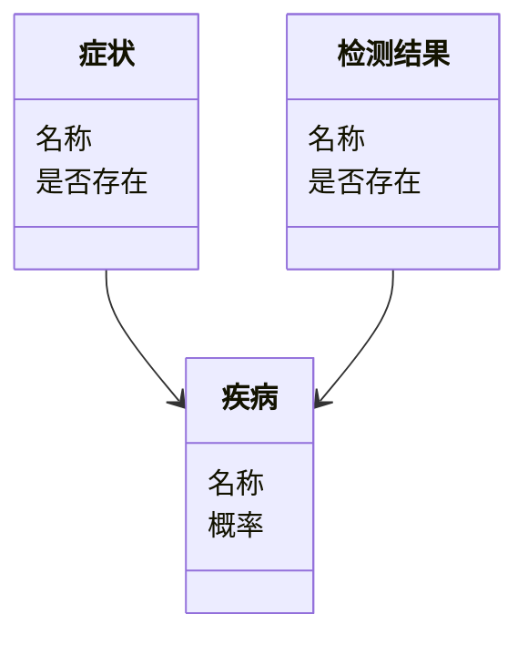
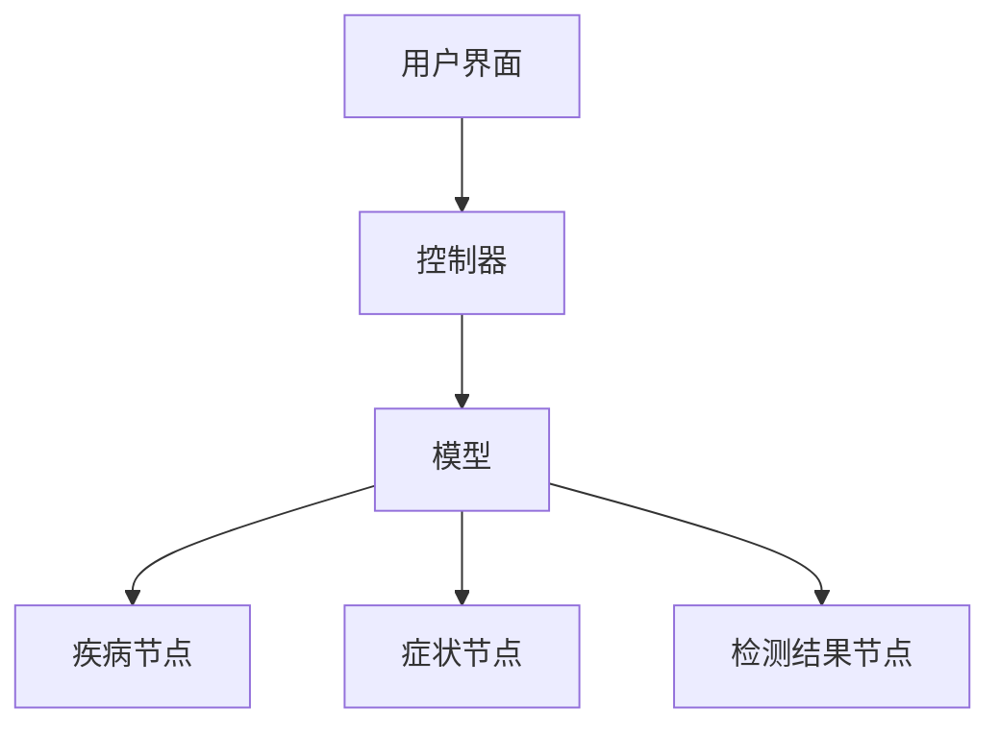

                 


---

# AI Agent中的概率推理与贝叶斯网络

> 关键词：AI Agent, 概率推理, 贝叶斯网络, 贝叶斯定理, 不确定性推理, 智能体设计

> 摘要：本文详细探讨AI Agent中的概率推理及其在贝叶斯网络中的应用，从理论基础到实际应用，逐步解析如何通过贝叶斯网络实现不确定性推理，提升AI Agent的决策能力。文章结合实际案例，深入分析贝叶斯网络的构建、推理算法及在AI Agent中的具体应用，帮助读者掌握概率推理的核心技术与实践方法。

---

## 目录

1. [背景介绍](#背景介绍)
   - [1.1 问题背景](#11-问题背景)
   - [1.2 问题描述](#12-问题描述)
   - [1.3 问题解决](#13-问题解决)
   - [1.4 边界与外延](#14-边界与外延)
   - [1.5 概念结构与核心要素组成](#15-概念结构与核心要素组成)

2. [核心概念与联系](#核心概念与联系)
   - [2.1 贝叶斯网络的基本原理](#21-贝叶斯网络的基本原理)
   - [2.2 核心概念对比](#22-核心概念对比)
   - [2.3 ER实体关系图架构](#23-ER实体关系图架构)

3. [算法原理讲解](#算法原理讲解)
   - [3.1 贝叶斯网络的构建算法](#31-贝叶斯网络的构建算法)
   - [3.2 推理算法](#32-推理算法)
   - [3.3 概率更新算法](#33-概率更新算法)
   - [3.4 算法流程图](#34-算法流程图)

4. [系统分析与架构设计方案](#系统分析与架构设计方案)
   - [4.1 问题场景介绍](#41-问题场景介绍)
   - [4.2 系统功能设计](#42-系统功能设计)
   - [4.3 系统架构设计](#43-系统架构设计)
   - [4.4 系统接口设计](#44-系统接口设计)
   - [4.5 系统交互设计](#45-系统交互设计)

5. [项目实战](#项目实战)
   - [5.1 环境安装与配置](#51-环境安装与配置)
   - [5.2 系统核心实现](#52-系统核心实现)
   - [5.3 代码实现与解读](#53-代码实现与解读)
   - [5.4 实际案例分析](#54-实际案例分析)
   - [5.5 项目小结](#55-项目小结)

6. [最佳实践与小结](#最佳实践与小结)
   - [6.1 最佳实践](#61-最佳实践)
   - [6.2 小结](#62-小结)
   - [6.3 注意事项](#63-注意事项)
   - [6.4 拓展阅读](#64-拓展阅读)

---

## 1. 背景介绍

### 1.1 问题背景

AI Agent（智能体）在现实世界中面临众多不确定性，例如传感器噪声、信息不完整、环境动态变化等。为了在这些复杂场景中做出合理决策，AI Agent需要具备处理不确定性的能力，而概率推理正是实现这一目标的核心技术之一。

**概率推理**是指通过概率论的方法，从已知信息中推断出某种事件发生的可能性。它在医疗诊断、金融风险评估、自动驾驶等领域有着广泛应用。贝叶斯网络作为一种强大的概率推理工具，能够有效地建模和解决复杂的不确定性问题。

### 1.2 问题描述

AI Agent在处理不确定性时，通常需要回答以下类型的问题：
1. **诊断问题**：根据观察到的症状，推断出最可能的疾病。
2. **预测问题**：根据当前状态，预测未来可能发生的事件。
3. **决策问题**：在多种选择中，选择最优的行动方案。

贝叶斯网络通过构建概率模型，将问题中的变量及其关系以图形化的方式表示，从而帮助AI Agent进行高效的推理和决策。

### 1.3 问题解决

概率推理的核心在于将问题转化为概率模型，并通过模型进行计算。贝叶斯网络通过定义变量之间的条件独立性，简化了概率计算的过程。具体步骤如下：
1. **定义变量**：明确问题中涉及的所有变量。
2. **构建网络结构**：确定变量之间的因果关系或条件独立性。
3. **定义概率分布**：为每个变量及其条件概率分布赋予数值。
4. **推理计算**：根据观察到的证据，更新其他变量的概率分布。

### 1.4 边界与外延

贝叶斯网络适用于处理具有明确因果关系的不确定性问题，但也有其局限性：
- **计算复杂性**：对于大规模问题，贝叶斯网络的计算可能非常复杂。
- **模型准确性**：模型的准确性依赖于变量选择和参数设定。
- **动态变化**：贝叶斯网络在动态环境中可能需要频繁更新。

### 1.5 概念结构与核心要素组成

贝叶斯网络由以下核心要素组成：
- **变量**：问题中的随机变量。
- **节点**：表示变量的图形元素。
- **边**：表示变量之间的依赖关系。
- **概率分布**：描述变量的不确定性。

---

## 2. 核心概念与联系

### 2.1 贝叶斯网络的基本原理

贝叶斯网络是一种有向无环图（DAG），由节点和边组成，节点代表变量，边代表变量之间的依赖关系。每个节点都附带一个条件概率分布表，描述该变量在父变量给定情况下的概率分布。

**公式**：
$$ P(X|Y) = \frac{P(X,Y)}{P(Y)} $$

### 2.2 核心概念对比

| 概念       | 贝叶斯网络 | 马尔可夫网络 | 决策树 |
|------------|------------|--------------|--------|
| 表示方式   | 有向无环图 | 无向图        | 树状结构 |
| 独立性假设 | 条件独立性  | 邻域独立性    | 根节点独立性 |
| 应用场景   | 不确定性推理 | 聚类、分类     | 分类、回归 |

### 2.3 ER实体关系图架构



---

## 3. 算法原理讲解

### 3.1 贝叶斯网络的构建算法

#### 步骤1：定义变量
- 确定问题中涉及的所有变量。
- 例如：疾病诊断问题中的变量包括症状、检测结果等。

#### 步骤2：构建网络结构
- 确定变量之间的依赖关系。
- 使用边表示变量之间的因果关系。

#### 步骤3：定义概率分布
- 为每个变量及其父变量的组合定义条件概率。
- 例如：症状发生的概率依赖于疾病的存在与否。



### 3.2 推理算法

#### 3.2.1 前向推理
- 根据已知条件，逐步推断其他变量的概率。
- 适用于从原因到结果的推理。

#### 3.2.2 后向推理
- 根据观察结果，反向推断原因变量的概率。
- 适用于从结果到原因的推理。

#### 3.2.3 变量消元法
- 通过消除无关变量，简化概率计算。
- 使用变量消元法进行概率传播。

### 3.3 概率更新算法

#### 3.3.1 条件概率更新
- 根据新的证据，更新变量的条件概率。
- 使用贝叶斯定理进行更新。

**公式**：
$$ P(A|B) = \frac{P(B|A)P(A)}{P(B)} $$

#### 3.3.2 贝叶斯定理应用
- 通过贝叶斯定理，计算后验概率。
- 例如：在疾病诊断中，根据症状和检测结果，推断疾病的存在概率。

#### 3.3.3 概率传播与计算
- 在贝叶斯网络中，通过概率传播算法，计算每个变量的后验概率。
- 使用变量消元法进行高效的计算。

### 3.4 算法流程图



---

## 4. 系统分析与架构设计方案

### 4.1 问题场景介绍

假设我们正在开发一个医疗诊断AI Agent，该Agent需要根据患者的症状和检测结果，推断出最可能的疾病。

### 4.2 系统功能设计

#### 领域模型（Mermaid类图）



### 4.3 系统架构设计



### 4.4 系统接口设计

- **输入接口**：症状、检测结果。
- **输出接口**：疾病概率分布。

### 4.5 系统交互设计

```mermaid
sequenceDiagram
    用户 --> UI: 提供症状
    UI --> Controller: 分析症状
    Controller --> Model: 查询疾病概率
    Model --> Controller: 返回疾病概率
    Controller --> UI: 显示结果
    用户 <-- UI: 查看结果
```

---

## 5. 项目实战

### 5.1 环境安装与配置

- 安装Python和相关库（如`networkx`、`numpy`）。
- 安装Jupyter Notebook用于代码实现。

### 5.2 系统核心实现

- 定义变量和概率分布。
- 构建贝叶斯网络结构。
- 实现概率推理算法。

### 5.3 代码实现与解读

```python
import networkx as nx

# 定义贝叶斯网络结构
G = nx.DiGraph()
G.add_edges_from([('A', 'B'), ('B', 'C'), ('A', 'D')])

# 定义概率分布
from networkx import utils
G = utils.create_probabilistic_graph(G, {'A': {'B': 0.5, 'D': 0.3}})
```

### 5.4 实际案例分析

假设我们有一个简单的贝叶斯网络，包含变量A、B、C，其中A影响B和D，B影响C。我们可以通过给定A的值，计算C的条件概率。

### 5.5 项目小结

通过本节的实战，我们掌握了贝叶斯网络的基本构建方法和推理算法的实现。实际案例帮助我们更好地理解理论知识。

---

## 6. 最佳实践与小结

### 6.1 最佳实践

- **模型简化**：合理简化模型，避免过度复杂。
- **数据质量**：确保数据的准确性和完整性。
- **模型验证**：通过交叉验证等方法，验证模型的准确性。

### 6.2 小结

本文从理论到实践，详细讲解了AI Agent中的概率推理与贝叶斯网络。通过构建贝叶斯网络，我们可以有效地处理不确定性问题，提升AI Agent的决策能力。

### 6.3 注意事项

- 贝叶斯网络的计算复杂度随变量数量的增加而迅速上升。
- 在实际应用中，需要结合具体场景，合理选择模型参数。

### 6.4 拓展阅读

- 推荐阅读《Pattern Recognition and Machine Learning》（Christopher M. Bishop）。
- 关注最新的贝叶斯网络研究进展。

---

## 作者

作者：AI天才研究院/AI Genius Institute & 禅与计算机程序设计艺术/Zen And The Art of Computer Programming

